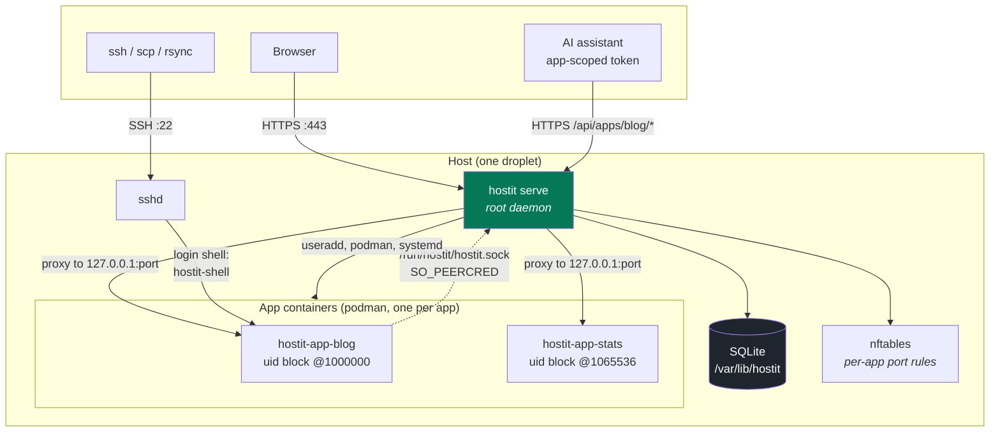
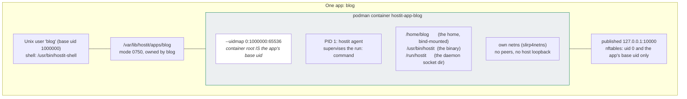
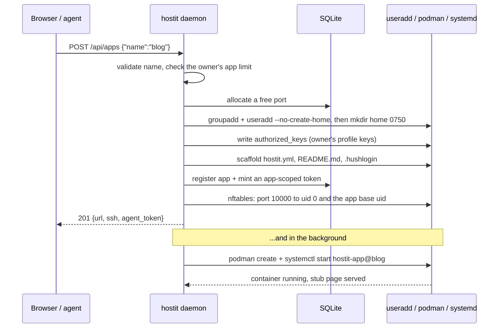
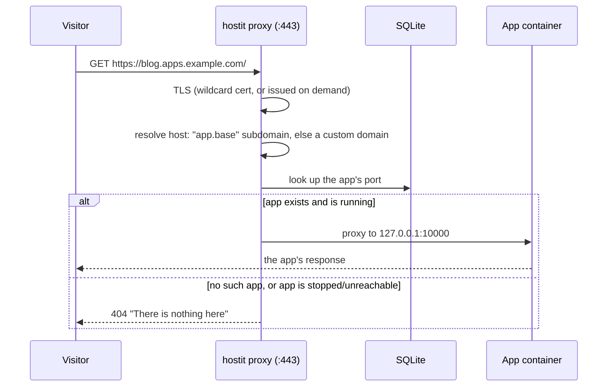
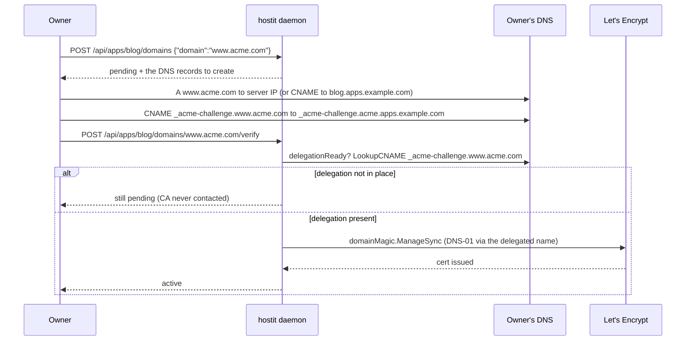
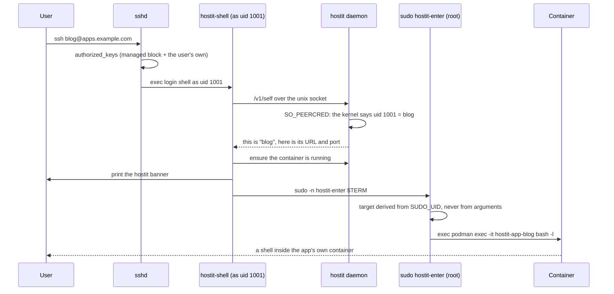
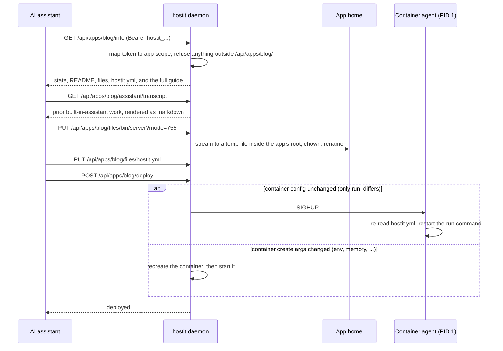
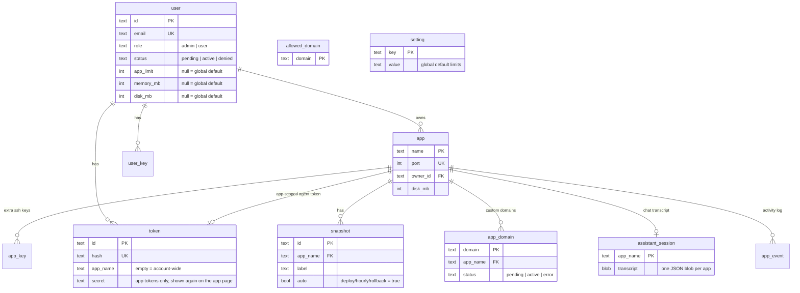

# hostit architecture

How the pieces fit, what isolates what, and what happens during the flows that
matter. The README covers using hostit; this covers building on it.

## The whole thing

One binary, running as root, is the entire control plane. It terminates TLS,
proxies to apps, serves the web app and REST API, creates Unix users and
containers, and answers a unix socket for the CLI inside each app.

The dotted line is the only way in from an app: a unix socket where the kernel,
not the caller, says which uid is calling. An app can therefore ask about itself
and act on itself, and cannot name another app.

## What isolates what

Each app is four things created together: a Unix user, a home directory, a
container, and a loopback port with a firewall rule.

Four boundaries, each doing one job:

| Boundary | Mechanism | What it stops |
|---|---|---|
| App vs app | separate uid, container, netns | reading files, seeing processes, reaching ports |
| App vs host | uidmap so container root is an unprivileged host uid | an escape landing as root |
| App vs daemon | SO_PEERCRED on the socket; app-scoped tokens on the API | acting as another app |
| Tenant vs operator | `hostit-shell` login shell; no host shell, no SSH forwarding | tunnelling out, reaching host services |

Each app owns a **65536-wide contiguous uid/gid block** (`uidFor(port) = 1000000 +
(port - PortMin) * 65536`), so container root maps to the app's base host uid and the
whole block maps one-to-one. Contiguity is load-bearing: it lets podman **idmap-mount**
the image (instant, no copy) instead of chowning a private copy. `MigrateToBlockUIDs`
is a one-off migration from the older single-uid scheme (the app must be stopped, since
`usermod` refuses a uid change with live processes).

The daemon holds the privilege. Nothing an app does escalates: it starts as an
unprivileged uid and every path back into hostit identifies it by that uid.

## Creating an app

The API answers as soon as the app exists; the container comes up behind it, so
the first request is never blocked on an image build.

An app that fails to start still exists: its URL shows hostit's "not running"
page rather than a dead hostname, and the owner can fix `hostit.yml` and deploy.

## Serving a request

By design there is no 502 path: no-such-host, lookup errors, and a proxy failure
because the app is down all return the **same** 404 "nothing here" page, so a stopped
app is indistinguishable from a free name.

## Custom domains

An app is reachable at `<app>.<base>` out of the box; an owner can also attach their
own hostname (`GET/POST /api/apps/{name}/domains`, `POST .../domains/{domain}/verify`,
`DELETE .../domains/{domain}`). Each domain belongs to exactly one app (`app_domain`
table, PK = domain) and carries a status: `pending` -> `active` -> `error`. Active
domains live in an in-memory `host -> app` cache (`domainCache`) the proxy consults
after the subdomain lookup misses.

TLS for these is the interesting part. The daemon runs **two** certmagic configs: the
base `s.magic` for the platform's own hostnames and app subdomains, and a **second**
`s.domainMagic` on its own cache for custom domains, with `GetCertificate` falling back
from the base cache to `domainMagic` on an SNI miss. In wildcard/DNS-01 mode
`domainMagic` uses a `DNS01Solver` whose `OverrideDomain` is a fixed name in a zone
hostit controls -- `_acme-challenge.acme.<BaseDomain>`. The owner delegates their
challenge by pointing a CNAME `_acme-challenge.<domain>` at that name, so hostit can
answer DNS-01 for a zone it does not control, even when the box is not publicly
reachable. In on-demand mode `domainMagic` is just aliased to `magic` (HTTP-01). Both
are nil when TLS is off, and custom domains then route over plain HTTP.

`issueDomainCert` guards against overlap (`s.issuing`), and a transient re-issue failure
on an already-active domain does **not** de-route it. A background `DomainRetryLoop`
periodically retries non-active domains, and `manageExistingDomains` re-obtains active
certs at startup. `validateCustomDomain` rejects malformed names, the platform's own
hostnames, existing app subdomains, and anything under `BaseDomain`.

## SSH login

The session never touches a host shell. sshd runs the app user's login shell,
which is hostit's own, and that execs into the container through a root helper.

`hostit-enter` ignores its arguments when choosing a container, so an app user
who calls it directly with someone else's name still lands in their own.

## An agent deploying

The token in the pasted prompt reaches exactly one app's endpoints.

Every path in the file operations resolves through `os.OpenRoot` on the app's
home, so a symlink the app planted cannot walk the daemon out of it.

## The in-browser workspace

The same deploy loop above can run without an external agent: each app's page is a
workspace with a hosted assistant, a terminal, and a live preview.

- **Hosted assistant (`assistant/`).** A chat drives an Anthropic Messages loop
  whose ten tools -- list/read/write files, run a command, read logs, deploy, refresh
  the preview, and `snapshot`/`list_snapshots`/`rollback` -- are exactly one app's REST
  surface, so the model is confined the same way an app-scoped token is. The turn is
  **server-owned**: `POST` starts it as a background goroutine (not tied to the
  request), each step is persisted, and every watcher subscribes over **SSE**, so the
  run survives a reload and shows up on every device viewing the app. A per-app lock
  allows one turn at a time; the transcript lives in SQLite (`assistant_session`).
  Thinking blocks are streamed to the UI but never persisted (`withoutThinking`
  strips them before saving). Chat file uploads land under the app's `uploads/`
  (`POST .../assistant/upload`, 10 MB cap); image attachments are read back and
  base64-embedded as vision blocks the model sees, other files are noted by path.
  Rate limits are **per-user across all their apps** (concurrent runs + hourly, admin
  token exempt); a context window, a subscriber cap, and a same-origin gate on the SSE
  connection keep it from being a lever for abuse. It is inert without an Anthropic API
  key in the config. Requests carry **prompt-cache breakpoints** (`cache_control`) on
  the system prompt, the tools block, and the tail of the conversation, so Anthropic
  reuses the large stable prefix across turns instead of re-reading it every message.

  An external agent can pick up where the hosted one left off:
  `GET /api/apps/{app}/assistant/transcript` renders the stored session as markdown
  (`RenderTranscript`), and the `/info` guide instructs a pasted-in agent to read it
  right after `/info` so it resumes with prior context instead of starting cold. The
  browser-facing `GET /api/apps/{name}/assistant` returns the same session as structured
  items for the web UI. `enabled:false` comes back cleanly when no key is configured.

- **Browser terminal.** `GET /api/apps/{app}/terminal` upgrades to a WebSocket and
  bridges it to a pty running the app's login shell (`runuser` into the container),
  binary both ways with a text frame carrying the window size. It is the same shell
  and isolation as an SSH session, owner-only, with an origin check on the upgrade
  so a tenant's own app page cannot open one on a signed-in owner's behalf.

- **Live preview + state.** The page iframes the app (owner-only, via a `frame-src`
  the CSP allows for the base domain's subdomains) and reloads it, cache-busted,
  whenever the app is redeployed -- picked up from the app process's start time
  changing. Live CPU/RAM/disk come from one `podman stats` read behind the state
  cache; lifecycle actions post the same verbs the CLI does.

- **Activity log (Logs tab).** User-initiated actions (create, fork, snapshot,
  rollback, domain add/remove, description, token, lifecycle) are recorded to an
  `app_event` row, attributed to the caller's email, via `s.logAction` in the
  handlers. `GET /api/apps/{app}/events` returns the last 100 for the Logs tab,
  which shows them above a live tail of the app's own container output
  (`GET .../logs`). The log is trimmed to the newest `maxAppEvents` per app.

## Data

SQLite, one connection, WAL. Ordered migrations that record their version in the
same transaction, so a failure rolls back whole and a success never replays.

`allowed_domain` is the email **allow-list** (auto-approve sign-in for a domain),
distinct from `app_domain`, the per-app custom domains above. `setting` holds the global
default limits the admin edits (`PATCH /api/settings`); the per-user override columns fall
back to it when null. The registry is root-only (0600 in a 0700 directory): it holds every
app's agent token in the clear, deliberately, so an app's page can show it again.

## Snapshots and quotas (btrfs)

When the app-homes path (`/var/lib/hostit/apps`) is a btrfs filesystem -- a loopback
image mounted there -- each app home is a **subvolume**. That makes two things cheap
and exact:

- **Snapshots** are copy-on-write: an instant, space-shared, atomic (crash-consistent)
  copy at `apps/.snapshots/<app>/<id>`, so it does not count against the app's quota.
  hostit snapshots **hourly** (`SnapshotLoop`) and **before every deploy**, both labelled
  `"Automated snapshot"` / `"Automated snapshot before deploy"` and flagged `auto`; owners
  and the assistant `snapshot` tool take labelled manual ones. A restic-style GFS policy
  (`applyRetention`, heavily unit-tested; default `Last:50 Daily:7 Weekly:4 Monthly:3`,
  UTC buckets) thins them all -- manual and automatic alike, so none lives forever. A
  `snapshot.pre`/`post` pair in `hostit.yml` runs in the container to quiesce a database
  first (pre failing aborts the snapshot). Rollback takes a safety snapshot, stops the
  app, replaces the home subvolume with a writable copy of the chosen snapshot, restores
  ownership and quota, and starts it again. A per-app lock (`appLocks`) serializes
  deploy/snapshot/rollback/delete so they never interleave on one home.
- **Fork** duplicates an existing app (`POST /api/apps/{name}/fork`,
  `{new_name, snapshot_id?}`): the new app's home is seeded from a writable CoW snapshot
  of the source (its current home, or a named snapshot of it) instead of the demo
  scaffold, then chowned to the new app's uid. It gets its own port/uid/user/subdomain/
  container and a fresh agent token. Requires btrfs (`ErrSnapshotsUnavailable`, 501,
  otherwise).
- **Quotas** are a btrfs **qgroup** limit per subvolume equal to the app's `disk_mb`,
  so a write past it fails with EDQUOT at write time -- a hard limit, not the periodic
  measure-and-stop used on other filesystems. Usage is read from the qgroup.

The daemon detects btrfs once and caches it; on any other filesystem the subvolume and
qgroup paths are skipped and hostit keeps the plain-directory, soft-quota behavior, so
it still runs anywhere. The btrfs work lives in the `app` package (`btrfs.go`,
`snapshot.go`); snapshot metadata is a `snapshot` table in the registry.

## Where the code lives

Service packages at the root, thin `main.go`, no `internal/`:

| Package | Owns |
|---|---|
| `server` | HTTP: proxy, REST API, agent API, OAuth, sessions, unix socket |
| `app` | apps as system objects: users, containers, files, quotas, ports |
| `user` | people: accounts, roles, limits, tokens, SSH keys, allowed domains |
| `store` | SQLite: schema, migrations, queries |
| `appctl` | the `hostit.yml` contract and the client for the app-side CLI |
| `agent` | PID 1 inside a container: supervises the app, rotates its log |
| `assistant` | the in-browser AI agent: an Anthropic Messages loop whose tools are one app's REST surface |
| `cmd` | the CLI: `serve`, the app commands, `admin`, and the SSH plumbing |
| `client` | Go client for the REST API, used by `hostit apps` |
| `web` | React + Vite SPA (dashboard, app workspace, admin); built into `server/site/` |

The same binary is all of these; which commands it offers depends on where it
runs. Inside a container it presents only the app's own commands.

Within a package, code is split per concern into small files rather than a few
grab-bags: `store` has one file per entity (`app.go`, `snapshot.go`, `domain.go`,
`event.go`, `token.go`, `setting.go`, ...), `app` separates deploy from
`reconcile.go`, `migrate.go` and the pure `retention.go` engine, and `server`
keeps the agent guide (`agentguide.go`), the assistant adapters (`assistantops.go`)
and each feature's handlers in their own file.

The SPA is a separate React 19 / Vite app under `web/`; `make web` builds it and copies
the output into `server/site/`, which `server/web.go` bakes into the binary via
`//go:embed` (a placeholder is checked in so the package always compiles). The SPA, REST
API, agent API, OAuth, terminal WebSocket, and assistant SSE are all same-origin, served
by the one root daemon.
