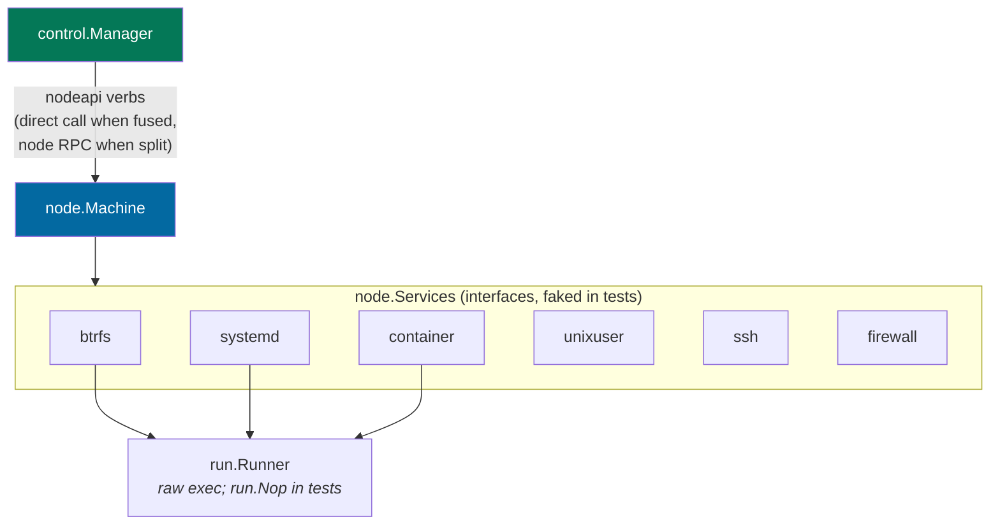

# Code map

Service packages at the root, a thin `main.go`, no `internal/`. The same binary is
all of these; which commands it offers depends on where it runs (see
[`overview.md`](overview.md)).

## Packages

| Package | Owns |
|---|---|
| `control` | the control plane: TLS-terminating proxy, REST API + web app, OAuth, sessions, the peercred unix socket, terminal WebSocket, assistant SSE -- plus the `Manager` that orchestrates app lifecycles (creation/deletion, placement, ports, ownership, retention) |
| `node` | the machine half: the `Machine` that owns this host's containers, unix users, subvolumes, port rules, files and state (implementing `nodeapi.NodeAgent`), the node daemon's serve loop, and the mTLS/yamux transport |
| `nodeapi` | the control<->node wire contract: the `NodeAgent` verbs, `ControlSink` callbacks, specs, sentinel errors, and the app-name rule |
| `proxy` | the standalone data plane (`hostit-proxy`): serves `<app>.<base>` from a locally cached routing table |
| `btrfs` | subvolumes, read-only snapshots, reflink copies, qgroup disk budgets |
| `container` | podman: create, exec, remove, image build/list, rootfs export |
| `workspace` | the app-container spec (`CreateArgs`, `--rootfs` + uid map, config hash) and its storage: the workspace image (build input), per-tag base subvolumes, and the per-app subvolumes (one writable subvolume per app: the container's whole OS tree, files at `home/app` inside) |
| `homefs` | file I/O inside an app's files directory, every path resolved through chained `os.Root`s (the subvolume root, then `home/app` inside it) |
| `snapshot` | whole-app snapshot, rollback and retention orchestration |
| `systemd` | per-app unit lifecycle (enable, start, restart, reset-failed) |
| `unixuser` | Unix user and home creation, rename, teardown; skeleton writes |
| `ssh` | an app's `authorized_keys` (managed-block merge, root-scoped write) and SSH public-key validation |
| `firewall` | nftables per-app loopback port rules |
| `run` | the shared `Runner` interface every service uses to shell out on the host |
| `retention` | pure grandfather-father-son snapshot retention policy (no I/O, heavily tested) |
| `user` | people: accounts, roles, limits, tokens, SSH keys, allowed domains |
| `store` | SQLite: schema, migrations, queries (one file per entity) |
| `appctl` | the `hostit.yml` contract and the client for the app-side CLI over the unix socket |
| `agent` | PID 1 inside a container: supervises the app's run command, rotates its log |
| `assistant` | the in-browser AI agent (an Anthropic Messages loop whose tools are one app's REST surface) plus the Claude Max subscription sandbox |
| `cmd/{control,node,proxy,agent}` | one thin `main` per binary: `hostit-control`, `hostit-node`, `hostit-proxy`, and `hostit` (the host CLI + in-container agent commands) |
| `preflight` | the startup host checks (btrfs, tooling) shared by control and node |
| `config` | per-component config files (`/etc/hostit/<component>/<component>.yml`) and their defaults |
| `client` | Go client for the REST API, used by `hostit apps` |
| `web` | React 19 + Vite SPA (dashboard, app workspace, admin); built into `control/site/` |

## How the Manager and the Machine compose the services

`control.Manager` decides *what* an app needs and drives the machine half
through the `nodeapi` verbs; `node.Machine` does the *how* on its host through
the injected `node.Services` bundle -- one interface per host tool:

`NewSystemServices` (`node/machine.go`) builds the real, root-requiring set;
`testServices` (control tests) and `apptest.NewNopServices` substitute fakes.
See [seams-and-testing.md](../subsystems/seams-and-testing.md).
## `go:embed` blobs

Large text blobs are pulled in with `//go:embed`, never inlined as Go string
literals:

| Blob | Source | Embedded in |
|---|---|---|
| Built web SPA | `control/site/` | `control/web.go` (a placeholder is checked in so the package always compiles) |
| 404 "nothing here" page | `control/errorpage.html` | `control/errorpage.go` |
| Workspace image recipe | `workspace/workspace.Containerfile` | `workspace/service.go` |
| App skeleton (`hostit.yml`, README) | `app/skeleton/` | `app/skeleton.go` |
| New-app placeholder page | `app/skeleton/public/index.html` | `app/skeleton.go` (served as a `mode: static` app) |

The SPA is a separate app under `web/`; `make web` builds it and copies the output
into `control/site/`, which `control/web.go` bakes into the binary. The SPA, REST API,
agent API, OAuth, terminal WebSocket and assistant SSE are all same-origin, served by
the one root daemon.

## Within-package file conventions

Code is split per concern into small files rather than a few grab-bags:

- Service packages keep the primary `Service` type in `service.go`, side types in
  `types.go`, and helpers in `util.go`.
- `store` has one file per entity: `app.go`, `snapshot.go`, `domain.go`, `event.go`,
  `token.go`, `setting.go`, `user.go`, ... plus `migrate.go` for the ordered,
  version-recording migrations.
- `control` keeps its HTTP handlers in `server_handler_<topic>.go` files (thin
  orchestration over the service packages: `_apps`, `_agent`, `_files`, `_domains`,
  `_snapshots`, `_assistant`, `_terminal`, `_auth`, `_account`, `_admin`, `_self`),
  with the router, middleware and response helpers in `api.go`, `auth.go`,
  `headers.go` and `socket.go`, and the proxy in `proxy.go`.
- Tests are colocated with the package they test (`foo.go` next to `foo_test.go`).
