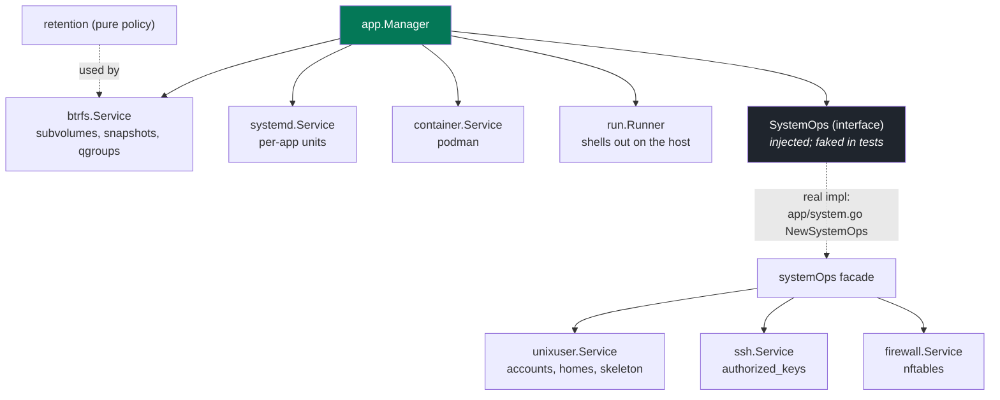

# Code map

Service packages at the root, a thin `main.go`, no `internal/`. The same binary is
all of these; which commands it offers depends on where it runs (see
[`overview.md`](overview.md)).

## Packages

| Package | Owns |
|---|---|
| `server` | HTTP: the TLS-terminating proxy, REST API, app-scoped agent API, OAuth, sessions, the peercred unix socket, terminal WebSocket, assistant SSE |
| `app` | an app's whole lifecycle; composes the service packages below and holds naming, ports and identity |
| `btrfs` | subvolumes, read-only snapshots, reflink copies, qgroup disk budgets |
| `container` | podman: create, exec, remove, image build/list, rootfs export |
| `workspace` | the app-container spec (`CreateArgs`, `--rootfs` + uid map, config hash) and its storage: the workspace image (build input), per-tag base subvolumes, per-app persistent rootfs subvolumes |
| `systemd` | per-app unit lifecycle (enable, start, restart, reset-failed) |
| `unixuser` | Unix user and home creation, rename, teardown; skeleton writes |
| `ssh` | an app's `authorized_keys` (managed-block merge, root-scoped write) and SSH public-key validation |
| `firewall` | nftables per-app loopback port rules |
| `run` | the shared `Runner` interface every service uses to shell out on the host |
| `retention` | pure grandfather-father-son snapshot retention policy (no I/O, heavily tested) |
| `user` | people: accounts, roles, limits, tokens, SSH keys, allowed domains |
| `store` | SQLite: schema, migrations, queries (one file per entity) |
| `appctl` | the `hostit.yml` contract and the client for the app-side CLI over the unix socket |
| `agent` | PID 1 inside a container: supervises the app's run command, rotates its log |
| `assistant` | the in-browser AI agent (an Anthropic Messages loop whose tools are one app's REST surface) plus the Claude Max subscription sandbox |
| `cmd` | the CLI: `serve`, the app commands, `admin`, the hidden `internal`/`enter`/`shell`/`agent` group, and the startup preflight |
| `config` | server config (`/etc/hostit/server.yml`) and its defaults |
| `client` | Go client for the REST API, used by `hostit apps` |
| `web` | React 19 + Vite SPA (dashboard, app workspace, admin); built into `server/site/` |

## How `app.Manager` composes the services

`app.Manager` decides *what* an app needs and delegates the *how* to the service that
owns each host tool (`app/service.go:NewManager`). It holds three service structs
directly plus a `SystemOps` interface and the shared runner:

The `btrfs`, `systemd` and `container` services are wired in directly because the
Manager calls them all over the lifecycle. The account, SSH-key and firewall
operations are reached through the `SystemOps` interface, whose real implementation
(`app/system.go:systemOps`, built by `NewSystemOps`) is a thin facade composing
`unixuser`, `ssh` and `firewall` and converting app-level types at the boundary. The
interface is the Manager's injection seam, so tests fake those root-requiring
operations wholesale (`app/apptest/`). `retention` is a pure, I/O-free policy the
btrfs snapshot code applies. Keeping the services separable is also the seam a future
control/app-node split would use to run them on a remote host agent.

Each service package is scoped to one host tool or API and exposes a small `Service`
built on the shared `run.Runner`, so nothing shells out except through one injected
runner.

## `go:embed` blobs

Large text blobs are pulled in with `//go:embed`, never inlined as Go string
literals:

| Blob | Source | Embedded in |
|---|---|---|
| Built web SPA | `server/site/` | `server/web.go` (a placeholder is checked in so the package always compiles) |
| 404 "nothing here" page | `server/errorpage.html` | `server/errorpage.go` |
| Workspace image recipe | `workspace/workspace.Containerfile` | `workspace/service.go` |
| App skeleton (`hostit.yml`, README) | `app/skeleton/` | `app/skeleton.go` |
| New-app placeholder page | `app/skeleton/public/index.html` | `app/skeleton.go` (served as a `mode: static` app) |

The SPA is a separate app under `web/`; `make web` builds it and copies the output
into `server/site/`, which `server/web.go` bakes into the binary. The SPA, REST API,
agent API, OAuth, terminal WebSocket and assistant SSE are all same-origin, served by
the one root daemon.

## Within-package file conventions

Code is split per concern into small files rather than a few grab-bags:

- Service packages keep the primary `Service` type in `service.go`, side types in
  `types.go`, and helpers in `util.go`.
- `store` has one file per entity: `app.go`, `snapshot.go`, `domain.go`, `event.go`,
  `token.go`, `setting.go`, `user.go`, ... plus `migrate.go` for the ordered,
  version-recording migrations.
- `server` keeps its HTTP handlers in `server_handler_<topic>.go` files (thin
  orchestration over the service packages: `_apps`, `_agent`, `_files`, `_domains`,
  `_snapshots`, `_assistant`, `_terminal`, `_auth`, `_account`, `_admin`, `_self`),
  with the router, middleware and response helpers in `api.go`, `auth.go`,
  `headers.go` and `socket.go`, and the proxy in `proxy.go`.
- Tests are colocated with the package they test (`foo.go` next to `foo_test.go`).
</content>
