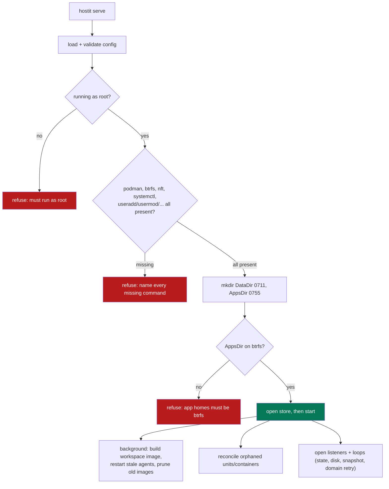
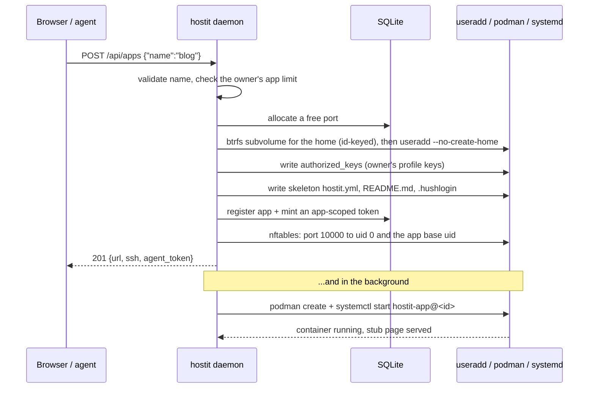
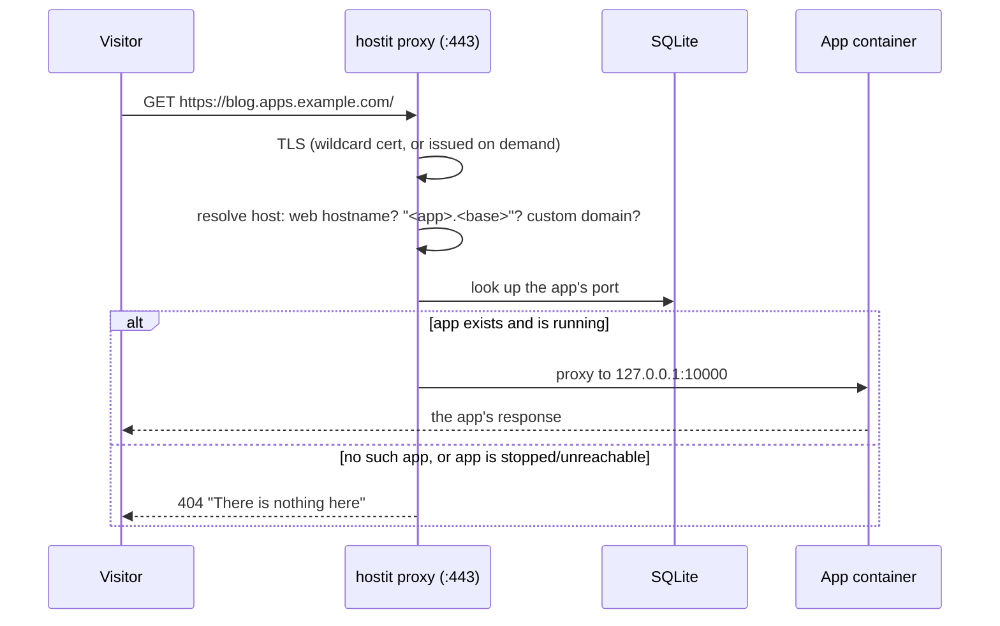
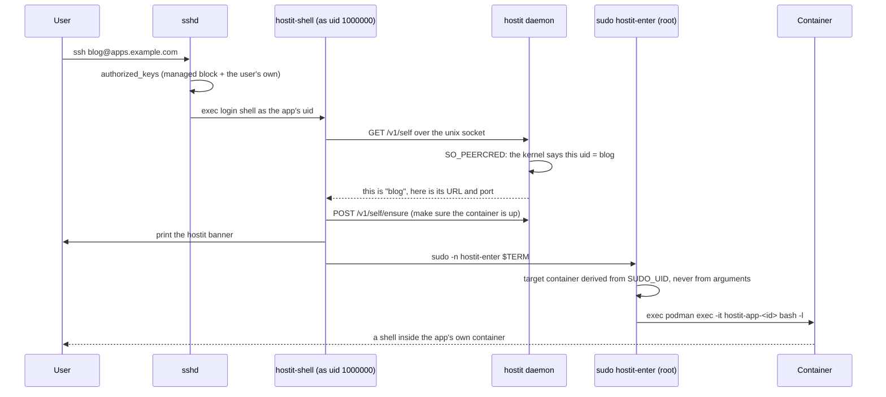
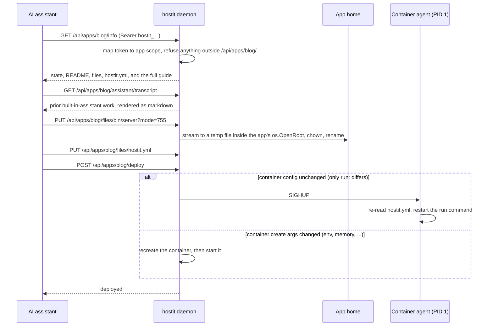

# Flows

The sequences that matter, as they happen in the code. Custom-domain issuance and the
assistant turn are their own subsystems; see [`../subsystems/`](../subsystems/).

## Startup preflight

Before the daemon touches anything it verifies the prerequisites it cannot run
without, so a misconfigured host fails loudly at boot rather than lazily on the first
app operation (`cmd/serve.go:execServe`, `cmd/preflight.go`).

btrfs is mandatory (`cmd/preflight.go:requireBtrfs`): snapshots, rollback, fork and
hard disk quotas are core, so hostit refuses to run without them rather than silently
degrading. There are no one-off data migrations on this path; the only post-upgrade
work is `RestartStaleAgents`, which brings each app up on the new binary because a
running agent keeps the behaviour of the binary it was exec'd from
(`app/upgrade.go`).

## Creating an app

The API answers as soon as the app exists; the container comes up behind it, so the
first request is never blocked on an image build (`app/service.go:create`,
`server/server_handler_apps.go`).

An app that fails to start still exists: its URL shows hostit's "not running" page
rather than a dead hostname, and the owner can fix `hostit.yml` and deploy. Fork is
the same flow, except the home is seeded from a writable btrfs snapshot of the source
instead of the skeleton (`app/service.go:Fork`).

## Serving a request

By design there is no 502 path: no-such-host, lookup errors, and a proxy failure
because the app is down all return the **same** 404 "nothing here" page
(`server/proxy.go:newProxyHandler`, `proxyTo`), so a stopped app is indistinguishable
from a free name. A request whose host matches the web hostname is handed to the
REST/web handler instead of being proxied.

## Logging in over SSH

The session never touches a host shell. sshd runs the app user's login shell, which is
hostit's own, and that execs into the container through a root helper
(`cmd/shell.go`, `cmd/enter.go`).

`hostit-enter` ignores its arguments when choosing a container, so an app user who
calls it directly with someone else's name still lands in their own
(`cmd/enter.go:execEnter`). scp, rsync and `ssh host <command>` get no banner; only an
interactive human session does (`cmd/shell.go:execShell`).

## An agent deploying

An app-scoped token reaches exactly one app's endpoints; the daemon refuses anything
outside `/api/apps/<that-app>/` (`server/server_handler_agent.go`,
`server/auth.go`).

Every path in the file operations resolves through `os.OpenRoot` on the app's home, so
a symlink the app planted cannot walk the daemon out of it (`app/files.go`); see
[`isolation.md`](isolation.md). The deploy decides between an in-place SIGHUP and a
container recreate by diffing the create arguments (`app/deploy.go`), so a
run-command-only change costs no container restart.
</content>
