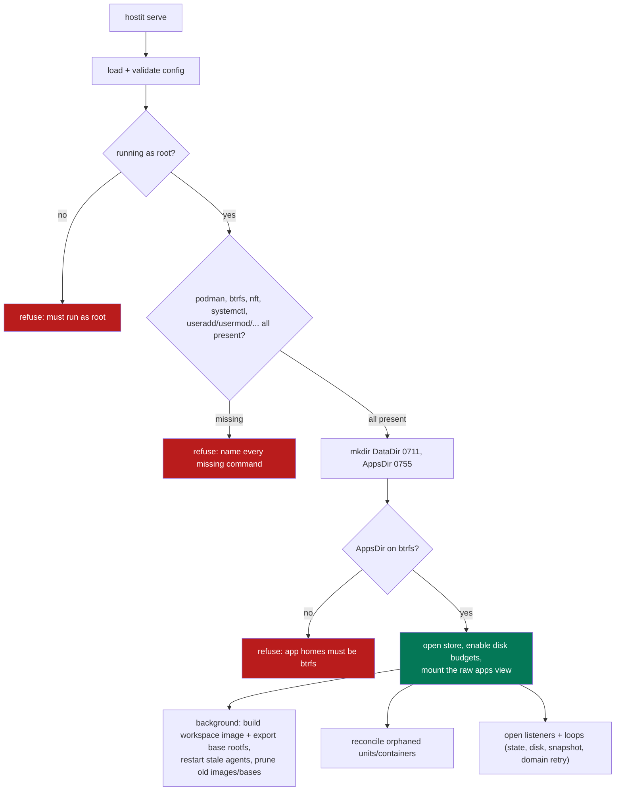
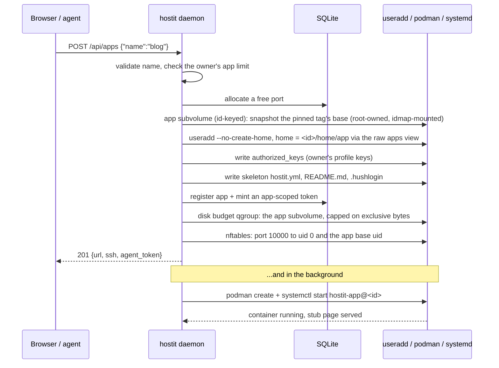
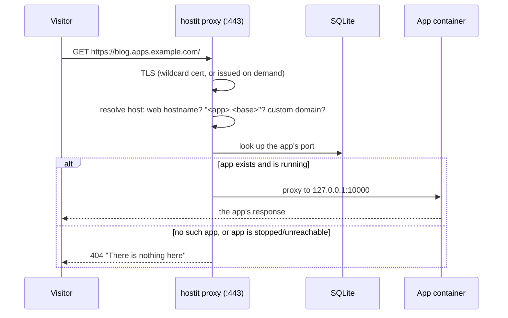
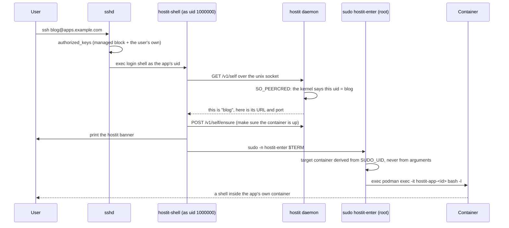
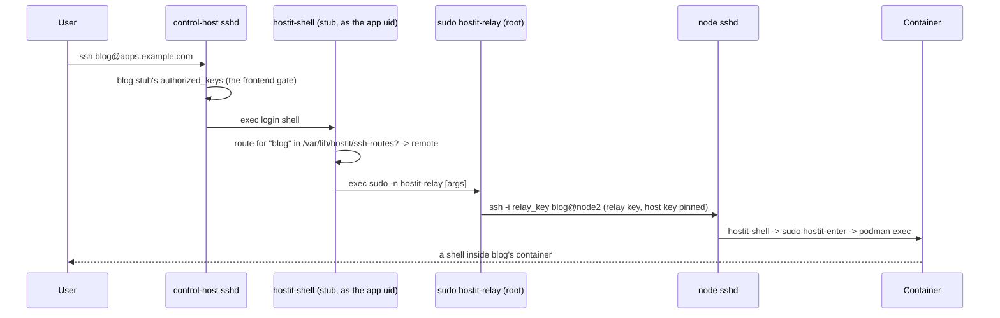
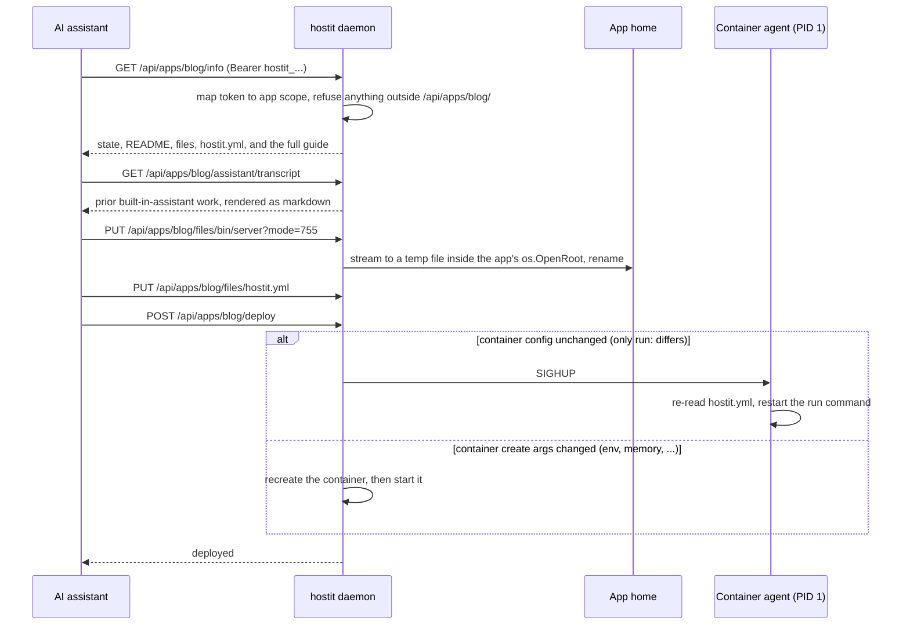
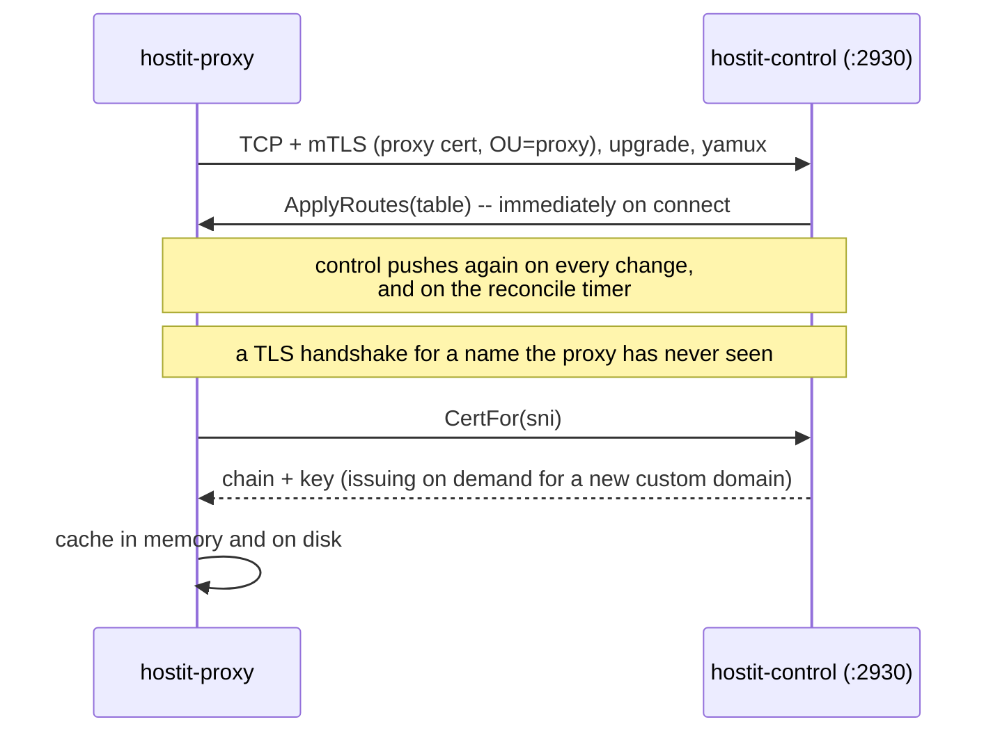

# Flows

The sequences that matter, as they happen in the code. Custom-domain issuance and the
assistant turn are their own subsystems; see [`../subsystems/`](../subsystems/).

## Startup preflight

Before the daemon touches anything it verifies the prerequisites it cannot run
without, so a misconfigured host fails loudly at boot rather than lazily on the first
app operation (`cmd/control/serve.go:execServe`, `cmd/preflight.go`).



btrfs is mandatory (`cmd/preflight.go:requireBtrfs`): snapshots, rollback, fork and
hard disk quotas are core, so hostit refuses to run without them rather than silently
degrading. So is a runtime that can idmap-mount a rootfs: the preflight refuses to
start unless podman is >= 4.3 and crun is >= 1.29, the crun resolved through
`podman info` so a `containers.conf` override is what gets checked
(`cmd/preflight.go:checkRuntimeVersions`). The one-time storage migrations
that used to run on this path were removed once every supported host recorded
their gates; upgrading from a pre-v0.11 release goes through v0.11.x first.
The post-upgrade work is `RestartStaleAgents`, which brings each enabled app up on the new binary
because a running agent keeps the behaviour of the binary it was exec'd from; a
powered-off app stays off (`app/upgrade.go`).

## Creating an app

The API answers as soon as the app exists; the container comes up behind it
(`control/manager.go:create`, `control/server_handler_apps.go`). The app's one subvolume
is an instant snapshot of its image tag's base subvolume; the base itself is
exported once per tag, in the background at startup, so create normally never
waits on it.



An app that fails to start still exists: its URL shows hostit's "not running" page
rather than a dead hostname, and the owner can fix `hostit.yml` and deploy. Fork is
the same flow, except the app subvolume is seeded from a writable btrfs snapshot of
the source's whole subvolume rather than the base -- one CoW copy carrying the
source's files AND installed packages (`control/manager.go:Fork`,
`workspace/subvolume.go:ForkAppSubvolume`).

## Serving a request



By design there is no 502 path: no-such-host, lookup errors, and a proxy failure
because the app is down all return the **same** 404 "nothing here" page
(`control/proxy.go:newProxyHandler`, `proxyTo`), so a stopped app is indistinguishable
from a free name. A request whose host matches the web hostname is handed to the
REST/web handler instead of being proxied.

## Logging in over SSH

The session never touches a host shell. sshd runs the app user's login shell, which is
hostit's own, and that execs into the container through a root helper
(`cmd/agent/shell.go`, `cmd/agent/enter.go`).



`hostit-enter` ignores its arguments when choosing a container, so an app user who
calls it directly with someone else's name still lands in their own
(`cmd/agent/enter.go:execEnter`). scp, rsync and `ssh host <command>` get no banner; only an
interactive human session does (`cmd/agent/shell.go:execShell`).

## Multi-node SSH

With more than one node, the app's Unix user and `authorized_keys` live only on
the node that runs it, so control has to point the client at the right node.
There are two paths (see `docs/features/ssh-access.md`).

### Direct-to-node (default)

Each node reports its own reachable SSH hostname in the cluster heartbeat;
control stores it (`store.node.ssh_host`) and advertises `ssh <app>@<node-host>`.
The client connects straight to that node's own `sshd` -- control is never in the
SSH path, so this works even while the control *process* is down.

```mermaid
sequenceDiagram
    participant N as node (worker)
    participant CTL as control
    participant U as User
    participant SD as node sshd
    participant C as Container

    N->>CTL: heartbeat { ssh_host: node2.ssh.example.com, host_key }
    CTL->>CTL: store on the node row; sshHostFor(app.Host)
    U->>CTL: GET app / info
    CTL-->>U: ssh blog@node2.ssh.example.com
    U->>SD: ssh blog@node2.ssh.example.com  (direct)
    SD->>SD: blog's authorized_keys (managed block)
    SD->>C: hostit-shell -> sudo hostit-enter -> podman exec
    C-->>U: a shell inside blog's container
```

### Relay gateway (optional)

One stable `ssh <app>@<base-domain>` on the control host, routed by app name
through the system `sshd`. `hostit-shell` reads the app's node from a local
routes file control writes; a colocated app is entered locally, a remote app is
handed to `sudo hostit-relay` (root, holds the relay key) which `ssh`es to the
node. The node then runs its normal login shell into the container, so the
second hop is an ordinary node login. `scp`/`sftp`/`rsync` ride the same path;
all forwarding stays off.



Key points: the control host holds a relay key trusted by every node (a
compromise reaches every app -- accepted; it already holds the key material);
the frontend `authorized_keys` is the sole per-user gate on the relay path, so
control re-writes it on every key change; and `hostit-relay` derives the app from
`SUDO_UID`, never its arguments. The relay is off by default and experimental --
prefer direct-to-node.

## An agent deploying

An app-scoped token reaches exactly one app's endpoints; the daemon refuses anything
outside `/api/apps/<that-app>/` (`control/server_handler_agent.go`,
`control/auth.go`).



Every path in the file operations resolves through chained `os.OpenRoot`s -- the
app's subvolume root first, then `home/app` inside it -- so a symlink the app
planted cannot walk the daemon out of the subvolume (`homefs/service.go`); see
[`isolation.md`](isolation.md). The deploy decides between an in-place SIGHUP and a
container recreate by diffing the create arguments (`app/deploy.go`), so a
run-command-only change costs no container restart. A recreate keeps the app's
filesystem either way: the container runs the app's one persistent subvolume
(`--rootfs`), so installed packages survive it.

## A node joining the cluster

Every node/control conversation rides ONE TCP connection, dialed by the node. The
node never listens: it has no inbound port, needs no route from control, and works
from behind NAT.

A member sharing control's host dials `cluster-socket`
(`/run/hostit/cluster.sock`) and presents no credentials at all: the socket is
root-only and the kernel identifies the caller. A member on another machine
dials `listen-cluster` (an address, conventionally port 2930) with a CA-signed
certificate. `cluster` owns the connection either way; `nodelink` and
`proxylink` own what is said over it.

The connection starts life as ordinary HTTP so it can be authorized and upgraded,
then stops being HTTP-shaped: after the 101 both sides hand the raw socket to
[yamux](https://github.com/hashicorp/yamux) and speak in multiplexed streams. Each
stream still carries an HTTP request/response, because a yamux session satisfies
`net.Listener` -- so each side runs a plain `http.Serve` for the streams its PEER
opens, and holds an `http.Client` for the streams it opens itself
(`nodelink/transport.go:Duplex`). That symmetry is the point: control can call the
node, and the node can call control, over one connection the node dialed.

```mermaid
sequenceDiagram
    participant N as hostit-node
    participant C as hostit-control (listen-cluster :2930)

    Note over N,C: 1. Establish -- once per connection
    N->>C: TCP + mTLS (node cert, cluster CA)
    N->>C: POST /internal/node/connect (X-Hostit-Node: <id>)
    C->>C: authorize the cert CN against the registry
    C-->>N: 101 Switching Protocols
    Note over N,C: socket is hijacked; both sides start yamux<br/>(control = server, node = client)

    Note over N,C: 2. Rejoin handshake -- control asserts the world
    C->>N: Heartbeat()
    N-->>C: version, btrfs-capable, apps-bind-address
    C->>N: Snapshots()
    N-->>C: records written while the link was down
    C->>N: SyncState(mirror, seq)
    C->>N: Reconcile(desired state)
    N->>N: provision what is missing, fix keys/limits,<br/>re-assert port rules, sweep what control no longer lists
    C->>N: Ensure(app) for each app that should run

    Note over N,C: 3. Steady state -- streams both ways, same connection
    C->>N: Provision / States / Rollback / Deprovision ...
    N->>C: sync + heartbeat callbacks
    C->>N: Reconcile(desired state) every 5 minutes
```

The rejoin order is load-bearing (`cmd/control/servenode.go:rejoin`). Snapshot
records are ingested BEFORE the mirror push, or control's older list would overwrite
what the node recorded during the outage. The mirror lands before anything reads
rows, and before the node's destructive startup sweeps are unblocked -- a node that
swept on an empty mirror would delete every app it hosts.

A node that reconnects gets the same treatment as one that boots for the first time:
control never asks what the node currently has, it states what the node should have.
That is why a wiped node rebuilds itself with no operator action.

### A proxy joins the same way

A proxy is a cluster member too, and everything above applies to it: same CA, same
port, same upgrade, same direction of authority. Its certificate carries `OU=proxy`,
so control's connect handler routes it to the proxy role rather than the node one --
and a proxy credential can never register as a node.

What differs is only the contract carried over the connection, because a proxy is a
much smaller thing than a node. It holds no registry, provisions nothing, and owns
no state beyond a cache of control's last word.



Certificates are the one thing a proxy asks for rather than being handed, because the
trigger is a handshake for a name nobody has seen yet, and answering it may mean
issuing a certificate right then. Everything else is stated by control.

The disk cache is what makes a proxy survive control being down: it keeps serving the
last table it was given, and answers handshakes from cached material (falling back to
a self-signed stand-in rather than failing, so `:443` never goes silent).

This was not always the shape. Until 2026-08, a proxy long-polled `/internal/routes`
and `/internal/cert` over a plain-HTTP `listen-internal` with no authentication at
all -- fine while every proxy shared control's host and dialed loopback, and a way to
serve the routing table and TLS private keys to the network the moment one did not.
