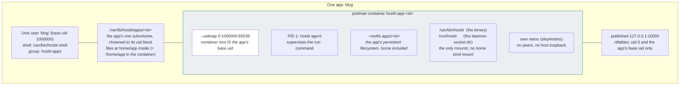

# Isolation: what stops an app escaping

Each app is created as four things at once: a Unix user, a btrfs subvolume (the
container's whole filesystem, with the app's files inside it), a podman
container, and a loopback port with a firewall rule (`app/service.go:create`). Each
of those carries one boundary, and the daemon holds all the privilege; nothing an app
does escalates, because it starts as an unprivileged uid and every path back into
hostit identifies it by that uid.

## The boundaries

| Boundary | Mechanism | What it stops |
|---|---|---|
| App vs app | separate uid, container, netns | reading files, seeing processes, reaching ports |
| App vs host | uidmap so container root is an unprivileged host uid | an escape landing as root |
| App vs daemon | `SO_PEERCRED` on the socket; app-scoped tokens on the API | acting as another app |
| Daemon vs app files | every write goes through chained `os.OpenRoot`s: the subvolume root, then `home/app` inside it | a planted symlink walking the daemon out of the subvolume |
| Tenant vs operator | `hostit-shell` login shell + sshd forwarding hardening | getting a host shell, tunnelling out, reaching host services |

### Per-app Unix user and uid-block idmap

Each app owns a **65536-wide contiguous uid/gid block**: `uidFor(port) = 1000000 +
(port - PortMin) * 65536` (`app/service.go:uidFor`, `workspace/spec.go` block
constants). The container is created by the root daemon but mapped
`--uidmap 0:<base>:65536` (and the matching `--gidmap`), so container root *is* the
app's unprivileged host uid and the whole block maps one-to-one
(`workspace/spec.go:CreateArgs`). Files in the app's subvolume belong to the app
inside and outside the container alike, and a workload escape lands on that uid,
never on host root.

Contiguity is load-bearing: the mapping is a single uniform offset, so the app's
one persistent subvolume is chowned to the block once at creation
(`workspace/subvolume.go:EnsureAppSubvolume`) and every uid a workload uses stays
inside the app's own range. Subvolumes are keyed on the app's stable id, so there
is no uid-migration step; older single-uid schemes are gone.

### Network namespace

Each container gets its own network stack (`--network slirp4netns`), so containers
cannot reach each other and have no route to the host's loopback
(`workspace/spec.go:CreateArgs`). The app's port is published on host loopback
only (`--publish 127.0.0.1:<port>:<containerPort>`), so the proxy can reach it but the
outside world cannot.

Two further container hardening flags: `--pids-limit` caps processes so a fork bomb in
one app cannot take the host, and `--security-opt no-new-privileges` stops a setuid
binary the tenant plants from escalating beyond where it started. AppArmor is left
`unconfined` deliberately (the default profile's signal mediation breaks the
multithreaded Go agent's SIGKILL to children); the uid map, no-new-privileges and
per-app netns already isolate the container. The comments in
`workspace/spec.go:CreateArgs` explain each choice.

### nftables port rules

Even on host loopback, one app must not connect to another app's published port. The
firewall package installs an nftables `output`-hook rule per app port: a connect to
`127.0.0.0/8` (and `::1`) on that port is dropped unless the calling socket's uid is
`0` (the proxy) or the app's own base uid (`firewall/service.go:renderRuleset`). The
ruleset is rebuilt from the registry (the source of truth) whenever apps change
(`app/service.go:ReconcilePortRules`), applied atomically by replacing the whole
`inet hostit` table.

### `os.OpenRoot` file containment

The daemon writes into app files as root, and the tenant owns the whole subvolume
(they are root inside the container it backs), so a symlink they plant -- even at
`home` or `home/app` itself -- could otherwise trick the daemon into writing
outside it. Every file operation resolves through chained `os.OpenRoot`s: the
subvolume root is opened first (its path only root controls), then `home/app` is
resolved INSIDE that root, and all I/O uses the returned `*os.Root`'s
path-contained methods, so a symlink cannot walk the daemon out of the subvolume
(`homefs/service.go:OpenRoot`, `ssh/service.go:WriteAuthorizedKeys`). The `.ssh`
directory must be a real directory, not a link, or the write is refused
(`ssh.ErrNotDirectory`) -- otherwise root would be writing SSH keys, and handing
out ownership, wherever the link pointed.

### The `hostit-shell` login shell

App users' login shell is `/usr/bin/hostit-shell` (set at user creation,
`app/system.go`), not a host shell. On login it identifies the app over the unix
socket, ensures the container is up, prints the banner, then hands off to a narrow
sudoers grant, `sudo -n hostit-enter` (`cmd/shell.go:execShell`). The privileged
`hostit enter` half runs as root but derives the target container from `SUDO_UID`
(the app's id, dug out of the caller's home directory path,
`apps/<id>/home/app`), **never** from its
arguments, so an app user who invokes it directly with someone else's name still lands
in their own container (`cmd/enter.go:execEnter`). The caller's arguments only ever
become the command run *inside* their own container, and the privileged exec runs with
a minimal, non-inherited environment.

### sshd forwarding hardening

The one thing sshd offers that reaches past the container is forwarding, and app users
log in for exactly one reason: to reach their own container. So a `Match Group
hostit-apps` block turns all of it off: `AllowTcpForwarding no`,
`AllowStreamLocalForwarding no`, `AllowAgentForwarding no`, `X11Forwarding no`,
`PermitTunnel no`, `GatewayPorts no`, `PermitUserRC no`
(`deploy/ansible/roles/hostit/templates/sshd-hostit-apps.conf.j2`). Without this a
tenant could tunnel to the cloud metadata service or to another app's loopback port;
scp/sftp/rsync are unaffected. The block is included at the top of `sshd_config` with a
trailing `Match all` so it does not swallow the global settings that follow.

## What stops an app escaping

Put together: an app process runs as an unprivileged host uid inside a container whose
root maps to that same uid, in its own network namespace, able to reach only its own
published port (enforced twice: netns, then nftables). It has no host shell and no SSH
forwarding. Its only channel back to the daemon is a unix socket that authenticates by
kernel-supplied uid, so it can only ever name itself; the daemon holds every
privileged capability and never takes an app-supplied identity. An escape from the
container therefore lands as an ordinary unprivileged user with no path to another
app's files, processes, ports, or to host root.
