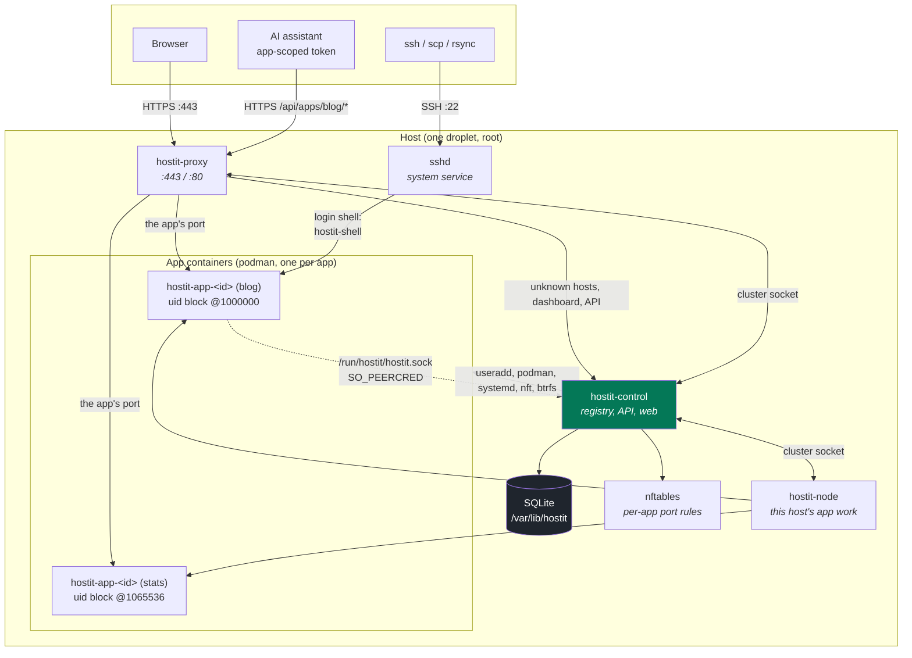

# Overview: four small binaries, running as root

The platform is four binaries from one module (`heckel.io/hostit`), each a thin
main over its component package: `hostit-control` (the registry, web app, REST
API, placement, certificate management, snapshot/retention decisions),
`hostit-node` (the machine half: Unix users, containers, subvolumes, port
rules -- doing only what control commands over the `nodeapi` verbs),
`hostit-proxy` (a dumb data plane serving a cached routing table), and
`hostit` (the app-side CLI and PID 1 inside every container; which commands it
offers depends on where it runs, `cmd/agent/`). There is no separate
scheduler, no message bus, no sidecar. All four colocate on one host -- the
diagram below shows that single-droplet shape; a remote node is the same node
binary dialing control over mTLS (per-node certificates as plain config
files, minted by `hostit-control node add`).

The dotted line is the only way in from an app: a unix socket where the kernel, not
the caller, says which uid is calling (`control/socket.go:socketConnContext`). An app
can therefore ask about itself and act on itself, and cannot name another app.

Containers and app subvolumes are keyed on each app's stable id (`hostit-app-<id>`,
`apps/<id>` -- the app's files live at `home/app` inside its subvolume), not its
name, so a rename never moves anything on disk
(`control/manager.go:create`, `cmd/agent/enter.go`).

## What each listener serves

Control opens its listeners in `control/service.go:Run`; a separate system
`sshd` handles SSH. It does NOT bind `:443` or `:80` -- `hostit-proxy` owns
those, in every deployment, and there is no setting to say otherwise. Control
still manages the certificates and hands material to the proxy over the cluster
link (`CertFor`).

| Listener | Address | Serves |
|---|---|---|
| Public handler | `ListenHTTP` (a local address, e.g. `127.0.0.1:2910`) | Everything the proxy forwards: the REST/web handler on the web hostname, and ACME HTTP-01 challenges arriving through the proxy's `:80` pass-through. With `tls: off` it is the plain-HTTP surface directly, for development. |
| Cluster socket | `ListenCluster` (`/run/hostit/cluster.sock`) | Members sharing this host: the node and the proxy. Root-only, and the kernel identifies the caller, so no certificate is involved. |
| Cluster mTLS | `ListenNode` (optional, e.g. `10.0.0.1:2930`) | Members on OTHER machines, authenticated by a CA-signed certificate. Absent on a single-box install. |
| Admin API | `ListenAPI` (optional, e.g. `127.0.0.1:2900`) | The same REST/web handler over plain HTTP, for local admin use behind the firewall. |
| Unix socket | `SocketFile` (`/run/hostit/hostit.sock`) | The app-side CLI (`hostit deploy/status/logs`, the login shell's `Self`/`Ensure`, and the sandboxed Claude Max tool calls), authorized by `SO_PEERCRED` (`control/socket.go`). World-connectable on purpose; the uid, not the caller, names the app. |
| sshd | `:22` (system service) | App logins. sshd runs the app user's login shell, `/usr/bin/hostit-shell`, which execs into the container; see [`isolation.md`](isolation.md) and [`flows.md`](flows.md). |

The single web/REST handler (`control/service.go:New`, built by `newAPIHandler`) is
one origin for all of these:

- the React SPA (`web/`, embedded via `control/web.go`),
- the REST API and the app-scoped agent API (`control/server_handler_*.go`),
- Google OAuth and cookie sessions (`control/auth.go`, `control/session.go`),
- the browser terminal WebSocket (`control/server_handler_terminal.go`),
- the assistant's SSE stream (`control/server_handler_assistant.go`).

The public proxy gets only the base security headers, so proxied tenant apps are not
constrained by the platform's own CSP; the web/REST handler additionally gets the
full CSP and framing denial (`control/service.go:New`, `control/headers.go`).

## The built-in assistant, by credential presence

The in-browser coding assistant has two possible backends, and each is switched on
purely by the presence of its credential in the config (`config/config.go`,
`control/service.go:New`):

- an `anthropic-api-key` enables the metered Anthropic Messages backend
  (`Config.AssistantEnabled`);
- a `claude-code-oauth-token` (from `claude setup-token`) enables the optional Claude
  Max subscription backend, a sandboxed `claude -p` (`Config.ClaudeBackendEnabled`).

The assistant is constructed whenever *either* is present
(`Config.AssistantAvailable`); there is no separate on/off setting. With neither, the
assistant is nil and its routes report `enabled:false` cleanly. See
[`../subsystems/`](../subsystems/) for the assistant internals.

## Startup, briefly

`cmd/control/serve.go:execServe` loads and validates the config, then refuses to run unless
three non-negotiable prerequisites hold: it is root, every external binary it drives
is installed, and the app-homes directory is on btrfs
(`cmd/preflight.go:checkHostRequirements`, `requireBtrfs`). btrfs is mandatory:
snapshots, rollback, fork and hard disk quotas are core, not optional. Only then does
it open the store, enable btrfs quota accounting and run the one-time storage
migrations (`app/migrate.go`), apply the stored disk limits, build the workspace image
and export its base rootfs in the background, restart any enabled app whose agent
predates this build (a powered-off app stays off), reconcile orphans, and start the
listeners. The full sequence is in
[`flows.md`](flows.md).
