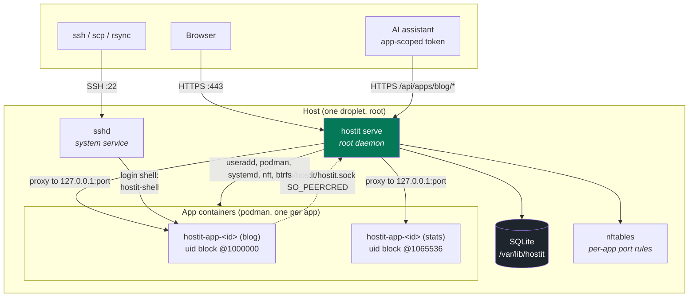

# Overview: one binary, running as root

One binary (`heckel.io/hostit`) running as root is the entire control plane. It
terminates TLS, proxies to apps, serves the web app and REST API, creates Unix users
and containers, and answers a unix socket for the CLI inside each app. There is no
separate scheduler, no message bus, no sidecar; the same binary is also the app-side
CLI (`hostit deploy`) and PID 1 inside every container, so which commands it offers
depends only on where it runs (`cmd/serve.go`, `cmd/shell.go`, `cmd/app.go`).

The dotted line is the only way in from an app: a unix socket where the kernel, not
the caller, says which uid is calling (`server/socket.go:socketConnContext`). An app
can therefore ask about itself and act on itself, and cannot name another app.

Containers and app subvolumes are keyed on each app's stable id (`hostit-app-<id>`,
`apps/<id>` -- the app's files live at `home/app` inside its subvolume), not its
name, so a rename never moves anything on disk
(`app/service.go:create`, `cmd/enter.go:containerKeyFromHome`).

## What each listener serves

The daemon opens a handful of listeners in `server/service.go:Run`; a separate system
`sshd` handles SSH. All the HTTP surfaces below are same-origin, served by the one
root daemon.

| Listener | Address | Serves |
|---|---|---|
| HTTPS proxy | `ListenHTTPS` (`:443`) | Terminates TLS (certmagic: a wildcard cert, or issued on demand). On the web hostname it hands off to the REST/web handler; on `<app>.<base>` or a custom domain it reverse-proxies to the app's loopback port. |
| HTTP | `ListenHTTP` (`:80`) | ACME HTTP-01 challenges, and a redirect of everything else to HTTPS. When TLS is off, this becomes the plain-HTTP proxy instead. |
| Admin API | `ListenAPI` (optional, e.g. `127.0.0.1:2900`) | The same REST/web handler over plain HTTP, for local admin use behind the firewall. |
| Unix socket | `SocketFile` (`/run/hostit/hostit.sock`) | The app-side CLI (`hostit deploy/status/logs`, the login shell's `Self`/`Ensure`, and the sandboxed Claude Max tool calls), authorized by `SO_PEERCRED` (`server/socket.go`). World-connectable on purpose; the uid, not the caller, names the app. |
| sshd | `:22` (system service) | App logins. sshd runs the app user's login shell, `/usr/bin/hostit-shell`, which execs into the container; see [`isolation.md`](isolation.md) and [`flows.md`](flows.md). |

The single web/REST handler (`server/service.go:New`, built by `newAPIHandler`) is
one origin for all of these:

- the React SPA (`web/`, embedded via `server/web.go`),
- the REST API and the app-scoped agent API (`server/server_handler_*.go`),
- Google OAuth and cookie sessions (`server/auth.go`, `server/session.go`),
- the browser terminal WebSocket (`server/server_handler_terminal.go`),
- the assistant's SSE stream (`server/server_handler_assistant.go`).

The public proxy gets only the base security headers, so proxied tenant apps are not
constrained by the platform's own CSP; the web/REST handler additionally gets the
full CSP and framing denial (`server/service.go:New`, `server/headers.go`).

## The built-in assistant, by credential presence

The in-browser coding assistant has two possible backends, and each is switched on
purely by the presence of its credential in the config (`config/config.go`,
`server/service.go:New`):

- an `anthropic-api-key` enables the metered Anthropic Messages backend
  (`Config.AssistantEnabled`);
- a `claude-code-oauth-token` (from `claude setup-token`) enables the optional Claude
  Max subscription backend, a sandboxed `claude -p` (`Config.ClaudeBackendEnabled`).

The assistant is constructed whenever *either* is present
(`Config.AssistantAvailable`); there is no separate on/off setting. With neither, the
assistant is nil and its routes report `enabled:false` cleanly. See
[`../subsystems/`](../subsystems/) for the assistant internals.

## Startup, briefly

`cmd/serve.go:execServe` loads and validates the config, then refuses to run unless
three non-negotiable prerequisites hold: it is root, every external binary it drives
is installed, and the app-homes directory is on btrfs
(`cmd/preflight.go:checkHostRequirements`, `requireBtrfs`). btrfs is mandatory:
snapshots, rollback, fork and hard disk quotas are core, not optional. Only then does
it open the store, enable btrfs quota accounting and run the one-time storage
migrations (`app/migrate.go`), apply the stored disk limits, build the workspace image
and export its base rootfs in the background, restart any enabled app whose agent
predates this build (a powered-off app stays off), reconcile orphans, and start the
listeners. The full sequence is in
[`flows.md`](flows.md).
