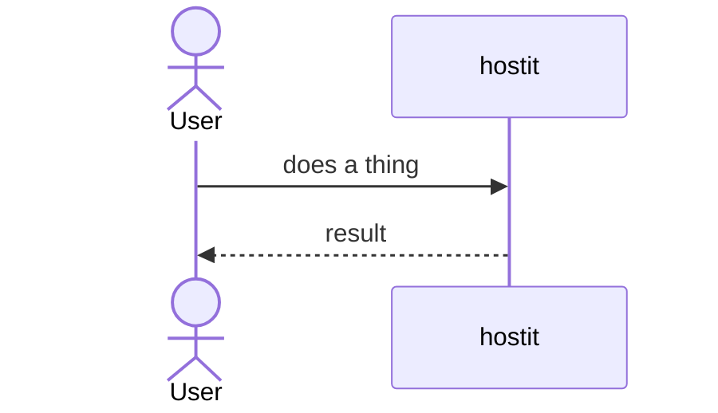

<!--
Feature catalog template. COPY THIS STRUCTURE EXACTLY for every feature file: same
headings, same order, nothing added or removed at the H2 level. Delete this comment
in real files. Keep prose ASCII-only; use Mermaid for diagrams.
-->

# <Feature name>

## Description

What the feature is, from the user's point of view. One or two paragraphs. What can
a user do, and what do they see?

## Why it exists

The problem it solves and the intent behind it. Why is it built this way rather than
another? Any design tradeoffs or decisions worth recording.

## User flows

Step by step, how a user actually uses it (via the dashboard, the API, SSH, or an
agent). Include a Mermaid diagram when a flow has multiple actors or steps, e.g.:

## Technical details

How it is implemented: the packages and files involved, the key functions, the data
model, the request path. Reference code as `path/file.go:symbol`. Enough that an
engineer can find and change it.

## Other notes

Edge cases, limitations, gotchas, security considerations, related features, and any
known future work.
