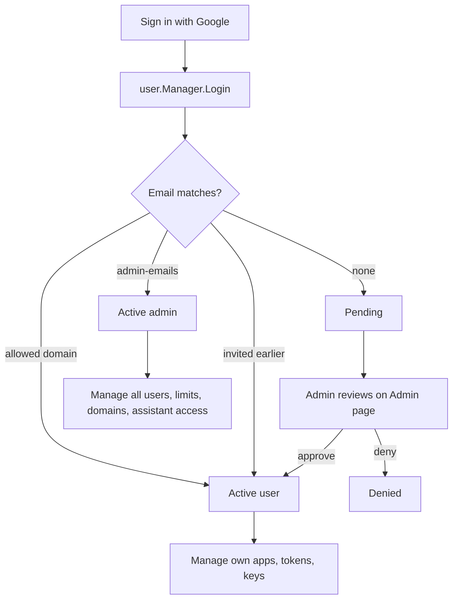

# Accounts, roles and admin controls

## Description

hostit is multi-user. People sign in with Google; each becomes an account with a
role (user or admin), a status in an approval workflow (pending, active, or
denied), and a set of resource limits (how many apps, how much memory and disk
each app may use). An ordinary user manages only their own apps, tokens and SSH
keys. An admin manages everyone: approving or denying pending sign-ups, changing
roles, setting per-user limit overrides and the global defaults, inviting people
before they have ever signed in, allowing whole email domains to skip the
approval queue, and controlling who may use the built-in assistant and which
models.

From a new user's point of view: they click "Sign in with Google", and either
land in the dashboard immediately (their email is an allowed domain or an
admin-configured admin, or they were invited) or see a "waiting for an
administrator to approve your account" state until an admin acts.

## Why it exists

A shared hostit deployment hosts many people's apps on one box, so it needs
identity, gatekeeping, and fair-use limits. The approval workflow keeps a public
Google login from turning into open signup: by default a new address is
`pending` and can do nothing until an admin approves it. Two escape hatches make
that practical at scale -- an admin can pre-`Invite` a specific person, or
`AllowDomain` a whole company domain so its staff are auto-approved -- while
still refusing public mail providers (allowing `gmail.com` would let anyone in).

Limits exist because every app is a real container with real memory and disk on a
shared host. They are layered: a built-in default, a global default an admin can
change, and a per-user override -- resolved most-specific-first, so raising one
person's limit does not touch anyone else.

The assistant permissions are separate from resource limits because the built-in
assistant spends the operator's API budget (or their Claude Max subscription).
There is no per-user model permission: the picker offers whatever the
configured credentials can serve, and any active user may choose any of it. What
bounds a user is their AI budget, which the admin UI shows alongside their spend
-- cost is the control, not a second allowlist that could disagree with it.

## User flows

**Sign-in and approval**

1. A person clicks "Sign in with Google" and completes OAuth.
2. `user.Manager.Login` finds or creates their account. New accounts start
   `pending`, unless: their email is in `admin-emails` (they become an active
   admin), their domain is allowed (active user), or they were invited
   (already active).
3. A pending user sees the waiting state. An admin opens the Admin page,
   reviews pending users, and sets their status to active (or denied).

**Admin managing a user**

1. Admin opens the Admin page (users table, allowed domains, global defaults).
2. For a user they can change role, status, per-user limit overrides (app count,
   memory, disk -- null means "use the global default"), and assistant access
   (External Claude on/off, the model allowlist, or clear the override to
   inherit defaults).
3. Deleting a user forces a decision about their apps: `apps=delete` removes
   them, or `apps=transfer&transfer_to=<id>` hands them (and their app-scoped
   tokens) to another active user.

## Technical details

**The user manager.** `user/service.go:Manager` owns people, tokens, profile SSH
keys and limit settings. `Login` implements the approval logic (admin emails
auto-promote and stay promoted; an allowed domain sweeps up only `pending`
accounts, never a denied one). `Invite` creates an already-active account before
first sign-in. `AllowDomain` / `DisallowDomain` / `AllowedDomains` manage the
allowed-domain list, normalizing `*@company.com` / `@company.com` / `company.com`
to a bare domain (`normalizeDomain`) and refusing public mail providers
(`user/providers.go:publicMailProviders`).

**Roles and status.** `store/types.go` defines `Role` (`RoleAdmin`, `RoleUser`)
and `Status` (`StatusPending`, `StatusActive`, `StatusDenied`), stored on
`store.User` (`store/user.go`). `config.Config.AdminEmails` /
`config.Config.IsAdminEmail` seed the first admins.

**Limits.** `user/service.go:Limits` resolves a user's effective limits (per-user
override on `store.User.AppLimit`/`MemoryMB`/`DiskMB`, else the global setting,
else the built-in defaults `defaultAppLimit`=3, `defaultMemoryMB`=512,
`defaultDiskMB`=2048). `Defaults` / `SetDefaults` read and write the global
settings. Enforcement: `control/server_handler_apps.go:checkAppLimit` rejects app
creation past the app-count limit; memory and disk limits are applied to the
container/qgroup at create time (`node/machine_quota.go` `SetMemoryLimit`,
`SetDiskLimit`). The global admin token (`c.user == nil`) is unlimited.

**Tokens and keys.** Account-wide tokens (`user.Manager.CreateToken`) and
app-scoped tokens (`CreateAppToken` -- see `bring-your-own-agent.md`), and
profile SSH keys (`AddKey`/`Keys`, granting access to all the user's apps), all
hang off the same `Manager`. Only token hashes are stored (`user/service.go:hashToken`).

**Authentication.** `control/auth.go:authenticate` resolves a caller from a
session cookie or a `Bearer` token; `requireActive` gates on `StatusActive`,
`requireAdmin` additionally on `RoleAdmin`. A pending user can still reach
`/api/account` (authenticated-only) to see why they are waiting. The admin token
grants `globalAdmin`. The admin token also signs an admin email in without
Google (`handleBreakglass`, always available -- no flag), for
e2e/recovery.

**Admin HTTP surface** (`control/server_handler_admin.go`, all behind
`requireAdmin`): `handleUsersList` (with each owner's assistant token total and
cost, `assistant.CostUSD`), `handleUsersUpdate` (role/status/limits + assistant
permissions), `handleUsersInvite`, `handleUsersDelete` (with the
delete-or-transfer decision, `store/user.go:TransferApps`), `handleDomainsList`/
`Add`/`Delete`, and `handleSettingsGet`/`Update` for the global default limits.

**Per-user assistant access.** There is none, by decision (2026-08-18). Any
active user may pick any mode the instance can run: the catalog follows from the
operator's credentials (`assistant.Catalog`), an instance approves its signups,
and that is the control. What a user may SPEND is still bounded, by the per-user
AI budget in `user.Limits` -- that is where cost belongs, rather than a second
allowlist that could disagree with it. `store/assistantprefs.go` now holds only
the per-app remembered choice.

**Frontend.** `web/src/pages/Admin.jsx`: the users table (`UserRow`), inline
limit editing, and the allowed-domains and default-limits panels. Each row shows
the user's assistant spend (`formatUSD` / `formatTokens`).

## Other notes

- **Assistant spend shown is the built-in assistant only**, across a user's apps;
  it does not include what their own pasted agent costs them (that is on their
  own Anthropic/Claude account).
- **Deleting a user is guarded.** You cannot delete or de-admin yourself, and you
  must say what happens to the user's apps -- an orphaned app would keep serving
  with nobody able to manage it. Transfers move the app-scoped tokens too.
- **Allowing a domain does not retroactively approve a denied account** -- only
  `pending` accounts are swept up; revoking access is always a per-user decision.
- **Web login can be off entirely.** With no Google client configured
  (`config.Config.WebEnabled` false) there is no web login; the deployment is
  driven by the admin token and the REST API.
- **Related features.** `rest-api.md` (account and app tokens, the API surface),
  `bring-your-own-agent.md` (app-scoped tokens), `builtin-assistant.md` (what the
  assistant permissions gate), `quotas-limits.md` (how memory/disk limits are
  enforced on the container), `web-dashboard.md` (Google login).
