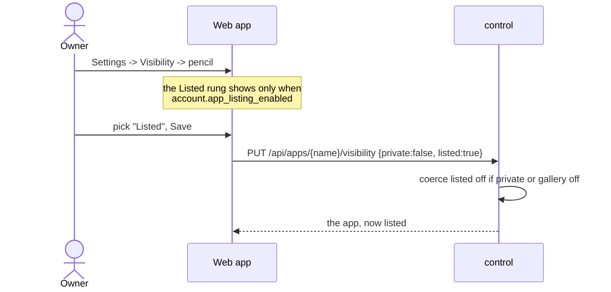

# Public app gallery (Explore)

## Description

**Explore** (`/explore` in the web app) is a gallery of the apps people on this
instance have chosen to show off: one card per app with its name, description,
hostname and, when the instance takes screenshots, its stored preview. Clicking
a card opens the app itself.

It is behind the login on purpose. Any signed-in member sees it; a signed-out
visitor sees nothing, because this is a members' gallery, not a public
directory of everything running on the box.

Being on the gallery is not a separate switch. It is the fourth rung of the same
visibility ladder an app already has:

| | who can open the app | on Explore |
|---|---|---|
| **Private** | the owner, collaborators, admins | no |
| **Restricted** | the above plus named viewers | no |
| **Public** | anyone with the URL | no |
| **Listed** | anyone with the URL | yes |

An owner picks the rung in the app's visibility dialog (Settings -> Visibility),
or in the new-app dialog when creating it. **Listed** means public AND on the
gallery; there is no way to be listed without being public.

The whole feature is off unless the operator turns it on. When it is off there is
no Explore link in the nav, no Listed rung in the picker, and `GET /api/explore`
answers `{enabled: false, apps: []}`.

## Why it exists

An instance is usually a group of people -- a family, a team, a class -- and the
interesting thing about hosting apps next to each other is seeing what the others
built. Before this, the only way to find someone else's app was to be told its
URL.

Two decisions carry the design:

**Listed is a rung, not a checkbox.** A "show on gallery" toggle sitting beside
the public/private setting is two controls that can disagree, and the
disagreement is the dangerous direction: an app flipped back to private with the
gallery box still ticked. Making it the top rung of the one ladder means the
question is asked once and the invalid combinations cannot be expressed. The
server still coerces rather than trusts (see below), because the API is reachable
without the picker.

**The gallery is behind the login.** Listing an app makes it findable by the
people on this instance, not by crawlers. That is a much smaller promise for an
owner to make than "put it on the public internet", and it is what makes the
default-off instance switch a reasonable thing for an operator to turn on.

## User flows

Listing an app:

Browsing it:

1. A signed-in member clicks **Explore** in the nav (present only when the
   instance has the gallery on).
2. `Explore.jsx` calls `GET /api/explore` once and renders a card per app.
3. A card with `has_shot` also loads
   `GET /api/explore/{name}/preview.png`; a shot that fails to load hides itself,
   since the card already names the app.
4. Clicking a card opens the app's own URL in a new tab.

Creating an app straight onto the gallery: the new-app dialog's visibility picker
offers the same four rungs (`Dashboard.jsx:NewAppVisibility`, gated on
`allowListed`). Creating with **Listed** posts the app, then
`PUT /api/apps/{name}/listed {listed:true}`.

An admin turning the gallery on or off: Admin page -> **Public app gallery** ->
`PATCH /api/settings {app_listing}`. It takes effect on the next request; apps
that were already listed keep their flag and come back when it is switched on
again.

## Technical details

**The flag** -- `store.App.Listed`, column `app.listed` (migration #49,
`ALTER TABLE app ADD COLUMN listed INTEGER NOT NULL DEFAULT 0`), written by
`store.Store.SetAppListed`. Nothing else keys on it: the gallery is a filtered
read of the app table, not its own registry.

**The instance switch** -- `control/explore.go:Server.appListingEnabled` is the
one place it is answered: the admin DB override (`store.SettingAppListing`,
`app_listing`) if set, else `config.Config.AppListing` (`app-listing` in
control.yml, default false). Same shape as the other live-overridable settings.

**The gallery** -- `control/explore.go`:

- `handleExplore` (`GET /api/explore`, `requireAccount`) returns
  `{enabled, apps:[{name, url, description, has_shot}]}`. It skips any app that
  is private, not listed, or soft-deleted, and returns `enabled:false` with an
  empty list when the gallery is off. The response is deliberately slim -- it is
  a visitor-facing card, so nothing an owner keeps to themselves goes in it.
- `previewShotExists` stats `preview.Dir(dataDir)/<appID>.png` (only in the
  `screenshot` preview mode), so a card shows a picture rather than an empty box.
- `handleExplorePreview` (`GET /api/explore/{name}/preview.png`) serves a listed
  app's stored screenshot to ANY signed-in user. This is the one place a
  non-owner sees an app's preview -- the per-app `/preview.png`
  (`control/server_handler_preview.go`) is owner-only -- so it re-checks the
  whole rule itself: gallery on, app public, app listed, not soft-deleted. Every
  refusal is `ErrAppNotFound`, so it leaks nothing about apps that are not on the
  gallery.
- `handleAppsSetListed` (`PUT /api/apps/{name}/listed`, owner only via
  `ownerApp`) refuses listing a private app (400) and listing at all while the
  gallery is off (403), so the flag can never claim "public" for an app that is
  not. It logs a `listed` action to the activity feed.

**The visibility endpoint** -- `control/server_handler_visibility.go:handleAppsSetVisibility`
(`PUT /api/apps/{name}/visibility`) now takes `listed` alongside `private` and
writes both, so one dialog commits as one call. It **coerces** rather than
rejects: `listed = req.Listed && !req.Private && s.appListingEnabled()`. The
picker only offers a valid combination anyway, and an API caller asking for
"private and listed" gets the safe reading of it.

**The account response** carries `app_listing_enabled`
(`control/types.go:apiAccountResponse`), which is what lets the SPA decide both
whether to show the nav link and whether to offer the Listed rung, without a
second round trip.

**Web** -- `web/src/pages/Explore.jsx` (the page; the route and both nav links,
desktop and mobile menu, live in `web/src/App.jsx`, the links behind
`account.app_listing_enabled` -- the route itself is always registered, since the
page says plainly when the gallery is off); the `listed`
state in `visibilityOf`, `VisibilityChoice` (its `allowListed` prop turns the
three-rung picker into four), `VisibilityBadge` and `VisibilityIcon`
(`web/src/components.jsx`); `visibilityChanges` (`web/src/visibility.js`), which
carries `listed` through the dialog's draft so Save sends one body; the
`NewAppVisibility` picker in `web/src/pages/Dashboard.jsx`; and the admin
toggle in `web/src/pages/Admin.jsx`.

## Other notes

- **A private app is never listed**, at any layer: the picker cannot express it,
  the visibility endpoint coerces it off, `handleAppsSetListed` refuses it, and
  `handleExplore`/`handleExplorePreview` filter on `Private` again when reading.
  Four checks for one rule, because the read path is the one that would leak.
- **Soft-deleted apps drop off immediately** -- both handlers check
  `SoftDeletedAt`, so an app pending deletion is gone from the gallery well
  before the reaper touches it. See [apps-lifecycle.md](apps-lifecycle.md).
- **Turning the gallery off does not unlist anything.** The flag survives; only
  the surface disappears. Switching it back on restores the same set of cards,
  which is what an operator toggling it experimentally expects.
- **The gallery is not a permission.** Listing changes discoverability only: a
  listed app is exactly as reachable as any other public app, and an unlisted
  public app is exactly as reachable as a listed one to anyone with the URL.
- **No ordering, paging or search.** `handleExplore` walks every app once per
  request; at instance scale (tens of apps) that is cheaper than a filtered query
  plus an index nobody else uses.
- Related features: [private-apps.md](private-apps.md) (the rest of the
  visibility ladder, and how public/private is enforced),
  [web-dashboard.md](web-dashboard.md) (the nav, the new-app dialog, and how card
  previews are taken), [accounts-roles.md](accounts-roles.md) (the admin page the
  instance switch lives on).
