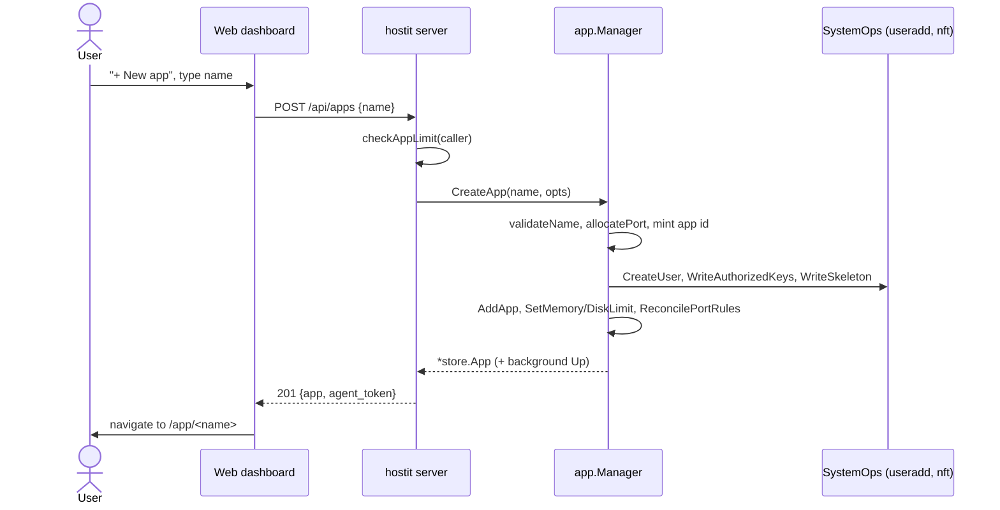

# Apps lifecycle (create, list, open, rename, delete)

## Description

An app is the unit hostit hosts: an isolated container with its own subdomain,
HTTPS certificate, Unix login and home directory. From a user's point of view the
lifecycle is: create an app (pick a name), see it in a list, open it (its public
URL, or its workspace page in the dashboard), rename it, and delete it. A freshly
created app is reachable immediately -- it serves a placeholder page (see
[placeholder.md](placeholder.md)) until its owner builds something in it.

Every one of these actions is available three ways: the web dashboard, the REST
API, and the bundled `hostit apps` CLI (which is just a REST client). Creating an
app also mints an app-scoped API token, shown on the app's page, so the owner can
immediately hand it to an agent.

## Why it exists

hostit is a small PaaS: the whole product is "spin up an isolated place to run a
web app, then drive it from an agent or over SSH". The app is that place. The
lifecycle is deliberately thin -- create allocates the scarce, node-local resources
(a port, a uid block, a Unix user, a subdomain) and everything else (deploy,
snapshots, files, domains) is a separate concern layered on top.

A key design decision runs through the whole lifecycle: **an app has a stable id
minted at birth (`store.NewAppID`), and every durable resource keys on that id, not
on the name.** The home directory, its btrfs snapshots, the container, the systemd
unit, tokens and all per-app database rows are id-keyed. The name is just a mutable
label plus the Unix login. This is what makes rename cheap (nothing moves) and what
lets the daemon translate a caller's name into node-local state at exactly one
point (`app/deploy.go:appID`).

Names are constrained (`app/service.go:AppNamePattern`, `^[a-z]([a-z0-9-]{0,30}[a-z0-9])?$`)
because a name has to be safe both as a Unix username and as a DNS label. A
reserved-name list (`app/service.go:reservedNames`) blocks hostnames with special
meaning (`api`, `www`, `mail`, ...) and common system accounts.

## User flows

Creating an app via the dashboard:

- **Create.** Dashboard `/api/apps` (`Dashboard.jsx` posts `{name}` then navigates
  to `/app/<name>`), or `hostit apps add <name> [-k key]`, or
  `POST /api/apps`. The server enforces the caller's app-count limit
  (`server/server_handler_apps.go:checkAppLimit`), gathers the owner's profile SSH
  keys and memory/disk limits, and calls `app.Manager.CreateApp`. The app is
  registered and then started in the background, so the API returns at once and the
  URL comes up shortly after.
- **List.** Dashboard home, `hostit apps list`, or `GET /api/apps`. By default a
  caller sees only their own apps; an admin can pass `?all=true`
  (`server/server_handler_apps.go:listedApps`). Each row carries live state (running
  dot, CPU/RAM/disk) merged in via `withState`.
- **Open.** Two senses: "Open app" opens the app's public URL
  (`<name>.<base-domain>`) in a new tab; clicking the card opens the workspace page
  `/app/<name>` (the tabbed detail view). There is no server-side "open" action.
- **Rename.** Settings tab, the rename icon next to "App name"
  (`AppDetail.jsx:RenameDialog` -> `POST /api/apps/{name}/rename`), or
  `POST /api/apps/{name}/rename {new_name}`. See rename details below.
- **Delete.** Actions menu, behind a type-the-name confirmation
  (`AppDetail.jsx:DeleteAppDialog` -> `DELETE /api/apps/{name}`), or
  `hostit apps remove <name>` (also confirms), or `DELETE /api/apps/{name}`.

## Technical details

- **Package `app`** (`app/service.go`) owns the lifecycle. `Manager` holds the
  config, the store, a `SystemOps` for root-privileged OS work (useradd, loginctl,
  nft), and injected `btrfs`/`systemd`/`container` services.
- **Create** flows `CreateApp` -> `create` (`app/service.go:create`, shared with
  fork). It validates the name (`validateName`), allocates the lowest free port in
  the configured range (`allocatePort`), mints `store.NewAppID`, builds the
  id-keyed home (a btrfs subvolume when available, else a plain dir), creates the
  Unix user (`SystemOps.CreateUser`) at a uid derived from the port
  (`uidFor`: a contiguous 65536-wide block per app), writes `authorized_keys` (the
  union of request keys and the owner's profile keys) and the skeleton
  (`app/skeleton.go`, see [deploy.md](deploy.md)/[placeholder.md](placeholder.md)),
  inserts the row (`store.AddApp`), records memory/disk limits, reconciles the
  per-app loopback firewall rules, and starts the app in a goroutine (`Up`).
- **Data model** (`store/app.go`): the `app` table is
  `(id, name UNIQUE, port UNIQUE, host, owner_id, disk_mb, created_at, image_tag)`.
  `store.App` is the struct. Lookups are by name (`Store.App`), and `RemoveApp`
  looks the app up first so it can cascade-delete every per-app table by id.
- **List**: `handleAppsList` -> `listedApps` -> `Store.Apps` / `AppsByOwner`, then
  `appResponse` + `withState` (live state from `app/state.go:CachedStates`).
- **Rename** (`app/rename.go:RenameApp`): validates the new name, stops the unit if
  running (it is `Restart=always`, so it must be stopped, not just killed), force-kills
  leftover user processes so `usermod --login` is not blocked
  (`SystemOps.KillUserProcesses`, with a retry loop in `renameUser` for the
  process-death race), renames the Unix login and the store row
  (`store.RenameApp`, one transaction that also fixes the `assistant_session` name
  mirror), moves the name-keyed in-memory caches (`renameCaches`), and restarts the
  app. Nothing durable moves; the container keeps its `--hostname` until the next
  deploy recreates it. The server then calls `reloadDomains` so a custom domain
  follows the app to its new name.
- **Delete** (`app/service.go:DeleteApp`): serialized by the per-app lock, it
  disables the unit, resets its failed state, force-removes the container, deletes
  the app's btrfs subvolumes (home + snapshots) on a btrfs host, deletes the Unix
  user, removes any leftover home dir, and finally `store.RemoveApp` (which cascades
  keys, snapshots, domains, events, usage, tokens, assistant session). The server
  also drops the app's assistant session (`handleAppsDelete`).
- **Per-app lock** (`app/service.go:lockApp`): a per-app mutex serializes deploy,
  snapshot, rollback and delete so operations on one app's home never interleave.

## Other notes

- **Ownership and visibility.** `ownedApp` returns `ErrAppNotFound` (not 403) for an
  app the caller does not own, so hostit never leaks the existence of other people's
  apps. Admins can act on any app; the *list* is still personal even for admins
  (asking for all apps is explicit via `?all=true`).
- **The global admin token owns nothing** (`c.user == nil`): its "own apps" means
  all apps, and it is exempt from the app-count limit.
- **Ports are the scarce resource.** Creation fails with `ErrNoPortsAvailable` when
  the configured `PortMin..PortMax` range is exhausted; the uid block is also derived
  from the port, so ports bound how many apps a node can hold.
- **App-count limit** is enforced on create/fork only (`checkAppLimit`); see
  [quotas-limits.md](quotas-limits.md).
- **Non-btrfs hosts** get plain-directory homes: no snapshots, rollback, fork, or
  hard quota. `create` logs the `subvolume` choice so a wrongly-detected ext4 home
  is visible rather than silent.
- **Related features:** [deploy.md](deploy.md) (what happens after create),
  [fork.md](fork.md) (create seeded from another app), [logs.md](logs.md) (the
  activity feed records create/rename/delete), and the SSH/custom-domain/token
  features layered on the same app.
