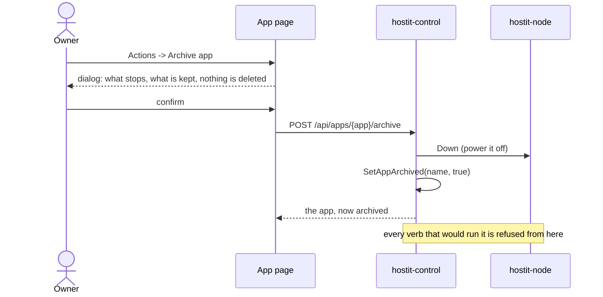

# Archiving

## Description

An app the owner is done with, but does not want to delete. Archiving powers it
off and keeps it off: it cannot be powered on, deployed to, started by an SSH
login, run a command, or take a new snapshot, and its subdomain stops serving.
Its files stay readable and writable, so it can still be inspected or prepared
before being brought back.

Archived apps are hidden on the dashboard by default, behind a toggle that
carries the count. On the app page the status dot is grey (not the red of a
stopped app -- it is put away, not broken) and the actions menu offers
**Unarchive** in place of every lifecycle verb.

Unarchiving returns it to an ordinary powered-off app. It is deliberately not
started: coming out of the archive is a different decision from wanting the app
running again.

## Why it exists

Deleting an app is final and takes its snapshots with it. People kept the apps
they were finished with running instead, because the only alternative was
losing them -- so they held memory, took snapshots every few hours, and crowded
the dashboard.

Two decisions are worth recording:

- **`archived` is its own registry column, not a second meaning for
  `powered_off`.** An owner flips power freely; overloading it would make "off
  because I am done for today" indistinguishable from "off because this app is
  retired", and would leave nothing to restore on unarchive. Keeping them
  separate means an app leaves the archive in the power state it had.
- **Retention keeps thinning an archive, but never to nothing.**
  `retention.Archived` is `{Last: 1, Monthly: 12}`: monthly rollups for a year,
  with the newest snapshot as a floor. The point of archiving rather than
  deleting is that someone may want the app back in a year, and a policy that
  pruned it to nothing would quietly defeat that.

## User flows

Archiving from the app page (the API path is the same, via the endpoints below):

Bringing it back is `POST /api/apps/{app}/unarchive`, then a power-on when the
owner wants it running.

## Technical details

- **Registry:** `archived` on the `app` row (migration 22, additive with a
  default), `store.Store.SetAppArchived`. It is in `store.App`, the API's app
  response, and the node mirror's view of an app.
- **The refusal is in one place.** `control/registry.go:routingAgent` routes
  every control-to-node call. `routeRunnable` refuses an archived app and is
  used by the verbs that would make it run (`Ensure`, `Up`, `PowerOn`,
  `Restart`, `StartApp`, `RestartApp`), the one that needs it running (`Exec`),
  and `TakeSnapshot`. A verb added later cannot forget the check by omission,
  because it has to pick a router.
  - `Down`, `StopApp`, `Status`, `Logs`, the file operations and
    `DeleteSnapshot` stay on the plain `route`: an archived app must still be
    inspectable, windable-down, and thinnable by retention.
- **Errors:** `control.ErrArchived`, mapped to HTTP 409 in `writeAppError` --
  the app exists and the request is well formed, but its state forbids it.
- **Manager:** `control/archive.go:Archive` powers the app off and sets the
  flag (an unreachable node is logged, not fatal: the flag is what stops it
  coming back either way). `Unarchive` clears it and starts nothing.
- **Snapshots:** the sweep skips archived apps entirely
  (`control/snapshot.go:autoSnapshotSweep`) but still prunes them, under
  `retentionPolicy`, which returns `retention.Archived` for an archived app.
- **Agents:** `AppOps.Archived` feeds the assistant's system prompt
  (`assistant/service.go:archivedNote`), and `/info`'s guide leads with the
  archived state and how to undo it, so a model explains the situation instead
  of discovering it one 409 at a time.
- **Terminal:** an archived app closes the websocket with
  `terminalStatusArchived` (4002), distinct from the powered-off 4001, so the
  browser stops reconnecting and names which state it is in
  (`web/src/reconnect.js:shouldReconnect`).
- **API:** `POST /api/apps/{app}/archive` and `/unarchive`, registered on the
  agent routes (`requireApp`, which wraps `requireActive`, so a browser session
  and an app-scoped token both reach them). Registering them on both surfaces
  panics the mux -- two patterns matching one path.

## Other notes

- **An app-scoped token may archive its own app.** It cannot strand itself: an
  archived app keeps answering the file and info endpoints that token needs to
  undo it.
- **Masking is not enforced in the node.** The refusal lives in control, which
  is where the registry is. A node asked directly would comply; that is the same
  trust boundary every other control decision relies on.
- **The subdomain stops serving** because the container is off, not because the
  proxy has a special case for archived apps.
- Related: [snapshots-rollback.md](snapshots-rollback.md) (the archived
  retention policy), [quotas-limits.md](quotas-limits.md) (an archived app still
  occupies disk), [apps-lifecycle.md](apps-lifecycle.md) (delete, the other way
  to be done with an app).
