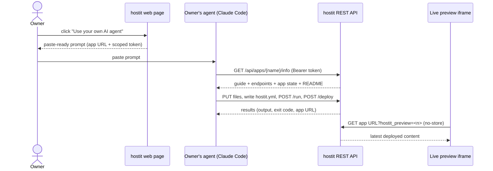

# Bring your own agent

## Description

Instead of the built-in chat, an owner can drive an app with their own AI agent
-- Claude Code, or anything else that can make HTTP calls. Every app is minted
with an app-scoped API token the moment it is created. The app page's "Use your
own AI agent" dialog hands the owner a short, ready-to-paste prompt that already
carries the app's URL and that token; pasting it into an agent points the agent
at the app's own self-describing `/info` endpoint, which returns everything the
agent needs to know: the full REST API, the file layout, how `hostit.yml` works,
and the app's current state. The agent then reads, writes, runs commands,
deploys, and snapshots the app entirely through that one URL.

While the agent works, the owner's live preview in the browser always shows the
latest deploy: hostit tags preview loads with a `?hostit_preview=<n>` query
parameter and serves them with caching disabled, so the owner sees fresh output
without the agent doing anything special.

## Why it exists

Some owners already have an agent they prefer, or want a more capable one than
the built-in chat. The design goal is that **the app is entirely
self-describing from a single URL**: whatever an agent needs must be reachable
from the one link the owner pastes, because that is all the owner hands over.
The pasted prompt stays deliberately tiny -- it does not duplicate the API docs,
it just sets the agent's stance (learn the API, then wait for instructions) and
points at `/info`.

The token is **app-scoped** on purpose. It is meant to be pasted into someone
else's agent session, so it must not be able to touch the owner's other apps or
reveal who the owner is. The URL shape *is* the permission: an app token may
only reach `/api/apps/{that-app}/...` and nothing else (not `/api/account`,
which would leak the owner's identity).

Two prompt shapes exist because they are two different jobs. A brand-new stub is
an invitation to build ("I'm ready to build, tell me what to make"). An app that
already carries a `description:` in `hostit.yml` is finished work someone is
coming back to -- the prompt says so up front, so the next agent continues the
work instead of overwriting it. For the same reason, `/info` points the agent at
the built-in assistant's transcript for the app, so an agent the owner switches
to picks up with the full history of what was already tried.

## User flows

1. The owner opens the app page and clicks "Use your own AI agent". A dialog
   shows the ready-to-paste prompt (the token masked on screen, real when
   copied).
2. The owner pastes the prompt into Claude Code (or another agent).
3. The agent calls `GET {origin}/api/apps/{name}/info` with
   `Authorization: Bearer <token>`. `/info` returns the platform guide, the
   API endpoints, the layout, `hostit.yml` semantics, and (from
   `/apps/{name}/info`) the app's URL, state, README, file list and current
   `hostit.yml`.
4. The agent optionally reads the built-in assistant's transcript
   (`GET /apps/{name}/assistant/transcript`) to continue prior work.
5. The agent uploads files (`PUT .../files/{path}` or a tar to
   `POST .../files`), writes `hostit.yml`, runs build commands
   (`POST .../run`), then `POST .../deploy`.
6. The owner watches the live preview in the browser; every deploy shows up
   because preview loads are cache-busted and served no-store.

## Technical details

**The scoped token.** `user/service.go:CreateAppToken` mints a token limited to
one app (`store.Token.AppName` set). `user/service.go:AppToken` returns the
app's token, creating one if it has none, so an app always has a token from the
moment it is created; `RotateAppToken` replaces it. Unlike account-wide tokens
(hash-only), an app token also stores its plaintext `Secret`
(`store/token.go`, `store/types.go:Token`) so the app page can render the prompt
again. Tokens are keyed on app id so they survive a rename, and move with the app
on owner transfer (`store/user.go:TransferApps`). The app API exposes the token
to the owner as `agent_token` (`server/server_handler_apps.go:agentToken`, rotated
via `POST /api/apps/{name}/token`).

**Authentication and scope enforcement.** `server/auth.go:authenticate`
resolves a `Bearer` token to a `caller` with an `appScope`
(`user/service.go:UserAndScopeByToken`). `server/auth.go:authenticated` rejects
any request whose path is outside that scope
(`server/auth.go:withinAppScope`), and `server/server_handler_agent.go:requireApp`
additionally refuses if `{app}` in the path is not the token's app. An app
created with the global admin token has no owner, but its app token still works
(scoped to that app only).

**The self-describing endpoint.** `server/server_handler_agent.go` registers the
per-app API under `/api/apps/{app}/` in `newAgentRoutes` -- the prefix is exactly
what an app token may reach. `handleAgentInfo` (`GET /api/info`) and
`handleAgentAppInfo` (`GET /api/apps/{app}/info`) both return
`agentGuide(...)`, the instruction set: platform description, workflow, file
layout (`appctl.PublicDir` / `BinDir` / `SrcDir` / `DocsDir` / `LogDir`),
`hostit.yml` semantics, available runtimes, an endpoint list, and notes. The
`/apps/{app}/info` variant also carries the app's live URL, running state,
README, file list, current `hostit.yml`, and SSH command. When the app has a
`description`, the guide switches to its "already built, do not rebuild" shape.

**Continuity with the built-in assistant.**
`server/server_handler_agent.go:handleAgentAssistant`
(`GET /api/apps/{app}/assistant/transcript`) renders the built-in assistant's
session as markdown via `assistant/transcript.go:RenderTranscript`, or
`{"enabled":false}` when no assistant is configured. The guide tells the agent
to read this first.

**The always-fresh live preview.** `server/proxy.go` reverse-proxies
`<app>.<base-domain>` to the app's loopback port. `proxy.go:isPreviewRequest`
recognizes a preview load two ways: the top-level document by its
`hostit_preview` query param (`proxy.go:previewParam`), and its same-origin
sub-resources (CSS/JS/images) by that param appearing in the `Referer`. For a
preview load, `proxy.go:stripCachingForPreview` rewrites the response headers
(`Cache-Control: no-store, must-revalidate`, dropping `ETag`/`Last-Modified`/
`Expires`) so a refresh never serves a stale document. Real visitors are
unaffected. The web iframe builds the URL with a per-reload counter, e.g.
`app.url + "?hostit_preview=" + previewKey` (`web/src/pages/AppDetail.jsx`,
`AppEditor.jsx`).

**The paste-ready prompt.** `web/src/pages/AppDetail.jsx:promptText` builds the
two prompt shapes (stub vs. described app); `PromptDialog` shows it under "Use
your own AI agent", masking the token on screen but copying the real value.

**Endpoints an agent uses** (all under `/api/apps/{app}/`, all app-scoped):
`info`, `assistant/transcript`, `logs`, `files` (list/read/write/delete/tar),
`move`, `mkdir`, `readme`, `run`, `deploy`, `snapshots` (list/take/restore/
delete), the app verbs `start`/`stop`/`restart`, and the container verbs
`poweron`/`poweroff`/`reboot`. Actions are POST-only; a GET to an action path
returns `405` with an explanation rather than falling through to the web app.

## Other notes

- **`/run` is bounded** (a minute by default, five at most, output capped); long
  builds belong in a `prepare:` step in `hostit.yml`. A backgrounded command
  survives `/run` but only a `reboot` (container replacement) stops it.
- **Not available over the app token:** deleting, renaming, and attaching a
  custom domain are owner-only, done in the web app. A rename keeps the app
  running and changes no files, and the token follows the app, so nothing the
  agent built breaks.
- **Account tokens** (empty `AppName`) are the broader credential covering the
  whole account; app tokens are the narrow, pasteable ones. See `rest-api.md`.
- **Do not 404/error on an unknown query string:** the preview appends
  `?hostit_preview=<n>`, and an app that rejects unknown params would break its
  own preview (noted in the guide's `Notes`).
- **Related features.** `builtin-assistant.md` (same tool surface, in-browser),
  `browser-workspace.md` (the preview pane and its controls), `ssh-access.md`
  (agents can also scp/rsync in), `rest-api.md` (tokens in general).
