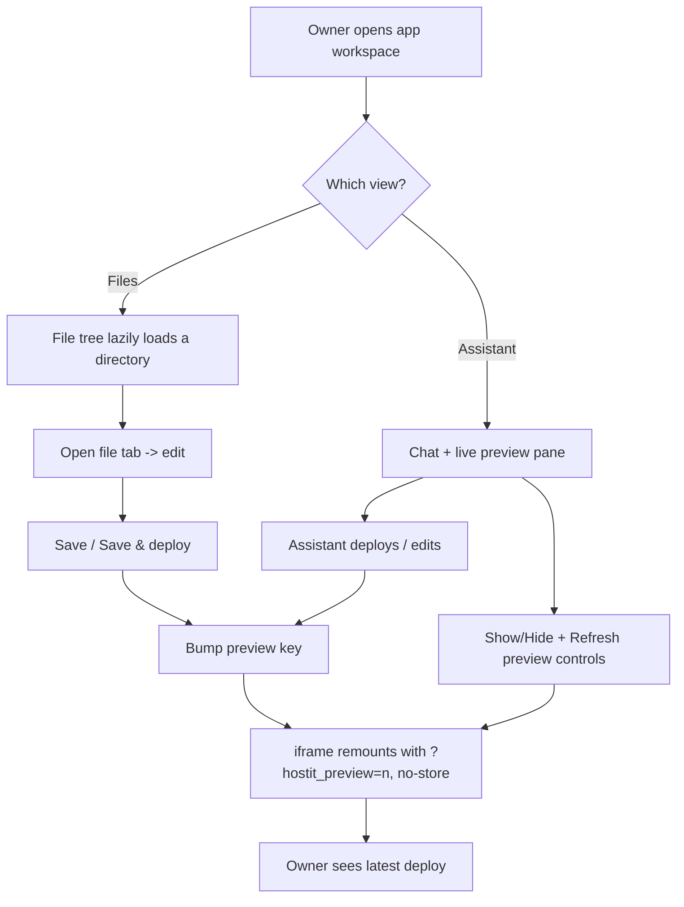

# Browser workspace

## Description

Each app opens into a workspace page in the browser -- a place to see, edit, and
run the app without a laptop or a local checkout. The page is a set of views the
owner switches between as tabs: the AI assistant (chat plus live preview), the
file editor, the terminal, snapshots, logs, and settings. The two that make it a
workspace are the **file editor** and the **live preview**.

The file editor is a small IDE: a lazily-loaded, collapsible, resizable file
tree on the left (drop OS files to upload with a progress bar, drag files between
folders, rename and delete), a tabbed code editor in the middle with syntax
highlighting and image/binary previews, and Save / Save & deploy controls. The
editor has its own optional preview pane, and the assistant view has a larger
one beside the chat. The preview is a live iframe of the running app that always
shows the latest deploy; the owner can show or hide it and refresh it on demand.
When the app is edited (a static file saved, a deploy run, the assistant or an
external agent changing something), the preview reloads on its own.

## Why it exists

The workspace is what lets someone build and maintain an app from a phone or a
borrowed computer. Everything the app needs -- editing files, running commands,
watching the result -- is on one page, served by the hostit daemon itself, so no
tooling is installed locally.

Design decisions worth recording:

- **Views stay mounted; only the active one is shown.** Switching tabs is
  instant, the terminal keeps its live session, and the assistant keeps its
  scroll position, instead of reconnecting or reloading on every click.
- **The tree loads per directory, not the whole tree.** An app with dependencies
  installed would otherwise answer with tens of thousands of entries; the editor
  fetches one directory at a time and expands on demand.
- **Text vs. binary is decided cheaply.** Known text/code extensions are
  downloaded to edit; known-binary extensions show a details card with no
  download; unknown extensions are `?stat=1`-sniffed server-side (a MIME check)
  rather than downloaded just to discover they are binary.
- **The preview is always fresh.** Rather than trusting cache headers, hostit
  cache-busts preview loads (a per-reload query param) and strips caching on the
  proxy for tagged requests, so a refresh can never show stale output. See
  `bring-your-own-agent.md` for the proxy mechanism.

## User flows

**Editing a file**

1. Owner opens the app and selects the Files view.
2. They click a file in the tree; its tab opens with syntax-highlighted content.
3. They edit and press Save (Cmd/Ctrl-S), or Save & deploy to also apply
   `hostit.yml` and restart the app.
4. Saving a static `public/` file bumps the editor's preview key so the pane
   reloads; Save & deploy bumps it after the deploy and calls `onDeploy`, which
   reloads the workspace preview.

**Watching changes live**

1. Owner is in the assistant view (chat left, preview right) or has toggled the
   editor's preview pane on.
2. The preview iframe points at the app's public URL with a `?hostit_preview=<n>`
   query param.
3. Any deploy -- the assistant's `deploy` tool, `Save & deploy`, an external
   `hostit deploy`, a restart -- bumps the key, remounts the iframe, and shows a
   "Refreshing" badge until it loads.
4. The owner can hit Refresh to reload manually, or Hide preview to give the
   chat the full width.

## Technical details

**The workspace shell.** `web/src/pages/AppDetail.jsx` renders the view switcher
(`ws-viewtabs`) and keeps every view mounted (`ws-inactive` hides the inactive
ones). It owns the workspace-level preview state: `previewKey` (seeded with a
timestamp so URLs are unique per session), `previewHidden`, `refreshing`, and
`reloadPreview` (bumps the key, refreshes the snapshots pane, and shows a
"Refreshing" badge with a 6s fallback timeout because some apps never fire the
iframe `load` event). The preview `src` is
`app.url + (has-query ? "&" : "?") + "hostit_preview=" + previewKey`. The
Refresh and Show/Hide preview controls (`ws-preview-ctl`) are rendered
right-aligned and only in the assistant view.

**The file editor.** `web/src/pages/AppEditor.jsx` is the IDE view. It manages:

- The tree: `loadDir` fetches one directory (`GET .../files?path=`),
  `refreshTree` reloads the root plus every expanded folder, drag/drop upload
  (`uploadTo`, with a disk-quota pre-check and a progress bar) and file moves
  (`moveEntry` -> `POST .../move`), plus `mkdir`, rename, and delete dialogs.
- The tabs: `openFile` decides binary vs. text (`looksBinary`, `knownTextExt`,
  or a `?stat=1` MIME sniff), `loadText` downloads editable files, and open
  tabs/active file are persisted to `localStorage` per app.
- Editing: a highlighted `<pre>` overlaid on a `<textarea>` (`highlight`,
  `langForFile`), a line gutter, `save` (`PUT .../files/{path}` raw body) and
  `saveAndDeploy` (`POST .../deploy`).
- Its own preview pane: `previewOn`, `previewWidth` (drag-resizable), and a
  `previewKey` bumped when a `public/` file is saved in a static app or after a
  deploy. The iframe is
  `src={url}?hostit_preview={previewKey}` with
  `sandbox="allow-scripts allow-same-origin allow-forms"`, shown only when the
  app is running.

**The file API** (`control/server_handler_files.go`, registered in
`control/server_handler_agent.go:newAgentRoutes`, shared with the agent API):
`handleAgentFileList` (one directory), `handleAgentFileGet` (raw bytes, or
`?stat=1` for size/modtime/MIME via `control.Manager.StatFile`; served as
`application/octet-stream` with `nosniff` so a tenant's HTML can never run on the
web origin), `handleAgentFilePut` (raw body, `?mode=755` for executables),
`handleAgentFileDelete`, `handleAgentMove`, `handleAgentMkdir`, and tar upload.
All are thin handlers over `control.Manager`'s file methods.

**The live preview proxy.** The public proxy (`control/proxy.go`) serves the app
at its subdomain and, on a preview-tagged request
(`proxy.go:isPreviewRequest`, matching `proxy.go:previewParam` =
`hostit_preview` in the query or the `Referer`), rewrites response headers via
`proxy.go:stripCachingForPreview` so a preview never serves a stale document or
asset. This is what makes "always shows the latest deploy" true regardless of
the app's own cache headers.

**Preview enablement.** The assistant view (chat + the larger preview) exists
only when `app.assistant_enabled` (an Anthropic key or the subscription is
configured); otherwise the workspace opens straight into the editor, whose own
preview pane still works. The terminal and snapshots views have their own
feature docs.

## Other notes

- **The preview needs the app running.** The editor's pane shows "The app is
  powered off." when it is down; the workspace pane shows an off state.
- **The iframe is sandboxed** (`allow-scripts allow-same-origin allow-forms`),
  and preview requests are same-origin sub-resources of the app's own origin,
  not the web app's.
- **Mobile.** On a phone the tree is a drawer over the editor (starts closed),
  and the preview "refreshing" spin is skipped on narrow screens because the
  hidden lazy iframe never fires `load`.
- **Disk quota.** Uploads are rejected up front if they would breach the app's
  disk quota; see `quotas-limits.md`.
- **Related features.** `builtin-assistant.md` (drives these same edits from the
  chat), `bring-your-own-agent.md` (the `?hostit_preview` cache-busting and the
  file API over a scoped token), `export-download.md` (downloading the whole
  workspace as an archive), `terminal.md`, `snapshots-rollback.md`, `logs.md`.
