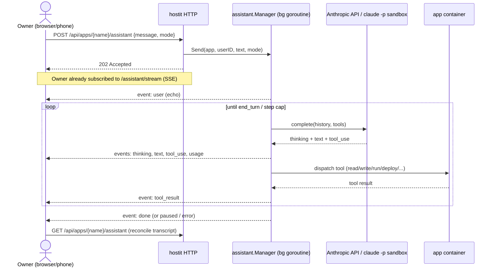

# Built-in assistant

## Description

The built-in assistant is an in-browser AI chat that builds and changes an app
for you. From the app's workspace page you type in plain English ("add a
leaderboard", "switch this to a Go binary") and the assistant reads and writes
the app's files, runs commands in its container, deploys, and reports back. Its
reply streams live: you watch it think, see each tool it runs (with a one-line
summary you can expand), and a rotating "Working... / Baking..." indicator shows
it is busy (with elapsed time and a token counter once a turn runs past ten
seconds). The conversation is persisted server-side, so a reload -- or a second
device, or a phone -- picks it up exactly where it left off, and a turn started
on one device streams to all of them.

A model picker sits in the input row, listing every model this instance can run:
the operator's Claude subscription first, then the metered API, with a rule
between the groups and the vendor's own mark per item (the Claude burst, the
Anthropic A). The same model can appear in both groups ("Sonnet 5" twice)
because the two differ in who pays, not in what runs, so the mark is the only
thing that tells them apart -- which is why it is the glyph a person already
recognises rather than a shape we invented. The list
follows from which credentials are configured; there is nothing to allowlist and
no per-user filter. When a turn runs long enough to hit its
step limit, the chat shows a calm "paused, say continue" notice rather than an
error, because nothing failed.

## Why it exists

The point of hostit is to let someone build and run a small web app without a
laptop or a toolchain. The assistant closes the last gap: you can create,
change, and debug an app entirely from the browser (including a phone), because
the model does the file editing and command running for you inside the app's own
container.

It is deliberately built as a thin loop around the Anthropic Messages API whose
**tools are the app's own REST operations** (see `assistant/tools.go:AppOps`),
not a general coding agent. The model is confined to exactly one app the same
way a pasted agent token is: it can list/read/write files, run a bounded
command, read logs, deploy, snapshot, and roll back -- and nothing else. There
is no shell tool, no network tool, no access to other apps.

Two backends are supported, and the **presence of a credential is the whole
switch** -- there is no `assistant-backend` setting:

- `anthropic-api-key` set (`config.Config.AnthropicAPIKey`) enables the metered
  API backend.
- `claude-code-oauth-token` set (`config.Config.ClaudeCodeOAuthToken`, from
  `claude setup-token`) enables the "Claude.ai" subscription backend, which
  drives a sandboxed `claude -p` on the operator's Claude Max plan.

Either credential on its own turns the assistant on
(`config.Config.AssistantAvailable`); both being present offers both in the
dropdown. This replaced an earlier design where the option could be shown while
the backend was unwired, silently running the API model and mislabelling the
reply (see `control/service.go:New`).

Design tradeoffs worth recording:

- **The run is server-owned, not request-owned.** A turn runs in a background
  goroutine bound to a background context, so the sender leaving (closing the
  tab, locking the phone) does not cancel it, and every subscriber sees the same
  stream. This is why the transcript, live state, and rate limits all live in
  the `assistant.Manager`, not in the HTTP handler.
- **A step cap, not a hard failure.** `maxIterations` (40) bounds one turn's
  tool-call rounds; hitting it publishes a friendly "paused" notice
  (`assistant/service.go:maxIterationsNotice`) rather than an error.
- **Per-user rate limits**, because every turn spends the operator's API budget
  (`defaultMaxRunsPerUser` = 3 concurrent, `defaultMaxRunsPerHour` = 60).

## User flows

1. The owner opens the app's workspace page and the chat view (chat on the left,
   live preview on the right).
2. They type a message (optionally attaching files by drag/drop) and press
   Enter. The browser POSTs to `/api/apps/{name}/assistant`; the server starts a
   background turn and returns `202 Accepted` immediately.
3. The browser is already subscribed to `/api/apps/{name}/assistant/stream`
   (SSE). Every step of the loop -- `model`, `thinking`, `text`, `tool_use`,
   `tool_result`, `usage`, and finally `done` (or `paused` / `error`) -- arrives
   as an event and renders live. The user message is echoed on the stream too,
   so it is not rendered optimistically.
4. When the model calls `deploy` or `refresh_preview`, the browser reloads the
   live preview iframe once the tool result comes back, so it shows the new
   content and not a mid-deploy snapshot.
5. On `done` the browser re-fetches the transcript to reconcile every watcher to
   the committed history. On `paused` it shows the step-limit notice; the owner
   types "continue" to resume.

## Technical details

**Packages.** The loop and its backends live in `assistant/`; the HTTP surface,
the adapters to the rest of hostit, and the mode/permission logic live in
`control/`.

**The API loop.** `assistant/service.go:Manager` owns everything. `Manager.Send`
reserves a run slot (`reserveRun`), claims the app's session (`session.begin`),
and launches `runLoop` in a goroutine. `runLoop` resolves the mode, stores and
shows the user's message once, then either runs the subscription backend or
falls through to `runAPILoop`. `runAPILoop` is the classic
model-call-then-run-tools loop: `Manager.client.complete` (an Anthropic Messages
request built in `assistant/types.go:request`), `publishReply` streams the reply
blocks, `dispatch` runs each `tool_use`, and results go back as the next user
message. It caps at `maxIterations` (40) and, on hitting the cap, publishes
`Event{Type:"paused", Text: maxIterationsNotice}`.

**Prompt shaping.** `systemPrompt` sets the model's stance (one hostit app, make
changes with the tools, deploy after config changes). Requests carry adaptive
extended thinking (`thinkingFor`, omitted for Haiku), a `high` output effort
(`outputConfigFor`), prompt-cache breakpoints on the system prompt, tool defs,
and the conversation tail (`cachedSystem`, `cachedToolDefs`, `cacheConversation`
with `ephemeralCache`), and only the last `maxContextTurns` (12) human turns
(`recentHistory`) -- the full history is still persisted and shown.

**Tools.** `assistant/tools.go:toolDefs` describes the ten tools
(`list_files`, `read_file`, `write_file`, `run_command`, `read_logs`, `deploy`,
`refresh_preview`, `snapshot`, `list_snapshots`, `rollback`).
`assistant/tools.go:DispatchTool` is the single place they execute, shared by
both backends, against `assistant/tools.go:AppOps`. The server implements
`AppOps` over `control.Manager` in `control/assistantops.go:appOps` (with an
`assistantReadCap` of 128 KB on reads). `refresh_preview` is a UI-only signal:
the tool call on the event stream tells the browser to reload the preview.

**The Anthropic client.** `assistant/anthropic.go:Client.complete` posts to
`/v1/messages` with `x-api-key` and `anthropic-version: 2023-06-01`;
`assistant/anthropic.go:completer` is the interface so the loop is testable.
`maxTokens` is 16000 per reply.

**The subscription backend.** An option whose backend is `claude` (ids like
`claude-opus-5`, see `assistant/backend.go`) routes a turn to
`assistant/claude.go:Manager.runClaudeTurn`, which calls
`assistant/claude.go:ClaudeRunner` -- implemented by
`control/assistantclaude.go:claudeBackend` over `assistant/sandbox.go:Sandbox`.
The sandbox runs a pinned `claude -p` inside a locked-down podman container
(uid-mapped to the app, MCP-only tools via `mcpToolGlob`, every built-in tool
denied via `disallowedBuiltins`), advertising the same tool surface over an MCP
server (`assistant/tools.go:ToolDefs` / `DispatchTool`). Its stream-json output
is normalized in `parseAssistantStreamLine` and re-emitted as the assistant's
own `Event`s, so the web chat renders a subscription turn identically to an API
turn. If the subscription is unavailable, `runLoop` publishes a `notice` and
falls back to the API model; `dedupeToolIDs` repairs tool-call ids so the
fallback turn is not rejected by the Messages API. (The step-limit "paused"
notice applies to the API loop only; the sandbox runs claude's own agent loop.)

**HTTP surface** (`control/server_handler_assistant.go`):
`handleAssistant` (POST a message, `202`), `handleAssistantStream` (SSE, with a
same-origin gate and a keepalive), `handleAssistantStop`,
`handleAssistantTranscript` (GET history + running state + mode options),
`handleAssistantUpload` / `handleAssistantUploadDelete` (chat attachments into
`uploads/`, images read back with a 6 MB cap so the model can see them).

**Modes** (`assistant/backend.go`, `control/assistantmodes.go`): a `Backend` is
a place turns can run, registered from its own file's `init()`, and `Catalog`
turns the configured credentials into the options offered -- an operator who
sets a key gets exactly the models that key can serve and cannot list one it
cannot. `resolveMode` picks what a turn runs (request -> the app's remembered
choice -> `assistant.Default`, which is the subscription's Opus, else the API's
Sonnet), persisted per app via `store.Store.SetAppAssistantMode`. A remembered
choice naming a credential since removed simply does not resolve, so pulling a
key downgrades the next turn instead of failing it. Adding a backend is one new
file, not an edit in the config, the dropdown, a validator and an admin page.

**Persistence and accounting.** `control/assistantops.go:appTranscripts` stores
the conversation as one JSON blob (`store/assistant.go`, keyed on app id so it
survives a rename) and accumulates per-turn token usage
(`store.Store.AddAssistantUsage`). `assistant/pricing.go:CostUSD` prices that
usage for the admin UI.

**Session and events.** `assistant/session.go` holds per-app live state:
`running`, the cancel func (so Stop works), and the subscriber set (capped at
`maxSubsPerApp` = 64, buffered at `subChanBuffer` = 256; a slow subscriber is
dropped and recovers by reloading). `runTimeout` bounds a turn at 15 minutes.

**Wiring.** `control/service.go:New` constructs the `Manager` when
`conf.AssistantAvailable()`, and calls `SetClaudeRunner` when
`conf.ClaudeBackendEnabled()`.

**Frontend.** `web/src/pages/AppAssistant.jsx` is the chat: it POSTs messages,
reads the SSE stream, renders tool calls as collapsible chips (grouping
consecutive calls), shows the `WorkingIndicator` (rotating word + elapsed +
token count), the `paused` notice, and the `ModelDropdown` (only when more than
one mode is available).

## Other notes

- **Security posture.** The model's only capabilities are the app's own scoped
  operations, so a prompt injection from the app's content cannot exfiltrate
  anything or reach another app. The subscription backend hardens this further:
  the Claude Max token is only ever mounted into the sandbox container (never an
  app container), and the MCP-only, all-built-ins-denied restriction is the
  load-bearing control -- see the long comment on
  `assistant/sandbox.go:disallowedBuiltins` and the plan under `plans/260810-*`.
  The `disallowedBuiltins` blocklist works only because `claudeVersion` is
  pinned and MUST be re-derived on every version bump.
- **Concurrency.** Only one turn runs per app at a time (`session.begin`); a
  second send gets `409` (`assistant.ErrBusy`). Rate errors return `429`.
- **Attachments** must live under `uploads/`; images become inline image blocks
  the model can see (`assistant/content.go:buildUserContent`), other files are
  referenced by path only.
- **Reset / delete.** `Manager.Reset` forgets an app's conversation;
  `Manager.DropSession` is called when the app is deleted.
- **Related features.** `bring-your-own-agent.md` (the same tool surface via a
  pasted token and `/info`), `browser-workspace.md` (the editor and live
  preview the assistant drives), `accounts-roles.md` (the per-user assistant
  access/model permissions and usage/cost reporting).
- **Known future work.** The subscription token is passed as an env var into the
  sandbox; a 0400 mounted file is the noted hardening TODO
  (`assistant/sandbox.go:baseArgs`).
