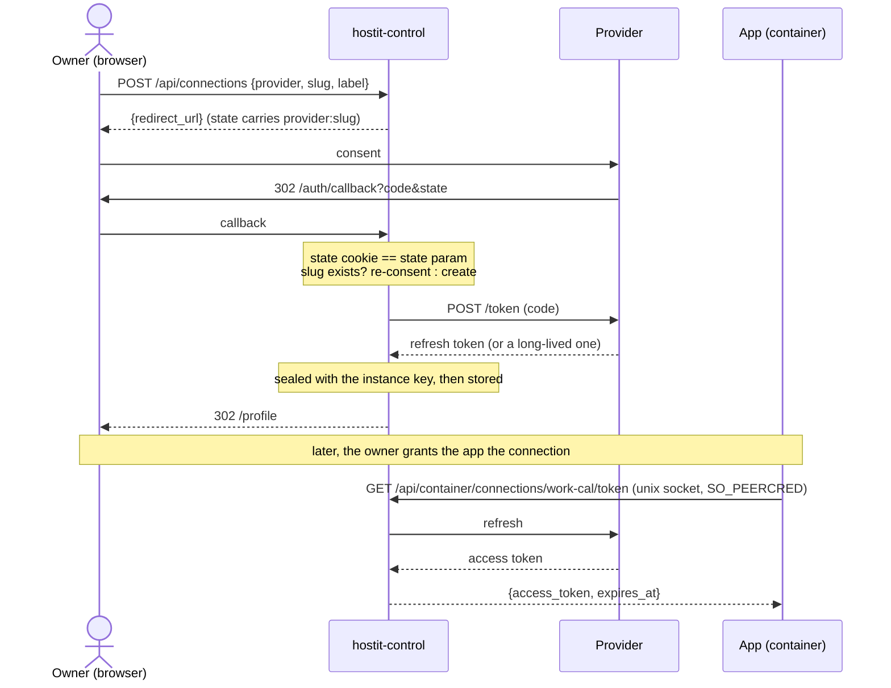

# Connections and credentials

## Description

An owner attaches an account or a secret **once**, names it, and then grants it
to individual apps. The app asks hostit for a usable credential per request over
its own unix socket; it never holds a refresh token, and never has a credential
baked into an environment variable that nothing can rotate.

**Connections** is the umbrella -- the page, the API collection, the grant, the
table. Under it are three kinds, deliberately named apart, because they are three
different things to a person:

- An **account** is a service you sign in to (Google Calendar, Gmail, Slack,
  Discord, GitHub, Jira). hostit holds a refresh token -- or, for a provider
  whose token does not expire, that token -- and mints short-lived access
  tokens. Its `kind` is `oauth`.

  It is called an ACCOUNT and not a "connection" on purpose: connections is the
  umbrella for all three, and using the same word for one of the three made it
  ambiguous everywhere it appeared. The API kind stays `oauth`.
- A **credential** is a secret you paste (an IMAP mailbox, any API key). hostit
  stores it and hands it back unchanged. Its `kind` is `static`.
- An **MCP server** is a tool server added by URL. It is the one kind hostit does
  NOT hand to the app -- hostit holds the token and makes the calls. It has its
  own file: [mcp-servers.md](mcp-servers.md).

The first two are the same row and the same API. An app cannot tell which it was
given, which is the point: `GET /api/container/connections/{slug}/token` answers the
same shape either way. An MCP server answers **404** there, on purpose: its token
opens the whole server, so it is never handed over, and the token sub-resource
genuinely does not exist for that member. The mirror holds -- asking a credential
for `/mcp/tools` is a 404 too. A 400 in either direction would send a caller
looking for a malformed request it did not send.

The collection is filterable: `GET /api/connections?kind=oauth|static|mcp`
narrows the connections AND the offered providers, so a one-kind view does not
offer you the wrong thing to attach. An unknown kind is refused rather than
ignored, since a client asking for one kind and silently getting three would
trust the answer and be wrong.

## Three tiers of provider

A provider is a DEFINITION -- "here is how to connect to Acme" -- as opposed to a
connection, which is one person's attached account. Three tiers hold them:

| Tier | Where | Who sees it | Editable via API |
|---|---|---|---|
| hostit's catalog | `connections/providers.go` | everyone | no |
| the operator's | `control.yml`, or `provider` rows with `owner_id = ''` | everyone | only the rows |
| a user's own | `provider` rows owned by them | only them | yes |

A user's own tier is **OAuth only**. Named MCP servers are an operator's act:
a preset saves other people from remembering a URL, and a user who wants a
server simply connects it -- so a personal preset would be a second way to do
something they have already done. Offering both in one dialog made "add your
own" and "add MCP server" look like the same thing, which was the bug.

A user having their own OAuth client is an ordinary thing, not a workaround: you
register an app with the vendor, point it at hostit's callback, and paste the
pair in. Nothing about OAuth requires the client to belong to the instance. The
only piece that IS instance-level is the callback URL, which is why the API and
the dialog both hand it over rather than making people work it out.

Resolution walks the tiers in order (`connectionManager.providerFor`), and
CREATION refuses a name any higher tier already uses. So an operator can rely on
what a name means, and a user can never quietly redefine `github` for their own
apps. Two USERS may each define `acme` -- those are two namespaces, and refusing
that would let one person's choice of name deny it to everybody else.

`UNIQUE (owner_id, name)` is the index. The catalog clash check applies to OAUTH
definitions only: an MCP preset's name is a menu label and never becomes a
connection's provider, so it shares no namespace with the OAuth providers.

Anything resolving a provider on somebody's behalf must go through the
user-aware path. `connections.Lookup` or `clientFor` directly leaves a personal
provider invisible -- which is exactly the bug that shipped to stage for ten
minutes: `available()` checked only control.yml for a client, so a personal
provider was offered in the menu and then refused on click. `availableFor` is
the fixed version, and the e2e caught what the unit test did not.

## Custom providers

A catalog entry is **pure data**. There is no per-provider code anywhere: a grep
for provider names outside `connections/providers.go` finds exactly one hit
(`controlconf/config.go`, Google falling back to the login client), and the
quirks that look like special cases -- Google's `access_type=offline`,
Atlassian's audience, Slack's non-expiring token -- are all fields.

So an operator can supply the same data in `control.yml` and get the same
behaviour, tested by the same tests:

```yaml
connections:
  acme:
    label: Acme                  # marks this as a provider, not just a client
    client-id: ...
    client-secret: ...
    scopes: [read, write]
    auth-url: https://acme.example.com/oauth/authorize
    token-url: https://acme.example.com/oauth/token
    # or, instead of the two URLs:
    # issuer: https://acme.example.com
```

`label` is the marker because it is the one field a custom entry cannot do
without and the one a client-only entry has no reason to set.

Custom providers are held on the connectionManager (`m.custom`), NOT registered
into the connections package's global catalog. Registering into a global at
startup would leak between servers in one test binary and make the set of
providers depend on what else had run. `m.lookup` prefers the overlay and falls
back to the global, and everything that resolves a connectable provider goes
through it -- `connections.Lookup` directly would make an operator's provider
invisible to half the code.

An `issuer` is resolved on FIRST USE via `mcp.AuthServerMetadata` (the same walk
MCP does), not at startup: resolving needs the network, and a blip while control
happens to be restarting should not silently drop a provider from the menu for
the rest of the process's life. An unresolved provider reports `NeedsDiscovery()`
and is not offered, rather than offered and broken.

A malformed entry is **fatal at start**, not a warning. The operator is looking
at the file they just edited, and a provider silently missing from a menu is the
hardest possible way to find out it is wrong.

## Why it exists

hostit brokers the **credential**, not the API. It holds what has to be held and
hands the app something usable, so the app uses the vendor's own SDK and hostit
never grows an API translation layer per vendor. Adding a provider is a
credential type plus a refresh rule, not a proxy surface maintained forever.

That is safe here precisely because the credential is the app owner's own: the
app, the container and the account all belong to the same person, so there is no
third party to keep the token from. The companion feature is **private apps** --
an app holding your calendar must not be one URL guess away from being someone
else's calendar reader.

The research behind this choice, and the four patterns that were rejected, is in
`docs/slides/presentations/integrations.md`.

## Name and slug are different things

Each connection carries both, and conflating them is the mistake this shape
exists to prevent:

- **`label`** is the NAME a person reads: "Work calendar". Free text, changeable,
  and changing it affects nothing else.
- **`slug`** is the REFERENCE an app asks for: `work-calendar`. Lowercase, 3-32
  characters of letters, digits and dashes, unique per owner, and part of a URL
  an app builds by hand.

The UI derives the slug from the name (`slugify` in `web/src/connections.js`) so
nobody invents both, and stops deriving the moment the reference is edited --
because a rename must never silently move what apps ask for. Renaming a slug
breaks any app configured for the old one, and the dialog says so rather than
looking cosmetic.

## Slugs: why a connection has a reference

One owner can hold **several of the same provider** -- a work calendar and a
personal one -- so a grant names a connection, not a provider, and an app asks
for it by the name its owner gave it:

```
GET /api/container/connections                    -> [{slug: "work-cal", provider: "google-calendar"}, ...]
GET /api/container/connections/work-cal/token     -> {access_token: "...", expires_at: "..."}
GET /api/container/connections/personal-cal/token -> a different account entirely
```

Slugs are lowercase, 3-32 characters of letters, digits and dashes, and unique
**per owner**. One person's `cal` never resolves for another: `tokenFor` looks
the slug up in the APP OWNER's namespace, so an app can only ever reach the
connections of whoever owns it -- holding a grant on someone else's connection
id reaches nothing.

## Who registers the OAuth clients

**The operator, per provider, per instance.** There is no shared hostit OAuth
client to inherit; registering one and getting it reviewed is the operator's own
relationship with the provider. `connections:` in `control.yml` holds a client id
and secret per provider, and a provider with no client is not offered at all.

Google Calendar and Gmail fall back to `google-client-id` (the login client)
when unlisted: it is the same Google Cloud client and scopes are requested per
authorization, so an instance that can already sign in with Google needs no
second registration to read a calendar.

**There is a way around all of this for mail.** The `imap` provider reaches a
Gmail mailbox at `imap.gmail.com:993` with a Google app password (2-Step
Verification required on the account), and `smtp` sends through
`smtp.gmail.com:465` the same way. No OAuth client, no verification, no CASA, no
user cap and no 7-day expiry. For a personal instance that is strictly the
better route to mail than the `gmail` OAuth provider. POP3 works too, but IMAP
is better: POP3 has no folders, no server-side flags, and removes as it reads.

The same applies to calendars: `caldav` against Fastmail, iCloud or Nextcloud
gets the two-calendar cross-reference with none of what follows.

**Gmail is the expensive one, and Calendar is not.** Google splits the two:

- `calendar.readonly` is *sensitive* -- verification only (a justification per
  scope and a demo video, 3-5 business days), **free**.
- `gmail.readonly` is *restricted* -- verification **and** a CASA Tier 2
  assessment by a Google-empanelled assessor, **renewed every 12 months**, from
  roughly $800/year at the cheaper assessors up to several thousand. Self-scan
  is no longer permitted for restricted APIs.

Personal use, Testing status (up to 100 test users, each added by hand) and
single-Workspace internal use are exempt from both.

**The cost of staying in Testing is not money, it is time.** Google expires
refresh tokens issued by a Testing-status app after **7 days**. That is invisible
for login, which spends its token once and drops it, and crippling for
connections: every connected account needs re-consenting weekly. `Reconnect`
exists partly for this -- it swaps the credential without touching the slug or
any grant.

**Enable the API too.** Verification and consent are separate from the API being
switched on in the Cloud project. A perfectly valid token still gets
`403 SERVICE_DISABLED` until Calendar (`calendar-json.googleapis.com`) or Gmail
(`gmail.googleapis.com`) is enabled for that project.

## Token models

Not every OAuth provider issues a refresh token, and treating them as if they do
refuses perfectly good connections:

| Provider | Stored | Refresh |
|---|---|---|
| Google Calendar, Gmail | refresh token | per request, ~1h access token |
| Discord, Jira | refresh token | per request |
| GitHub, Linear | a refresh token **when the app issues one**, else the access token itself | refreshed when refreshable, otherwise probed and handed back |
| Slack bot (`xoxb-`) | the access token itself | none -- handed back as-is |
| Slack personal (`xoxp-`) | the user access token itself | none -- handed back as-is |
| Discord | refresh token, **rotated every use** | per request, and the new one is stored |
| IMAP, generic | the pasted secret | none |

`Provider.LongLivedToken` marks the Slack rows. GitHub and Linear are
`Provider.HybridToken`: the same provider issues an expiring token WITH a
refresh token (a GitHub App, or a workspace with token expiration enabled) or a
permanent access token with none (a classic OAuth App), depending on how the
operator registered their app. Which one a given connection got is decided at
`Exchange` from what the token endpoint returns and remembered per connection --
a refreshable one is refreshed, a permanent one is probed. Treating them as
long-lived was why a GitHub or Linear token could die overnight and need
reconnecting every morning. Every path returns the same `Token`, so the app
socket behaves identically.

**Rotation is the trap.** Some providers issue a NEW refresh token on every
refresh and invalidate the old one -- Discord does. `Provider.Refresh` therefore
returns the rotated token as a second value and `tokenFor` stores it. Dropping it
makes the first request work and the second fail with `invalid_grant`, which
reads exactly like the owner revoking access and is not. Google does not rotate,
so a catalog of one provider would never have surfaced it.

Consent parameters are **per provider** (`Provider.AuthParams`) rather than
Google's copied everywhere: Google needs `access_type=offline` or it never issues
a refresh token, Atlassian needs `audience=api.atlassian.com` and
`offline_access` in its scopes, Slack and GitHub need none of it.

**User tokens are a second Slack-shaped quirk, and also a field.** The `slack-bot`
provider is a bot token; `slack-user` acts as the person who connected it. For a
user-token provider the authorize URL sends its scopes in `user_scope` rather
than `scope`, and the token hostit keeps is `authed_user.access_token` from the
`oauth.v2.access` response, NOT the top-level `access_token` (which is the bot
token, empty for a user-only app). Like the bot token it does not expire and has
no refresh token, so it too is a `Provider.LongLivedToken` and is stored as-is.
Its read grant is chosen by the owner at connect time: the dialog sends back
option KEYS (public channels, private channels, search), which the server maps to
scopes against the provider's own allowlist and refuses an unknown key, so a
crafted request cannot over-grant. `users:read` is always granted so ids resolve
to names, and there are deliberately no direct-message scopes.

## Flows



## Technical details

- `connections/` -- the vendor-facing half. `providers.go` is the catalog,
  `oauth.go` the consent URL, exchange and refresh, `crypto.go` the sealing.
- `store/connection.go` + migration 32 -- `connection` keyed on an id with a
  unique `(user_id, slug)`, and `app_connection` pointing at a connection id.
  **Migration slots 23, 30 and 31 are burned** (an abandoned PoC and the
  reverted redirect work both ran on stage); the connections migration drops the
  PoC's differently-shaped tables of the same name before creating its own.
- `control/connections.go` -- `connectionManager`, the only thing that ever
  holds a refresh token in the clear. `tokenFor` resolves in the app owner's
  namespace and checks the grant before opening anything.
- `web/src/pages/Connections.jsx` -- its own page, not a section of the profile:
  two cards (connections, credentials), one call-to-action menu each, and the
  add/edit dialogs. The catch-all `generic` provider is set below a divider in
  the menu rather than listed among the named ones, because it is the escape
  hatch for a service hostit does not know.
- `control/server_handler_connections.go` -- the owner API, the app-socket half,
  and `connectionFromState`, which handles the OAuth callback when the state says
  it belongs to a connection. Checked **before** the login guard, so an instance
  with Slack configured but no Google login still completes a consent.
## Credential storage, and what it does and does not protect

- **AES-256-GCM**, random 12-byte nonce per seal, prefixed to the ciphertext. The
  same credential stored twice produces different rows.
- **Bound to its row.** The additional authenticated data is
  `hostit-connection:<user_id>:<connection_id>` (`connections.Binding`). GCM
  authenticates the bytes; the binding is what says whose they are. Without it
  ciphertext was portable -- moving one person's sealed secret into another's row
  decrypted cleanly, which a migration that mixes rows or a restore from the
  wrong backup could do by accident. The slug is deliberately NOT in the binding:
  renaming a connection must not make its credential unreadable.
- Credentials sealed before binding existed still open, via
  `OpenLegacyTolerant`, and are re-sealed bound the first time they are used --
  so an existing instance converges without re-authorising every account.
- **The key** is 32 random bytes, base64 in `connections.key` (0600) beside the
  database, root-owned like the database itself.
- **The `meta` column is NOT encrypted.** It holds the non-secret half of a
  pasted credential -- an IMAP host and username, a CalDAV URL, an S3 access key
  id and bucket. That is deliberate (the UI and the app both need to read it) and
  worth knowing before putting anything sensitive in a non-secret field.

**What this protects against:** a copied database. A backup, a support dump or a
stolen `hostit.db` is not a stolen mailbox.

**What it does not:** root on the box. The key sits beside the database, so
anything that can read one can read the other. A passphrase supplied at start, an
OS keyring or an external KMS would change that, and none of them is implemented.

**Who can read a granted credential:** the app, and therefore anyone with
**terminal, SSH or exec access to that app** -- which includes its
**collaborators**. Granting a connection to an app grants it to everyone who can
run code in that app. Only the OWNER can grant, but the grant is what widens the
audience. An **admin** and the **node hosting the app** can read it too; both
already have root over the container, so neither is a new exposure.

**Deleting** removes the row and purges the cached access token, but SQLite does
not overwrite freed pages -- the ciphertext may remain in the database file until
it is vacuumed. Encrypted, and beside its key.

## Where the public docs live

Split one page per topic since the docs restructure (`web/src/docs.js` is the
table of contents; every entry is a PAGE, not an anchor):

- User guide: `/docs/user/connections` and its four sub-pages -- `accounts`,
  `credentials`, `mcp`, `using`.
- Admin guide: `/docs/admin/connections` and one **complete** page per provider --
  `google`, `github`, `slack`, `discord`, `linear`, `jira`, `hubspot`, `custom`,
  `mcpsetup`.

Each provider page carries its own redirect URIs, steps, scopes, config block and
gotchas. Nothing says "see above": an operator setting up Slack must never have
to read the GitHub page. `RedirectURIs` and `ProviderConfig` in `Docs.jsx` are
the shared components that make that repetition cheap.

## Other notes

- Renaming a connection changes the name apps address it by, and breaks any app
  configured for the old one. That is the owner's call, and the UI says so.
- **Reconnect** re-consents in place: same slug, same grants, fresh credential.
  It exists so a revoked or expired account does not mean re-granting every app.
- Disconnecting deletes every grant naming it, so apps lose access at once rather
  than holding a grant pointing at nothing.
- A collaborator can manage an app but cannot grant it somebody else's
  credential: only the owner grants their own connections.
- 50 connections per owner, and the secret is never returned by any endpoint.
- A field may be `Multiline` (an SSH private key needs a textarea) and may carry
  a `Pattern` the value must match. The pattern exists for one class of mistake
  worth catching at paste time -- an SSH **public** key in the private key box --
  which otherwise validates as "some text" and fails much later inside an app.
- Access tokens are cached in memory per connection until two minutes before
  expiry, so a page making five calls is one round trip rather than five. The
  entry records the sealed credential it came from, so a reconnect invalidates it
  by construction. The grant is re-checked on every request BEFORE the cache is
  consulted, so revoking one is still immediate.
