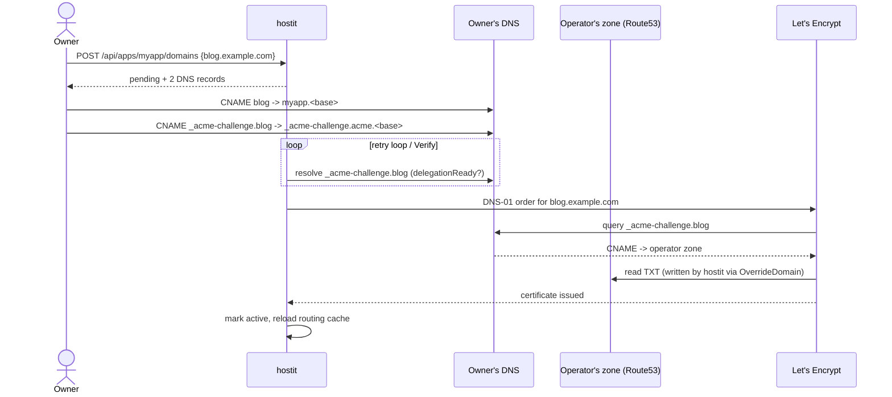

# Custom domains

## Description

Every app answers on its `<app>.<base-domain>` subdomain out of the box. A custom
domain lets the owner serve the same app on a hostname *they* own (e.g.
`blog.example.com`) on top of that subdomain. The owner attaches the domain from
the app page's Actions menu, the CLI, or the REST API; hostit responds with the
DNS records to create at their own provider, and shows the domain as `pending`
until it verifies, then `active` (or `error` with a message). Once active, the
app is reachable over HTTPS on the custom hostname, with a certificate hostit
obtains and renews automatically.

The distinctive part is that certificate issuance uses **DNS-01 with
CNAME-delegated challenges**, so it works even when the hostit server is not
reachable from the public internet -- the certificate authority validates by
reading a DNS record, never by connecting to the box.

## Why it exists

Apps live under one shared base domain, which is convenient but not something an
owner wants to hand out as a public URL. Custom domains make an app look like a
first-class site while leaving the subdomain working as a stable internal handle.

The certificate mechanism is the real design decision. A naive HTTP-01 or
TLS-ALPN challenge requires the CA to reach the server on port 80/443, which
rules out servers behind NAT, on private networks, or otherwise not publicly
addressable. hostit instead proves control over the domain via DNS-01, but the
owner never has to give hostit credentials to *their* DNS zone. Instead:

- The owner creates one `CNAME` from `_acme-challenge.<their-domain>` to a single
  fixed name inside the operator's own zone (`_acme-challenge.acme.<base-domain>`,
  the same target for every custom domain).
- hostit writes the ACME challenge `TXT` into *its own* zone (the same Route53
  setup that issues the wildcard), and the delegation CNAME makes the CA follow
  it there.

So the delegation CNAME is simultaneously the routing setup's sibling and the
proof of control: the owner could only have created it if they control their
domain. This keeps DNS credentials on the operator side and lets certificates
issue for domains whose servers the CA can never reach.

A deliberate tradeoff: to avoid hammering Let's Encrypt, hostit does a cheap DNS
lookup first and only contacts the CA once the delegation CNAME is actually in
place; an unconfigured domain stays `pending` and is polled cheaply.

## User flows

1. Owner adds `blog.example.com` to app `myapp` (app page, `hostit apps domain
   add myapp blog.example.com`, or `POST /api/apps/myapp/domains`).
2. hostit stores it as `pending` and returns two DNS records to create:
   - **Traffic**: `blog.example.com` -> `myapp.<base-domain>` (a `CNAME`), or an
     `A` record to the server IP at a zone apex where CNAME is illegal.
   - **Delegation** (wildcard/DNS-01 mode only):
     `_acme-challenge.blog.example.com` -> `_acme-challenge.acme.<base-domain>`.
3. Owner creates both records at their own DNS provider.
4. A background retry loop (and the owner's "Verify" button) re-checks: once the
   delegation CNAME resolves, hostit orders a certificate over DNS-01, writing
   the challenge TXT into the operator's zone.
5. On success the domain flips to `active`, is added to the routing cache, and
   the proxy serves the app on it over HTTPS.

## Technical details

Handlers and issuance (all in `server/server_handler_domains.go`):

- HTTP surface: `handleAppDomainsList`, `handleAppDomainAdd`,
  `handleAppDomainVerify`, `handleAppDomainDelete` (routed in `server/api.go`
  under `/api/apps/{name}/domains`). Admin-wide list of *approval* domains is a
  different feature; these are per-app custom domains.
- `Server.addAppDomain` normalizes and validates the hostname
  (`validateCustomDomain` + `hostnameRegex`; rejects the platform's own
  hostnames, app subdomains, and names under the base domain), stores a
  `store.Domain` as `DomainPending`, reloads the routing cache, and kicks off
  `issueDomainCert` in the background.
- `Server.issueDomainCert` is the core: with TLS off it just marks the domain
  active; in wildcard/DNS-01 mode it first calls `delegationReady` and stays
  pending (without contacting the CA) if the CNAME is not yet in place;
  otherwise it calls `domainMagic.ManageSync`. An in-flight guard
  (`s.issuing`) prevents concurrent attempts, and a transient re-issue failure
  does not de-route an already-active domain.
- `Server.delegationReady` does `net.LookupCNAME("_acme-challenge."+domain)` and
  checks it points at `domainChallengeName()` (`_acme-challenge.acme.<base>`) or
  a `.acme.<base>` name.
- `Server.retryDomains` / `Server.DomainRetryLoop` re-attempt every non-active
  domain on an interval; `Server.manageExistingDomains` re-obtains certs for
  active domains at startup.
- `Server.markDomain` writes status via `store.SetDomainStatus` and refreshes
  the cache; `Server.reloadDomains` rebuilds `s.domainCache` (host -> app name)
  from `store.AllDomains`, keeping only active domains.
- `Server.domainDNSRecords` builds the records the owner must create: an `A`
  record to `serverIP()` when resolvable (works at a zone apex), else a `CNAME`
  to `<app>.<base>`, plus the delegation `CNAME` in wildcard mode.
- `dnsSolver` builds the `certmagic.DNS01Solver` for Route53
  (`config.DNSProviderRoute53`), with propagation delay/timeout.

certmagic wiring (`server/service.go:runTLSServers`):

- In wildcard mode a *separate* `certmagic.Config` (`s.domainMagic`) is built on
  its own cache, whose DNS-01 solver sets `OverrideDomain =
  s.domainChallengeName()` -- that is what makes the challenge TXT land in the
  operator's fixed zone name instead of the customer's domain. It is kept apart
  from the base wildcard config so the wildcard path is untouched.
- The HTTPS `tls.Config.GetCertificate` falls back to `domainMagic`'s
  certificate lookup when the base cache has no match for the SNI name, so
  custom-domain certs are served alongside the wildcard.
- `Server.allowTLSHost` permits certificate requests for the web host, registered
  apps, and any registered custom domain (pending or active).
- Without a DNS provider (no wildcard), custom domains reuse the on-demand
  HTTP-01 config (`s.domainMagic = magic`) and only the traffic record is needed.

Routing (`server/proxy.go:newProxyHandler`): an incoming request host is matched
first as `<app>.<base>` (`appNameFromHost`), then as a custom domain
(`appNameFromCustomDomain`, which consults/loads the cache), then proxied to the
app's loopback port.

Data model (`store/domain.go`, `store/types.go:Domain`): the `app_domain` table
is keyed on `app_id` (with a name fallback), so a domain follows an app across a
rename; `domainName` resolves the app's current name. `DomainPending` /
`DomainActive` / `DomainError` are the states; `ActiveDomains` returns each app's
first active domain in one query for the app list.

## Other notes

- Removing a domain (`removeAppDomain`) stops routing immediately but leaves the
  certificate in certmagic storage to expire on its own; there is no revoke.
- A rename does not move a domain: routing keys on the app id, and the rename
  handler calls `s.reloadDomains()` so the cache follows
  (`server/server_handler_apps.go:handleAppsRename`).
- Validation forbids wildcards, trailing dots, bare TLDs, and any hostname hostit
  already owns; a domain already attached to some app returns
  `store.ErrAppDomainExists` (409).
- The delegation CNAME can only work in wildcard/DNS-01 mode; in per-app HTTP-01
  mode the server *must* be publicly reachable, and `domainDNSRecords` omits the
  delegation record. This is the practical difference between the two operator
  configurations.
- One custom domain is shown per app on the dashboard card (first active), so
  `AppCard` links to it in preference to the subdomain
  (`web/src/pages/Dashboard.jsx`). Related: `web-dashboard.md` (the domains UI
  lives in the app workspace Settings area), `rest-api.md`.
- Known future work implied by the code: only Route53 is supported today
  (`dnsSolver` errors otherwise), so other DNS providers are an obvious
  extension point.
