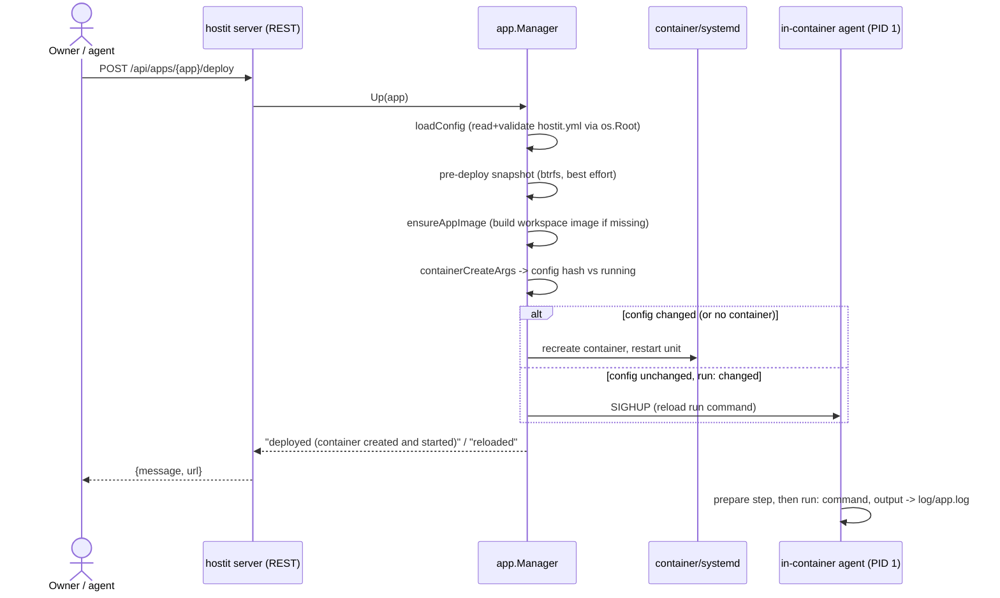

# Deploy (hostit.yml, static and app modes)

## Description

Deploying is how an app goes from "files in a home directory" to "a running web
service on its subdomain". The owner (or their agent) describes how the app runs in
a single file, `hostit.yml`, then triggers a deploy. hostit reads the config,
builds the workspace image if needed, (re)creates the container when the
configuration changed, and starts (or reloads) the app.

`hostit.yml` has two modes:

- **`mode: static`** -- hostit serves the app's `public/` directory over HTTP. No
  command to run, nothing else to configure. Good for plain HTML or the built output
  of any frontend.
- **`mode: app`** -- hostit runs the owner's `run:` command inside the workspace
  container. The command must listen on `0.0.0.0:$PORT` (`$PORT` is provided). An
  optional `prepare:` build step runs first, on every deploy.

A deploy is triggered by `hostit deploy` (inside the container, over the daemon
socket), `hostit apps deploy <app>` (remote, over REST), `POST /api/apps/{app}/deploy`,
the browser assistant, or the Files tab's deploy. The response says what happened
("container created and started", "reloaded", "up to date") and the app's URL.

## Why it exists

The whole point of hostit is that describing how an app runs should be one short,
declarative file that both a person and an agent can write, and that applying it
should be a single verb. `hostit.yml` is that contract (`appctl/config.go`).

The two modes cover the two things people actually deploy: a bag of static files,
and a process that listens on a port. Static mode needs zero configuration because
there is exactly one place static files go (`public/`), so there is nothing to point
at and nothing to get wrong (`appctl/config.go:Command`, `cmd/app.go:execStatic`).
App mode is the general escape hatch: any language, any framework, as long as it
binds `$PORT`.

`prepare:` exists so the source can live in the app and be built on the machine that
runs it -- no cross-compiling, no toolchain on the deployer's side. That matters
because the person deploying is often talking to an assistant, not sitting at a
terminal. The build output goes to the app log, so a failed build is visible where
the owner is already looking, and a failed build leaves the previously-running app
alone.

The deploy path is careful about **when a container is recreated versus reloaded**:
recreating tears down the container (and any SSH/terminal session in it) and is only
done when something load-bearing changed; a changed `run:`/`prepare:`/`mode:` only
signals the in-container agent to restart the command. This keeps iterating on an
app fast and non-disruptive.

## User flows

- **From inside the container / over SSH:** `hostit deploy` (`cmd/app.go:execDeploy`)
  posts to the daemon's unix socket (`appctl.Controller.Deploy` ->
  `POST /v1/self/deploy`), which the socket authenticates by peer uid. This is the
  same code path the SSH login banner and `hostit guide` point people at.
- **Remotely:** `hostit apps deploy <app>` or `POST /api/apps/{app}/deploy` with a
  Bearer token (`server/server_handler_agent.go:handleAgentDeploy`).
- **Editing the config:** the owner edits `hostit.yml` (Files tab, SSH, or an agent's
  file PUT), then deploys. Static apps just upload files under `public/`.

## Technical details

- **The config contract** lives in `appctl/config.go`. `AppConfig` fields:
  `description`, `prepare`, `mode` (`appctl/types.go:ModeStatic`/`ModeApp`), `run`,
  `env` (map), `snapshot` (pre/post hooks). `LoadAppConfig` parses strictly
  (`ParseAppConfigStrict`, `KnownFields(true)` -- an unknown key is an error) and
  validates (`Validate`: static must have no `run:`, app must have a `run:`).
  `Command(hostitBin)` returns `hostit static` for static mode, else the `run:`
  string. The agent parses leniently (`ParseAppConfig`) and simply idles on a
  half-written config.
- **Reading the config safely** (`app/deploy.go:loadConfig`): the daemon reads
  `hostit.yml` through the app's `os.Root` (`app/files.go:appRoot`), so a symlink the
  tenant planted cannot walk the root daemon out of the home, and the read is capped
  (`maxConfigSize`).
- **Deploy entry points** (`app/deploy.go`): `Up` (locks the app, takes a pre-deploy
  snapshot, then `apply`), `up` (unlocked variant for rollback), `Ensure` (used on
  SSH login: makes sure the container exists and runs, never recreates a live
  container, falls back to an idle workspace without a valid config).
- **`apply`** (`app/deploy.go:apply`) is the convergence step. It ensures the app's
  pinned image exists (`ensureAppImage`), computes the desired container create args
  (`app/workspace.go:containerCreateArgs`) and a config hash
  (`containerConfigHash`), compares to the running container's stored
  `hostit.config` label (`inspectHashFormat`), and:
  - recreates the container (stop unit, remove, create with the label) if the hash
    differs or no container exists;
  - starts the unit if not active; if recreated, restarts it;
  - otherwise, if reload is allowed and there is a config, sends the agent SIGHUP to
    restart just the `run:` command ("reloaded"), else "up to date".
- **The config hash deliberately excludes `--hostname`** (`containerConfigHash`) so a
  rename never forces a recreate. `env:` changes *are* in the hash, so changing env
  recreates the container (and ends SSH sessions in it); `mode:`/`prepare:`/`run:`
  changes only reload.
- **The workspace container** (`app/workspace.go`): `containerCreateArgs` builds a
  `podman create` invocation. Each app gets its own network namespace
  (`--network slirp4netns`, loopback publish `127.0.0.1:port:80`), a contiguous uid
  map (`0:UID:65536`, so container-root is the app's unprivileged host uid and podman
  can idmap-mount the shared image), `--pids-limit 512`, `--security-opt
  no-new-privileges`, `--security-opt apparmor=unconfined` (podman's AppArmor
  profile otherwise blocks the multithreaded Go agent's SIGKILL to children),
  memory limit if set, the app's env, the home bind-mounted at `/home/app`, and the
  hostit binary + daemon socket dir mounted read-only. The container command is
  `<hostitBin> agent`.
- **The in-container agent** (`agent/service.go`) is PID 1. It loads `hostit.yml`,
  runs `prepare:` (`agent/service.go:prepare`, output timestamped into
  `log/app.log`), then starts the `run:`/`static` command (`startChild`), restarts it
  on exit, reloads it on SIGHUP (`Reload`), pauses/resumes on SIGUSR1/SIGUSR2
  (stop/start the app without touching the container), reaps zombies, and writes a
  state breadcrumb (`log/state`: running/stopped/crashed/idle) the daemon reads.
- **The default workspace image** (`app/workspace.Containerfile`) is a Debian slim
  with python3/venv/pip, the Go toolchain, Node.js+npm, php-cli, sqlite3, plus git,
  curl, rsync, htop, vim, nano and the sftp server. The image tag is a hash of the
  Containerfile (`workspaceImageTag`), so editing that file yields a new image; each
  app is pinned to the tag it was built with (`store.App.ImageTag`), so a
  Containerfile change only affects new apps.
- **CLI static server:** `cmd/app.go:execStatic` (`hostit static`) serves `~/public`
  with `appctl.StaticHandler`; this is what a `mode: static` app runs, including a
  brand-new app (whose skeleton ships `public/index.html`, the placeholder).
- **Serialization:** image builds and `/run` execs are each serialized behind a
  mutex (`buildMu`, `execMu`) because two at once would OOM a one-core box.

## Other notes

- **The skeleton** a new app gets (`app/skeleton/hostit.yml`) is `mode: static`, and
  ships a `public/index.html` placeholder, with the `mode: app` alternative documented
  inline as comments. So a brand-new app already serves the placeholder page; see
  [placeholder.md](placeholder.md).
- **`prepare:` is bounded only by the agent, not the request.** A one-off build over
  `/run` is capped (a minute by default, five max, `app/exec.go`); anything longer
  belongs in `prepare:`, which the agent runs on its own time on every deploy.
- **A crash loop is visible in the logs**, not the deploy response: `apply` returns as
  soon as the unit is started; whether the `run:` command then binds `$PORT` is seen
  via [logs.md](logs.md) and the app's state dot.
- **Pre-deploy snapshot** is best-effort on btrfs (`Up` -> `takeSnapshot`); a
  snapshot failure never blocks the deploy. See [snapshots-rollback.md](snapshots-rollback.md).
- **Static mode never serves the home directory**, only `public/`: the home also holds
  `hostit.yml` (which may carry env values) and `.ssh/`, so the agent guide explicitly
  warns an app that serves files itself to point at `public/`.
- **Related:** [apps-lifecycle.md](apps-lifecycle.md) (an app is created already
  deployable), the container/agent packages, and the workspace/terminal features that
  share the same container.
