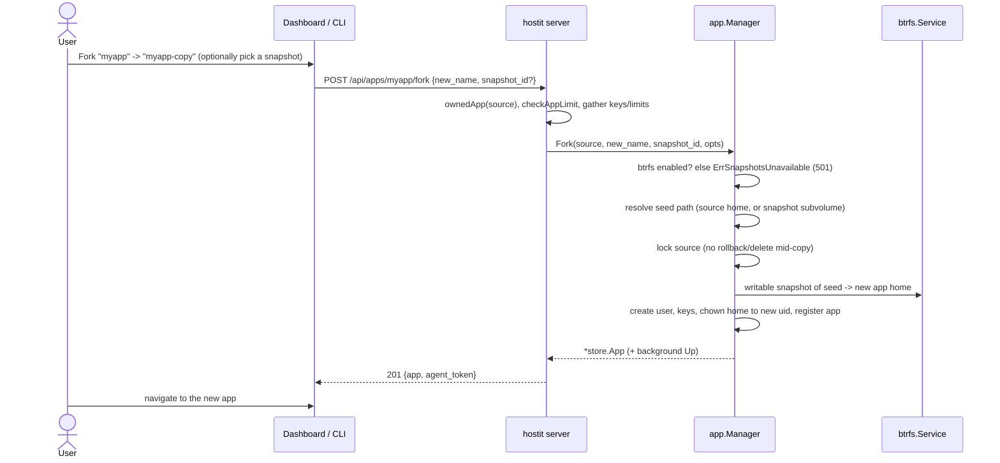

# Fork (duplicate an app from a snapshot)

## Description

Forking duplicates an existing app into a brand-new one, seeding the new app's home
from a copy of the source's files -- either the source's current state, or a specific
snapshot of it. The fork gets its own name, subdomain, Unix user, port and container,
and the two apps run completely independently from that point on. It is the "make me
a copy of this to experiment on" primitive.

From the dashboard, fork is reached from the Fork button in the app's workspace top
bar (seeds from the current state) or from a per-snapshot "Fork" action in the
Snapshots tab (seeds from that snapshot). It is also available as
`hostit apps fork <source> <new-name> [snapshot-id]` and
`POST /api/apps/{app}/fork`.

Forking requires the app-homes filesystem to be **btrfs**: the seed is a
copy-on-write snapshot, which is instant and space-shared. On a non-btrfs host the
API returns 501 and the UI does not offer it.

## Why it exists

The value proposition is "try a risky change on a copy without endangering the
original". Because an app's home is a btrfs subvolume, hostit can already snapshot it
cheaply; a fork is the natural extension -- instead of a read-only snapshot kept for
rollback, take a *writable* snapshot and hang a whole new app off it. The copy is
instant and shares storage with the source until the two diverge, so forking a large
app costs almost nothing up front.

The design reuses the create path exactly (`app/service.go:create`, shared by
`CreateApp` and `Fork`): a fork is "create, but seed the home from a subvolume
instead of writing the demo skeleton". This keeps the two operations honest with each
other -- a fork gets the same validation, port allocation, uid block, keys, limits and
background start as any new app; only the home contents differ.

Requiring btrfs is a deliberate limitation rather than a fallback to `cp -r`: the
whole appeal (instant, cheap) depends on CoW, and a slow deep-copy fork would be a
different, worse feature wearing the same name.

## User flows

- **From the top bar** (`AppDetail.jsx:ForkDialog` with no snapshot id): seeds from the
  source's current home.
- **From a snapshot row** (`ForkDialog` with a `snapshotId`): seeds from that specific
  snapshot.
- **CLI:** `hostit apps fork myapp myapp-copy` (current files) or
  `hostit apps fork myapp myapp-copy <snapshot-id>` (`cmd/apps.go`, `execFork`).
- **API:** `POST /api/apps/{app}/fork` with `{"new_name": "...", "snapshot_id": "..."}`
  (the snapshot id is optional).

## Technical details

- **Route/handler:** `POST /api/apps/{name}/fork` ->
  `server/server_handler_apps.go:handleAppsFork`. It resolves the owned source app,
  enforces the caller's app-count limit (`checkAppLimit`), gathers the owner's
  profile SSH keys and memory/disk limits, and calls `app.Manager.Fork`. Errors go
  through `writeSnapshotError`, which maps `ErrSnapshotsUnavailable` to HTTP 501.
- **`app.Manager.Fork`** (`app/service.go:Fork`): guards `btrfsEnabled()`, verifies
  the source exists, resolves the seed path -- the source's current home
  (`appHome(source)`) or, when `snapshotID != ""`, the snapshot's subvolume
  (`snapshotPath`, after checking the snapshot belongs to the source) -- takes the
  source's per-app lock (so its home/snapshot is not rolled back or deleted mid-copy),
  and delegates to `create(newName, opts, seedPath)`.
- **`create` with a seed** (`app/service.go:create`, `forking := seedPath != ""`):
  - Instead of `CreateSubvolume` + skeleton, it makes a **writable** btrfs snapshot of
    the seed into the new app's id-keyed home (`btrfs.Snapshot(seedPath, home, false)`).
  - It skips `WriteSkeleton` (a fork keeps the source's files, including its
    `hostit.yml`, `README.md` and data).
  - After registering the app, it `chown -R`s the forked home to the new app's uid
    (`uidFor(port)`), because the copied files are owned by the source's uid.
  - Everything else is identical to a fresh create: port allocation, uid block, Unix
    user, `authorized_keys` (request + profile keys), memory/disk limits, port-rule
    reconcile, and a background `Up` to start the new container.
- **btrfs primitive** (`btrfs/service.go:Snapshot`): `btrfs subvolume snapshot`
  without `-r` produces a writable CoW copy. This is the same call rollback uses to
  stage a restored home (`readonly=false`), versus the read-only (`-r`) snapshots kept
  for rollback.
- **CLI client:** `cmd/apps.go` registers the `fork` subcommand; `client.Client`
  posts to the fork endpoint.

## Other notes

- **btrfs required.** Without it, `Fork` returns `app.ErrSnapshotsUnavailable` and the
  handler answers 501. The dashboard hides fork on non-btrfs hosts (snapshots are
  reported unavailable). See [quotas-limits.md](quotas-limits.md) and
  [snapshots-rollback.md](snapshots-rollback.md) for the other btrfs-gated features.
- **The fork counts against the owner's app limit** just like any create; forking is
  rejected once the limit is reached.
- **The source is briefly locked** during the copy (its per-app lifecycle lock), so a
  concurrent deploy/snapshot/rollback/delete on the source waits; the new app's own
  `Up` runs under its own lock in the background.
- **The fork inherits the source's `hostit.yml`**, so it deploys the same way the
  source did -- including the source's `run:`/`mode:`. It does not inherit the source's
  snapshots, custom domains, tokens or activity log; those are per-app and keyed on
  the new id.
- **Name validation** is the same as create (`validateName`): a fork name must be a
  legal, unreserved, unused app name. The dashboard mirrors the pattern client-side
  (`AppDetail.jsx:forkNameRe`).
- **Ownership:** you can only fork an app you own (admins can fork any). The new app is
  owned by the caller.
