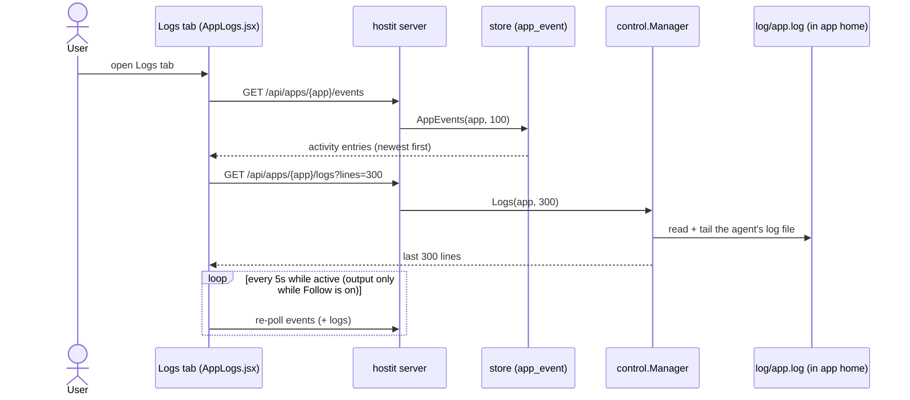

# Logs (the activity feed and live app output)

## Description

The Logs tab on an app's workspace page has two stacked sections:

- **Activity** -- an audit feed of who did what to the app: created, deployed,
  snapshots, rollbacks, domain changes, renames, power actions. Each entry has a
  timestamp, a human-readable detail line, and the actor (the email that did it;
  blank for the global admin token). Errors are styled distinctly.
- **App output** -- a live, timestamped tail of the app's own container output (the
  last 300 lines of stdout/stderr from the `run:`/`prepare:` command). It has a
  "Follow" toggle (auto-scroll + poll) and a manual Refresh.

The output tail is also available outside the dashboard: `hostit logs [-f]` inside the
container, `hostit apps logs [-n N] <app>` remotely, and
`GET /api/apps/{app}/logs?lines=N`. The activity feed is
`GET /api/apps/{app}/events`.

## Why it exists

These are the two questions an owner asks: "what has been done to this app?" and "why
isn't it working?". They are different data with different sources, so they are two
sections rather than one stream.

The **activity feed** is an audit/worklog: it is written by the server whenever a
user (or agent) takes an action, attributed to whoever did it. It matters most now
that apps can be driven by agents and shared views -- the owner wants to see that
their assistant took a snapshot, or that a deploy happened, without watching it live.
It is bounded per app (the newest 500 rows) so it can never grow without limit.

The **app output** is the actual process output, which the daemon cannot see directly
(it lives inside the container). The in-container agent mirrors the command's
stdout/stderr into a log file in the app's home, timestamping each line, so the
output is readable after the fact and reachable both from inside (tail the file) and
from anywhere (through the daemon). Timestamps are added by hostit because most apps
do not stamp their own output, and an undated stream is much harder to reason about.

## User flows

- **In the dashboard** (`web/src/pages/AppLogs.jsx`): on opening the tab it loads both
  sections, then polls every 5s while the tab is active (events always; output only
  while "Follow" is on). The output pane auto-scrolls to the bottom while following.
- **How activity entries appear:** every mutating action handler on the server calls
  `s.logAction(...)` (or `recordEvent`), which appends an event row. Examples:
  create ("App created"), fork ("Forked from <source>"), rename, description update,
  token rotation, power on/off, reboot, start/stop/restart, snapshot, rollback,
  domain changes.
- **App output over SSH/CLI:** `hostit logs` reads through the daemon; `hostit logs -f`
  tails the agent's log file directly (`cmd/agent/app.go:execLogs`), so follow works from
  inside the container without a round trip.

## Technical details

### Activity feed

- **Data model** (`store/event.go`): the `app_event` table is
  `(id, app_name, app_id, created_at, actor, level, action, detail)`. `store.Event`
  is the struct. Events key on `app_id`; `eventName` resolves the app's *current*
  name via a `COALESCE` subquery so the feed follows a rename. `AddEvent` inserts and
  then trims the app's log to the newest `maxAppEvents` (500). `AppEvents(app, limit)`
  returns newest-first.
- **Writing events** (`control/events.go`): `recordEvent(appName, actor, level, action,
  detail)` appends one row; a failure is logged, never returned ("auditing can never
  break the action it records"). `logAction(caller, app, action, detail)` is the
  common wrapper that attributes the event to the caller's email.
- **Reading events** (`control/events.go:handleAppEvents`): `GET /api/apps/{name}/events`
  (registered in `control/api.go`), owner/admin-gated via `ownedApp`, returns up to 100
  `apiEventResponse` entries (`time`, `actor`, `level`, `action`, `detail`).

### App output

- **Written by the agent** (`agent/service.go`): `prepare` and `startChild` set the
  command's stdout/stderr to `io.MultiWriter(os.Stdout, timestampWriter)`. The raw
  stream still goes to `os.Stdout` (so `podman logs` is unstamped), while the log file
  gets each complete line prefixed with a UTC wall-clock timestamp
  (`logTimeFormat`, `timestampWriter.emit`). Partial lines are buffered until their
  newline (bounded by `maxLineBuffer`, 64 KiB).
- **The log file** (`appctl/types.go:AppLogFile` = `log/app.log`, under the app home):
  `appLog` rotates to `app.log.old` once it passes `logMaxSize` (10 MiB), both on open
  and mid-write, so a long-running app's log cannot grow without bound.
- **Reading the tail** (`node/machine_deploy.go:Logs`): opens the app's `os.Root`, reads the log
  file capped at `maxLogRead` (16 MiB, `app/files.go`), and returns the last `lines`
  via `tailLines`. Reading through the `os.Root` means a symlink the tenant planted
  cannot walk the daemon out of the home.
- **The endpoint** (`control/server_handler_agent.go:handleAgentLogs`):
  `GET /api/apps/{app}/logs`, with `?lines=` bounded by `logLines` (default 100, max
  10000). An app with no output yet answers `"(no logs yet: ...)"` rather than an
  error.
- **CLI:** `cmd/agent/app.go:execLogs` (`hostit logs`, with `-f` tailing the file directly);
  `cmd/agent/apps.go:execRemoteLogs` (`hostit apps logs`) and `appctl.Controller.Logs` go
  through the daemon.

## Other notes

- **The app-process state** the status dot reflects is separate from the log: the
  agent writes `log/state` (running/stopped/crashed/idle), which the daemon reads in
  `node/machine_state.go:appProcessState`. The Logs tab shows output; the top bar shows the
  live state. See [deploy.md](deploy.md).
- **Two different "logs".** The activity feed is server-side audit data in SQLite; the
  app output is the container process's own stdout/stderr in a file in the app home.
  They are deliberately not merged.
- **Follow polls, it does not stream.** The dashboard re-fetches the last 300 lines
  every 5s while following; there is no long-lived log socket for this view (the
  terminal tab is the streaming surface). `hostit logs -f` uses `tail -F` on the file.
- **Bounded everywhere:** activity at 500 rows/app, `?lines=` at 10000, the read at
  16 MiB, the file rotated at 10 MiB -- so neither the store nor the daemon can be made
  to hold an unbounded amount for the logs view.
- **Related:** [apps-lifecycle.md](apps-lifecycle.md) and [deploy.md](deploy.md)
  (the actions that generate both the events and the output), and the terminal feature
  (live interactive session, a different surface).
