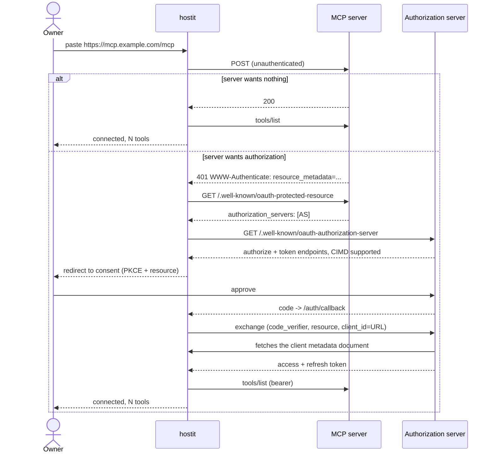

# MCP servers

## Description

An owner pastes the URL of an **MCP server** -- a service exposing tools over the
Model Context Protocol -- and hostit works out the rest: whether it needs
authorization, where to arrange it, and what tools it offers. It appears under
its own card on the **Connections** page, alongside connections and credentials,
and is granted to apps exactly like they are. The row carries the endpoint and a
tool COUNT; the list itself is a dialog, because a server is entitled to expose
hundreds and inlining them would bury every other connection under one of them.
That dialog grows a search once there are eight or more.

The difference is what a granted app gets. A connection or a credential is handed
to the app as a token; an MCP server is **not**. hostit keeps the token and makes
the calls, so a granted app sends a tool name and arguments over its own socket
and gets a result back. The same tools also appear in the **built-in assistant's**
tool list, so an owner can grant an app a Linear server and then simply ask the
assistant to file an issue.

Nothing has to be registered by an admin first, which is the practical difference
from every other provider in the catalog.

## Why it exists

Two decisions worth recording.

**hostit speaks MCP, rather than handing the credential over.** Everywhere else,
hostit brokers the CREDENTIAL and not the API -- see `connections.md` for why that
is right for a Google or a Slack. MCP is the exception, for one reason: an MCP
access token is not scoped to what the app was granted. It opens the whole server,
every tool, for the owner's whole account there. Handing it to the app would make
the grant decorative -- an app given a read-only issue server could send any
request it liked. So the token stays in control, and the app calls through it.

The side effect is most of the work disappearing: an app needs no MCP client, no
OAuth of its own, no PKCE, and nothing to refresh. `curl` and a JSON body is the
whole integration.

**Discovery instead of a catalog entry.** A Google or a Slack is written down once
with its endpoints and scopes baked in, because there is one of each. MCP servers
are an open set -- there is no more a catalog entry per MCP server than there is
one per website. So there is a single pseudo-provider (`mcp`) that takes a URL,
and everything else is asked of the server at the moment it is added.

That is what the whole `mcp` package exists for, and it is why hostit implements
a chain of specs rather than one:

| Spec | What it gets us |
|---|---|
| RFC 9728 (Protected Resource Metadata) | which authorization server this MCP server trusts |
| RFC 8414 / OIDC Discovery | that server's authorize and token endpoints |
| Client ID Metadata Documents | identifying hostit **by URL**, so nothing is registered anywhere |
| RFC 7591 (Dynamic Registration) | the fallback for a server that predates CIMD |
| RFC 7636 (PKCE) | standing in for the client secret hostit cannot have |
| RFC 8707 (Resource Indicators) | binding the token to ONE server, so it cannot be replayed |

MCP deprecated dynamic client registration (RFC 7591) in favour of CIMD, which is
why hostit publishes a metadata document rather than registering itself. Dynamic
registration is kept as the fallback, and `mcp/oauth.go:ClientIDFor` picks
between three cases:

1. **CIMD** -- the client id IS the metadata document's URL. Nothing to do.
2. **A registration endpoint** -- register once as a PUBLIC client and store the
   issued id. A server that issues a client SECRET is refused: hostit has nowhere
   safe to keep a per-server secret, and pretending otherwise would be worse than
   saying so.
3. **Neither** -- refused at add time, naming the issuer. Guessing produces a
   consent error at the provider that nobody can trace back to hostit.

Verified against three real servers as of 2026-08-23:

| Server | Auth | Client id |
|---|---|---|
| `mcp.deepwiki.com/mcp` | none | n/a (3 tools listed straight away) |
| `mcp.linear.app/mcp` | yes | CIMD |
| `api.githubcopilot.com/mcp/` | yes | **case 3** -- its AS is `github.com/login/oauth`, which offers neither. Connecting it needs a GitHub OAuth App registered by hand, which hostit does not yet do for MCP. |

## User flows

### Adding a server



### An app using one

```
GET  /v1/mcp/{slug}/tools    -> {"tools":[{"name":"...","input_schema":{...}}]}
POST /v1/mcp/{slug}/call     <- {"tool":"...","arguments":{...}}
                             -> {"text":"...","is_error":false}
```

Over the app's own unix socket, so there is no token to hold and no host to know.
Both answer at `/api/container/...` as well; see `connections.md` on the two prefixes.

### The assistant using one

Nothing to do. Granted MCP tools become real tool definitions in the assistant's
tool list, named `mcp__conn__<slug>__<tool>`, carrying the server's own JSON
Schema. The model calls them like any other tool and hostit routes the call.

## Technical details

### The `mcp` package

Protocol only; it knows nothing about hostit's storage or users.

- `mcp/discovery.go:Discover` -- the RFC 9728 walk. Answers `Discovery{NeedsAuth,
  CanAuthorize, Issuer, AuthorizationEndpoint, TokenEndpoint, Resource, Scopes,
  SupportsCIMD}`. A server needing auth but not saying how is reported as such
  rather than half-attempted.
- `mcp/pkce.go:NewPKCE` -- 48 random bytes, base64url, SHA-256, `S256`.
- `mcp/oauth.go` -- `AuthCodeURL`, `Exchange`, `Refresh`, `ClientMetadata`,
  `ClientIDFor`, `Register`. No client secret anywhere: hostit is a public
  client here. The resolved client id is stored in `mcpMeta.Discovery.ClientID`
  and reused on refresh -- a registered id has no other source, and registering
  again on every refresh would leave a trail of dead clients.
- `mcp/client.go:Client` -- Streamable HTTP JSON-RPC. `initialize` once (holding
  the `Mcp-Session-Id` the server hands out), then `tools/list` and `tools/call`.
  Reads a plain JSON body **or** an SSE stream, because the spec lets a server
  answer either way for the same request.

A tool that fails comes back as `ToolResult{IsError: true}` with **no error**: the
call happened and the answer is bad news. Only a call that did not happen is an
error. The caller wants to retry one and show the other.

### Storage

An MCP connection is a `store.Connection` with `Kind = store.ConnectionMCP`.

- `Secret` -- the sealed OAuth refresh token, or a sealed empty string for a
  server that wants no authorization. Sealed either way, so nothing downstream
  special-cases a plaintext row.
- `Meta` -- a JSON `control.mcpMeta`: the endpoint URL, what discovery found, the
  tool list and when it was fetched. Non-secret by definition; the token is in
  `Secret` and never here. Note this is JSON where a static credential's meta is
  `k=v` pairs, which is why `connectionView` unpacks it rather than showing it.

### Control

- `control/mcp.go` -- `connectionManager.addMCP`, `saveMCPToken`, `mcpClientFor`,
  `mcpTools`, `mcpCall`, `grantedMCPConnection`. Access tokens go through the same
  `cachedTokenFor`/`cache` pair the OAuth providers use, keyed on the sealed
  credential so a reconnect invalidates itself.
- `control/mcp.go:mcpBroker` -- consents in flight, keyed by nonce, 30-minute TTL.
  **In memory on purpose:** the PKCE verifier is what proves the code came back to
  whoever asked for it, so putting it in a cookie hands it to whatever can read
  cookies -- the attack PKCE exists to stop. A control restart mid-consent means
  the owner clicks connect again.
- `control/server_handler_mcp.go` -- the endpoints, plus
  `handleMCPClientMetadata` serving `/.well-known/oauth-client` publicly.
- The callback is the SAME `/auth/callback` a login uses, told apart by the state
  prefix (`conn:mcp:<slug>:<nonce>`), so no second redirect URI is registered
  anywhere.

### Assistant

- `web/src/pages/Connections.jsx:ToolsDialog` -- the tool list, with
  `filterTools` (in `web/src/connections.js`) matching name AND description:
  people remember what a tool does long before they remember whether it was
  called `search_issues` or `issues_search`.
- `assistant/mcptools.go` -- `mcpToolDefs` builds the definitions, `mcpToolName`
  sanitises a server's tool name into what the API accepts, `dispatchMCPTool`
  routes a call. Names resolve against the GRANTED list rather than by splitting
  the string, so a model that invents a plausible name finds nothing.
- `control/assistantops.go:MCPTools` / `CallMCPTool` -- the control-side half. A
  server that will not answer is skipped rather than failing the turn.

## Where the public docs live

- User guide: `/docs/user/connections/mcp` (what it is, adding one, why hostit
  makes the calls) and `/docs/user/connections/using` (the socket endpoints).
- Admin guide: `/docs/admin/connections/mcpsetup` -- the three ways hostit
  identifies itself, and the one thing to check on a new instance
  (`/.well-known/oauth-client` must be publicly reachable).

## Other notes

- **Outbound requests are guarded (SSRF).** The URL is the user's, and hostit
  fetches it from inside its own network. Without a guard that is a server-side
  request forgery primitive: pointed at `http://169.254.169.254/` it reads the
  cloud metadata service, unauthenticated on most providers, from an address that
  service trusts. It also reflected up to 512 bytes of a non-2xx response body
  back to the caller in the error text.

  The `outbound` package is the answer: an http.Client whose dialer refuses any
  address that is not publicly routable. The check is at DIAL time, on the
  resolved address, because a hostname check is defeated by DNS rebinding.
  `outbound-allow-private-cidrs: ["192.168.1.0/24"]` exempts specific ranges for
  a self-hoster whose MCP servers really are on their LAN; it is empty by default
  and tests that are not about the guard list loopback (they talk to httptest
  servers on 127.0.0.1). Listing a range, not an all-or-nothing switch, keeps the
  exemption from quietly covering the cloud metadata service.

  This shipped to stage before it was caught. It never reached prod --
  `connections-v2` is unmerged.

- **The grant is the whole boundary.** It is checked before hostit contacts the
  server at all, so an ungranted app cannot even make hostit send a request on its
  behalf. `control/mcp_test.go:TestAnUngrantedAppCannotCallAnMCPTool` asserts the
  server was never contacted.
- **`/v1/connections/{slug}/token` answers 404 for an MCP connection**, naming
  the call endpoint instead. The refusal is the design, not a gap: the token
  sub-resource does not exist for that member, which is what 404 means. Asking a
  credential for `/mcp/tools` is the mirror image and answers the same way.
- **`/.well-known/oauth-client` must be reachable from the internet.** An
  authorization server fetches it to learn who is asking; if it cannot, every
  consent fails. Unauthenticated on purpose -- it is hostit's public identity.
- **Refresh tokens rotate.** MCP requires public clients to rotate, so the token
  just spent is dead. `mcpClientFor` stores the replacement; not doing so makes
  the first call work and the second fail with `invalid_grant`, which reads like
  the owner revoked access. (The same bug already bit the Discord provider.)
- **Tool results are redacted** on the way into a transcript, by the existing
  `assistant.RedactCredentials` -- MCP results go through `DispatchTool` like
  everything else, so this needed no new wiring.
- **A stale tool list beats no list.** If a server is briefly unreachable,
  `mcpTools` serves what it last saw rather than making an app's tools vanish.
- **`connectedToolPrefix` is `mcp__conn__`, not `mcp__`.** `mcp__hostit__` is how
  Claude Code namespaces hostit's OWN tools inside the sandboxed Claude Max
  backend (`assistant/sandbox.go`), and the two must not be confusable.
- **Known gap:** the sandboxed Claude Max backend advertises `ToolDefs()`, which
  is the built-in set only. Granted MCP tools reach the API-backed assistant but
  not that one yet.
- **A pre-registered client per issuer is not supported.** That is what GitHub's
  MCP endpoint needs, and hostit already holds a GitHub OAuth client for the
  `github` connection provider -- reusing it here, keyed on issuer, is the
  obvious next step and is deliberately not done yet.
- **Not implemented:** per-tool grants. A grant is whole-server, with the tools
  listed in the UI so the owner sees what they are agreeing to. Narrowing to
  individual tools is possible later without changing the storage.
