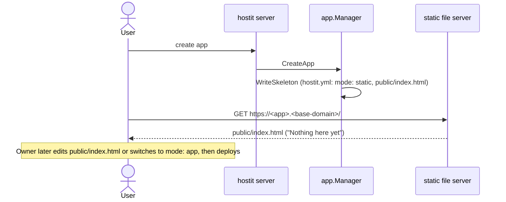

# Placeholder (the page a new app serves)

## Description

A brand-new app is not empty: the moment it is created, its subdomain serves a small
"Nothing here yet" page -- the placeholder. It shows a "Ready" badge, a short line
("This app is live and waiting. Edit public/index.html, or ask the assistant to build
something here."), and the hostit wordmark. The owner sees a working, HTTPS-served
page at `<app>.<base-domain>` immediately, before they (or their agent) have built
anything.

The placeholder is not a special server mode or a running process. A new app starts
from a skeleton as a `mode: static` app whose `public/index.html` is the placeholder
page, so hostit serves that file directly.

## Why it exists

The design goal is that creating an app produces something reachable at once -- the
API returns and the URL already serves a page, rather than a 502 until the owner does
work. That is a nicer first impression and a useful signal: if the placeholder loads,
the whole path (subdomain routing, TLS, port allocation, static serving) is working.

Making the placeholder a plain `public/index.html` in the skeleton (rather than a
hardcoded server behavior or a dedicated `hostit placeholder` backend it used to be)
is deliberate: a new app is then a *complete, editable example* of the simplest mode.
There is no process to supervise and no magic to unwind; the owner just edits (or
replaces) `public/index.html`, or switches `hostit.yml` to `mode: app` to run a
command instead. It also keeps the daemon and CLI smaller: there is no placeholder
subcommand, only the ordinary static-file path every `mode: static` app uses.

The page is deliberately plain and self-describing, so a visitor who lands on an
unbuilt app is not confused, and an agent reading the app's `README.md` is told the
app is a stub.

## User flows

- A user creates an app; nothing else is required. Visiting the app's URL shows the
  placeholder from `public/index.html`.
- When the owner (or an agent) edits `public/index.html`, or writes their own
  `hostit.yml` and deploys, the placeholder is replaced by whatever they serve.
  Because `WriteSkeleton` never overwrites existing files, an app that already has
  content keeps it.

## Technical details

- **The page:** `app/skeleton/public/index.html`, embedded via
  `//go:embed skeleton/public/index.html` into `skeletonPublicIndex`
  (`app/skeleton.go`). It is a self-contained HTML document with inline CSS
  (light/dark aware), a "Ready" badge, the "Nothing here yet" heading, and the hostit
  wordmark. Embedding (not inlining a string literal) keeps the markup in its own file.
- **The config:** `app/skeleton/hostit.yml` is `mode: static`, with the description
  field and the `mode: app` alternative documented inline as comments.
- **Wired via the skeleton:** `app/skeleton.go:skeletonFiles` returns the initial home
  files: `hostit.yml`, `public/index.html` (the placeholder), a templated `README.md`
  (`app/skeleton/readme.md`) that tells the reader the app is a stub, and `.hushlogin`.
- **Applied on create:** `app/service.go:create` calls
  `SystemOps.WriteSkeleton(name, home, skeletonFiles(...))` for a fresh (non-fork) app.
  `WriteSkeleton` never overwrites existing files.
- **Served like any static app:** a `mode: static` app is served straight from
  `public/`; there is no per-app process for the placeholder (see [deploy.md](deploy.md)
  for the `static` vs `app` modes). There is no `hostit placeholder` CLI command; the
  earlier design ran one, and it was removed in favor of this static skeleton.

## Other notes

- **A fork does not get the placeholder.** Forking seeds the home from the source and
  skips the skeleton (`app/service.go:create`, the `forking` branch), so a fork serves
  whatever the source served. See [fork.md](fork.md).
- **The placeholder is only the default, not a lock-in.** Editing `public/index.html`
  (or switching to `mode: app`) and deploying replaces it. The skeleton `README.md` and
  the agent guide steer whoever comes next to do exactly that, and to keep a one-line
  `description:` so the next session starts from what the app already is
  (`server/server_handler_agent.go:agentGuide`).
- **Related:** [deploy.md](deploy.md) (the modes and the deploy path) and
  [apps-lifecycle.md](apps-lifecycle.md) (create, which installs the skeleton).
