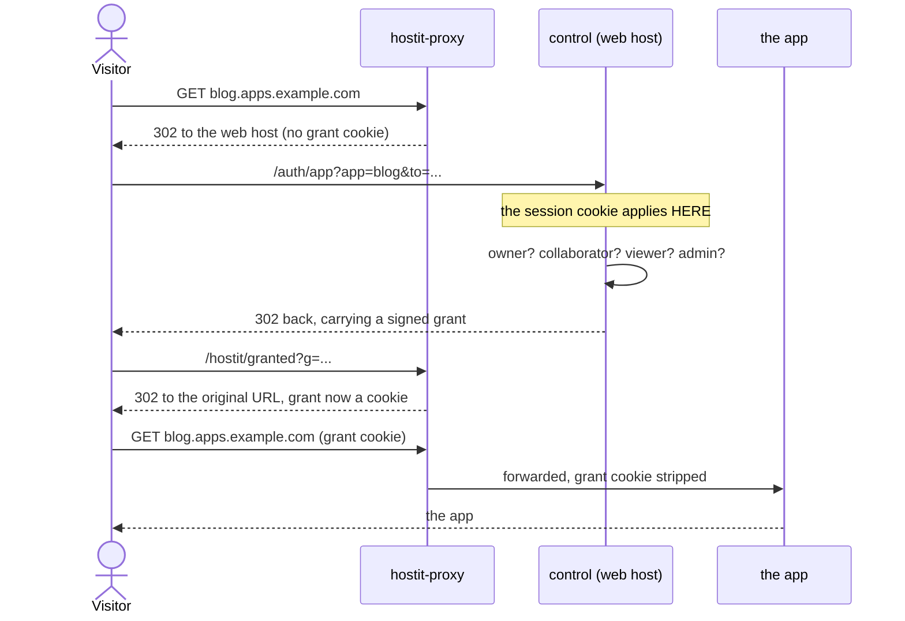

# Private apps

## Description

An app is **public** by default: anyone with the URL opens it, no sign-in, no
account. That is what hostit is for, and what every app did before this setting
existed.

A **private** app is reachable only by its owner, its collaborators, the people
its owner gives access to, and admins. It applies to every hostname the app
answers to, custom domains included. The setting is chosen when the app is
created and can be changed later under Settings -> Visibility, and it takes
effect within about a second.

An app with people on the access list reads as **Restricted** rather than
Private in the interface. That is a label, not a stored state: the flag is still
`private`. It exists so an owner can tell "only me" from "me and two others"
without opening anything.

Above public sits **Listed**, the top rung of the same picker: public, and shown
on the instance's members-only Explore gallery. Unlike Restricted that one is a
real stored flag (`app.listed`), and it is only offered when the operator has the
gallery switched on -- see [app-gallery.md](app-gallery.md).

Two per-app grants, and the difference between them is the point:

| | may open the app | may deploy, edit files, use the terminal, SSH in | appears on their dashboard |
|---|---|---|---|
| **Collaborator** | yes | yes | yes |
| **Viewer** | yes | no | no |

## Why it exists

hostit apps were public URLs. That is fine for a blog and wrong for a personal
dashboard holding a connected account -- one URL guess away from being someone
else's mail reader. It was the only item on the roadmap that was an active
exposure rather than a missing feature.

The design changed twice while being built, and both changes are worth
recording because the reasons generalise.

**The session cookie cannot be used.** The original design had the proxy ask
control whether the visitor's session may see the app. That is unimplementable:
the session cookie is `__Host-` prefixed (`control/session.go`), so a browser
sends it only to the exact host that set it. A request to
`blog.apps.example.com` carries no session at all. The prefix is deliberate and
load-bearing -- it stops an app subdomain planting a session on the web app --
so it stays, and the visitor instead acquires a second, much smaller credential
that IS valid on the app's own hostname.

**Enforcement belongs in the proxy, not control.** The second version routed
private traffic through control, which meant a private app returned 502 the
moment control stopped -- measured, not theorised. The proxy exists so apps keep
answering when the control plane does not, and that had been given up for
exactly the apps that most need it. So control now resolves the policy ahead of
time into a set of user ids pushed with the routing table, and the proxy
enforces it without asking anything.

**Viewers were split out of collaborators.** The first version reused the
collaborator grant alone and accepted that sharing a dashboard also handed over
deploy and SSH access. The tell for revisiting it -- somebody wanting to share
with a non-technical person -- arrived the next day.

## User flows

Making an app private: **Settings -> Visibility -> the pencil**, which opens one
dialog holding both halves of the decision (public/private, and who else gets
in). Nothing is sent until **Save**, so the whole dialog commits or does not.

A visitor opening a private app:

Everything after the first hop is invisible: a visitor already signed in sees
the address bar settle and nothing else. Signed out, they are sent to sign in
and returned to the app afterwards. Signed in without access, they get a page
saying the app is private, to ask its owner, and which account they are using.

Three endpoints answer on a private app's own hostname:
`/hostit/auth` (ask for access without waiting to be refused), `/hostit/granted`
(take delivery of a grant) and `/hostit/logout` (drop the grant for this one
app). They are the only place a private app's URL space is not entirely its own.

Scripts and webhooks skip the dance: `Authorization: Bearer <token>` is judged
by control against the same rule.

## Technical details

**The grant** -- `appgrant/service.go`. Ed25519, value `app|userID|expiry|sig`.
The keypair is derived from the session key (`appgrant.NewSigner`), so every
control sharing that key agrees with no extra material to distribute. Ed25519
rather than an HMAC for one reason: the proxy must be able to CHECK a grant and
must never be able to MINT one, so it gets `Signer.PublicKey()` and nothing
else. Grants are app-scoped, so one leaking is worthless anywhere else -- which
matters, because it lives as a cookie on a hostname whose content the app's
owner controls. It is stripped from the request before it reaches the app, in
both forwarding paths (`proxy/grant.go:stripGrantCookie`,
`control/appaccess.go:stripGrantCookie`).

**The decision** -- `control/appaccess.go:mayViewApp` is the only place the rule
is written: global admin, or app-scoped token for this app, or an active user
who is admin / owner / collaborator / viewer.

**The push** -- `control/proxies.go:Routes()` evaluates that rule ahead of time.
Each private `proxyapi.Route` carries `Access` (active user ids: owner +
collaborators + viewers) and `App`; the `Table` carries `Admins` once and
`GrantPublicKey`. `store.AccessSets()` and `store.ActiveAdmins()` are two
grouped queries for the whole registry, because `RouteLoop` re-derives every
500ms. The access sets are hashed with the routes, so a membership change bumps
the sequence and pushes on its own -- there is no separate notify path.

**The enforcement** -- `proxy/grant.go:mayServePrivately`, called from
`proxy/service.go:ServeHTTP`. Verify the grant, match `route.App`, check
membership in `route.Access` or `table.Admins`, strip the cookie, forward. Only
the ALLOW path lives there: refusals, the sign-in bounce, the grant hop, logout
and bearer tokens all fall through to control, which owns the error page and the
credentials to judge them. Token hashes are deliberately not in the table.

**Data model** -- `app.private` (migration 28); `app_viewer` (migration 29),
deliberately a separate table from `app_collaborator` rather than a role column,
so neither grant can be read as the other by a query that forgets to filter.
Both cascade on app and user delete.

**Refusal pages** -- `control/errorpage.go`. `writePrivateAppPage` (403) names
the app and the signed-in account; `writeNothingHerePage` (404) stays silent and
is still what an unknown hostname gets.

**Web** -- `VisibilityChoice`, `VisibilityBadge`, `VisibilityMark` and
`visibilityOf` in `web/src/components.jsx`; the dialog is `VisibilityDialog` in
`web/src/pages/AppDetail.jsx`, which drafts everything and commits in one
`saveVisibility`.

## Other notes

- **Revocation costs one table push**, measured under a second end to end. That
  is the same latency the private flag itself has, so membership is not the weak
  link: an app just made private is equally reachable for that half second.
- **Control is a dependency for minting only.** With control down, everyone
  holding a grant keeps working (verified with the daemon stopped, including
  across a proxy restart, since the public key is persisted with the routes);
  nobody new can get in, because issuing a grant needs the session and the user
  tables.
- **A collaborator cannot also be added as a viewer** -- it would be a row that
  changes nothing while looking like it does something.
- **No invite flow.** Access can only be given to an account that has signed in
  at least once. The API says which of "never signed up", "waiting for
  approval" and "suspended" applies, because that was the single most common way
  to use this wrong.
- **Previews go through the same gate, not around it.** A private app used to be
  skipped entirely: the shot container browsed the public URL with no
  credentials, so it would only have photographed the refusal page. It is now
  shot with an app-bound grant cookie minted for a reserved preview principal
  (`Server.PreviewCookie`, `api.PreviewPrincipal`), so the proxy serves it the
  real app -- the grant names that ONE app, is re-checked like any other, and is
  stripped before the request reaches the app backend. This is deliberately not a
  bypass: the shot is a caller the gate admits, not a path around it. An instance
  with no cookie minter configured drops private apps from the queue rather than
  photographing a refusal page (`preview.Manager.enqueue`).
- **Grants name the app, and apps can be renamed.** A rename invalidates
  outstanding grants for that app; visitors bounce once and get a fresh one.
- **Related features:** [app-gallery.md](app-gallery.md) is the fourth rung of
  this ladder (public plus listed on the Explore gallery).
- Design record, including what was rejected: `plans/260821-private-apps.md`
  (not in this repo).
