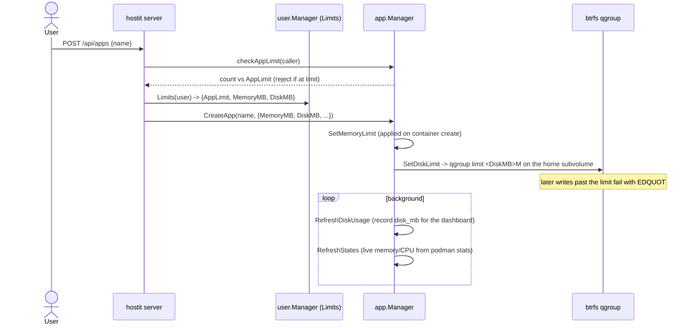

# Quotas and limits (disk, memory, app count)

## Description

hostit caps three resources so one app -- or one user -- cannot starve the rest of a
node:

- **Disk quota** (`disk_mb`, per app): how much the app's home may use. On a btrfs
  host this is a hard cap enforced by a btrfs qgroup -- a write past it fails
  immediately with `EDQUOT`. On a non-btrfs host it is measured and reported but not
  enforced.
- **Memory limit** (`memory_mb`, per app): the container's memory cap, enforced by the
  kernel via podman/cgroups.
- **App-count limit** (`app_limit`, per user): how many apps a user may own at once.

Disk and memory come from the owner's per-user limits, applied to every app they
create. The app-count limit is checked when creating (or forking) an app. Live disk,
memory and CPU usage show in the app's workspace top bar; the values and defaults are
set per user (or as an instance default) on the Admin page.

## Why it exists

hostit is designed to pack many small apps onto a modest node (the code repeatedly
notes "one core", "a small host"). Without caps, a single runaway app -- a fork bomb,
a memory leak, a log that fills the disk -- would take the whole box and every other
tenant with it. The three limits are the guardrails that make multi-tenancy safe on
one machine.

The disk quota is deliberately a **hard** cap on btrfs (qgroup `EDQUOT`) rather than a
soft "measure and stop it later" sweep: a background sweep would let an app blow far
past its limit before anything noticed, and stopping the app after the fact is a
worse failure than the write itself failing. On filesystems that cannot hard-cap,
hostit degrades to soft accounting rather than refusing to run -- it still runs
anywhere, it just loses enforcement (README: btrfs is recommended precisely because
snapshots, rollback, fork and hard quotas are core).

Limits are **per-user with per-app application**: a user's plan is expressed once
(their `Limits`), and every app they make inherits the same disk/memory cap. The
app-count limit is what actually bounds a user's footprint; disk/memory bound each
app within that.

## User flows

- **On create/fork:** the server resolves the caller's limits and passes `MemoryMB`
  and `DiskMB` into `CreateOptions`; the app is capped from the start. Exceeding the
  app-count limit is rejected before anything is created.
- **Setting limits:** an admin sets instance defaults and per-user overrides on the
  Admin page (`user.Manager.SetDefaults`, per-user `AppLimit`/`MemoryMB`/`DiskMB`
  overrides on the user row).
- **Seeing usage:** the workspace top bar shows live CPU/RAM/disk; the disk figure is
  the periodically-measured `disk_mb`, memory/CPU are live from `podman stats`.

## Technical details

### Where the numbers come from

- **User limits** (`user/service.go`): `Limits{AppLimit, MemoryMB, DiskMB}`.
  `Manager.Limits(user)` returns the per-user override if set, else the instance
  default; `Manager.Defaults()` reads settings (`default_app_limit`,
  `default_memory_mb`, `default_disk_mb`) with built-in fallbacks
  (`defaultAppLimit = 3`, `defaultMemoryMB = 512`, `defaultDiskMB = 2048`).
  `SetDefaults` persists them.
- **Server plumbing** (`server/server_handler_apps.go`): `callerMemoryLimit` and
  `callerDiskLimit` resolve the caller's caps (the global admin token uses instance
  defaults); `checkAppLimit` counts the owner's apps (`Store.AppCountByOwner`) against
  `AppLimit` and returns `app.ErrLimitReached` when at or over it.

### App-count limit

- Enforced only on create and fork (`handleAppsCreate` / `handleAppsFork` both call
  `checkAppLimit`). The global admin token (`c.user == nil`) is unlimited. The error
  message names the current count and limit and suggests deleting an app or asking an
  admin to raise the limit.

### Memory limit

- Recorded per app in `Manager.memoryMB` (`app/deploy.go:SetMemoryLimit` /
  `memoryLimit`), cached in memory rather than only in the DB so redeploys keep it.
- Applied when the container is (re)created: `app/workspace.go:containerCreateArgs`
  adds `--memory <MB>m` when the limit is > 0 (0 means unlimited). The kernel enforces
  it via cgroups.
- Live usage is read from `podman stats` (`app/state.go:resourceUsage`, parsed by
  `parseMemMB`) and surfaced in `State.MemoryMB`.

### Disk quota

- Recorded per app in `Manager.diskMB` (`app/quota.go:SetDiskLimit` / `diskLimit`).
- On btrfs, `SetDiskLimit` also sets the subvolume's qgroup limit
  (`btrfs/service.go:SetQuota` -> `btrfs qgroup limit <MB>M <home>`; `0` clears it).
  This is a **hard** limit: a write past it fails with `EDQUOT`. Quota must already be
  enabled on the filesystem (a one-off at setup).
- Applied at create/fork (`app/service.go:create` calls `SetDiskLimit`) and re-applied
  after a rollback (`app/snapshot.go:Rollback` calls `btrfs.SetQuota`), so the cap
  survives a home swap.
- **Usage accounting** (`app/quota.go:RefreshDiskUsage` / `DiskUsageLoop`,
  `measureDiskMB`): on btrfs it reads the qgroup's referenced bytes
  (`btrfs.UsageMB`, cheap and accurate, no directory walk); on other filesystems it
  walks the home directory. The measured value is stored via `Store.UpdateAppUsage`
  into `app.disk_mb` for the dashboard. On btrfs this loop is pure accounting -- the
  qgroup already enforces the cap, so there is nothing here to stop.
- Snapshots are stored **beside** the app subvolumes, under `.snapshots/<id>/`
  (`app/btrfs.go:snapshotsDirName`), not inside the home, so a snapshot's space is not
  charged to the app's own quota.

### btrfs detection

- `app/btrfs.go:btrfsEnabled` caches whether `AppsDir` is btrfs (via
  `btrfs.Filesystem` -> `stat -f`). On a plain ext4 host it is false and hostit keeps
  its plain-directory, soft-quota behavior. The detection is logged once so a
  mis-detection is visible rather than silent.

## Other notes

- **Hard vs soft disk quota is the headline gotcha.** The README's `## Users, roles
  and limits` section (older text) still describes disk as a *soft* quota; the
  `## Snapshots, rollback and quotas` section and the code describe the current
  behavior: hard on btrfs (qgroup `EDQUOT`), soft/report-only elsewhere. Treat the
  code (`btrfs/service.go:SetQuota`, `app/quota.go`) as authoritative.
- **The disk quota is shared** by everything in the app (the app process, builds,
  logs, uploaded files, dependencies). A build that fans out past the quota fails
  rather than taking the host with it -- as does one past the 512-process
  (`app/workspace.go:maxProcesses`) or memory limit.
- **Process limit** is a fourth, fixed guardrail: `--pids-limit 512` on every
  container, not user-configurable, sized generously for a build but far below what it
  takes to exhaust the host.
- **Changing a user's limits does not retroactively resize existing apps' caps** in
  the running daemon beyond what a redeploy re-applies; disk is re-applied on
  create/fork/rollback, memory on the next container (re)create.
- **Related:** [apps-lifecycle.md](apps-lifecycle.md) (create enforces the app-count
  limit and applies the caps), [fork.md](fork.md) (also counts against the app limit
  and inherits the caps), [snapshots-rollback.md](snapshots-rollback.md) (shares the
  btrfs substrate and re-applies the quota).
