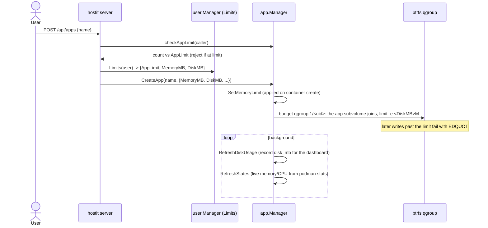

# Quotas and limits (disk, memory, app count)

## Description

hostit caps three resources so one app -- or one user -- cannot starve the rest of a
node:

- **Disk budget** (`disk_mb`, per app): how much the app may pin on disk, across its
  one subvolume (the container's whole filesystem, files and installed software
  alike) and its snapshots combined. It is a hard cap
  enforced by one btrfs qgroup per app -- a write past it fails immediately with
  `EDQUOT` ("Disk quota exceeded"), wherever the app writes. A `disk_mb` of 0 means
  the platform default (2048 MB); nothing is unlimited.
- **Memory limit** (`memory_mb`, per app): the container's memory cap, enforced by the
  kernel via podman/cgroups.
- **App-count limit** (`app_limit`, per user): how many apps a user may own at once.

Disk and memory come from the owner's per-user limits, applied to every app they
create. The app-count limit is checked when creating (or forking) an app. Live disk,
memory and CPU usage show in the app's workspace top bar; the values and defaults are
set per user (or as an instance default) on the Admin page.

## Why it exists

hostit is designed to pack many small apps onto a modest node (the code repeatedly
notes "one core", "a small host"). Without caps, a single runaway app -- a fork bomb,
a memory leak, a log that fills the disk -- would take the whole box and every other
tenant with it. The three limits are the guardrails that make multi-tenancy safe on
one machine.

The disk budget is deliberately a **hard** cap (qgroup `EDQUOT`) rather than a
soft "measure and stop it later" sweep: a background sweep would let an app blow far
past its limit before anything noticed, and stopping the app after the fact is a
worse failure than the write itself failing. It also deliberately covers
**everything the tenant can write**, not just the home: before the rootfs model, an
app once filled the whole host from inside a 10 MB-quota'd app by writing into
`/usr` (the then-uncapped container writable layer), wedging the daemon's own
SQLite. btrfs is mandatory for exactly this reason -- the daemon refuses to start
without it, rather than degrading to unenforced accounting.

Limits are **per-user with per-app application**: a user's plan is expressed once
(their `Limits`), and every app they make inherits the same disk/memory cap. The
app-count limit is what actually bounds a user's footprint; disk/memory bound each
app within that.

## User flows

- **On create/fork:** the server resolves the caller's limits and passes `MemoryMB`
  and `DiskMB` into `CreateOptions`; the app is capped from the start. Exceeding the
  app-count limit is rejected before anything is created.
- **Setting limits:** an admin sets instance defaults and per-user overrides on the
  Admin page (`user.Manager.SetDefaults`, per-user `AppLimit`/`MemoryMB`/`DiskMB`
  overrides on the user row).
- **Seeing usage:** the workspace top bar shows live CPU/RAM/disk; the disk figure is
  the periodically-measured `disk_mb`, memory/CPU are live from `podman stats`.

## Technical details

### Where the numbers come from

- **User limits** (`user/service.go`): `Limits{AppLimit, MemoryMB, DiskMB}`.
  `Manager.Limits(user)` returns the per-user override if set, else the instance
  default; `Manager.Defaults()` reads settings (`default_app_limit`,
  `default_memory_mb`, `default_disk_mb`) with built-in fallbacks
  (`defaultAppLimit = 3`, `defaultMemoryMB = 512`, `defaultDiskMB = 2048`).
  `SetDefaults` persists them.
- **Server plumbing** (`server/server_handler_apps.go`): `callerMemoryLimit` and
  `callerDiskLimit` resolve the caller's caps (the global admin token uses instance
  defaults); `checkAppLimit` counts the owner's apps (`Store.AppCountByOwner`) against
  `AppLimit` and returns `app.ErrLimitReached` when at or over it.

### App-count limit

- Enforced only on create and fork (`handleAppsCreate` / `handleAppsFork` both call
  `checkAppLimit`). The global admin token (`c.user == nil`) is unlimited. The error
  message names the current count and limit and suggests deleting an app or asking an
  admin to raise the limit.

### Memory limit

- Recorded per app in `Manager.memoryMB` (`app/deploy.go:SetMemoryLimit` /
  `memoryLimit`), cached in memory rather than only in the DB so redeploys keep it.
- Applied when the container is (re)created: `workspace/spec.go:CreateArgs`
  adds `--memory <MB>m` when the limit is > 0 (0 means unlimited). The kernel enforces
  it via cgroups.
- Live usage is read from `podman stats` (`app/state.go:resourceUsage`, parsed by
  `parseMemMB`) and surfaced in `State.MemoryMB`.

### Disk budget

- Each app has one hierarchical qgroup, `1/<uid>` (`app/budget.go:budgetGroup`,
  keyed on the app's unix uid: stable across renames, unique per app). Its members
  are the app's one subvolume and every snapshot subvolume
  (`app/budget.go:ensureBudget`; the snapshot service joins each subvolume it
  creates via `snapshot.Host.AssignBudget`).
- The group is capped on **exclusive bytes** (`btrfs/service.go:QgroupLimitExclusive`
  -> `btrfs qgroup limit -e <MB>M`): the app pays for what it alone pins, while data
  still shared with the read-only base is charged to nobody. This is a
  **hard** limit: a write past it fails with `EDQUOT` -- in `/home/app` or anywhere
  else inside the container. Quota accounting is enabled at every start
  (`app/budget.go:EnableDiskBudgets`).
- A stored `disk_mb` of 0 (or less) is enforced as the 2048 MB default
  (`app/budget.go:effectiveDiskCapMB`); nothing is unlimited.
- Recorded per app in `Manager.diskMB` (`app/quota.go:SetDiskLimit` / `diskLimit`);
  `SetDiskLimit` re-caps the budget group. The budget is set up at create/fork and
  re-ensured at startup; a rollback needs no re-application, because the staged
  copy joins the group before the swap and qgroup membership survives the rename.
- **Usage accounting** (`app/quota.go:RefreshDiskUsage` / `DiskUsageLoop`,
  `measureDiskMB`): reads the budget group's exclusive bytes
  (`btrfs.ExclusiveUsageMB`, cheap and accurate, no directory walk) -- the true
  bytes the app pins, i.e. what deleting it would free. A fresh app shows ~47 MB,
  the metadata cost of chowning its subvolume snapshot. The measured value is
  stored via `Store.UpdateAppUsage` into `app.disk_mb` for the dashboard. The loop
  is pure accounting -- the qgroup already enforces the cap, so there is nothing
  here to stop.
- Snapshots are stored **beside** the app subvolumes, under `.snapshots/<id>/`
  (`app/btrfs.go:snapshotsDirName`), not inside the tree they capture, but they are
  members of the budget group: under exclusive accounting a snapshot only costs
  budget for data that has since diverged from the live subvolume.

### btrfs is a given

- The startup preflight (`cmd/preflight.go:requireBtrfs`) refuses to run unless
  `AppsDir` is btrfs, so everything downstream simply assumes it; the old runtime
  `btrfsEnabled()` guards are gone. See
  [storage-btrfs.md](../subsystems/storage-btrfs.md).

## Other notes

- **The budget spans the whole app.** The one subvolume and its snapshots are one
  number: an `apt-get install` competes with uploaded files and retained snapshot
  divergence for the same `disk_mb`. Treat the code (`app/budget.go`,
  `app/quota.go`) as authoritative.
- **The disk budget is shared** by everything in the app (the app process, builds,
  logs, uploaded files, dependencies, installed packages). A build that fans out
  past the budget fails rather than taking the host with it -- as does one past the
  512-process (`workspace/spec.go:maxProcesses`) or memory limit.
- **Process limit** is a fourth, fixed guardrail: `--pids-limit 512` on every
  container, not user-configurable, sized generously for a build but far below what it
  takes to exhaust the host.
- **Changing a user's limits does not retroactively resize existing apps' caps** in
  the running daemon beyond what a redeploy re-applies; disk is re-applied on
  create/fork and at every daemon start (`applyStoredLimits` in `cmd/serve.go`),
  memory on the next container (re)create.
- **Related:** [apps-lifecycle.md](apps-lifecycle.md) (create enforces the app-count
  limit and applies the caps), [fork.md](fork.md) (also counts against the app limit
  and inherits the caps), [snapshots-rollback.md](snapshots-rollback.md) (shares the
  btrfs substrate; snapshots join the budget group).
