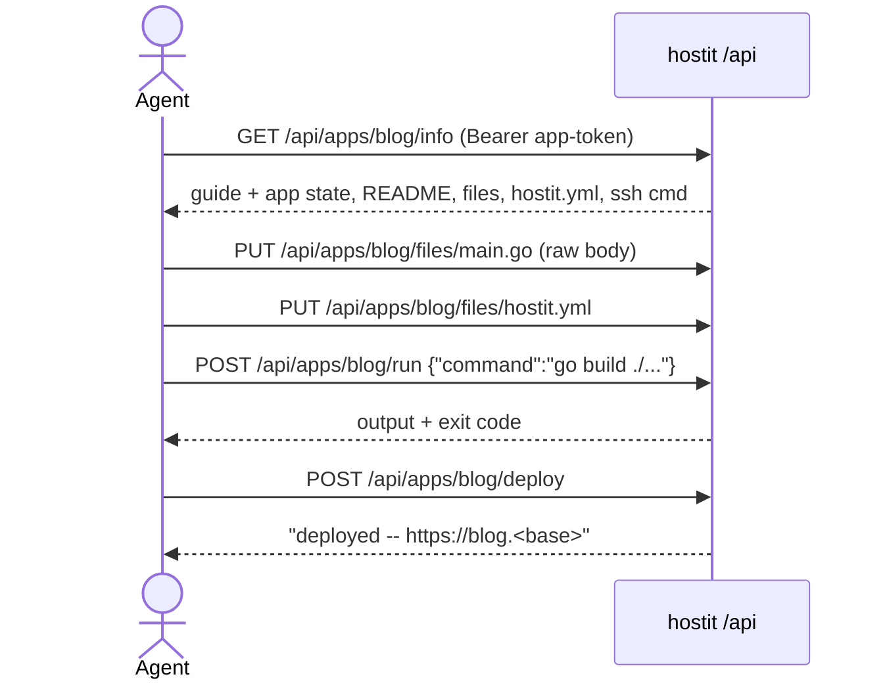

# REST API

## Description

hostit is fully driveable over a JSON REST API under `/api`, served on the web
hostname. It is what the `hostit` CLI, the web dashboard, and any external AI
agent talk to. There are three ways to authenticate:

- an **account token** -- carries everything its owner can do (all their apps,
  their profile, and, if the owner is an admin, the admin endpoints);
- an **app-scoped token** -- limited to exactly one app's endpoints under
  `/api/apps/{app}/`, meant to be pasted into an agent so it cannot touch the
  owner's other apps or reveal who the owner is;
- the **session cookie** the web app gets from Google login (plus a same-origin
  guard), and the operator's unlimited **admin token** from `server.yml`.

The API is self-describing: `GET /api/info` (and `GET /api/apps/{app}/info`)
return a machine-readable guide -- the base URL, the auth header, the endpoint
list, the app layout, how `hostit.yml` works, and a suggested workflow -- so an
agent handed only a token and this URL can figure out the rest. The per-app
surface (`/api/apps/{app}/*`) covers files, deploy/lifecycle, logs, running a
command, snapshots, domains, the assistant, and more.

## Why it exists

The whole product thesis is that an app can be built and operated by an agent, so
the API is a first-class interface, not a bolt-on. Two decisions follow.

First, tokens are scoped. An app token exists to be handed to a third party's
agent, so it must be incapable of lateral movement: it may only reach its own
app's paths, and specifically must not reach `/api/account` (which would leak the
owner's identity). Account tokens are for the owner's own tooling and the CLI.

Second, the API explains itself. Rather than expecting an agent to have read
external docs, `/info` ships the guide inline and keys every instruction to the
concrete app path the token can use, so the same document works whether the
caller holds an account token or a one-app token. The endpoint namespace
(`/api/apps/{app}/...` for one app, `/api/account` and `/api/users` for the rest)
was chosen precisely because the path prefix *is* the permission boundary.

## User flows

Agent building an app with an app-scoped token:

Owner via CLI with an account token: `hostit apps add blog` -> `POST /api/apps`;
`hostit apps ls` -> `GET /api/apps`; and so on. Admin managing the instance uses
the session cookie (as an admin) or the admin token against `/api/users`,
`/api/domains`, `/api/settings`.

## Technical details

Router and auth:

- `server/api.go:newAPIHandler` registers every route via the `route` helper
  under `apiPrefix = "/api"`. Anything unmatched under `/api/` returns a JSON 404
  pointing at `/api/info`; the SPA catches everything else.
- `server/auth.go:Server.authenticate` resolves a `caller` from a `Bearer` token
  or the session cookie. The admin token (`config.AdminToken`) is compared in
  constant time and yields `caller{globalAdmin:true}`; otherwise
  `user/service.go:Manager.UserAndScopeByToken` resolves the token to its user
  and app scope.
- Middleware: `authenticated` (auth only, plus `checkSameOrigin` and the
  app-scope check), `requireActive` (approved account), `requireAdmin`
  (`server/auth.go`).
- `caller` (`server/auth.go`): `user`, `globalAdmin`, `appScope` (non-empty for
  an app token), `viaCookie`. `isAdmin`, `isActive`, `userID` derive from it.
- App-scope enforcement: `withinAppScope` allows only `/api/info` and
  `/api/apps/{scope}` (and its subpaths); reaching anything else with an app
  token returns 403. This lives in `authenticated` so even the
  authenticated-only `/api/account` is blocked for app tokens.
- CSRF: `checkSameOrigin` refuses a cookie-authenticated state-changing request
  without a same-origin `Sec-Fetch-Site`/`Origin`, because apps are subdomains of
  the web app and `SameSite=Lax` does not separate them. Token callers are
  exempt.

Tokens (`user/service.go`, `store/token.go`, `store/types.go:Token`):

- `Manager.CreateAppToken` mints `hostit_<hex>`, stores only the SHA-256
  `hashToken` plus a visible `Prefix`; an app-scoped token additionally stores
  the plaintext `Secret` so the app page can show it again (account-wide tokens
  stay hash-only). `CreateToken` is the account-wide variant (empty app name).
- `Manager.AppToken` returns an app's token (creating one labelled "agent" if
  missing -- every app gets one at creation); `RotateAppToken` deletes and
  re-mints; `UserAndScopeByToken` returns `(user, appScope)` and touches
  last-used, returning `(nil, appName)` for a token on an ownerless
  (admin-created) app so it still works.
- `store/token.go`: tokens are keyed on `app_id` (with `app_name` fallback) so a
  scoped token survives a rename; `tokenName` resolves the current name.

Endpoint surface:

- Account (self, readable while pending): `GET /api/account`, and
  `/api/account/keys` + `/api/account/tokens` (list/add/delete) in
  `server/server_handler_account.go`. `handleTokensList` shows only account-wide
  tokens; each app's token lives on its own page. `handleTokensAdd` mints an
  app-scoped token only for an app the caller owns.
- Apps (owner-scoped; admins see all): create/list/get/delete, `keys`, `token`
  (rotate), `description`, `rename`, `fork`, `events`, `domains`, `terminal`,
  `assistant*` in `server/server_handler_apps.go` and siblings, routed in
  `server/api.go`.
- The agent-facing per-app API is registered by
  `server/server_handler_agent.go:newAgentRoutes` under `/api/apps/{app}/*`:
  `info`, `logs`, `files` (GET/PUT/GET-one/DELETE, plus tar upload, `move`,
  `mkdir`, `readme`), `run`, `deploy`, `poweron|poweroff|reboot`,
  `start|stop|restart`, and `snapshots*`. `requireApp` resolves and
  authorizes the `{app}` path value against the caller.
- Admin (behind `requireAdmin`): `/api/users` (list/invite/update/delete),
  `/api/domains` (approval domains), `/api/settings` (global default limits),
  `/api/assistant-defaults` in `server/server_handler_admin.go`.

The self-describing endpoint:

- `handleAgentInfo` (`GET /api/info`) returns `agentGuide("","")`;
  `handleAgentAppInfo` (`GET /api/apps/{app}/info`) returns the app's URL,
  running state, README, file list, `hostit.yml`, the ready-made SSH command
  (`apiSSHInfo`), and the embedded guide.
- `agentGuide` builds the whole thing: `Platform`, `BaseURL`, `WhatIsThis`, an
  ordered `Workflow`, `Layout`, `HostitYml`, `Runtimes`, `SuggestedStack`,
  `Auth`, an `Endpoints` list, and `Notes`. It parameterizes every path on the
  app name (or `{app}`), and, when the app already has a description, tells the
  agent it is built and live -- do not rebuild it.

Errors: `server/api.go:writeAppError` / `server/server_handler_account.go:
writeUserError` map sentinel errors (`store.ErrAppNotFound`, `app.ErrAppExists`,
`ErrInvalidDomain`, `user.ErrNotActive`, ...) to HTTP status codes; all responses
are JSON via `writeJSON` / `writeError`.

Note the on-box **unix-socket "self" API** (`server/socket.go`,
`server/server_handler_self.go`) is a separate `/v1/self/*` surface used by the
in-container `hostit` CLI, authenticated by SO_PEERCRED rather than a token. It is
not part of the public `/api` and is documented with SSH/CLI, not here.

## Other notes

- The `/v1/*` paths the API used to have now return a JSON 404 pointing at
  `/api` (`server/api.go`).
- The global admin token owns no user record, so "your apps" means all apps for
  it; `listedApps` / `ownedApp` implement the owner-or-admin visibility rule, and
  never widen an ordinary admin's *personal* app list unless `?all=true`.
- App tokens can read `/api/info` (the platform guide is app-agnostic) but not
  `/api/account`; this asymmetry is deliberate and enforced in `withinAppScope`.
- Rotating an app token invalidates the previous one immediately
  (`handleAppsRotateToken` -> `RotateAppToken`).
- A token's plaintext is shown exactly once for account tokens
  (`apiTokenResponse.Token`); app tokens are re-showable from their `Secret`.
- Related features: `bring-your-own-agent.md` (app-scoped tokens in practice),
  `accounts-roles.md` (who may call what), `web-dashboard.md` (the session-cookie
  caller and same-origin guard), `ssh-access.md`, `snapshots-rollback.md`,
  `custom-domains.md`.
