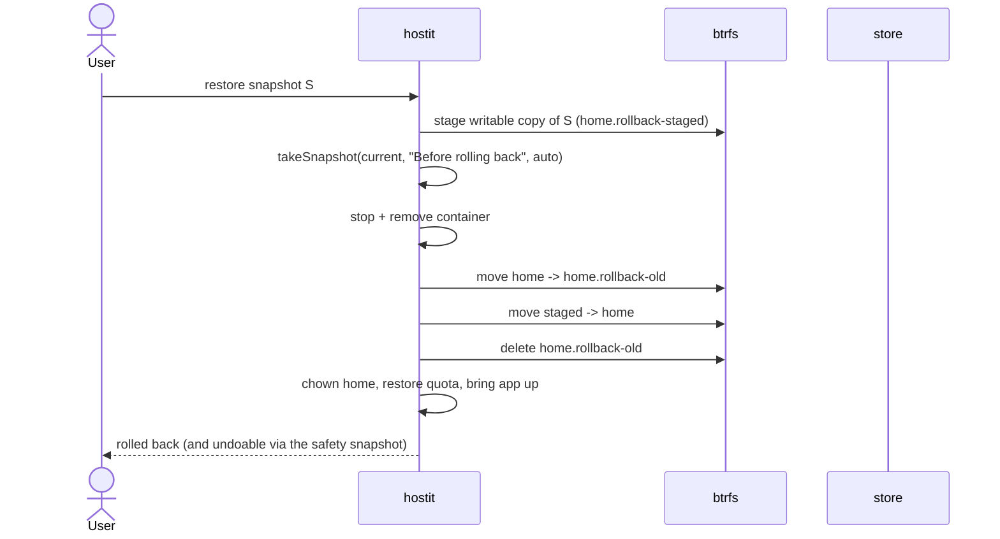

# Snapshots and rollback

## Description

A snapshot is an instant, space-shared, read-only copy of an app's entire home
directory (its files, `hostit.yml`, everything). hostit takes them
automatically -- once every hour, and once right before every deploy -- and the
owner or an agent can take a labelled one at any time to mark "this is a good
state". The app page shows them as a timeline, newest first, with the reason for
each. Any snapshot can be restored: **rollback** replaces the live home with the
snapshot's contents, and first takes a safety snapshot of the current state so the
rollback is itself undoable. Snapshots are also what `fork` seeds a new app from.

Snapshots require a btrfs apps filesystem; on a plain-directory host the feature
is unavailable (the app page hides the Snapshots tab, and the API answers 501).
Retention keeps history from growing without bound using a restic-style
grandfather-father-son policy, so old automatic snapshots are thinned out with
age while recent ones stay dense.

## Why it exists

Deploying, editing files over SSH, or letting an agent rewrite an app are all
easy ways to break a working app. The intent is that there is *always* a recent
point to go back to, without the owner having to think about it: hourly plus
pre-deploy automatic snapshots give a floor, and manual labelled snapshots give
agents and owners a way to bookmark known-good states before a risky change.

btrfs makes this cheap enough to do constantly: a snapshot is a copy-on-write
subvolume, so it shares storage with the live home and costs almost nothing until
the files diverge. That is why the pre-deploy snapshot can be unconditional.

Rollback is written to be crash-safe: it must never leave an app without a home.
The replacement is staged beside the live home first, a safety snapshot is taken,
and only then is the swap done by moving subvolumes -- with the old home moved
aside (not deleted) until the new one is confirmed in place, so any failure can
put the original back. The staging happens *before* the safety snapshot's
retention prune, because that prune could otherwise delete the very snapshot being
restored.

Retention exists so that constant automatic snapshotting does not fill the disk;
it applies to manual snapshots too, so nothing lives forever (a documented
tradeoff -- a very old manual bookmark can eventually be pruned).

## User flows

Automatic (no user action):
- Before every deploy, `up` takes a pre-deploy snapshot (best effort; a failure
  never blocks the deploy).
- An hourly loop snapshots every app.

Manual and rollback:
1. Owner/agent takes a snapshot (Snapshots tab "Take snapshot",
   `POST /api/apps/{app}/snapshots {"label": "before rewrite"}`, or the CLI).
2. hostit runs the optional `snapshot.pre` hook (aborting if it fails, so a torn
   state is never captured), creates a read-only btrfs snapshot of the home,
   records it, runs `snapshot.post` (best effort), and prunes per retention.
3. To roll back, the owner/agent picks a snapshot and restores it; hostit stages
   the target, takes a safety snapshot, stops the container, swaps the home in,
   restores ownership and quota, and brings the app back up.

## Technical details

Core logic in `app/snapshot.go` (`app.Manager`):

- `Manager.TakeSnapshot` / `takeSnapshot`: runs `snapshot.pre` (aborts on
  non-zero exit), makes the read-only subvolume via `m.btrfs.Snapshot(home,
  path, true)`, records a `store.Snapshot`, runs `snapshot.post`, then
  `pruneSnapshots`. `snapshotID` builds a sortable id from the timestamp plus a
  short random suffix; `snapshotKind` tags it auto/manual.
- `Manager.Rollback`: the staged/safety/swap sequence described above, using
  `rollbackStagedSuffix` / `rollbackOldSuffix`, `m.btrfs.MoveSubvolume`,
  `m.systemd.DisableNow` / `m.container.RemoveForce` to release the home, and
  `m.btrfs.SetQuota` to restore the disk quota. It holds the per-app lock and
  passes `snapshot=false` to `up` (it already took a safety snapshot).
- `Manager.DeleteSnapshot`: removes the subvolume then the record (never orphan
  a subvolume).
- `Manager.pruneSnapshots`: calls `retention.Apply` and deletes the pruned
  subvolumes and records; keeps the record if the subvolume delete fails so it
  retries rather than orphaning.
- `Manager.SnapshotLoop`: the hourly automatic snapshot loop (no-op on non-btrfs);
  started from `cmd/serve.go` with a 1h interval.
- `Manager.SnapshotsEnabled` gates the feature on `btrfsEnabled()`;
  `ErrSnapshotsUnavailable` is the sentinel for non-btrfs hosts.
- Labels for unattended snapshots: `autoSnapshotLabel` ("Automated snapshot") and
  `preDeploySnapshotLabel` ("Automated snapshot before deploy").

Pre-deploy trigger: `app/deploy.go:Manager.up` calls `takeSnapshot(name,
preDeploySnapshotLabel, true)` when `snapshot && btrfsEnabled()` before applying
the new config.

Retention (`retention/retention.go`, pure logic, no I/O):

- `retention.Policy` is grandfather-father-son: keep the newest `Last`, plus the
  newest in each of the last `Daily` days, `Weekly` ISO weeks, and `Monthly`
  months. `retention.Default = {Last: 50, Daily: 7, Weekly: 4, Monthly: 3}`.
- `retention.Apply` sorts newest-first (deterministic on ties by id), marks the
  keep set via `markBuckets` over `dayBucket`/`weekBucket`/`monthBucket` (UTC),
  and returns `(keep, prune)`. Every snapshot -- manual and automatic -- is
  subject to it.

Data model (`store/snapshot.go`, `store/types.go:Snapshot`): id, app name, label,
created-at, and `Auto`. `store.Snapshots` returns them newest first;
`AddSnapshot` / `DeleteSnapshot` / `Snapshot` round it out. `retention.Snapshot`
is the I/O-free mirror, bridged by `app/snapshot.go:toRetentionSnaps`.

HTTP surface:

- Agent/API (token): `server/server_handler_snapshots.go` -
  `handleAgentSnapshotList`, `handleAgentSnapshotTake` (manual, `auto=false`),
  `handleAgentRestore` (rollback), `handleAgentSnapshotDelete`; routed in
  `server/api.go` under `/api/apps/{app}/snapshots`. `writeSnapshotError` maps
  `ErrSnapshotsUnavailable` to 501.
- The `/info` guide (`server/server_handler_agent.go:agentGuide`) explicitly
  tells agents to snapshot at intervals with a one-line reason, noting the
  automatic snapshots are coarse.
- The built-in assistant takes a snapshot per turn via
  `server/assistantops.go` (`o.apps.TakeSnapshot(..., false)`).
- Fork seeds a new app's home from a snapshot subvolume
  (`server/server_handler_apps.go:handleAppsFork` -> `app.Manager.Fork`).

## Other notes

- Everything is btrfs-gated; a plain-directory home silently lacks
  snapshots/quotas/rollback/fork, which `Manager.create` logs so the choice is
  visible.
- The safety snapshot taken before a rollback is itself `auto`, so retention will
  eventually prune it; it is labelled "Before rolling back to snapshot <id>".
- Rollback stops and removes the container (nothing may hold the home subvolume)
  and then restores ownership (`chown -R`) and the disk quota, because the swapped
  subvolume is a fresh subvolume that does not inherit them.
- Snapshot ids are second-precision plus a random suffix, so multiple snapshots in
  the same second do not collide and still sort chronologically.
- `snapshot.pre` / `snapshot.post` hooks come from `hostit.yml`; a failing `pre`
  hook aborts the snapshot, a failing `post` hook only logs.
- Related features: `deploy.md` (pre-deploy snapshot), `fork.md` (snapshot as a
  seed), `quotas-limits.md` (the btrfs qgroup quota restored on rollback), and
  the web `web-dashboard.md` Snapshots tab.
- Known sharp edge worth noting: retention applies to manual snapshots too, so a
  long-lived manual bookmark is not guaranteed to survive forever.
