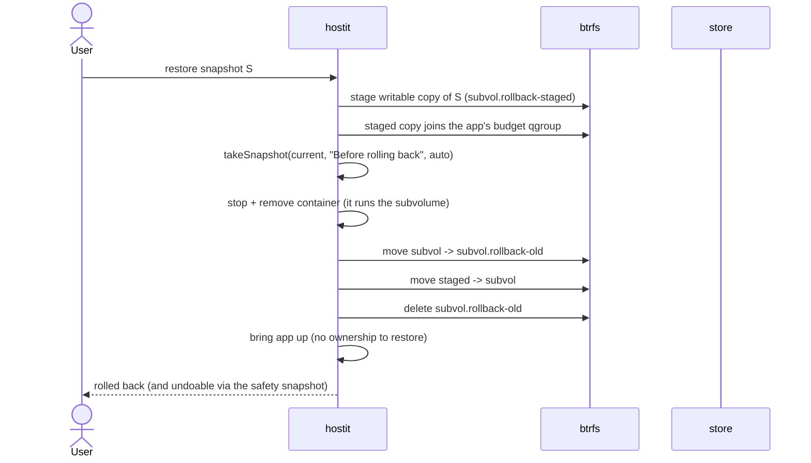

# Snapshots and rollback

## Description

A snapshot is an instant, space-shared, read-only copy of an app's entire
subvolume -- its files, `hostit.yml`, AND the installed software around them,
since the subvolume is the container's whole filesystem. hostit takes them
automatically -- every three hours by default, and once right before every
deploy -- and the
owner or an agent can take a labelled one at any time to mark "this is a good
state". The app page shows them as a timeline, newest first, with the reason for
each. Any snapshot can be restored: **rollback** replaces the live subvolume with
the snapshot's contents (data and installed packages come back together -- a
bricked rootfs from a bad `apt` run or deleted system files is restored the same
way as a bad file edit), and first takes a safety snapshot of the current state
so the rollback is itself undoable. Snapshots are also what `fork` seeds a new
app from.

Snapshots are built on btrfs, which hostit requires outright (the daemon refuses
to start without it).
Retention keeps history from growing without bound using a restic-style
grandfather-father-son policy, so old automatic snapshots are thinned out with
age while recent ones stay dense.

## Why it exists

Deploying, editing files over SSH, installing packages, or letting an agent
rewrite an app are all easy ways to break a working app. The intent is that there
is *always* a recent point to go back to, without the owner having to think about
it: the periodic plus pre-deploy automatic snapshots give a floor, and manual labelled
snapshots give agents and owners a way to bookmark known-good states before a
risky change. Because a snapshot covers the whole subvolume, "risky change" now
includes system-level ones: an `apt-get` upgrade that breaks the app rolls back
the same way a bad code change does.

btrfs makes this cheap enough to do constantly: a snapshot is a copy-on-write
subvolume, so it shares storage with the live subvolume and costs almost nothing
until they diverge. That is why the pre-deploy snapshot can be unconditional.

Rollback is written to be crash-safe: it must never leave an app without a
subvolume. The replacement is staged beside the live one first, a safety snapshot
is taken, and only then is the swap done by moving subvolumes -- with the old one
moved aside (not deleted) until the new one is confirmed in place, so any failure
can put the original back.

Retention exists so that constant automatic snapshotting does not fill the disk;
it applies to manual snapshots too, so nothing lives forever (a documented
tradeoff -- a very old manual bookmark can eventually be pruned).

## User flows

Automatic (no user action):
- Before every deploy, `up` takes a pre-deploy snapshot (best effort; a failure
  never blocks the deploy).
- An ARCHIVED app takes no new snapshots -- on demand or from the sweep; the
  refusal comes from `routingAgent.routeRunnable` (it cannot change anyway) and its history is
  kept under `retention.Archived` -- monthly rollups for a year, plus the newest
  snapshot as a floor, so the archive thins but never empties. See
  `control/archive.go`.
- A loop snapshots each app on its own cadence (`snapshot.interval` in the
  app's hostit.yml, else three hours), staggered so the fleet does not move as
  one; see `control/snapshotsched.go`.

Manual and rollback:
1. Owner/agent takes a snapshot (Snapshots tab "Take snapshot",
   `POST /api/apps/{app}/snapshots {"label": "before rewrite"}`, or the CLI).
2. hostit runs the optional `snapshot.pre` hook (aborting if it fails, so a torn
   state is never captured), creates a read-only btrfs snapshot of the app
   subvolume, records it, runs `snapshot.post` (best effort), and prunes per
   retention.
3. To roll back, the owner/agent picks a snapshot and restores it; hostit stages
   the target, takes a safety snapshot, powers the container down, swaps the
   subvolume in, and brings the app back up (the staged copy
   joined the app's disk budget at stage time).

## Technical details

Core logic in the `snapshot/` service (`snapshot/service.go`), bound to the
`control.Manager` through the small `snapshot.Host` interface (`node/machine_snapshot.go`):

- `Service.TakeSnapshot` / `takeSnapshot`: runs `snapshot.pre` (aborts on
  non-zero exit), makes the read-only subvolume via
  `btrfs.Snapshot(appSubvolume, path, true)` -- the whole app subvolume, files
  and installed software alike -- joins it to the app's disk budget qgroup
  (`Host.AssignBudget`; under exclusive accounting it only costs budget as it
  diverges), records a `store.Snapshot`, runs `snapshot.post`, then
  `pruneSnapshots`. `snapshotID` builds a sortable id from the timestamp plus a
  short random suffix.
- `Service.Rollback`: the staged/safety/swap sequence described above, using
  `rollbackStagedSuffix` / `rollbackOldSuffix`, `btrfs.MoveSubvolume`, and
  `systemd.DisableNow` / `container.RemoveForce` to power the container down --
  the subvolume being swapped IS the container's rootfs, so nothing may run it
  during the swap. The staged copy joins the budget group before the swap, and
  qgroup membership survives the rename, so there is no quota to restore
  afterwards. It holds the per-app lock and skips the pre-deploy snapshot on the
  way back up (it already took a safety snapshot).
- `Service.DeleteSnapshot`: removes the subvolume then the record (never orphan
  a subvolume).
- Control side (`control/snapshot.go`): `Manager.AutoSnapshotLoop` sweeps
  each due app through the node agent (started from
  `cmd/control/serve.go` in both fused and split mode);
  `Manager.PruneSnapshots` applies `retention.Apply` to the registry rows and
  commands `DeleteSnapshot` for what falls outside -- after the sweep
  and after every manual take and rollback.
- Labels for unattended snapshots: "Automated snapshot" and
  "Automated snapshot before deploy".

Pre-deploy trigger: the node's up path (`node/machine_deploy.go`) calls the
snapshot service's `PreDeploySnapshot` (best effort) before applying the new
config -- node-originated, but only ever while executing a deploy control
commanded.

Retention (`retention/retention.go`, pure logic, no I/O):

- `retention.Policy` is grandfather-father-son: keep the newest `Last`, plus the
  newest in each of the last `Daily` days, `Weekly` ISO weeks, and `Monthly`
  months. `retention.Default = {Last: 50, Daily: 7, Weekly: 4, Monthly: 3}`.
- `retention.Apply` sorts newest-first (deterministic on ties by id), marks the
  keep set via `markBuckets` over `dayBucket`/`weekBucket`/`monthBucket` (UTC),
  and returns `(keep, prune)`. Every snapshot -- manual and automatic -- is
  subject to it.

Data model (`store/snapshot.go`, `store/types.go:Snapshot`): id, app name, label,
created-at, and `Auto`. `store.Snapshots` returns them newest first;
`AddSnapshot` / `DeleteSnapshot` / `Snapshot` round it out. `retention.Snapshot`
is the I/O-free mirror, bridged by `snapshot/service.go:toRetentionSnaps`.

HTTP surface:

- Agent/API (token): `control/server_handler_snapshots.go` -
  `handleAgentSnapshotList`, `handleAgentSnapshotTake` (manual, `auto=false`),
  `handleAgentRestore` (rollback), `handleAgentSnapshotDelete`; routed in
  `control/api.go` under `/api/apps/{app}/snapshots`. `writeSnapshotError` maps
  an unknown snapshot id to 404.
- The `/info` guide (`control/server_handler_agent.go:agentGuide`) explicitly
  tells agents to snapshot at intervals with a one-line reason, noting the
  automatic snapshots are coarse.
- The built-in assistant takes a snapshot per turn via
  `control/assistantops.go` (`o.apps.TakeSnapshot(..., false)`).
- Fork seeds a new app's subvolume from a snapshot subvolume
  (`control/server_handler_apps.go:handleAppsFork` -> `control.Manager.Fork`).

## Other notes

- Everything is btrfs-built, and btrfs is mandatory: the startup preflight refuses
  a non-btrfs apps directory (`cmd/preflight.go:requireBtrfs`).
- Snapshots are members of the app's disk budget qgroup, so a churning app pays for
  its retention history -- but under exclusive accounting a snapshot only costs
  budget for data that has since diverged from the live subvolume. See
  [quotas-limits.md](quotas-limits.md).
- The safety snapshot taken before a rollback is itself `auto`, so retention will
  eventually prune it; it is labelled "Before rolling back to snapshot <id>".
- Rollback stops and removes the container (the subvolume being swapped is its
  rootfs, so nothing may run it). There is no ownership to restore afterwards:
  app trees are root-owned and idmap-mounted, and snapshots carry that
  root-owned tree with them. The disk cap needs no
  restoring either, since it lives on the app's budget qgroup, which the staged
  copy joined.
- Snapshot ids are second-precision plus a random suffix, so multiple snapshots in
  the same second do not collide and still sort chronologically.
- `snapshot.pre` / `snapshot.post` hooks come from `hostit.yml`; a failing `pre`
  hook aborts the snapshot, a failing `post` hook only logs.
- Related features: `deploy.md` (pre-deploy snapshot), `fork.md` (snapshot as a
  seed), `quotas-limits.md` (snapshots count toward the app's disk budget), and
  the web `web-dashboard.md` Snapshots tab.
- Known sharp edge worth noting: retention applies to manual snapshots too, so a
  long-lived manual bookmark is not guaranteed to survive forever.
