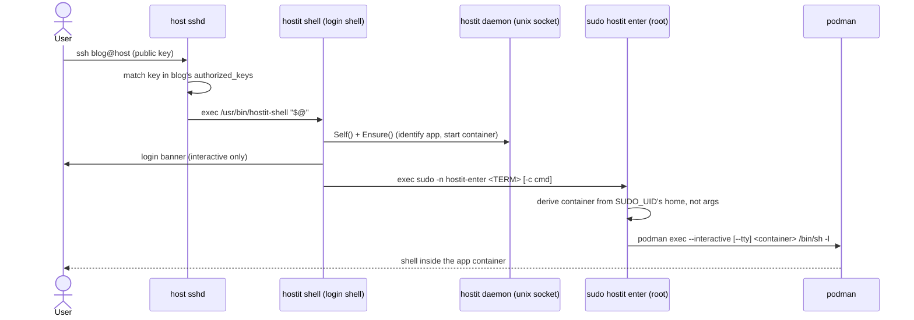

# SSH access

## Description

Every hostit app is reachable over plain SSH using the app's name as the
username, e.g. `ssh blog@apps.example.com`. There is no separate hostit account
to make: the host's own `sshd` authenticates the session against the app user's
`authorized_keys`, and the login lands the caller *inside the app's container* --
their own filesystem, processes and ports, with `root` in there. The same login
carries `scp`, `sftp` and `rsync`, so an owner (or their agent) can copy files
straight into the app's home with ordinary tools and no hostit-specific client.

Keys come from two places, both managed without touching the server by hand: the
owner's **profile keys** (added on the Profile page or via the API, they open
*all* of that owner's apps) and per-app **request keys** (supplied when the app
is created or via `PUT /api/apps/{name}/keys`). An app created with no keys at
all is still fully usable through the REST API; SSH simply starts working the
moment a key is added.

## Why it exists

The design goal is that an app *is* a small Unix machine you can SSH into, not a
PaaS abstraction you push to. Landing directly in the container (rather than a
host shell or a restricted menu) means the toolchains, `apt`, the app's ports and
its files are all right there, which is what both humans and coding agents expect.

Doing this on top of the host's stock `sshd` (instead of an embedded SSH server)
keeps hostit out of the credential-handling and crypto business: key
distribution is the only thing hostit owns, and it owns it by writing a managed
block into each app user's `authorized_keys`. Two boundaries make that safe. The
managed block is delimited by markers so a key someone `scp`'d in by hand
survives every profile change hostit makes. And every write into the app's home
goes through chained `os.OpenRoot` handles (the app's subvolume root, then
`home/app` resolved inside it), because the app user owns that whole tree; a
tenant who replaced `.ssh` -- or `home/app` itself -- with a symlink must not be
able to redirect the root daemon's key writes (or its `chown`) onto a host path.

The one thing `sshd` offers that would reach *past* the container is forwarding.
An app user logs in for exactly one reason -- to reach their own container -- so
all forwarding is turned off for the apps group; otherwise a tenant could tunnel
to the cloud metadata service (which on DigitalOcean carries `user-data`, often
secrets) or probe another app's loopback port. `scp`/`sftp`/`rsync` are
deliberately unaffected.

## User flows

1. The owner adds an SSH public key on the Profile page (or `POST
   /api/account/keys`, or `-k key.pub` when creating an app via the CLI).
2. hostit writes/merges that key into the `authorized_keys` of every app the
   owner owns.
3. The owner runs `ssh <app>@<ssh-host>`. The host `sshd` authenticates the key,
   and because the app user's login shell is `hostit-shell`, the session is
   handed to hostit rather than to a shell.
4. hostit identifies which app this is, ensures the container is running,
   prints a banner (only for an interactive human, never for `scp`/`rsync`),
   and `exec`s the caller into the app's container via a narrow sudo grant.
5. `scp`, `sftp` and `rsync` use the very same login; they see only their own
   protocol on the wire (no banner) and read/write the app's home.

## Technical details

Key management (the daemon side):

- `ssh/service.go:Service.WriteAuthorizedKeys` resolves the app user's uid/gid
  and writes through the chained files root the caller hands it
  (`app/service.go:writeKeysIn` opens it via `homefs.Service.OpenRoot`); it
  refuses if `.ssh` is not a real directory (`ssh/service.go:ErrNotDirectory`)
  and `Lchown`s the results back to the app user.
- `ssh/keys.go:MergeAuthorizedKeys` rewrites only the delimited managed block
  (`managedBeginMarker`/`managedEndMarker`), preserving hand-added keys;
  `ssh/keys.go:keyMaterial` compares type+key so the same key with a different
  comment is deduped.
- `ssh/service.go:ValidateKeys` (wrapped by `app/util.go:validateKeys`) rejects
  unparseable keys before anything is written.
- The full key set for an app is app keys plus the owner's profile keys:
  `app/service.go:Manager.create` composes `sshKeys` and calls
  `WriteAuthorizedKeys`; `app/service.go:Manager.SyncKeys` /
  `Manager.writeKeys` rewrite it when profile keys change; `systemOps`
  delegates to the ssh service in `app/system.go:systemOps.WriteAuthorizedKeys`.
- Profile keys live on the user: `store/userkey.go`, exposed through
  `user/service.go:Manager.AddKey` / `Manager.KeyStrings`, and pushed to every
  owned app by `server/server_handler_account.go:Server.syncUserAppKeys` when a
  key is added or deleted.
- The create/set-keys HTTP surface is
  `server/server_handler_apps.go:handleAppsCreate` (profile keys via
  `s.users.KeyStrings`, request keys from `apiCreateAppRequest.SSHKeys`) and
  `handleAppsSetKeys`; the request shapes are in `server/types.go`
  (`SSHKeys []string`).

The login path (what happens on connect):

- The app user is created with `hostit-shell` as its login shell and membership
  in the `hostit-apps` group: `unixuser/service.go:Service.Create` /
  `createUserArgs`.
- `hostit-shell` is a one-line wrapper that `exec`s `hostit shell`
  (`cmd/shell.go:cmdShell` / `execShell`). It skips flag parsing so `sshd`'s
  `-c <command>` is passed through untouched, ensures the container is up via
  `appctl` (`ctl.Self()` / `ctl.Ensure()`), prints `loginBanner` only when
  `isTerminal(os.Stdin)` and there is no forced command, then `exec`s
  `sudo -n /usr/bin/hostit-enter <TERM> [args...]`.
- `hostit-enter` (`cmd/enter.go:cmdEnter` / `execEnter`) is the privileged half.
  It must run as root, derives the caller from `SUDO_UID` (never from
  arguments), and resolves the target container from the caller's *home
  directory path* via `containerKeyFromHome` (`app.IDFromHomeDir` digs the id
  out of `apps/<id>/home/app`) -- containers are keyed on the app's stable id,
  and the app user's home is the id-keyed path, so a rename
  never changes it. It builds the `podman exec` argv itself, passing only a
  validated `TERM` and an optional single `-c` command, and runs with
  `minimalEnv()` (the caller's environment is not inherited).
- The sudo grant is `hostit.sudoers`: `%hostit-apps ALL=(root) NOPASSWD:
  /usr/bin/hostit-enter` -- one root-owned helper that ignores its args when
  choosing the target, so a member of the group can only ever reach their own
  app.

sshd forwarding hardening:

- `deploy/ansible/roles/hostit/templates/sshd-hostit-apps.conf.j2` emits a
  `Match Group hostit-apps` block that sets `AllowTcpForwarding no`,
  `AllowStreamLocalForwarding no`, `AllowAgentForwarding no`, `X11Forwarding
  no`, `PermitTunnel no`, `GatewayPorts no`, `PermitUserRC no`, then `Match all`
  to reset the context (the file is included at the top of `sshd_config`). The
  README documents the same block for hand installs.

## Other notes

- The SSH host reported to clients is `config/config.go:Config.SSHHostname`
  (`ssh-host`, defaulting to the base domain); it is what the app page and the
  agent `/info` response print as the ready-made `ssh <app>@<host>` command
  (`server/server_handler_agent.go:handleAgentAppInfo`, `apiSSHInfo`).
- hostit never generates a key pair; an app with no keys is API-only until a key
  is added. This is intentional (no private key to hand out or store).
- Whether SSH is usable at all is a property of the owner's profile, not the app,
  so the app page shows a "add a key to your profile first" state when there are
  none (`web/src/pages/AppDetail.jsx`).
- Per-app request keys are stored separately (`store.SetAppKeys` /
  `AppKeys`) and merged ahead of profile keys, so an app can have extra keys the
  owner's profile does not carry.
- Because the container is entered per the caller's own uid (container root maps
  to the app's unprivileged uid), an escape lands on that uid, not host root; see
  the README security model. Related features: `custom-domains.md` (how the app
  is reached over HTTP), `terminal.md` (the same login shell over a WebSocket),
  and `rest-api.md` (the file endpoints that avoid SSH entirely).
- Known sharp edge: `writeAuthorizedKeysIn` refuses a non-directory `.ssh`
  rather than clobbering it, so a tenant who turns `.ssh` into a file blocks
  their own managed-key updates until it is removed.
