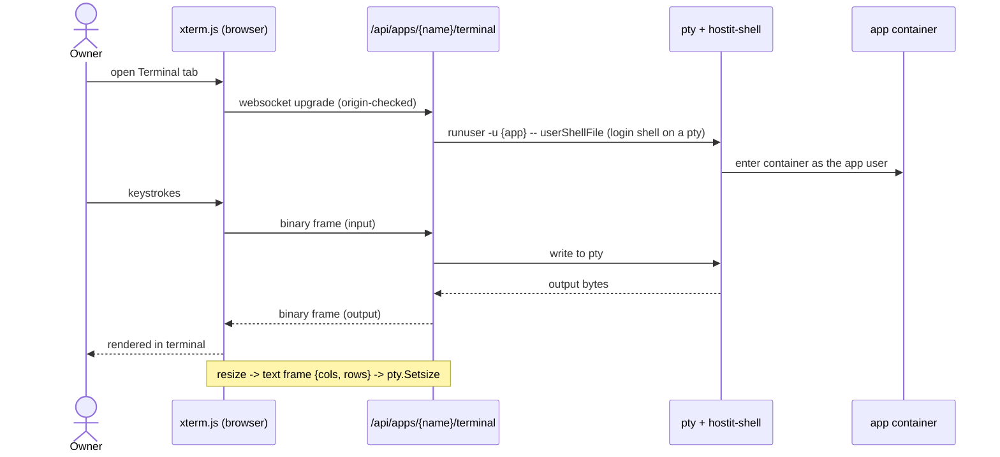

# In-browser terminal

## Description

The workspace has a real terminal, in the browser, connected to a live shell
inside the app's container. It is the same login shell an SSH session gets --
same banner, same colours, same prompt, running as the app's own user -- so an
owner can install a package, poke at a file, run a one-off command, or debug a
crash without leaving the page or setting up SSH keys.

It appears two ways: a Terminal tab in the app workspace (embedded inline,
sharing the page with the live preview and the editor), and a floating,
draggable panel that deliberately does not dim the page behind it so the preview
stays visible. It can be popped out into its own full-window tab, resized, and
put fullscreen. The window stays mounted while minimized, so the shell keeps
running. There is also a shortcut into SSH for owners who prefer their own
terminal.

## Why it exists

The terminal completes the "manage the whole app from a browser" story: some
things (installing a dependency, inspecting a running process, reading a file the
app wrote) are just faster in a shell, and not every owner wants to configure SSH
on the device they happen to be holding.

Design decisions worth recording:

- **It is byte-for-byte an SSH session.** The server runs the app's login shell
  through the same `hostit-shell` entry point SSH uses, on a pty, rather than a
  bespoke `podman exec`. That means one code path to reason about and identical
  behaviour (banner, `TERM`, colours, container entry) whether you connect over
  the web or over SSH.
- **Owner-only, and origin-locked.** The websocket upgrade is refused unless the
  request comes from one of hostit's own web origins, so another site -- even a
  tenant's own app page -- cannot open a shell on a signed-in owner's behalf.
- **Bounded.** A single session is capped at 60 minutes and a single websocket
  message at 64 KB, so a tab left open forever does not pin a shell (and a podman
  exec) on the host indefinitely, and a client bug cannot flood the pty.

## User flows

1. The owner opens the app and selects the Terminal tab (or the floating shell
   from the app actions).
2. The browser opens a websocket to `/api/apps/{name}/terminal`. The server
   resolves the owned app, starts the app's login shell on a pty, and bridges it
   to the socket.
3. The owner types; keystrokes go to the pty as binary frames, output comes back
   as binary frames and is written to the xterm.js terminal. Resizing the window
   sends a text frame with the new cols/rows, which the server maps onto the pty.
4. The session ends when the owner closes it, the 60-minute cap hits, or the
   server ends it (a reboot/poweroff kills the container); the terminal prints
   `[session closed]` and the page reflects it.

## Technical details

**Server.** `server/server_handler_terminal.go:handleTerminal` is the whole
backend. It is registered under `requireActive` and resolves an owned app
(`s.ownedApp`), so only the owner or an admin reaches it. It gets the shell
command from `app/exec.go:TerminalCommand`, which returns
`runuser -u {app} -- {userShellFile}` -- the app's login shell through
`hostit-shell`, identical to SSH (`runuser` drops from the root daemon to the app
user so the daemon socket sees the right peercred identity, just as `sshd`
would).

The websocket is accepted with `github.com/coder/websocket`, restricting
`OriginPatterns` to `s.config.WebHostnames()` (the origin lock). The shell is
started on a pty (`github.com/creack/pty`) with `TERM=xterm-256color`. Two
pumps bridge it: a goroutine copies pty output to the socket as
`MessageBinary`, and the main loop reads the socket -- a `MessageText` frame is
a `{cols, rows}` resize applied with `pty.Setsize`, a binary frame is input
written to the pty. Bounds: `terminalMaxDuration` (60m, via a context timeout)
and `terminalReadLimit` (64 KB, via `conn.SetReadLimit`). On any read/write
error either side, the handler tears down: it closes the pty and kills the
process.

**Frontend.** `web/src/pages/AppTerminal.jsx` renders the xterm.js terminal
(`@xterm/xterm` + `@xterm/addon-fit`). It opens
`wss://<host>/api/apps/{name}/terminal`, wires `term.onData` to send input,
`ws.onmessage` to write output, and a `FitAddon` + `ResizeObserver` +
`window.resize`/`fullscreenchange` listeners to refit and send the size on any
change. It renders in several shapes (`embedded` inline in the workspace,
`fullPage` overlay, or a floating draggable panel), pops out to
`/app/{name}/terminal`, and distinguishes an intentional close from a
server-ended session (`closingRef`) so the page can show a session that ended on
its own (e.g. a reboot).

**Wiring in the workspace.** `web/src/pages/AppDetail.jsx` mounts the terminal in
the Terminal view (`embedded active={view === "terminal"}`) and keeps it mounted
while other views are active, so the shell survives tab switches; it also manages
the floating/minimized web-shell open/close state (`openWebShell`,
`closeTerminal`).

## Other notes

- **Not exposed to app-scoped tokens.** The terminal is a cookie/owner
  interactive feature; it is not part of the agent REST API. Agents run commands
  via `POST /api/apps/{app}/run` instead (bounded, non-interactive).
- **A reboot/poweroff ends the session** because it replaces the container; the
  terminal reports `[session closed]` and the workspace clears the live-session
  state.
- **Resize is best-effort:** a `Setsize` failure is ignored; input/output errors
  end the session cleanly.
- **Related features.** `ssh-access.md` (the same login shell over SSH; the
  terminal has an "connect via SSH" shortcut), `browser-workspace.md` (the
  terminal is one workspace view), `bring-your-own-agent.md` (`/run` for
  non-interactive command execution).
