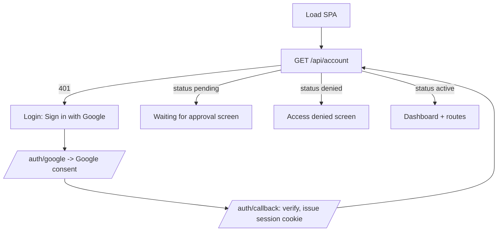

# Web dashboard

## Description

The dashboard is a single-page React app served by the hostit binary at the web
hostname. After signing in with Google, an owner sees a grid of their apps (live
status, CPU/RAM/disk bars, description, and a link to open each), can create a new
app from a dialog, and can open any app into its **workspace** -- a full-page view
with tabs for the built-in Assistant, a file editor with live preview, a terminal,
snapshots, logs, and a settings/overview area (URLs, SSH command, API token,
custom domains, rename, delete). There is a Profile page for the owner's SSH keys
and account API tokens, and, for admins, an Admin page to manage users, sign-up
approval, and global limits.

Login is Google OAuth. For testing and recovery there is also a "breakglass"
login that mints a normal session using the operator's admin token, with no
Google round-trip.

## Why it exists

hostit is usable entirely over SSH and the API, but the dashboard is what makes it
approachable: it turns "read the guide, craft curl calls" into a click, and it is
where the built-in assistant, the live preview, and the at-a-glance fleet view
live. It is a personal view -- each owner sees their own apps and their own usage
next to their limits -- which is why even an admin's app list is not silently
widened with other people's apps.

The SPA is deliberately thin: it holds no privileged logic, only calls the same
`/api` surface everything else uses, and authenticates with a session cookie
guarded against cross-site use (apps are subdomains of the web app, so the cookie
carries the `__Host-` prefix and writes require a same-origin signal). Breakglass
exists because driving the UI as a real user is invaluable for e2e testing and
recovery, and it grants nothing new -- the admin token already has full API
rights -- so it is safe to gate behind that same token and an opt-in flag.

## User flows

Login and gating (`web/src/App.jsx`):

Everyday use:
1. Owner lands on the Dashboard (`/`), sees the apps grid and a usage counter
   ("N of M apps"), and clicks "New app" -> a dialog that previews the app's URL
   and SSH command, then `POST /api/apps`, then navigates to the new app.
2. Opening an app (`/app/:name`) shows the workspace: the assistant/editor/
   terminal/snapshots/logs tabs plus an overview with the app's URLs, SSH
   command, agent token, and custom-domain management.
3. Profile (`/profile`) manages SSH keys (which open all the owner's apps) and
   account-wide API tokens (shown once).
4. Admin (`/admin`, admins only) lists users with role/status/limits/assistant
   spend, invites users, manages approval domains, and sets global default
   limits.

## Technical details

Frontend (`web/src/`, embedded and served by `server/web.go`):

- `web/src/App.jsx`: top-level gate. `refreshAccount` calls `GET /api/account`;
  `account` is `undefined` (loading) / `null` (401 -> `Login`) / an object.
  `status` routes to `Pending` / `Denied` / the authed `BrowserRouter`. Routes:
  `/` -> `Dashboard`, `/app/:name` -> `AppDetail`, `/profile` -> `Profile`,
  `/admin` -> `Admin`. Two chrome-less paths render before the gate: `/docs`
  (shareable instance docs, `Docs.jsx`) and the popped-out terminal
  `/app/:name/terminal`.
- `Login` is a card with a "Sign in with Google" link to `/auth/google`.
- `web/src/pages/Dashboard.jsx`: `AppCard` (status pill, CPU/RAM/disk bars,
  prefers a verified custom domain for the link), `AppsSummary`, and the
  `NewAppDialog`; polls `GET /api/apps` on an interval and on reconnect.
- `web/src/pages/AppDetail.jsx`: the workspace. Tabs (`ws-viewtabs`): Assistant
  (only if `app.assistant_enabled`), Files, Terminal, Snapshots (only if
  `app.snapshots_enabled`), Logs, plus an overview/settings area with editable
  description, the agent API token, the SSH command, and custom-domain add/verify/
  remove (`/api/apps/{name}/domains...`). Tab code chunks are lazy-loaded and
  prefetched (`AppAssistant.jsx`, `AppEditor.jsx`, `AppTerminal.jsx`,
  `AppLogs.jsx`).
- `web/src/pages/Profile.jsx`: `SshKeys` (`/api/account/keys`) and `Tokens`
  (`/api/account/tokens`, new token shown once). Notes that each app also has its
  own token on its page.
- `web/src/pages/Admin.jsx`: users table (role/status/limits, assistant tokens
  and cost), invite, `AllowedDomains` (`/api/domains`), and global defaults
  (`/api/settings`). Renders "Not authorized" for non-admins.
- `web/src/api.js` is the fetch wrapper (`ApiError`); the SPA never holds
  privileged logic, it just calls `/api`.

Login backend (`server/server_handler_auth.go`, `server/auth.go`,
`server/session.go`):

- `handleGoogleLogin` sets a state cookie and redirects to Google's consent
  screen (`googleAuthURL`, scopes `openid email profile`).
- `handleGoogleCallback` verifies the state, exchanges the code
  (`exchangeGoogleCodeLive` -> token + userinfo), requires a verified email,
  calls `user.Manager.Login` (creates or finds the account), and issues a signed
  session cookie.
- `handleBreakglass` (`POST /auth/breakglass`): gated on `config.Breakglass`;
  requires the admin token; signs in an existing account by `?email=`, and will
  create one only for a configured admin email (the way a first Google login
  would). It grants nothing beyond what the admin token already has.
- `handleLogout` clears the session cookie.
- `session.go`: stateless HMAC-signed cookies (`<userID>|<expiry>|<hmac>`),
  30-day TTL, not individually revocable before expiry. `cookie` /
  `cookieName` add `HttpOnly`, `Secure` (when TLS is on), `SameSite=Lax`, and the
  `__Host-` prefix; `checkSameOrigin` blocks cross-site cookie writes.

Routing to the SPA: `server/proxy.go:newProxyHandler` sends requests on the web
hostname to `s.api`, whose fallthrough handler (`server/api.go`) serves the
embedded SPA (`server/web.go:webHandler`) for any non-`/api` path.

## Other notes

- The Google login handlers return 501 when web login is not configured
  (`config.WebEnabled`), so an API-only instance still runs.
- The dashboard is a *personal* view: `listedApps` returns the caller's own apps
  unless `?all=true` and the caller is an admin
  (`server/server_handler_apps.go`), so another user's app appearing on the
  dashboard would be a bug, not a privilege.
- Pending/denied accounts can still call `GET /api/account` (it is
  authenticated-only, not active-only), which is how the SPA shows the "waiting
  for approval" and "denied" screens.
- Breakglass is the documented way to drive the UI in e2e tests without Google
  OAuth; it is off unless the `breakglass` config flag is set.
- Sessions cannot be revoked before their 30-day expiry (stateless by design); a
  deleted/denied user is still stopped because API calls re-check status per
  request via the token/user lookup.
- Related features: `accounts-roles.md` (roles, approval, invites),
  `rest-api.md` (everything the SPA calls), `builtin-assistant.md`,
  `browser-workspace.md`, `terminal.md`, `logs.md`, `snapshots-rollback.md`,
  `custom-domains.md`, `ssh-access.md`.
