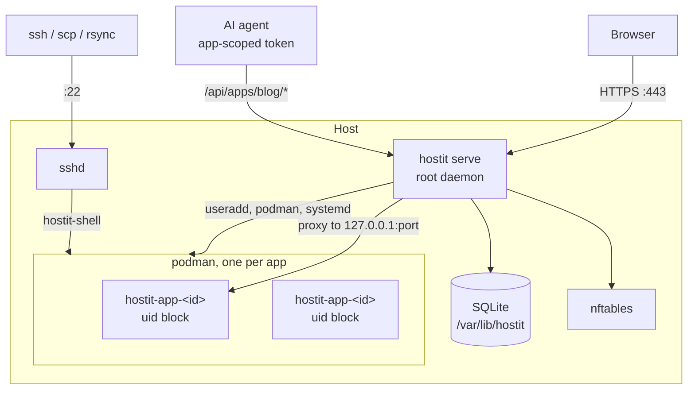
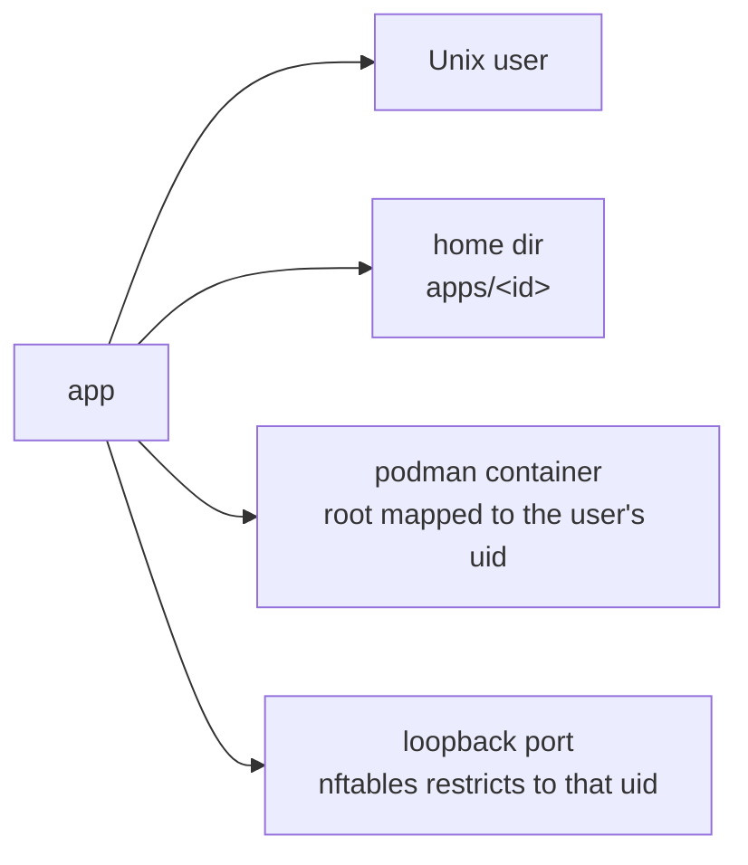
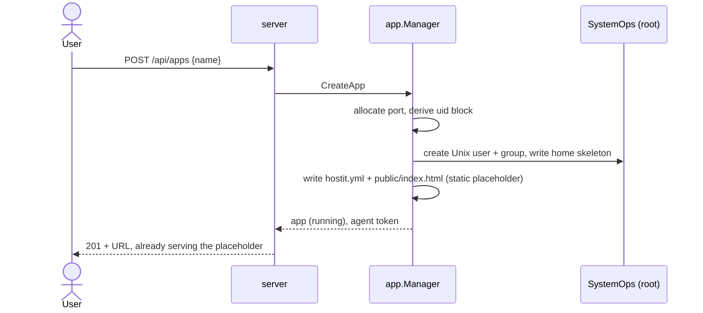
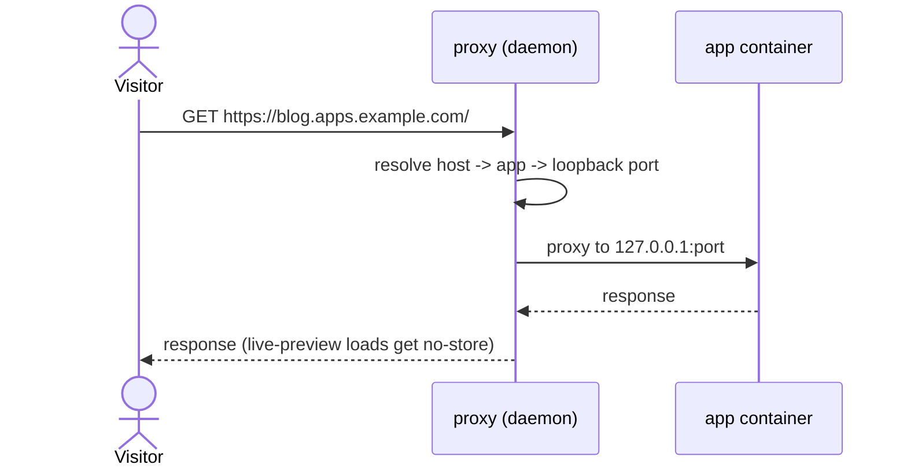
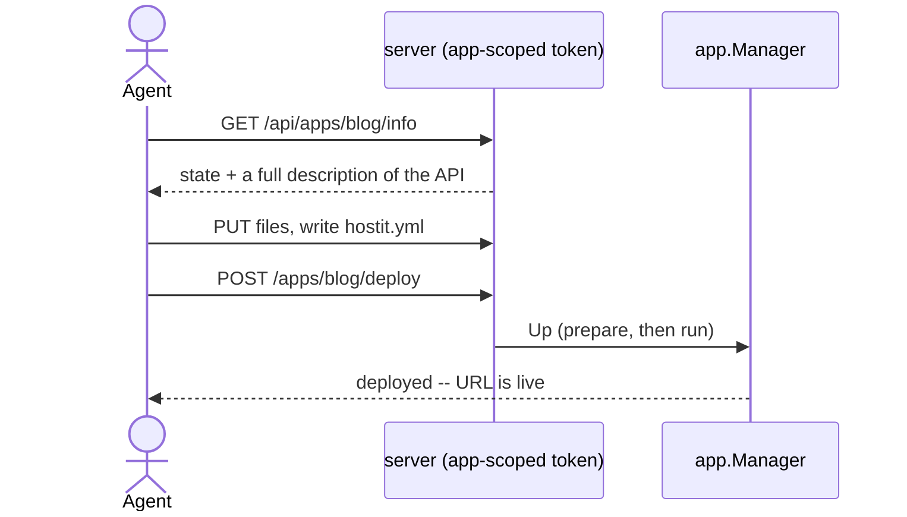
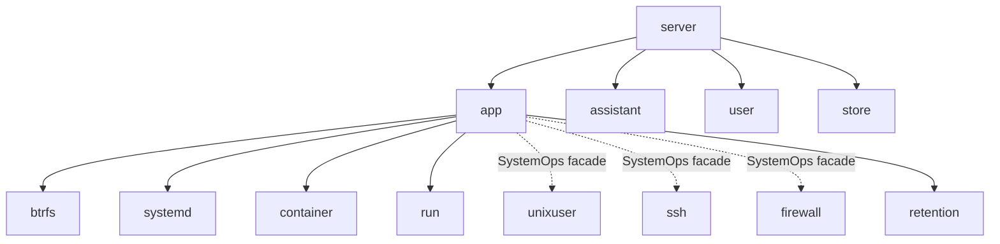
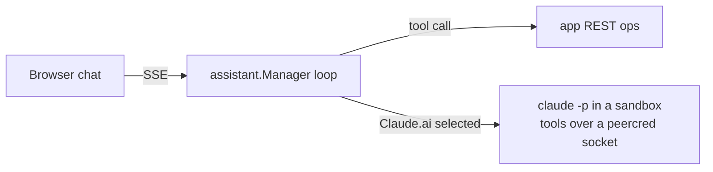

# hostit

A tiny self-hosted mini-app platform, driven by AI agents (or humans) over SSH and
a REST API.

**One binary.** Each app gets its own container, a subdomain with HTTPS, SSH access,
and an API an agent can drive.

<div class="pt-8 text-sm opacity-70">
A code walkthrough. Source of truth: <code>docs/internal/</code>.
</div>

---

## What we'll cover

1. **What you get** -- one binary, one container per app, a subdomain, an API
2. **Isolation** -- what stops an app escaping to the host or to another app
3. **The flows** -- creating an app, serving a request, an agent deploying
4. **The code map** -- `app.Manager` and the service packages behind it
5. **The subsystems** -- btrfs storage, the built-in assistant, build and preflight

<div class="pt-8 text-sm opacity-70">
Each section maps to a folder under <code>docs/internal/</code>; the last slide has the links.
</div>

---

## What you get, per app

- Its **own container** -- SSH lands inside it (root in there, `apt install` away); other
  apps are invisible (processes, files, network, loopback ports).
- **SSH / scp / sftp / rsync** via the host's sshd; keys via the API.
- A **subdomain** `myapp.apps.example.com` with automatic Let's Encrypt TLS.
- Two ways to run: `mode: static` (serve `public/`) or `mode: app` (your command,
  supervised).
- A workspace: an in-browser AI assistant, a file editor with live preview, a
  terminal, snapshots, logs.

The point: "create an app on my host and deploy this" is one API call plus a token.

---

## The whole thing: one binary as the control plane

One process, running as root, terminates TLS, proxies, serves the web app + REST API,
and creates the Unix users and containers behind the apps.



<div class="text-sm opacity-70">See <code>architecture/overview.md</code>.</div>

---

## An app is four things, created together



Durable resources key on a stable opaque **id**, not the name. So a rename is
`usermod -l` + one DB update: no data move, no container recreate.

<div class="text-sm opacity-70">See <code>subsystems/app-identity.md</code>.</div>

---

## Isolation: what stops an app escaping

| Boundary | Mechanism |
|---|---|
| App vs app | separate Unix users, containers, network namespaces; nftables pins each port to its uid |
| App vs host | SSH execs into the container (no host shell); container root is the app's unprivileged uid |
| App files vs daemon | every file op in the home goes through `os.OpenRoot` -- a symlink out is refused by the kernel |
| Tenant vs web app | `__Host-` session cookie + same-origin check; files are always downloads, never rendered |

The daemon is the trusted control plane and legitimately runs as root.

<div class="text-sm opacity-70">See <code>subsystems/security-isolation.md</code>.</div>

---

## Flow: creating an app



<div class="text-sm opacity-70">See <code>architecture/flows.md</code>.</div>

---

## Flow: serving a request



An unknown host, or a stopped app, gets the same "Nothing deployed here" page (so
names cannot be enumerated).

---

## Flow: an agent deploying



The app-scoped token only reaches `/api/apps/blog/*`. That URL shape is the
permission.

<div class="text-sm opacity-70">See <code>features/bring-your-own-agent.md</code>, <code>features/rest-api.md</code>.</div>

---

## The code map



`app.Manager` decides *what* an app needs and delegates the *how* to the service that
owns each tool. That split is the seam a future control/app-node split would use.

<div class="text-sm opacity-70">See <code>architecture/code-map.md</code>.</div>

---

## Service packages and the test seam

Each service is scoped to one tool or API, with its primary type in `service.go`,
built on the shared `run.Runner`:

```go
// app.Manager composes them
type Manager struct {
    ops       SystemOps         // useradd, nftables, ... (root)
    btrfs     *btrfs.Service    // subvolumes, snapshots, quotas
    systemd   *systemd.Service  // per-app units
    container *container.Service// podman
    // ...
}
```

`SystemOps` + `run.Runner` let the Manager be built and tested **without root** (a fake
ops in tests, `apptest.NopSystemOps` for other packages). Same seam the multinode plan
remotes.

<div class="text-sm opacity-70">See <code>subsystems/seams-and-testing.md</code>.</div>

---

## btrfs storage (mandatory)

- Per-app home is a **btrfs subvolume**.
- **Snapshots** before every deploy and hourly; **rollback** stages a writable copy and
  swaps atomically, with a safety snapshot first.
- **Fork** seeds a new app from a reflink snapshot of another (near-instant, no copy).
- **Hard disk quotas** via qgroup (`EDQUOT` on overflow).
- Retention is a pure, tested GFS engine (`retention/`).

hostit **refuses to start** unless `apps-dir` is btrfs -- the startup preflight enforces
it (along with running as root and the required binaries).

<div class="text-sm opacity-70">See <code>subsystems/storage-btrfs.md</code>.</div>

---

## The built-in assistant

An Anthropic Messages loop whose **tools are the app's own REST operations** -- so the
model can only touch that one app.



A **credential's presence is the whole switch**: `anthropic-api-key` enables API models;
`claude-code-oauth-token` additionally offers "Claude.ai" (a Claude Max subscription,
run in a locked-down sandbox). No separate backend setting.

<div class="text-sm opacity-70">See <code>subsystems/assistant-internals.md</code>.</div>

---

## Building and starting

- Build: `make web` (React -> `server/site`, embedded) then `make build`.
- Release: goreleaser produces a single `.deb`; deploy with the example Ansible role
  (`deploy/ansible/`).
- On start, the daemon **preflights**: root + required binaries + btrfs, failing with one
  clear message naming what to fix.
- Upgrades reach an app's PID-1 agent only on restart (`RestartStaleAgents`), because the
  binary is bind-mounted.

<div class="text-sm opacity-70">See <code>subsystems/release-and-preflight.md</code>.</div>

---

## Where to look

- **The whole system:** `docs/internal/architecture/` (overview -> isolation -> flows -> code-map).
- **One feature:** `docs/internal/features/<name>.md` -- what it is, why, the flow, the code.
- **A tricky internal:** `docs/internal/subsystems/`.
- **Contributing:** `CONTRIBUTING.md` (TDD, style, build/test).

<div class="pt-10 text-2xl">
Questions live next to the code. Start at <code>architecture/overview.md</code>.
</div>
