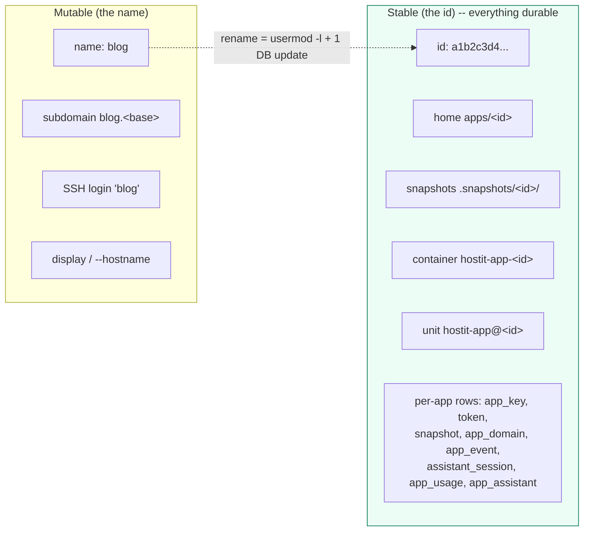

# App identity: the stable opaque id

An app has two names. One is the **human-facing name** (`blog`): the subdomain,
the SSH login, the display label. It is mutable -- an owner can rename an app. The
other is the **stable opaque id** (`store.NewAppID`, a random string): it is
minted once at creation, never changes, and is what every durable resource keys
on. That split is the entire reason a rename is cheap: it moves nothing.



## What keys on the id

The id is minted at create time and put on the `App` struct before anything is
built (`app/service.go:create`, `ID: store.NewAppID()`), specifically so the home
can be created id-named. From then on:

- **Home directory:** `apps/<id>` (`app/deploy.go:appHomeByID`, and `appHome`
  which resolves a name to its id first via `app/deploy.go:appID`).
- **Snapshots:** `apps/.snapshots/<id>/<snapshot-id>`
  (`app/btrfs.go:snapshotsRoot`, `snapshotPath`) -- keyed on the id like the home,
  so a rename does not move them.
- **Container:** `hostit-app-<id>` (`app/workspace.go:containerNameForID`).
- **systemd unit:** `hostit-app@<id>.service` (`app/workspace.go:unitNameForID`),
  the per-app instance of `hostit-app@.service`.
- **Per-app DB tables:** every one keys on `app_id` -- `app_key`, `token`,
  `assistant_session`, `snapshot`, `app_domain`, `app_event`, `app_usage`,
  `app_assistant` (see the migration that repointed them,
  `store/migrate.go`, the "Point every per-app table at app.id" step). The join
  key is the id; the name is looked up from the id, never stored as the join key.

The `containerHome` inside the container is a fixed path (`/home/app`), not the
app name (`app/workspace.go`), for the same reason: a rename never has to recreate
the container just to fix a mount path.

## A rename is `usermod -l` plus one DB update

Because everything durable keys on the id, a rename touches exactly two things:
the Unix login name, and the app row's `name` column. `app/rename.go:RenameApp`:

1. Validate the new name exactly as create does (charset, reserved words, not
   already taken).
2. Rename the Unix login: `SystemOps.RenameUser` -> `usermod --login`
   (`app/rename.go:renameUser`). **The uid and home are unchanged** -- this is the
   only OS mutation a rename needs (`app/service.go:SystemOps.RenameUser` doc).
3. Flip the name in the store in one transaction (`store/app.go:RenameApp`), which
   updates `app.name` and the `assistant_session` name mirror; **every other
   per-app table keys on `app_id` and needs no update.**
4. Carry the name-keyed in-memory caches over (`app/rename.go:renameCaches`:
   `memoryMB`, `diskMB`, `stateCache`). Everything else is id-keyed and needs no
   move.

No data move. No container recreate. The app keeps whatever state it built up (its
writable layer, installed packages), because the container is the same one -- it is
addressed by id, which did not change.

```mermaid
sequenceDiagram
    participant O as Owner
    participant M as app.Manager
    participant SD as systemd
    participant OS as usermod
    participant S as SQLite

    O->>M: RenameApp("blog", "journal")
    Note over M: unit is keyed on the (unchanged) id
    M->>SD: Stop hostit-app@&lt;id&gt; (if running)
    M->>OS: KillUserProcesses("blog")  (reap SSH/terminal leftovers)
    M->>OS: usermod --login journal blog   (uid + home unchanged)
    M->>S: UPDATE app SET name='journal' WHERE name='blog'
    M->>SD: Start hostit-app@&lt;id&gt; (same container)
    M-->>O: renamed
```

### The one wrinkle: stop and start around the rename

`usermod --login` refuses while any process runs as the user -- and the app's
container, plus any open web-terminal or SSH session, is exactly that. So a
running app is stopped around the rename and started again after
(`app/rename.go:RenameApp`):

- The unit is stopped first, not just the container killed: `hostit-app@.service`
  is `Restart=always`, so killing the container would let systemd bring it right
  back and re-block `usermod`.
- `KillUserProcesses` then force-kills whatever is left owned by the user
  (in-container `htop`/shell started via a web-terminal or SSH session; stopping
  the unit does not reliably reap those in time). It runs only after the unit is
  stopped, so it reaps session leftovers, not the app.
- `renameUser` retries briefly on "currently used by process" because stopping the
  container tears its sessions down asynchronously.

Stop/start reuses the same container, so no state is lost; it is a brief blip, not
a rebuild. Old `<name>.<base>` links stop resolving; the new one works on the next
request.

### The `--hostname` caveat

The container keeps the `--hostname` it was created with (`app/rename.go`, closing
comment): podman drops `CAP_SYS_ADMIN`, so a running container's hostname cannot
change without recreating it (which would lose the writable layer) or granting a
near-root capability. So the bare `hostname` command and the shell's `\h` prompt
show the old name until the next deploy recreates the container; the SSH login
banner shows the current name regardless (it comes from the daemon). This is why
`--hostname` is deliberately **excluded** from the container config hash
(`app/workspace.go:containerConfigHash`): it is cosmetic and derived from the
mutable name, and a rename must never force a recreate.

## How tokens follow a rename

An app's agent token is stored keyed on `app_id`
(`store/token.go`: `insertTokenQuery` resolves `app_id` from the name at insert
time via `COALESCE((SELECT id FROM app WHERE name = ?), '')`). Its display name is
resolved from the id on every read:

```sql
tokenName = COALESCE((SELECT name FROM app a WHERE a.id = token.app_id), token.app_name)
```

So after a rename the token keeps working (it was never bound to the name) and
shows the app's *current* name on the app page. Account-wide tokens carry an empty
`app_id`, which is how the account-wide meaning is preserved.

## How custom domains follow a rename

Custom domains are the same pattern (`store/domain.go`). `app_domain` keys on
`app_id`, and the app's current name is resolved from the id
(`domainName = COALESCE((SELECT name ... WHERE a.id = app_domain.app_id), app_domain.app_name)`).
The proxy's in-memory `host -> app` cache is built from `Store.ActiveDomains`,
which returns the id-resolved *current* name, so after a rename the domain routes
to the app under its new name with no domain-row rewrite. Each domain belongs to
exactly one app (PK = domain); the id binding survives whatever the app is called.

## The name mirror and cleanup

For one release the per-app tables keep a denormalized `app_name` mirror alongside
`app_id`, as a rollback safety net (`store/migrate.go`, the repoint migration).
Reads resolve through the id and fall back to the mirror only for rows not yet
backfilled; the `RenameApp` transaction keeps the `assistant_session` mirror
truthful so a later app reusing the freed name cannot collide with a stale row
(`store/app.go:renameAssistantMirrorQuery`).

Deletion and reconciliation also work by id: `store/app.go:RemoveApp` looks the app
up first so it knows the id, then cascades the per-app deletes by `app_id` (with a
name fallback), and `app/reconcile.go` matches leftover units, containers and home
directories to the registry by id (`known` is a set of ids; `idFromUnit`,
`reconcileContainers`, `reconcileHomes` all parse or compare ids). Backfill of
`app_id`/`image_tag` for pre-id rows happens in Go on startup, since SQL cannot
generate the ids.

## Why this design

Renaming used to mean moving a home, recreating a container (losing its writable
layer and installed packages), rewriting every per-app row, and re-keying
snapshots -- a heavy, risky operation for a cosmetic change. Keying durable state
on an opaque id makes a rename a metadata update: `usermod -l` plus one row. The
name is free to be a nice human label because nothing important depends on it
staying put. See `plans/260808-hostit-app-id-identity.md` for the original design.
