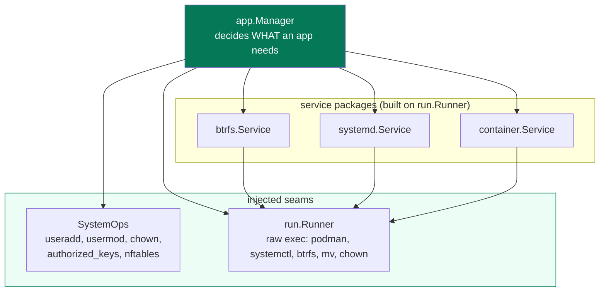

# Seams and testing

`app.Manager` is the orchestrator: it creates and deletes apps and everything
that belongs to them. Doing that for real means `useradd`, `podman`, `systemctl`,
`nft`, `btrfs`, `chown` -- all root, all touching the host. Yet `app.Manager` is
unit-tested without root and without a container runtime. That is possible because
every host interaction goes through one of two injected seams, and the same seams
are what a future control/app-node split would remote.

## The two seams

Everything `app.Manager` does to the host is reached through exactly two injected
dependencies (`app/service.go:NewManager`):

- **`SystemOps`** (`app/service.go:SystemOps`) -- the root-privileged operations
  that are not a simple command wrapper: `CreateUser`, `RenameUser`,
  `KillUserProcesses`, `DeleteUser`, `WriteAuthorizedKeys`, `WriteScaffold`,
  `ChownToUserIn`, `ApplyPortRules`, and the lookups. The real implementation
  (`app/system.go:systemOps`, from `NewSystemOps`) is a thin facade that composes
  the tool-scoped service packages `unixuser`, `ssh`, and `firewall`, converting
  app-level types at the boundary. It must run as root; `NewManager` takes it as an
  interface.

- **`run.Runner`** (`run/service.go:Runner`) -- the raw command runner every
  service package shells out through, defined once instead of redeclared in each.
  The real one (`rootRunner`) execs as the root daemon; `run.Nop` returns empty
  output and touches nothing.

The service packages themselves -- `btrfs`, `systemd`, `container` -- are each
scoped to one host tool and built on a `run.Runner` (`app/service.go:NewManager`
constructs them with the injected runner). So the entire host-touching surface of
`Manager` bottoms out in `SystemOps` plus `run.Runner`.

### The split it enforces: what vs how

The division is deliberate (`app/service.go` package doc): `app.Manager` decides
*what* an app needs (allocate a port, create a user with this uid, apply these
port rules, snapshot this home) and delegates the *how* to the service that owns
each tool. Keeping the services separable is the point.

## Testing without root

Because both seams are interfaces, a test builds a real `Manager` -- real
`config`, real SQLite store -- with fakes underneath:

- **`app/apptest.NopSystemOps`** (`app/apptest/apptest.go`) -- a no-op `SystemOps`
  for **cross-package** tests: anything outside the `app` package that needs a
  `Manager` but must not touch the host. It returns benign values
  (`LookupUID` -> 1001, `LookupIDs` -> a 65536-wide block) and does nothing else.
  `apptest.NewNopRunner` pairs it with `run.Nop`. These live in their own package,
  out of production code, so they are importable from other packages' tests without
  shipping test doubles in the binary.

- **`fakeSystemOps`** (`app/service_test.go`) -- a **recording** fake for the
  `app` package's own tests: it stores created/deleted/renamed users, written
  authorized_keys, scaffolds, uids, and the port-rule sets it was handed, so a test
  can assert *what the Manager asked the host to do* without a host. `newTestManager`
  (`app/service_test.go`) wires it with a temp-dir config, a temp SQLite store, and
  a fake runner, and hands back both the `Manager` and the `fakeSystemOps` so the
  test can inspect it.

The fake's mutex is not incidental (`fakeSystemOps.mu`): `CreateApp` starts the app
in a **background goroutine** (`app/service.go:create`, the `go func` calling
`Up`), so a test's assertions and the background start race on the recorded state
unless the fake guards it. This is a good example of the fakes mirroring the real
concurrency, not just the real signatures.

`run.Nop` (`run/service.go`) covers the service packages the same way: a `btrfs`,
`systemd`, or `container` `Service` built on `run.Nop` executes its logic
(argument assembly, output parsing) against a runner that runs nothing, so those
packages are testable in isolation too, and the pure `renderRuleset`
(`firewall/service.go`) / `parseQgroupReferencedMB` (`btrfs/service.go`) helpers
are split out precisely so the generated rules and parsed output can be tested
without invoking the tool at all.

## Why the same seam is the multi-node seam

The single-node daemon runs everything in one process, but the seam above already
separates **control-plane** work (the registry, TLS, host resolution, the reverse
proxy, the assistant) from **node-local** work (everything `Manager` reaches
through `SystemOps` and `run.Runner`, plus the direct `os.OpenRoot` file layer and
the btrfs syscalls). The node-local half is exactly what touches a specific
machine's filesystem, kernel, and container runtime -- and it already forms a
coherent unit that owns the uid, home, container, and port together.

The multi-node design (`plans/260807-hostit-multinode.md`) promotes that unit to a
`NodeAgent` interface with two implementations:

- **`localNodeAgent`** -- today's in-process code, unchanged. A single-box install
  holds one `NodeAgent` whose implementation is local, and every call is a direct
  Go method call: zero network, zero serialization, no behaviour change. "Runs
  anywhere" and "zero-overhead single host" fall out for free.
- **`remoteNodeAgent`** -- an HTTP+JSON client to a `hostit-agent` on another
  machine, same interface, different transport.

Two things about *why the seam is drawn where it is* are worth carrying forward,
because they constrain any refactor here (`plans/260807-hostit-multinode.md`, "Why
node-local work cannot simply be remoted"):

- **`os.OpenRoot`'s containment is a property of the real path on the real
  machine.** It is the kernel refusing to follow a symlink out of an opened root; a
  "remote open" over a wire is just a string the caller trusts the node to have
  honoured. So the file layer (`app/files.go`) has to move *whole* to the node -- it
  cannot be a remote pipe threaded through the middle of the Manager. See
  [security-isolation.md](security-isolation.md).
- **btrfs snapshots and qgroups, and podman, are local syscalls/operations** where
  the filesystem and container are. There is nothing to "call remotely"; the
  operation *is* the local filesystem or the local container runtime.

That is why the design moves the whole node-local half behind one interface rather
than giving `Manager` a `Runner` that SSHes out: the seam is already in the right
place. The unit-test fakes and the future `remoteNodeAgent` are the same
substitution applied for two different reasons -- a test that must not touch *this*
host, and a proxy that must reach *another* one.

## Practical guidance

- New host interaction from `Manager`? Route it through `SystemOps` (if it is a
  privileged, non-trivial operation) or a service package on `run.Runner` (if it is
  a command wrapper). Do not exec directly from `Manager`; that breaks both the
  tests and the future remote path.
- New service package? Give it a small `Service` in `service.go` over a
  `run.Runner`, keep path/naming policy in the caller (as `container` and `btrfs`
  do), and split any pure formatting/parsing into a testable helper.
- Adding a `SystemOps` method? Implement it on the real `systemOps`
  (`app/system.go`), the recording `fakeSystemOps` (`app/service_test.go`), and
  `apptest.NopSystemOps` (`app/apptest/apptest.go`) -- the compiler enforces all
  three via the `var _ SystemOps = ...` assertions.
