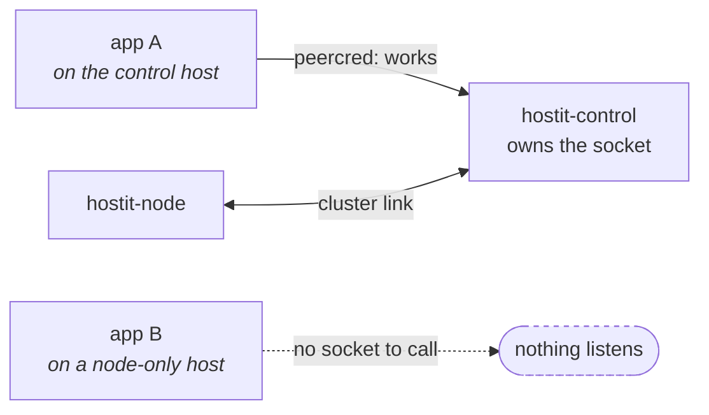
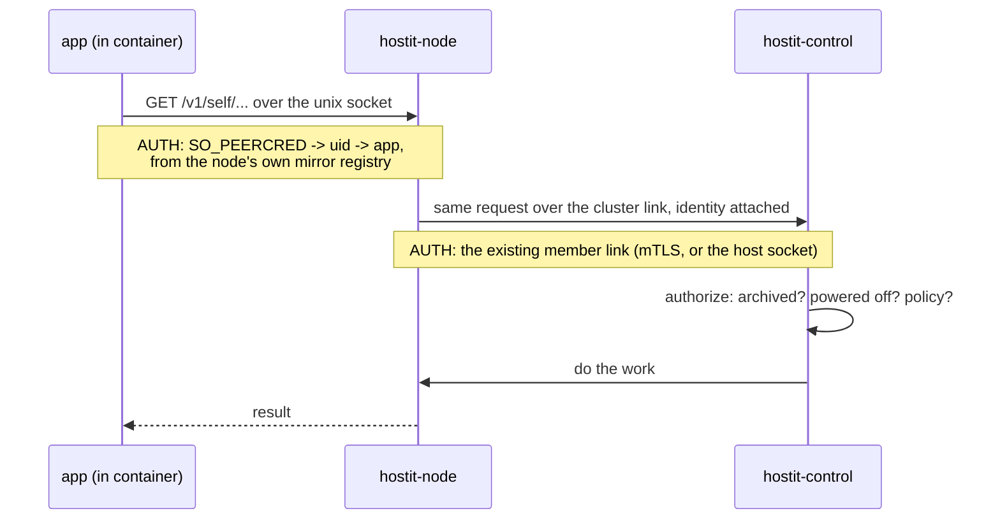
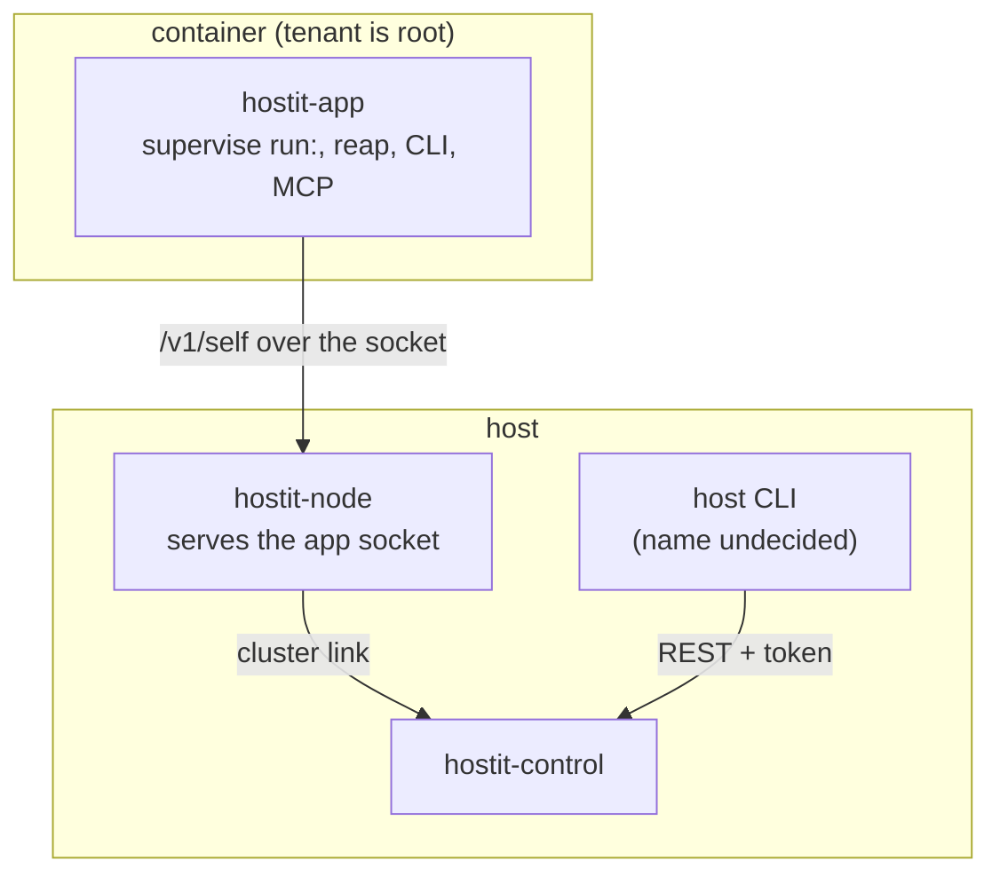

# The app API

### `/v1/self`, who serves it, and the binary that speaks it

<div class="mt-8 opacity-60">
One live bug, one planned refactor, and the contract that sits between them
</div>

<div class="abs-br m-6 text-sm opacity-40">
bug: <code>TODO.md</code> (high priority) &middot; split: <code>TODO.md</code> "two tools sharing a name"
</div>

<style>
h1 {
  background-color: #10b981;
  background-image: linear-gradient(45deg, #34d399 20%, #0e7490 80%);
  background-size: 100%;
  -webkit-background-clip: text;
  -webkit-text-fill-color: transparent;
}
</style>

---

# What `/v1/self` is

The API an app uses **about itself, from inside its own container**. Not the
REST API, not the dashboard: a unix socket, bind-mounted in, with no token.

<v-clicks>

- `GET /v1/self` &middot; `POST /v1/self/deploy` &middot; `logs` &middot; `status`
- `start|stop|restart` &middot; `poweron|poweroff|reboot` &middot; `ensure`
- `POST /v1/self/tool/{name}` -- the MCP bridge
- `GET /v1/connections/{provider}/token` -- new, on the `connections` branch

</v-clicks>

<v-click>

<div class="mt-6 p-4 border border-emerald-700 rounded">
<b>Authentication is the kernel.</b> <code>SO_PEERCRED</code> gives the calling
process's uid; the uid maps to exactly one app. Not a token: it cannot be
phished, copied out of a log, or replayed from another container.
</div>

</v-click>

---

# Who calls it

Everything that acts from *inside* an app -- which is most of hostit's story.

| Caller | What it does |
|---|---|
| the SSH login shell | `Self()`, then `Ensure()` -- **before it greets you** |
| the tenant CLI | `hostit deploy`, `logs`, `restart`, ... |
| `hostit mcp` | the tool bridge an agent drives |
| app code | connections tokens (new) |

<v-click>

<div class="mt-4 opacity-80">
So "the app API" is the surface behind <b>SSH</b>, <b>bring-your-own-agent</b>,
and <b>deploy from inside</b> -- three of the four things the docs lead with.
</div>

</v-click>

---

# The bug: control serves it

`hostit-control` owns the socket. A host running only `hostit-node` has none.



<v-click>

Apps on a secondary node: **SSH, scp and rsync fail at login**, the whole
in-container CLI is gone, `hostit mcp` is gone.

</v-click>

<v-click>

<div class="mt-4 p-3 border border-amber-600 rounded text-sm">
Prod is a single host, so control and node share a machine and every app sits
next to the socket. <b>Latent in prod, live on stage.</b> It arrived with the
control/node split and nothing failed loudly.
</div>

</v-click>

---

# What still works

Worth being precise, because the blast radius is smaller than "apps are broken".

<div class="grid grid-cols-2 gap-4 mt-4">
<div>

**Broken** (from inside the container)

- SSH / scp / rsync
- `hostit deploy|logs|status|...`
- `hostit mcp`, `/v1/self/tool`
- connections tokens

</div>
<div>

**Fine** (routed through control)

- the whole dashboard
- the REST API from outside
- the app serving its own traffic
- snapshots, retention, previews
- the assistant -- *including* the sandbox

</div>
</div>

<v-click>

<div class="mt-6 opacity-80">
The sandboxed assistant surprises people: it mounts no app home, runs next to
control, and uses control's own socket -- so control routes its tool calls to
the right node normally.
</div>

</v-click>

---

# Target: the node serves it, control decides

The node owns the socket **on every host**, and relays. One path, not two.



---

# Why the node must not answer locally

The node already implements deploy, start, logs. Letting it answer would be
faster and **wrong**.

<v-clicks>

- Control is where the guards live: `routeRunnable` refuses an archived app
- An archived app would become deployable **from inside its own container**
- Powered-off intent and per-app policy would be bypassed the same way
- Two decision points is how the two shapes drift apart again

</v-clicks>

<v-click>

<div class="mt-6 p-4 border border-emerald-700 rounded">
A node&rarr;control&rarr;node round trip is worth one decision point. The link
already carries traffic both ways: snapshot and usage callbacks go
node&rarr;control today.
</div>

</v-click>

---

# The one thing to get right

Control must trust the injected identity **only on the cluster link**.

<v-clicks>

- On the link: the node is trusted infrastructure, already authenticated
- On the public API: the same header would be an impersonation header
- So it is not a header hostit accepts -- it is a property of *that* transport

</v-clicks>

<v-click>

<div class="mt-6 opacity-80">
This is the part to test hardest: a request carrying the identity header
arriving at the REST API must be refused, and there should be a test that says
so out loud.
</div>

</v-click>

---

# The other half: two tools sharing a name

`cmd/agent/cmd.go` says it outright. `insideContainer()` switches between them.

<div class="grid grid-cols-2 gap-4 mt-4">
<div>

**Inside a container**

- PID 1, supervising `run:`
- the tenant CLI
- the MCP server
- talks only to the socket

</div>
<div>

**On the host**

- the operator's REST client
- `hostit apps ...`
- shell / enter helpers
- talks to control over TCP

</div>
</div>

<v-click>

<div class="mt-6 p-4 border border-amber-600 rounded">
<b>The real argument is least privilege.</b> The binary bind-mounted into every
container -- where the tenant is root -- also contains control's TLS/ACME,
OAuth, podman/systemd/nftables/store, assistant and admin-API code. None of it
belongs there. Defense in depth, <b>not</b> a live hole.
</div>

</v-click>

---

# Target: a container binary with one contract



<v-click>

The container binary's **entire** outward dependency becomes one local socket.
No TLS, no OAuth, no store, no podman.

</v-click>

---

# Why the socket fix comes first

<v-clicks>

- The split defines a binary whose contract is `/v1/self`
- Today that contract reads: *"control, if it happens to be on this machine"*
- Split first and you bake the bug into a node-shipped binary
- Fix first and it reads: *"the local node"* -- machine-scoped, same everywhere

</v-clicks>

<v-click>

<div class="mt-6 opacity-80">
They also touch the same code exactly once: <code>control/socket.go</code> holds
the unix listener and the peercred mapping. The fix moves those to the node and
leaves the handlers with control -- a move the split wanted anyway.
</div>

</v-click>

<v-click>

<div class="mt-4 p-3 border border-emerald-700 rounded text-sm">
The split stays blocked only on <b>naming the host command</b>, not on this.
</div>

</v-click>

---

# The binaries, and where they live

`/usr/lib/hostit/bin` is not on `$PATH` -- the container binary cannot be run on
the host by accident.

| Binary | Lives in | Who runs it |
|---|---|---|
| `hostit` | `/usr/bin` | the operator |
| `hostit-control` `-node` `-proxy` | `/usr/bin` | systemd, `hostit` dispatch |
| **`hostit-app`** | `/usr/lib/hostit/bin` | mounted in **as `/usr/bin/hostit`** |
| `hostit-shell` | `/usr/lib/hostit/bin` | sshd (the app's login shell) |
| `hostit-enter` | `/usr/lib/hostit/bin` | `hostit-shell` |

<v-click>

<div class="mt-3 p-3 border border-emerald-700 rounded text-sm">
The host filename and the command tenants type are <b>different things</b>:
mounting <code>hostit-app</code> in as <code>/usr/bin/hostit</code> keeps
<code>hostit deploy</code> working inside the container. That is what unblocks
the naming question.
</div>

</v-click>

---

# One command for the operator

The commands belong to the component binaries. `hostit` is the front door that
execs them -- one help text, and it knows what is installed.

```
hostit-control apps list          # the command lives here
hostit control apps list          # ... and this is the same thing
# enroll a node by issuing it a CA-signed cert (openssl); no add command
hostit-control status
hostit node ... / hostit proxy ...   # only what is installed here
```

<v-clicks>

- **`hostit apps` moves onto `hostit-control`** -- one registry, one surface.
  It sits in the agent binary today only because the CLI code happened to live
  there.
- Not `hostit-cluster`: that is a third name for what control already is, and
  "cluster" fits nodes and proxies, not apps.
- Local over the socket (no token); `--host`/`--token` from a laptop, as today.
- A component that is not installed says so, naming what this machine is.

</v-clicks>

---

# Every host command, and where it lives

<div class="grid grid-cols-2 gap-8 text-sm mt-3">
<div>

**`/usr/bin/hostit`** &mdash; the front door<br>
<code>control&nbsp;...</code> <code>node&nbsp;...</code> <code>proxy&nbsp;...</code><br>
<code>apps&nbsp;...</code> <i>(deprecated alias)</i>

<div class="mt-4"></div>

**`/usr/bin/hostit-control`**<br>
<code>serve</code><br>
<code>node list|remove</code><br>
<code>proxy list|remove</code><br>
<code>status</code>

<div class="mt-4"></div>

**`/usr/bin/hostit-node`**, **`hostit-proxy`**<br>
<code>serve</code>

</div>
<div>

**`hostit-control apps ...`**<br>
<i class="opacity-60">every one of these moves off the agent binary</i>

<div class="mt-3"></div>

<code>add</code> <code>list</code> <code>remove</code> <code>keys</code><br>
<code>deploy</code> <code>start</code> <code>stop</code> <code>restart</code><br>
<code>power on|off|reboot</code><br>
<code>snapshot list|create|delete</code><br>
<code>rollback</code> <code>fork</code><br>
<code>logs</code> <code>run</code><br>
<code>domain list|add|verify|rm</code>

</div>
</div>

<v-click>

<div class="mt-4 p-3 border border-emerald-700 rounded text-sm">
Nothing an operator types lives in <code>/usr/lib/hostit/bin</code>, and nothing
in <code>/usr/bin</code> is bind-mounted into a container. That is the whole
rule.
</div>

</v-click>

---

# Every in-container command

All of these move to **`hostit-app`**, which is mounted in as `/usr/bin/hostit`
-- so what a tenant types does not change at all.

<div class="grid grid-cols-2 gap-6 text-sm mt-2">
<div>

**The app's own lifecycle**

`deploy` &middot; `start` &middot; `stop` &middot; `restart`
`poweron` &middot; `poweroff` &middot; `reboot`
`status` &middot; `logs`

</div>
<div>

**For agents, and for PID 1**

`info` &middot; `guide` -- what this app is
`mcp` -- the tool bridge
`agent` -- supervise `run:`, reap
`static` -- serve `public/`

</div>
</div>

<v-click>

<div class="mt-4 p-3 border border-emerald-700 rounded text-sm">
Host path: <code>/usr/lib/hostit/bin/hostit-app</code>. In-container path:
<code>/usr/bin/hostit</code>. Same file, two names -- and the only thing it can
reach is the app socket.
</div>

</v-click>

---

# The two that are not commands

`hostit-shell` and `hostit-enter` are entry points, not things anyone types.

<div class="text-sm">

| Binary | Path | Invoked by |
|---|---|---|
| `hostit-shell` | `/usr/lib/hostit/bin/hostit-shell` | sshd, via `/etc/passwd` |
| `hostit-enter` | `/usr/lib/hostit/bin/hostit-enter` | `hostit-shell`, as root |

</div>

<v-clicks>

- `hostit-shell` is the app user's **login shell**; it calls `Self()` and
  `Ensure()` on the socket before greeting anyone
- `hostit-enter` is the privileged half: it is how the browser terminal enters
  the container, rather than going straight to `podman exec`
- Neither belongs on `$PATH`, and neither is part of the operator's CLI

</v-clicks>

---

# What moving hostit-shell costs

It is every app user's login shell, recorded in `/etc/passwd`.

```
useradd --shell /usr/lib/hostit/bin/hostit-shell ...      # today
```

<v-clicks>

- Moving it means `usermod --shell` for **every existing app user** on upgrade
- Get it wrong and SSH is refused for everyone: the failure is a lockout
- So: migrate on node start, verify the new path exists **before** touching a
  single user, and leave the old binary in place until the sweep has run

</v-clicks>

<v-click>

<div class="mt-4 p-3 border border-amber-600 rounded text-sm">
Chosen deliberately over leaving a compatibility symlink: the symlink never goes
away, and a login shell in <code>/usr/bin</code> invites someone to run it.
</div>

</v-click>

---

# Not in this round: the API prefixes

<div class="mt-4">

`/api/...`, `/v1/self/...`, `/internal/...` grew for three audiences and do not
look like one decision.

</div>

<v-clicks>

- It is worth harmonizing -- and it is not worth doing **while** moving the
  socket and splitting the binary
- Changing the public `/api` surface breaks tokens, scripts and the docs
- The socket paths are the ones about to move; renaming them at the same time
  makes one change into two

</v-clicks>

<v-click>

<div class="mt-6 p-4 border border-emerald-700 rounded">
Deliberately deferred. Do the socket move and the split against the paths that
exist today, then harmonize once, with aliases, as its own change.
</div>

</v-click>

---

# So: what should it be called?

`/v1/self` is about to become a versioned contract between two binaries. Worth
naming deliberately.

| Option | Reads as | Against |
|---|---|---|
| `/v1/self` (keep) | "this app, whoever asks" | vague in docs; "self" of what? |
| **`/v1/app`** | "the app's own API" | -- |
| `/v1/agent` | "for agents" | **agent is overloaded**: PID 1 is the agent, and BYO-agent means an AI |

<v-click>

<div class="mt-6 p-4 border border-amber-600 rounded">
<b>Deferred with the rest of the prefixes.</b> Whatever it becomes, it needs a
version in the path: the binary in a running container is bind-mounted and stays
old until that container is recreated, while the daemon upgrades underneath it.
That skew is what path versions are for -- and it is why the alias has to keep
answering, whenever the rename happens.
</div>

</v-click>

---

# Order of work

<v-clicks>

**The goal is 1-5. Everything after it is follow-on work.**

1. **Failing test**: an app on a remote node can reach `/v1/self` (nothing proves this today)
2. Move the listener and peercred mapping to `hostit-node`
3. Relay over the cluster link; control keeps every authorization
4. Refuse the identity header on the public API, with a test that says so
5. Verify on stage with an app on **stage-2** -- the case that has never worked
6. Then the split: `hostit-app` into `/usr/lib/hostit/bin`, mounted in as `/usr/bin/hostit`
7. `hostit-shell` and `hostit-enter` move too -- with the `usermod` sweep
8. `hostit apps` moves onto `hostit-control apps`, old spelling aliased
9. **Last**, on its own: harmonize the API prefixes

</v-clicks>

<v-click>

<div class="mt-6 opacity-80">
Prod is single-host, so none of this is user-visible there today -- but socket
ownership does move from control to node, which is a live change to how SSH
login is served. Deliberate, not discovered.
</div>

</v-click>

---
layout: center
class: text-center
---

# One socket, one contract, one decision point

<div class="mt-6 opacity-70">
The node serves it because the node is the machine.<br/>
Control decides because control is the registry.<br/>
The container binary speaks it and knows nothing else.
</div>
