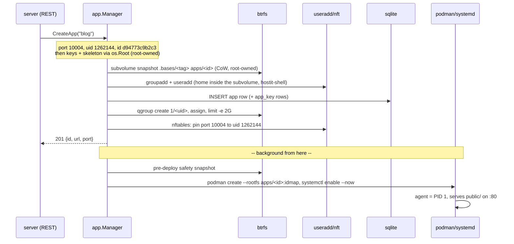

# Creating an app

### Everything the backend does in ~0.4 seconds

<div class="mt-8 opacity-60">
One POST, one subvolume, one user, one container -- every command and every row,
captured live from a real host
</div>

<div class="abs-br m-6 text-sm opacity-40">
code path: <code>control/manager.go: create()</code>
</div>

<style>
h1 {
  background-color: #10b981;
  background-image: linear-gradient(45deg, #34d399 20%, #0e7490 80%);
  background-size: 100%;
  -webkit-background-clip: text;
  -webkit-text-fill-color: transparent;
}
</style>

---

# The request

One authenticated POST. The response arrives before the container exists -- the
start is backgrounded, so the API never waits on podman.

```sh
$ time curl -s -X POST -H "Authorization: Bearer $TOKEN" \
    -d '{"name":"blog"}' https://apps.example.com/api/apps
```

<v-click>

```json
{
    "id": "d94773c9b2c3",
    "name": "blog",
    "url": "https://blog.apps.example.com",
    "port": 10004,
    "snapshots_enabled": true,
    "assistant_enabled": true,
    "created_at": "2026-08-14T11:27:28.47152718Z",
    ...
}
```

</v-click>

<v-click>

```
0.02s user 0.00s system 7% cpu 0.372 total
```

<div class="text-sm opacity-70 mt-2">
<b>0.37 seconds.</b> Creation is a metadata-only CoW snapshot since the idmapped-rootfs
storage (v0.10.0) -- there is no chown, no copy, no image pull on this path.
</div>

</v-click>

---

# The flow at a glance

Everything before the dashed line is synchronous (the 0.4s); the container start
happens in the background.



---

# Step 1: port, uid, id

Three identities, all derived before anything touches the host:

<v-clicks>

- **Port** -- the next free one from the range, guarded by an in-memory
  reservation map so two concurrent creates cannot pick the same port before
  the first row lands: `blog -> 10004`
- **uid block** -- derived from the port, one contiguous block of 65536 ids:
  `uid = 1000000 + (10004 - 10000) * 65536 = 1262144`. Container root IS host
  uid 1262144; in-container `www-data` (33) is host 1262177. One block, one
  uniform mapping rule.
- **id** -- a random 12-hex identifier, minted now so every durable resource
  (subvolume, unit, container) can be keyed on it: `d94773c9b2c3`. Renames
  never move anything.

</v-clicks>

<v-click>

```
code: control/manager.go allocatePort(), workspace UIDFor(), store/app.go NewAppID()
```

</v-click>

---

# Step 2: the subvolume

The app's entire filesystem is ONE btrfs snapshot of the base OS tree.
Metadata-only, instant, and **root-owned** -- ownership is never baked in.

```sh
btrfs subvolume snapshot /var/lib/hostit/apps/.bases/1a3027527a55 \
                         /var/lib/hostit/apps/d94773c9b2c3
mkdir -p .../d94773c9b2c3/home/app        # 0755, the app's files dir
```

<v-click>

```sh
$ btrfs subvolume show /var/lib/hostit/apps/d94773c9b2c3
d94773c9b2c3
        Name:                   d94773c9b2c3
        UUID:                   de035bbc-0c44-ea49-93cd-25ac26a27390
        Parent UUID:            1eb73402-b509-2144-baee-518656cbab2f   <- the base
```

</v-click>

<v-click>

<div class="text-sm opacity-70">
THE INVARIANT: this subvolume is never recreated or reset by hostit. The app's
files AND everything it later installs (apt, pip, /etc changes) live here; new
base images only affect new apps.
</div>

```
code: workspace/subvolume.go EnsureAppSubvolume()
```

</v-click>

---

# Step 3: the Unix identity

One user + one group at the block base, straight from the journal:

```
groupadd[1240470]: new group: name=blog, GID=1262144
useradd[1240476]:  new user: name=blog, UID=1262144, GID=1262144,
                   home=/run/hostit/apps-raw/d94773c9b2c3/home/app,
                   shell=/usr/bin/hostit-shell
useradd[1240476]:  add 'blog' to group 'hostit-apps'
```

<v-clicks>

- **home** points INSIDE the subvolume -- via the daemon's raw apps view
  (`/run/hostit/apps-raw`, more on that later) -- so scp/sftp/rsync land on the
  app's files
- **shell** is `hostit-shell`: every SSH session is exec'd into the container,
  there is no host shell to have
- **hostit-apps** is the supplementary group sshd's hardening matches on
  (forwarding off) and that grants container entry via `hostit-enter`

</v-clicks>

<v-click>

```
code: unixuser/service.go Create(), cmd/agent/shell.go
```

</v-click>

---

# Step 4: keys and skeleton

Written by the daemon through a chained `os.Root` (subvolume first, then
`home/app` inside it), so a tenant-planted symlink can never redirect a
root write. Everything is root-owned -- the idmap makes that container-root.

```sh
$ ls -ln /run/hostit/apps-raw/d94773c9b2c3/home/app/
-rw-r--r-- 1 0 0 930 Aug 14 11:27 README.md
-rw-r--r-- 1 0 0 927 Aug 14 11:27 hostit.yml
drwxr-xr-x 1 0 0  24 Aug 14 11:27 log
drwxr-xr-x 1 0 0  20 Aug 14 11:27 public
```

<v-click>

```yaml
# hostit.yml (the skeleton stub)
# This stub serves the public/ directory (mode: static), which starts with a
# placeholder public/index.html. Replace it with your own site, or switch to
# "mode: app" below to run a command instead.
mode: static
```

</v-click>

<v-click>

<div class="text-sm opacity-70">
authorized_keys is root-owned 0644 in a 0755 .ssh: sshd (as the app user)
reads it on the host, StrictModes accepts root-owned, and through the idmap
the tenant can still hand-edit it -- public keys are not secrets.
</div>

```
code: app/skeleton.go, ssh/service.go writeAuthorizedKeysIn(), homefs/service.go
```

</v-click>

---

# Step 5: the registry rows

sqlite is the source of truth; everything else is reconciled against it.

```sql
CREATE TABLE app (
    name TEXT PRIMARY KEY, port INTEGER NOT NULL UNIQUE,
    host TEXT NOT NULL, created_at INTEGER NOT NULL,
    owner_id TEXT, disk_mb INTEGER, over_quota INTEGER,
    image_tag TEXT, id TEXT  -- unique-indexed
);
```

<v-click>

```
id            name  port   host   image_tag                                created_at
------------  ----  -----  -----  ---------------------------------------  ----------
d94773c9b2c3  blog  10004  local  localhost/hostit-workspace:1a3027527a55  1786706848
```

</v-click>

<v-clicks>

- the **image_tag is pinned at creation**: a later Containerfile change only
  affects new apps, never this one
- SSH keys land in `app_key` (one row per key); the app's bearer token in
  `token`
- moments later the background start adds a `snapshot` row:
  `20260814-112728-auto-bf2980 | blog | Automated snapshot before deploy`

</v-clicks>

---

# Step 6: the disk budget

One qgroup per app, keyed on the uid, capped on **exclusive** bytes -- what the
app itself pins. Extents shared with the base are charged to nobody.

```sh
btrfs qgroup create 1/1262144 /var/lib/hostit/apps
btrfs qgroup assign 0/2115 1/1262144 /var/lib/hostit/apps   # 0/<rootid> = the subvolume
btrfs qgroup limit -e 2048M 1/1262144 /var/lib/hostit/apps
```

<v-click>

```sh
$ btrfs qgroup show -e /var/lib/hostit/apps | grep 1/1262144
qgroupid      referenced    exclusive    max exclusive
1/1262144     781.89MiB     436.00KiB    2.00GiB
```

</v-click>

<v-click>

<div class="text-sm opacity-70">
The whole 782 MiB OS tree is <i>referenced</i>, but the fresh app's
<i>exclusive</i> usage is 436 KiB -- sharing the base costs nothing against the
cap. Writes past 2 GiB fail with EDQUOT, enforced by the filesystem at write
time. Snapshots join the same group as they are taken.
</div>

```
code: app/budget.go ensureBudget(), btrfs/service.go
```

</v-click>

---

# Step 7: the firewall

Loopback ports are the one place apps could reach each other. nftables pins
each app's port to its uid block (plus root, for the proxy):

```sh
$ nft list ruleset | grep 10004
ip  daddr 127.0.0.0/8 tcp dport 10004 meta skuid != { 0, 1262144 } counter drop
ip6 daddr ::1         tcp dport 10004 meta skuid != { 0, 1262144 } counter drop
```

<div class="text-sm opacity-70 mt-4">
Re-applied as one ruleset on every create/delete (ReconcilePortRules): the rules
are derived from the registry, never edited incrementally.
</div>

```
code: firewall/service.go, control/manager.go ReconcilePortRules()
```

---

# Step 8 (background): the container

The API already returned. The background start takes a pre-deploy safety
snapshot, then builds the container -- against the subvolume, not an image:

```sh
podman create --name hostit-app-d94773c9b2c3 --hostname blog
  --sdnotify conmon                      # systemd sees "ready" only when it IS
  --uidmap 0:1262144:65536 --gidmap 0:1262144:65536
  --network slirp4netns                  # own network stack, no cross-app traffic
  --memory 512m --pids-limit 512         # fork bombs stay the app's problem
  --security-opt no-new-privileges --security-opt apparmor=unconfined
  --env PORT=80 --env HOME=/home/app --workdir /home/app
  --publish 127.0.0.1:10004:80           # loopback only; the proxy does TLS
  --volume /usr/bin/hostit:/usr/bin/hostit:ro
  --volume /run/hostit:/run/hostit:ro    # the daemon's unix socket
  --label hostit.config=b20b87e31ca0510e # config hash: recreate only on change
  --rootfs /var/lib/hostit/apps/d94773c9b2c3:idmap
  /usr/bin/hostit agent                  # the agent is PID 1
```

<div class="text-sm opacity-70">
Only two mounts: the hostit binary and the socket dir. The app's files need no
mount -- they are already inside the rootfs.
</div>

---

# `:idmap` -- the trick that made creates instant

The subvolume stays root-owned on disk; the runtime maps it through the
container's uid mapping. disk root <-> container root, one rule, no chown.

```sh
$ findmnt | grep apps/d94773c9b2c3
/var/lib/hostit/apps/d94773c9b2c3   /dev/loop0[/d94773c9b2c3]   btrfs   rw,idmapped,...
```

<v-clicks>

- requires **podman >= 4.3** and **crun >= 1.29** -- preflighted at daemon
  start, resolved through `podman info` so a `containers.conf` override is what
  gets checked
- while the container runs, that idmapped mount covers the host path, so
  host-side tools see the MAPPED view (files "owned by" uid 1262144). The
  daemon therefore does all file I/O through `/run/hostit/apps-raw` -- a
  non-recursive, **private** bind of the apps dir that the overmounts cannot
  propagate into
- every rootfs carries an `/etc/mtab` symlink: podman would otherwise try to
  create it through the idmapped view and fail (EOVERFLOW on podman 4.9)

</v-clicks>

```
code: workspace/spec.go CreateArgs(), app/deploy.go MountRawAppsView(), cmd/preflight.go
```

---

# Step 9 (background): systemd runs it

The container is wrapped in a template unit; `Type=notify` + `--sdnotify conmon`
means "active" is not declared until the container truly runs.

```sh
$ systemctl status hostit-app@d94773c9b2c3
* hostit-app@d94773c9b2c3.service - hostit app d94773c9b2c3
     Loaded: loaded (/usr/lib/systemd/system/hostit-app@.service; enabled)
     Active: active (running) since 11:27:30 UTC
   Main PID: 1240575 (conmon)
```

<v-click>

```sh
$ curl -s http://127.0.0.1:10004/ | head -3
<!doctype html>
<meta charset="utf-8">
<title>hostit app</title>
```

</v-click>

<v-click>

<div class="text-sm opacity-70">
Inside, the hostit agent is PID 1: it serves public/ (mode: static) or
supervises the run command (mode: app), and takes stop/restart/deploy signals
from the daemon over the socket.
</div>

```
code: hostit-app@.service, agent/, app/deploy.go apply()
```

</v-click>

---

# The whole thing, from the journal

```
11:27:28 INFO Creating app app=blog port=10004 forked=false
11:27:28 groupadd: new group: name=blog, GID=1262144
11:27:28 useradd:  new user: name=blog, UID=1262144, ...
11:27:28 INFO App created app=blog port=10004            <- API answers here (0.37s)
11:27:28 podman:   container create ... name=hostit-app-d94773c9b2c3
11:27:28 INFO Container recreated app=blog took=0s
11:27:30 INFO App started app=blog forked=false took=2s  <- serving
```

<v-click>

| when | what |
| --- | --- |
| t+0.37s | API returns: row exists, subvolume exists, user exists, budget capped |
| t+2s | skeleton serves on `https://blog.apps.example.com` |
| t+minutes | owner (or an agent) SSHes in, `apt install`s, deploys the real thing |

</v-click>

---

# Where to read the code

| step | code |
| --- | --- |
| handler, limits, keys | `server/server_handler_apps.go` |
| the create orchestration | `control/manager.go create()` |
| port/uid/id | `control/manager.go`, `store/app.go` |
| subvolume + base | `workspace/subvolume.go` |
| unix user | `unixuser/service.go` |
| keys + skeleton | `ssh/service.go`, `app/skeleton.go`, `homefs/service.go` |
| disk budget | `app/budget.go`, `btrfs/service.go` |
| firewall | `firewall/service.go` |
| container argv | `workspace/spec.go CreateArgs()` |
| start + unit | `app/deploy.go apply()`, `hostit-app@.service` |

<div class="text-sm opacity-60 mt-4">
Deeper: docs/features/apps-lifecycle.md, docs/subsystems/storage-btrfs.md,
docs/architecture/flows.md. All output on these slides captured live on
2026-08-14 (v0.10.0).
</div>
