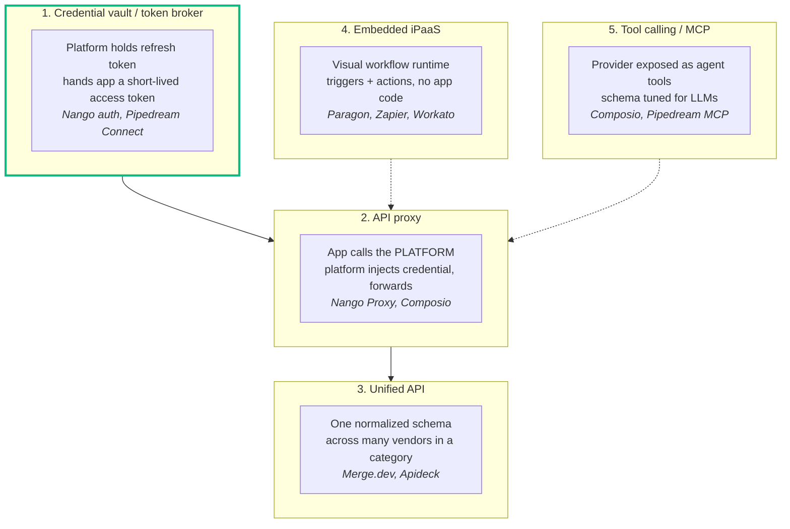

# Integrations

### How everyone else does it, and what that means for hostit

<div class="mt-8 opacity-60">
Five patterns, four deciding axes, and one constraint that rules most of them out
</div>

<div class="abs-br m-6 text-sm opacity-40">
heckel.io/hostit &middot; research, 2026-08-23
</div>

<style>
h1 {
  background-color: #10b981;
  background-image: linear-gradient(45deg, #34d399 20%, #0e7490 80%);
  background-size: 100%;
  -webkit-background-clip: text;
  -webkit-text-fill-color: transparent;
}
</style>

---
transition: fade-out
---

# The ask

> "I want to be super flexible: Google Calendar, Gmail, Slack, Discord, HubSpot,
> Fastmail, random MCP servers, GitHub, Jira, Linear."

That list is doing a lot of work, because those things are **not the same shape**:

<div class="grid grid-cols-2 gap-6 mt-4 text-sm">
<div>

- **Google Calendar / Gmail** -- OAuth, and the most heavily gated scopes on the internet
- **Slack / Discord** -- OAuth, but the unit is a *bot installed into a workspace*
- **GitHub** -- three different auth models depending on what you want
- **Jira / Linear / HubSpot** -- ordinary OAuth, ordinary REST

</div>
<div>

- **Fastmail** -- IMAP/JMAP with an app password. **No OAuth at all**
- **Random MCP servers** -- may have no auth, or OAuth 2.1 with a server you have never met and cannot pre-register with

</div>
</div>

<div class="mt-6 p-4 border-l-4 border-emerald-500 bg-emerald-500/5">
Any design that assumes "an integration is an OAuth provider" already fails Fastmail
and half of MCP. The abstraction has to be <b>credential</b>, not <b>OAuth</b>.
</div>

---
layout: section
---

# 1. The five patterns

---

# The landscape, in one picture



<div class="mt-2 text-sm opacity-70">
They stack. Most vendors sell one but implement several. <b>hostit's PoC is pattern 1</b>,
which is the foundation the other four are built on.
</div>

---

# 1 &middot; Credential vault (token broker)

**The platform stores the credential and hands it back. The app makes its own API calls.**

<div class="grid grid-cols-2 gap-6 mt-4">
<div>

**Who does this**

- **Nango** -- 800+ pre-built auth configs, encrypted
  storage, automatic refresh. Open source, self-hostable
- **Pipedream Connect** -- managed auth, *their* approved
  OAuth client IDs, short-lived tokens to your frontend
- **Clerk / Supabase / WorkOS** -- same idea bolted onto
  the login provider

</div>
<div>

**Why it wins**

- App uses the **vendor's own SDK**. Nothing to proxy
- Adding a provider = a credential type + a refresh rule,
  not an API translation layer
- Fastmail's app password fits the same shape as Google's
  refresh token

**What it costs**

- The token is in the app's process. A compromised app
  reads it
- The platform can never say what the app *did* with it

</div>
</div>

<style>
li { line-height: 1.32; margin-top: 0.12rem; }
</style>

<div class="mt-4 p-3 border-l-4 border-emerald-500 bg-emerald-500/5 text-sm">
<b>This is exactly hostit's <code>connections</code> branch.</b> The instinct that it "isn't
really an integration" is right -- but it is what everyone else builds first, and what
the other four patterns sit on.
</div>

---

# 2 &middot; API proxy

**The app calls the platform. The platform injects the credential and forwards.**

<div class="grid grid-cols-2 gap-6 mt-4">
<div>

```text
App  ->  POST /proxy/google/calendar/v3/events
         (no credential in the request)

Platform
  - resolves provider + connection
  - injects Authorization header
  - normalizes rate limits, retries
  ->  Google Calendar API
```

Nango's proxy does exactly this: "resolves the provider,
injects credentials, normalizes rate-limit responses,
and handles retries."

</div>
<div>

**Why you would**

- The credential **never enters the app process**
- Central rate limiting, retries, audit log
- You can revoke mid-flight; a handed-out token you cannot

**Why you would not**

- You now own an HTTP surface **per vendor, forever**
- SDKs stop working -- they point at the vendor
- Streaming, webhooks, uploads and pagination all need
  bespoke handling

</div>
</div>

<style>
li { line-height: 1.32; margin-top: 0.12rem; }
</style>

<div class="mt-4 text-sm opacity-70">
hostit's <code>260818-hostit-broker-design.md</code>. Its threat model -- keep the operator's
key from the tenant -- does not apply when the app, the container and the credential all
belong to the same person.
</div>

---

# 3 &middot; Unified API

**One normalized schema across every vendor in a category.**

<div class="grid grid-cols-2 gap-6 mt-4">
<div>

Merge.dev ships a unified API across ~9 categories --
CRM, HRIS, ticketing, ATS. You write to *their* `Ticket`
model; they map Jira, Linear, Zendesk and Asana onto it.

**The pitch:** integrate once, get thirty vendors.

**The catch, in their competitors' words:** you stay
"inside Merge's fixed schema and pre-built catalog, with
limited custom fields and custom objects."

</div>
<div>

**Why it does not fit hostit**

A unified schema only pays off when the *same* app must
talk to many *interchangeable* vendors -- your customers
use Jira, mine uses Linear, the code must not care.

hostit's apps are **personal**. Phil's calendar app talks
to *Phil's* Google Calendar. There is no vendor
heterogeneity to abstract over.

You would pay the entire cost of normalization for a
population of one.

</div>
</div>

<style>
li { line-height: 1.32; margin-top: 0.12rem; }
</style>

<div class="mt-4 p-3 border-l-4 border-red-500 bg-red-500/5 text-sm">
Also note what a unified API <i>cannot</i> do: the moment you want a Gmail feature Merge
did not model, you are out of the abstraction with no escape hatch.
</div>

---

# 4 &middot; Embedded iPaaS

**A visual workflow runtime. Triggers, actions, no app code.**

<div class="grid grid-cols-2 gap-6 mt-4">
<div>

Paragon, Zapier, Workato, n8n. The integration is not
code you write -- it is a **workflow you draw**, running
in the vendor's engine.

Paragon is "organized around a visual workflow engine,
with integrations staying inside Paragon's workflow
runtime and its pre-built catalog."

</div>
<div>

**Why it does not fit hostit**

hostit's entire premise is that **the app is the unit**.
People get a container, SSH, a deploy pipeline and an
agent that writes code for them.

Adding a second, weaker, non-code way to express logic
next to "you have a whole Linux container" is a strange
trade. The workflow engine is the product at Zapier; at
hostit it would be a competing runtime.

</div>
</div>

<style>
li { line-height: 1.32; margin-top: 0.12rem; }
</style>

<div class="mt-4 p-3 border-l-4 border-emerald-500 bg-emerald-500/5 text-sm">
Worth stealing anyway: the <b>trigger</b> half. "Run this app when a Google Calendar
event starts" is genuinely useful and is not something a credential vault gives you.
Webhook ingestion + delivery into a container is a small, self-contained feature.
</div>

---

# 5 &middot; Tool calling and MCP

**The provider is exposed as tools an LLM can call.**

<div class="grid grid-cols-2 gap-6 mt-4">
<div>

- **Composio** -- 1,000+ toolkits, ~20,000 tools, schemas
  "continuously tuned against real agent error and success
  rates". Tokens encrypted, auto-rotated, "agents never
  touch raw credentials"
- **Pipedream MCP** -- 10,000+ tools across 3,000+ apps,
  already wired into Claude, ChatGPT and Cursor

The insight both sell: an API designed for humans makes a
**bad tool schema**. The value is the curation, not the
transport.

</div>
<div>

**Why this one is different for hostit**

hostit already has an assistant, and already has an
MCP story on the list (TODO #8). The `claude-max-poc`
branch proved MCP-only tools as the load-bearing control.

So "connect an MCP server" is not a fifth integration
pattern to build -- it is **the same credential problem**
pointed at a different protocol.

</div>
</div>

<style>
li { line-height: 1.32; margin-top: 0.12rem; }
</style>

<div class="mt-4 p-3 border-l-4 border-amber-500 bg-amber-500/5 text-sm">
And MCP is the one place where the newest OAuth work lands: <b>RFC 9728</b> discovery,
<b>RFC 8707</b> resource binding, and <b>Client ID Metadata Documents</b> replacing dynamic
registration. See the OAuth deck, "Client ID Metadata Documents".
</div>

---
layout: section
---

# 2. The axes that actually decide

---

# Four questions, and nothing else matters

| Axis | The options | What it really costs |
|---|---|---|
| **Who registers the OAuth client?** | The platform vendor &middot; the operator &middot; the end user | This is the one that kills self-hosted designs. Next slide. |
| **Who holds the token at runtime?** | The app &middot; the platform | Vault vs proxy. Decides whether you own an API surface per vendor. |
| **Does the platform know the API's shape?** | No &middot; normalized &middot; per-tool schemas | No = cheap forever. Normalized = expensive forever. |
| **Who writes the integration code?** | The app author &middot; the platform &middot; an agent | hostit already answers this: **the app, with an agent's help.** |

<div class="mt-6 p-4 border-l-4 border-emerald-500 bg-emerald-500/5">
Three of these four, hostit has already answered by virtue of what it <i>is</i>. The
open one is the first -- and it is not a design question, it is a paperwork question.
</div>

<style>
table { font-size: 0.70em; line-height: 1.35; }
table :is(td, th) { padding-top: 0.22rem; padding-bottom: 0.22rem; }
</style>


---
layout: statement
---

# The constraint nobody's marketing page mentions

## Somebody has to register an OAuth client with Google. And for Gmail, get audited for it. Every year.

---

# What "just add Google Calendar" actually costs

Google splits scopes into tiers. The useful ones are **restricted**.

<div class="grid grid-cols-2 gap-6 mt-4">
<div>

**The gate**

Full Gmail access is a restricted scope, so an app must
clear **CASA Tier 2**. If the app "stores or transmits
restricted-scope data on servers", it needs an assessment
by a Google-empanelled assessor.

**Reverified every 12 months.**

Reported costs: a **$540 DAST scan** at the low end, a
**$5,000+ penetration test** at the high end.

</div>
<div>

**The exemptions that save hostit**

- **Personal use** -- you, or "a few users, all of whom
  are known personally to you"
- **Testing publishing status** -- up to **100 test
  users**, with a scary consent screen
- **Internal** -- one Workspace org

A personal hostit instance sits squarely in these. A
**public, multi-tenant** apps.heckel.io offering Gmail
to strangers does not.

</div>
</div>

<div class="mt-4 p-4 border-l-4 border-red-500 bg-red-500/5">
So there are two products here, and they need different answers. <b>Do not design as if
they are one.</b>
</div>

---

# How the vendors dodge it -- and why hostit cannot

<div class="grid grid-cols-2 gap-6">
<div>

**Pipedream Connect** ships "approved client IDs" --
*their* verified OAuth client, already through Google's
review, amortized over thousands of customers.

That is a real moat. It is also only available to a
company willing to be the accountable party for
everyone's data access.

**Nango** self-hosted takes the other path: you bring
your own client credentials per provider. The 800+
`providers.yaml` entries are *endpoint templates*, not
registrations.

</div>
<div>

**hostit is Nango's case, not Pipedream's.**

A self-hosted instance cannot inherit somebody else's
verified client. So the honest model is:

> **The operator registers the OAuth clients for their
> own instance.** hostit ships the *templates* -- URLs,
> scopes, refresh rules -- and a config slot per provider.

An instance with no Google client simply does not offer
Google. That is already how `WebEnabled()` gates login
today.

</div>
</div>

<div class="mt-4 text-sm opacity-70">
Corollary: the provider <b>catalog</b> is the deliverable, not the mechanism. Nango's
value is 800 tested auth configs. hostit needs maybe eight -- but they still have to be
written and kept working.
</div>

---

# The wishlist, by what it actually needs

| Provider | Auth | Real difficulty |
|---|---|---|
| **Fastmail** | App password (IMAP/JMAP) | **Trivial.** Paste a string. No OAuth, no client, no review |
| **Linear** | OAuth 2.0 | Easy. Self-serve client, sane scopes |
| **Jira / Atlassian** | OAuth 2.0 (3LO) | Easy-ish. Self-serve, fiddly scope names |
| **HubSpot** | OAuth 2.0 | Easy. Self-serve developer app |
| **GitHub** | PAT &middot; OAuth App &middot; **GitHub App** | PAT trivial. GitHub App is best (1-hour tokens, targeted permissions, survives the installer leaving) but is a different model |
| **Discord** | OAuth 2.0 + bot token | Easy for a bot. User-scoped data is more restricted |
| **Slack** | OAuth v2, `xoxb-` bot token | Easy for one workspace. Scopes accumulate additively across installs |
| **Google Calendar** | OAuth, *sensitive* scope | Verification, but no CASA |
| **Gmail** | OAuth, **restricted** scope | **CASA Tier 2, annually** -- unless personal/testing |
| **Random MCP** | None, or OAuth 2.1 | Discovery-driven; cannot pre-register. Needs RFC 9728 + CIMD |

<div class="mt-3 text-sm opacity-70">
The spread is enormous: <b>hours</b> for Fastmail, <b>a compliance programme</b> for public Gmail.
</div>

<style>
table { font-size: 0.60em; line-height: 1.3; }
table :is(td, th) { padding-top: 0.15rem; padding-bottom: 0.15rem; }
</style>

---
layout: section
---

# 3. Where hostit stands

---

# The PoC, read honestly

`connections` branch + `plans/260819-connections.md`.

<div class="grid grid-cols-2 gap-6 mt-4">
<div>

**What it does**

```text
GET /v1/connections/{provider}/token
->  { provider, access_token, expires_at }
```

hostit holds the refresh token, never lets it leave
control, and hands the app a short-lived access token
over the unix socket it already has.

Two credential kinds -- OAuth and static -- behind one
`Connection` shape, "so an app does not care which it
got."

</div>
<div>

**The critique, restated**

> "It was just a way to store credentials and then pass
> them to the app. Which isn't necessarily wrong, but
> it's not really an integration."

**Both halves are correct.** It is a credential vault.
It is not an integration.

But the deck's finding is that a credential vault is
what pattern 2, 4 and 5 are *built on*. Nobody skips it.

</div>
</div>

<style>
li { line-height: 1.32; margin-top: 0.12rem; }
</style>

<div class="mt-4 p-4 border-l-4 border-emerald-500 bg-emerald-500/5">
The plan's own instinct is the right one: <i>"every app can make its own integration the
way it wants to."</i> That is not a cop-out -- it is the same bet Nango's auth-only tier
makes, and the reason a container platform is a good place to make it.
</div>

---

# What the PoC is missing (and the plan already says so)

<div class="grid grid-cols-2 gap-6">
<div>

**Named in `260819-connections.md`**

- **Private apps** -- called "the necessary companion
  feature". *This has since shipped* (v0.19.0), which
  removes the plan's own biggest objection
- Encryption at rest for stored credentials
- Which node gets a credential pushed, and when it purges

</div>
<div>

**Not named, and load-bearing**

- **Who registers the OAuth clients** -- the whole of
  "How the vendors dodge it". The plan assumes one exists
- **Refresh lifecycle** -- rotation, revocation
  detection, silent expiry, re-consent when scopes drift
- **The catalog** -- eight providers written and *kept
  working* is the actual recurring cost
- **Triggers** -- the one genuinely missing capability
  a vault cannot provide

</div>
</div>

<div class="mt-4 p-3 border-l-4 border-amber-500 bg-amber-500/5 text-sm">
Note the ordering trap: the plan defers encryption-at-rest and node-push as details.
They are not details -- they are the same "per-owner secret custody" problem TODO #2
(secrets outside the web root) needs. <b>Building it twice would be the mistake.</b>
</div>

<style>
li { line-height: 1.35; margin-top: 0.15rem; }
</style>

---

# Three options, and what each really buys

<div class="grid grid-cols-3 gap-4 mt-6 text-sm">
<div class="p-4 border border-emerald-500/40 rounded">

### A &middot; Vault, finished

Take the PoC to done: encryption at rest, refresh
lifecycle, per-app grants, 3-4 providers.

**Buys:** the thing everything else needs, at the
lowest cost.

**Risk:** it stays "not really an integration" --
every app still writes its own client code.

</div>
<div class="p-4 border border-gray-500/30 rounded">

### B &middot; Vault + triggers

A, plus webhook ingestion: a provider event wakes an
app.

**Buys:** the half a vault genuinely cannot do, and
the thing that makes an integration feel alive.

**Risk:** delivery semantics, retries, replay -- a
real subsystem, not a weekend.

</div>
<div class="p-4 border border-gray-500/30 rounded">

### C &middot; Vault + MCP client

A, plus hostit speaks MCP: connect a server, grant an
app a subset of tools.

**Buys:** "random MCP servers" as a first-class
answer, and it composes with the assistant.

**Risk:** the newest, least settled spec surface.

</div>
</div>

<div class="mt-5 p-3 border-l-4 border-emerald-500 bg-emerald-500/5 text-sm">
<b>A is a prerequisite for both B and C.</b> Whatever the eventual shape, the credential
custody work is not wasted -- which is the strongest argument for not throwing the PoC
away, even though the critique of it is fair.
</div>

---
layout: center
class: text-center
---

# What the research actually changed

<div class="text-left max-w-3xl mx-auto mt-6">

1. **The PoC is not the wrong shape.** It is pattern 1, which every other pattern is built on. Nango's free self-hosted tier is *exactly* this and nothing more.
2. **A unified API is the wrong ambition here.** It pays off across interchangeable vendors for many customers -- hostit has personal apps for one owner.
3. **The hard part is not the protocol, it is the paperwork.** Who registers the OAuth client, and Gmail's annual CASA audit, decide more than any architecture choice.
4. **Personal and public hostit are different products.** The exemptions that make a personal instance trivial evaporate for a multi-tenant one.
5. **CIMD deprecating dynamic registration** removes most of the cost the broker plan feared -- but only in the MCP ecosystem, not for Google or Slack.
6. **The catalog is the deliverable.** Mechanism is a week; keeping eight providers working is forever.

</div>

<div class="mt-8 text-sm opacity-50">
Companion: <code>oauth-oidc.md</code> &middot; plans: <code>260818-app-capabilities.md</code>, <code>260818-hostit-broker-design.md</code>, <code>260819-connections.md</code>
</div>
