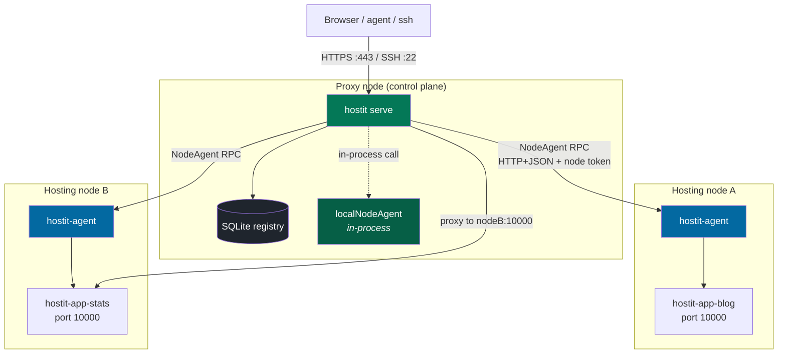
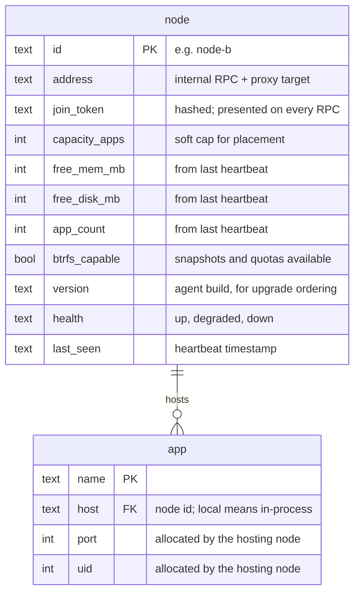
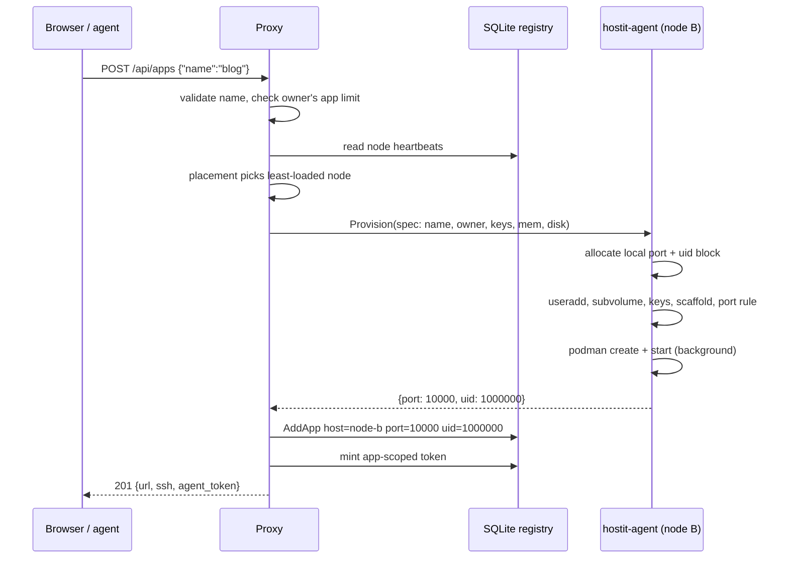
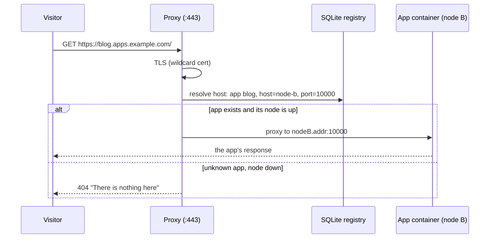
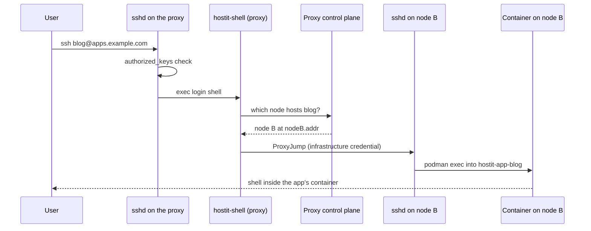
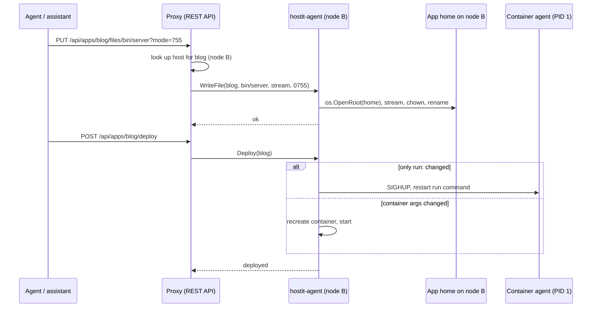
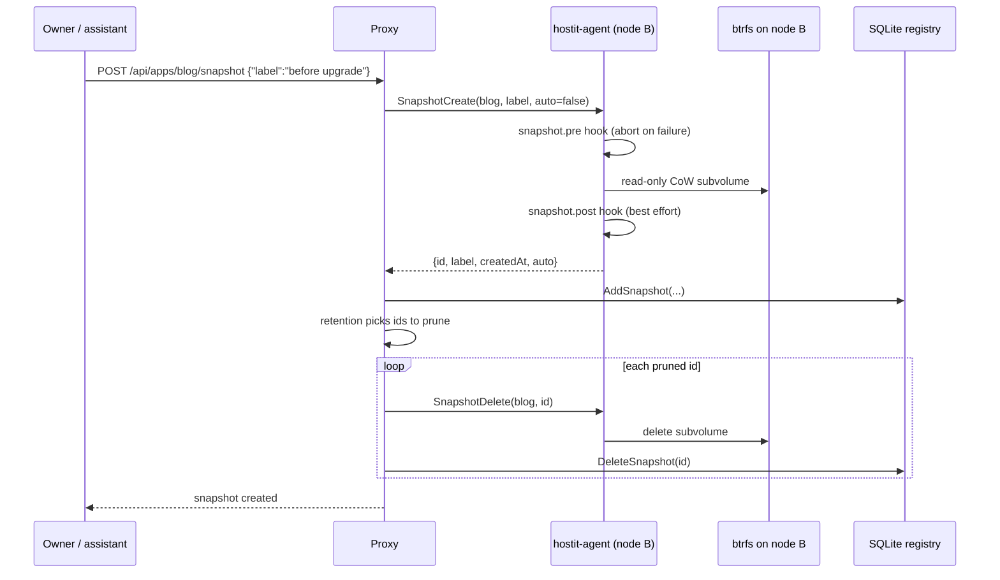

# hostit multi-node

### One front door, many machines

Splitting the all-in-one daemon into a proxy node and stateless hosting nodes --
while a single box stays exactly what it is today

design: <code>plans/260807-hostit-multinode.md</code> &middot; phase 1: <code>plans/260815-hostit-nodeagent.md</code>

---

# The problem

Today one root daemon on one droplet **is** the platform: TLS, proxy, dashboard,
API, assistant -- and every Unix user, container, port and subvolume apps are
made of.

<v-clicks>

- One machine's CPU, RAM, disk and port range is the **ceiling for every app**
- A busy app and a noisy neighbor share one core
- The goal is capacity, **not** HA: no failover, no live migration, registry stays single-writer

</v-clicks>

<v-click>

<b>Non-negotiable:</b> a one-machine install keeps <b>zero</b> network hops, zero
serialization, zero behavior change. The multi-node machinery is present but
inert until a second node joins. hostit must stay deployable on a $6 droplet.

</v-click>

---

# Responsibilities: two roles, one binary

Which role a process plays is a subcommand -- `hostit serve` vs `hostit agent`.

### Proxy node (control plane)

- **TLS + certs**: wildcard and custom domains (certmagic); nodes never see keys
- **Reverse proxy**: host &rarr; app &rarr; node
- **Registry**: SQLite, single writer -- apps, users, tokens, snapshots metadata, domains, nodes
- **Web app + REST API**, name validation, app limits
- **Placement**: least-loaded eligible node
- **Assistant**: Anthropic loop, SSE, rate limits
- Owns **no** app homes, runs **no** app containers

### Hosting node (`hostit-agent`)

- **Stateless**: no registry, knows nothing of other nodes
- Unix users + homes (useradd, managed authorized_keys)
- Containers + units (podman, systemd), workspace image
- btrfs subvolumes, snapshots, qgroup quotas
- Port + uid allocation **on its own machine**
- nftables port rules; `os.OpenRoot` file layer
- Self-maintenance loops: reconciles, state, disk usage, qgroup sweep, preview shots

---

# Why the node half cannot just be "remoted"

The tempting shortcut -- keep `app.Manager` on the proxy, SSH the commands over --
throws away the safety model.

<v-clicks>

- **`os.OpenRoot` needs the real path on the real machine.** Its guarantee is the
  kernel refusing to follow a symlink out of the opened root. A "remote open" is
  just a string the proxy hopes the node honored.
- **btrfs is local syscalls.** A snapshot is a reflink on one filesystem; a quota
  is an `EDQUOT` at write time. There is nothing to call remotely -- the operation
  *is* the filesystem.
- **podman runs where the container is.** exec, stats, idmapped rootfs mounts,
  netns -- plus the locking and caching the Manager does in-process.

</v-clicks>

<v-click>

So the **whole node-local half moves** behind one interface -- `NodeAgent` --
with a `localNodeAgent` (today's in-process code) and a `remoteNodeAgent`
(RPC client to a `hostit-agent`).

</v-click>

---

# Target architecture

Dashed = in-process Go call. On a single box only the proxy subgraph exists and
there are **no RPC lines at all**: `host == "local"` resolves to the in-process
agent, today's exact code path.

---

# Database structure

The registry stays central and single-writer on the proxy. One new table, two
app columns.

---

# Consistency model

<v-clicks>

- **Nodes own local resources; the registry records the outcome.** Only the node
  can see its own free ports and uid blocks, so `Provision` allocates and
  *returns* them; the proxy writes `(host, port, uid)` into the app row.
- **Snapshot subvolumes are node-local, metadata is central**: the id/label rows
  live in the `snapshot` table; retention policy runs on the proxy and drives
  `SnapshotDelete` on the node.
- **Reconciliation over consensus.** Proxy restart: reload the `node` table,
  resume heartbeats -- containers never stopped serving. Node restart: the agent
  comes up stateless, runs its reconcile loops, and desired state is re-asserted
  lazily by the next `Ensure`/`Deploy`.
- **Drift surfaces, then heals**: `States()` feeds the proxy's state cache, so a
  mismatch shows on the dashboard and is corrected by the next lifecycle call --
  no distributed protocol.

</v-clicks>

---

# Flow: creating an app

Placement picks a node; the node allocates and builds; the proxy records what
came back. The node is stateless -- the registry is the only durable record.

---

# Flow: serving an HTTP request

The only change from today's `proxyTo`: the target `127.0.0.1:port` becomes
`node.address:port`. No 502 path -- a down node looks like a free name, as today.

---

# Flow: SSH via one front door

One SSH endpoint (the proxy). The login shell looks up the node and jumps.
For a `local` app there is no jump -- `podman exec` in-process, exactly today.

---

# SSH credentials: two separate trust edges

<v-clicks>

- The **tenant's keys never move**: the managed `authorized_keys` lives where the
  app user lives -- on the node, written by `SetKeys`. That authenticates the end
  user, same as today.
- The **proxy needs its own hop credential** to reach each node's container-exec
  path: a proxy-held key trusted by each node's sshd (or the RPC's mTLS
  identity). The user never sees it.
- This credential is a **new trust edge**: scoped to container exec (never a node
  root shell), rotatable, and guarded like the RPC token. Compromising the proxy
  was already game-over on one box; multi-node widens that blast radius to every
  node's containers.

</v-clicks>

---

# Flow: file write + deploy across the wire

The proxy is a pass-through; the bytes land through `os.OpenRoot` **on the
node**, where that guarantee actually exists.

The assistant's `AppOps` keeps its exact shape -- only the adapter behind it
resolves the app's node first.

---

# Flow: snapshot -- node cuts, proxy records

---

# IPC: the NodeAgent RPC surface

~25 primitives -- the node-local half of `app.Manager` as verbs. The spec travels
on every call; the agent keeps nothing between calls.

**Lifecycle**
`Provision(spec) -> {port, uid}` &middot; `Deprovision` &middot; `Fork` (same-node reflink)

**Deploy & process control**
`Deploy` / `Up` &middot; `Ensure` &middot; `Down` &middot; `Start` / `Stop` / `Restart` &middot;
`PowerOn` / `PowerOff` / `Reboot` &middot; `Status` &middot; `Logs` &middot; `Exec` &middot; `TerminalCommand`

**Files** (each through `os.OpenRoot` on the node)
`ListFiles` &middot; `ReadFile` &middot; `WriteFile` (streamed) &middot; `DeleteFile` &middot; `FileExists` &middot; `ExtractTar`

**Limits & keys**
`SetDiskLimit` &middot; `SetMemoryLimit` &middot; `SetKeys`

**Snapshots**
`SnapshotCreate -> metadata` &middot; `SnapshotDelete` &middot; `Rollback`

**Node-level**
`Heartbeat -> {freeMem, freeDisk, appCount, btrfsCapable, version, health}` &middot;
`States(names)` (batch, feeds the proxy's state cache)

**Deliberately NOT on the wire**
`Readme` / `Description` / `SetDescription` / `ListSnapshots` -- compositions of
`ReadFile`/`WriteFile` + the registry, assembled on the proxy

---

# IPC: transport and auth

<v-clicks>

- **Dedicated internal RPC**: the `NodeAgent` interface over HTTP+JSON, streamed
  for file bodies and logs. Listens on a **private interface / VPN only**.
- **Not the public agent REST API, structurally.** The internal surface is a
  superset with the most privileged verbs on the platform -- `Provision` creates
  a Unix user, `SetKeys` rewrites `authorized_keys`, `Deprovision` deletes a
  home. A separate channel means tenants *physically cannot address it*, instead
  of being policy-fenced on a shared one.
- **Auth: per-node bearer token**, minted at join time, stored hashed in the
  `node` table, presented on every RPC. **mTLS** as the stronger option.
- **Why not SO_PEERCRED?** On one box the kernel vouches for the calling uid over
  the unix socket. There is no kernel in the middle of a TCP connection --
  cross-node identity must be a cryptographic credential.
- **Versioned contract**: `node.version` from the heartbeat; the proxy tolerates
  agents one version behind (roll agents first).

</v-clicks>

---

# Risks, called out

<v-clicks>

- **A down node takes its apps offline** -- capacity, not HA. Must be explicit in
  the dashboard. Optional later: "evacuate" from last snapshots (a data-loss
  window decision).
- **Cross-node fork/move is a copy**, not a reflink -- send/receive or tar. The
  UI must not imply it is instant.
- **Network partition**: proxy marks the node `down` and stops routing even
  though its containers are fine. Heartbeat thresholds must tolerate blips;
  RPC timeouts must never wedge a proxy goroutine.
- **TLS stays only on the proxy** -- deliberate (nodes never hold private keys),
  but it is the single ingress bottleneck.

</v-clicks>

---

# Phased rollout

<v-clicks>

- **Phase 1 -- the seam, no behavior change** *(work plan: `260815-hostit-nodeagent.md`)*:
  `uid` column + backfill; split create/delete into control-plane vs
  `provision`/`deprovision`; define `NodeAgent` + `localNodeAgent`; route every
  caller through a one-entry `{"local": ...}` map. Single box byte-identical.
- **Phase 2 -- the wire**: `remoteNodeAgent` (HTTP+JSON), the `hostit-agent`
  subcommand wrapping a `localNodeAgent`, the `node` table, `hostit node add`,
  token auth. Join one node, place by hand.
- **Phase 3 -- invisible multi-node**: heartbeats, least-loaded placement,
  SSH ProxyJump.
- **Phase 4 -- move & rebalance**: snapshot-ship-provision-flip; optional
  evacuate-on-failure.

</v-clicks>

<v-click>

New code lives per the existing layout: <code>app</code> (NodeAgent + local),
new <code>node</code> package (RPC client + server), <code>server</code>
(routing, placement, jump), <code>store</code> (node table), <code>cmd</code>
(<code>hostit agent</code>, <code>hostit node add/list/remove</code>). Same
binary, role by subcommand.

</v-click>
