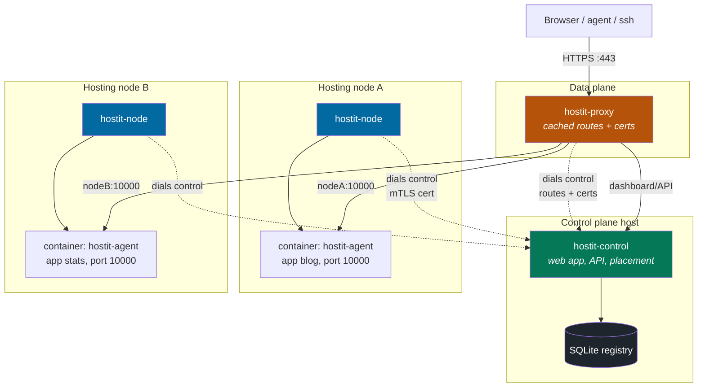
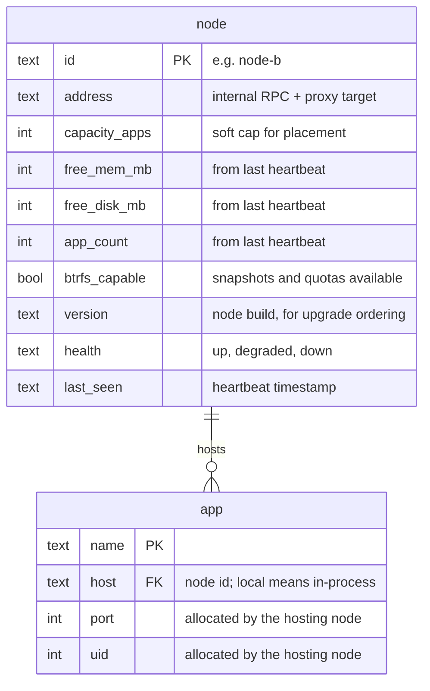
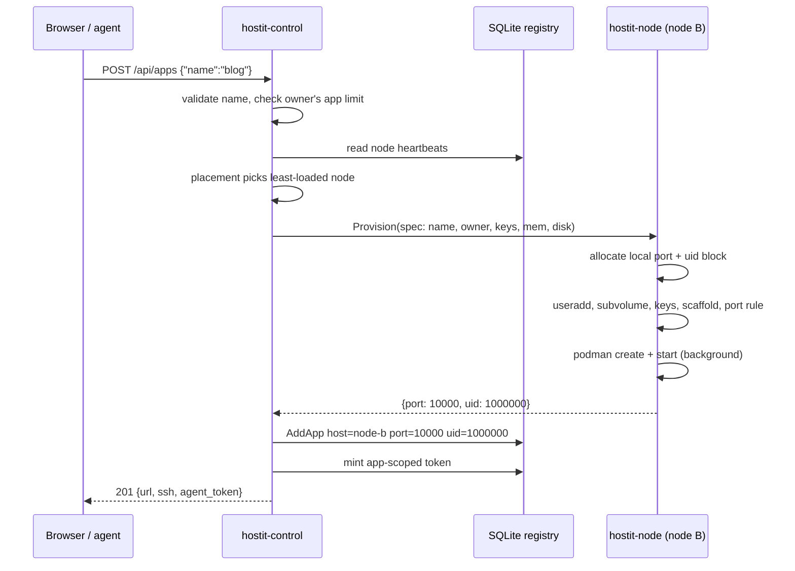
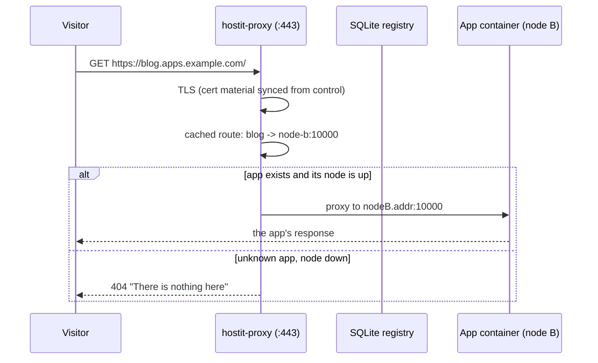
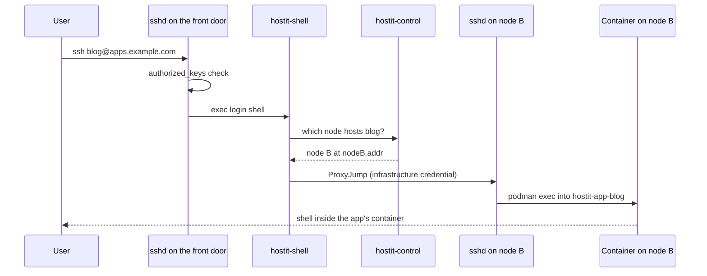
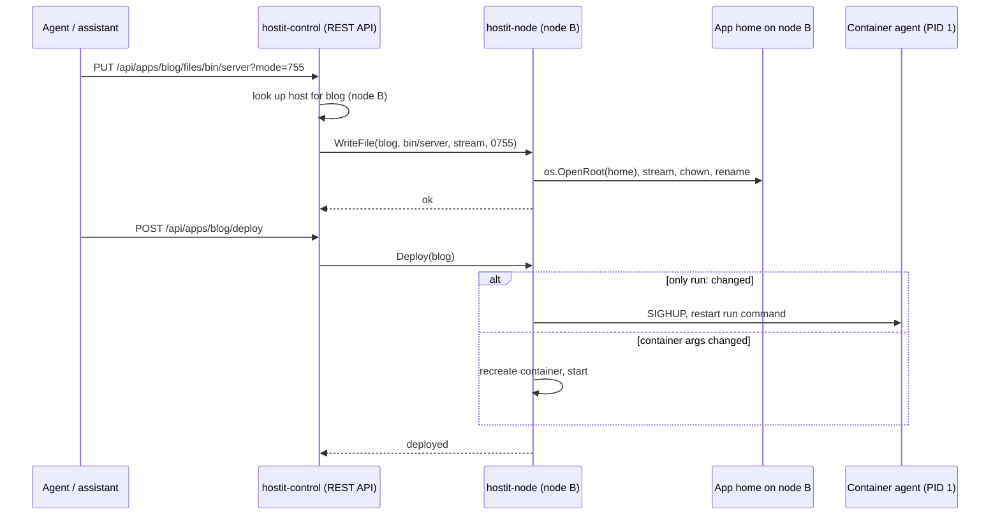
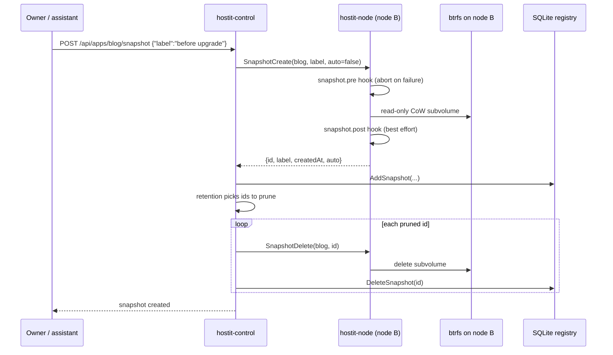

# hostit multi-node

### One front door, many machines

Four services -- control, node, proxy, and the in-container agent --
colocatable on one host or split across machines

design: <code>plans/260807-hostit-multinode.md</code> &middot; phase 1: <code>plans/260815-hostit-nodeagent.md</code>

---

# The problem

Today one root daemon on one droplet **is** the platform: TLS, proxy, dashboard,
API, assistant -- and every Unix user, container, port and subvolume apps are
made of.

<v-clicks>

- One machine's CPU, RAM, disk and port range is the **ceiling for every app**
- A busy app and a noisy neighbor share one core
- The goal is capacity, **not** HA: no failover, no live migration, registry stays single-writer

</v-clicks>

<v-click>

<b>Non-negotiable:</b> hostit stays deployable on <b>one server</b> (a $6
droplet): all four services colocated, zero extra configuration.
Localhost-network hops between them are fine -- the one-server story is the
requirement, not zero hops.

</v-click>

---

# Four binaries, four services

One host (the default) or split out. `hostit-node` and `hostit-proxy` **dial control**.

#### `hostit-control` -- control plane

Serves the **web app + REST API**, **owns the SQLite database** (apps, users,
tokens, snapshot metadata, domains, nodes), name validation and limits,
placement, cert management, the assistant. Accepts node/proxy connections.

#### `hostit-node` -- the machine half

Dials control; executes every node-local operation on its own machine: Unix
users + homes, containers + units, btrfs subvolumes/snapshots/quotas, port +
uid allocation, nft rules, `os.OpenRoot` files, self-maintenance loops.
**Stateless** about the platform.

#### `hostit-proxy` -- dumb data plane

Dials control, caches the **routing table** (`<app>.<base>` &rarr;
`<node-ip>:port`, dashboard &rarr; control) and cert material, and serves from
the cache -- **apps keep serving while control or a node daemon restarts**.
N proxies on different hosts, or one colocated with control (most likely).

#### `hostit-agent` -- inside the container

Unchanged meaning: the PID-1 binary in every app container -- runs the app
process, leaves the state breadcrumb, handles start/stop/restart signals.

---

# Why the node half cannot just be "remoted"

The tempting shortcut -- keep `app.Manager` on the control plane, SSH the commands over --
throws away the safety model.

<v-clicks>

- **`os.OpenRoot` needs the real path on the real machine.** Its guarantee is the
  kernel refusing to follow a symlink out of the opened root. A "remote open" is
  just a string the control plane hopes the node honored.
- **btrfs is local syscalls.** A snapshot is a reflink on one filesystem; a quota
  is an `EDQUOT` at write time. There is nothing to call remotely -- the operation
  *is* the filesystem.
- **podman runs where the container is.** exec, stats, idmapped rootfs mounts,
  netns -- plus the locking and caching the Manager does in-process.

</v-clicks>

<v-click>

So the **whole node-local half moves** behind one interface -- `NodeAgent` --
with a `localNodeAgent` (today's in-process code) and a `remoteNodeAgent`
(RPC client to a `hostit-agent`).

</v-click>

---

# Target architecture

Dashed = dialed control connections (per-node mTLS certs). App traffic
never traverses control -- the proxy serves node targets from its **local
cache**, so control and node daemons restart without dropping a request.

---

# Database structure

The registry stays central and single-writer on `hostit-control`. One new table, two
app columns.

---

# Consistency model

<v-clicks>

- **Nodes own local resources; the registry records the outcome.** Only the node
  can see its own free ports and uid blocks, so `Provision` allocates and
  *returns* them; control writes `(host, port, uid)` into the app row.
- **Snapshot subvolumes are node-local, metadata is central**: the id/label rows
  live in the `snapshot` table; retention policy runs on control and drives
  `SnapshotDelete` on the node.
- **Reconciliation over consensus.** Control restart: reload the `node` table,
  resume heartbeats -- containers never stopped serving (and the proxy keeps
  routing from its cache). Node restart: `hostit-node`
  comes up stateless, runs its reconcile loops, and desired state is re-asserted
  lazily by the next `Ensure`/`Deploy`.
- **Drift surfaces, then heals**: `States()` feeds control's state cache, so a
  mismatch shows on the dashboard and is corrected by the next lifecycle call --
  no distributed protocol.

</v-clicks>

---

# Flow: creating an app

Placement picks a node; the node allocates and builds; control records what
came back. The node is stateless -- the registry is the only durable record.

---

# Flow: serving an HTTP request

The proxy serves from its locally cached routing table -- no control-plane
round trip on the hot path, and no interruption while control restarts.

---

# Flow: SSH via one front door

One SSH endpoint: the front door host (where the proxy lives). The login shell
asks control which node hosts the app, then jumps.
For a `local` app there is no jump -- `podman exec` in-process, exactly today.

---

# SSH credentials: two separate trust edges

<v-clicks>

- The **tenant's keys never move**: the managed `authorized_keys` lives where the
  app user lives -- on the node, written by `SetKeys`. That authenticates the end
  user, same as today.
- The **front door needs its own hop credential** to reach each node's
  container-exec path: a key trusted by each node's sshd (or the same mTLS
  identity as the RPC channel). The user never sees it.
- This credential is a **new trust edge**: scoped to container exec (never a node
  root shell), rotatable, and guarded like the node certificates. Compromising the front door
  was already game-over on one box; multi-node widens that blast radius to every
  node's containers.

</v-clicks>

---

# Flow: file write + deploy across the wire

Control is a pass-through; the bytes land through `os.OpenRoot` **on the
node**, where that guarantee actually exists.

The assistant's `AppOps` keeps its exact shape -- only the adapter behind it
resolves the app's node first.

---

# Flow: snapshot -- node cuts, control records

---

# IPC: the NodeAgent RPC surface

~25 primitives -- the node-local half of `app.Manager` as verbs. The spec travels
on every call; the node keeps nothing between calls.

**Lifecycle**
`Provision(spec) -> {port, uid}` &middot; `Deprovision` &middot; `Fork` (always placed on the source node)

**Deploy & process control**
`Deploy` / `Up` &middot; `Ensure` &middot; `Down` &middot; `Start` / `Stop` / `Restart` &middot;
`PowerOn` / `PowerOff` / `Reboot` &middot; `Status` &middot; `Logs` &middot; `Exec` &middot; `TerminalCommand`

**Files** (each through `os.OpenRoot` on the node)
`ListFiles` &middot; `ReadFile` &middot; `WriteFile` (streamed) &middot; `DeleteFile` &middot; `FileExists` &middot; `ExtractTar`

**Limits & keys**
`SetDiskLimit` &middot; `SetMemoryLimit` &middot; `SetKeys`

**Snapshots**
`SnapshotCreate -> metadata` &middot; `SnapshotDelete` &middot; `Rollback`

**Node-level**
`Heartbeat -> {freeMem, freeDisk, appCount, btrfsCapable, version, health}` &middot;
`States(names)` (batch, feeds control's state cache)

**Deliberately NOT on the wire**
`Readme` / `Description` / `SetDescription` / `ListSnapshots` -- compositions of
`ReadFile`/`WriteFile` + the registry, assembled on control

---

# IPC: transport and auth

<v-clicks>

- **Dedicated internal RPC**: the `NodeAgent` interface over HTTP+JSON, streamed
  for file bodies and logs, on a **private interface / VPN only**.
- **Nodes and proxies dial control**, not the other way around: control accepts,
  a node needs no public listener, and commands multiplex over the node's own
  connection. The proxy's channel is a subscription: routing table + certs.
- **Not the public agent REST API, structurally.** The internal surface is a
  superset with the most privileged verbs on the platform -- `Provision` creates
  a Unix user, `SetKeys` rewrites `authorized_keys`, `Deprovision` deletes a
  home. A separate channel means tenants *physically cannot address it*, instead
  of being policy-fenced on a shared one.
- **Auth: per-node mTLS certificate** (CN = node id), minted by
  `hostit-control node add` and configured as plain files on the node
  (`node-cert-file` / `node-key-file` / `cluster-ca-cert-file`). Shipped as
  mTLS-only; there is no bearer-token fallback and no join protocol.
- **Why not SO_PEERCRED?** On one box the kernel vouches for the calling uid over
  the unix socket. There is no kernel in the middle of a TCP connection --
  cross-node identity must be a cryptographic credential.
- **Versioned contract**: `node.version` from the heartbeat; the proxy tolerates
  agents one version behind (roll agents first).

</v-clicks>

---

# Risks, called out

<v-clicks>

- **A down node takes its apps offline** -- capacity, not HA. Must be explicit in
  the dashboard. Optional later: "evacuate" from last snapshots (a data-loss
  window decision).
- **Forks always land on the source node** (reflink = local); a hot node can
  accumulate forks until move/rebalance exists. A cross-node move is a full
  copy, never implied instant.
- **Network partition**: control marks the node `down` and the proxies drop its
  routes, even though its containers are fine. Heartbeat thresholds must
  tolerate blips; RPC timeouts must never wedge a control goroutine.
- **Certs are managed only by control, terminated only by proxies** -- hosting
  nodes never hold private keys. The proxy tier is the ingress bottleneck.

</v-clicks>

---

# Phased rollout

<v-clicks>

- **Phase 1 -- the seam, no behavior change** *(work plan: `260815-hostit-nodeagent.md`)*:
  `uid` column + backfill; split create/delete into control-plane vs
  `provision`/`deprovision`; define `NodeAgent` + `localNodeAgent`; route every
  caller through a one-entry `{"local": ...}` map. Single box byte-identical.
- **Phase 2 -- the binary split, one host**: `hostit-control`, `hostit-node`,
  `hostit-proxy` as separate systemd services over a localhost socket; the
  proxy serves from its cached routes. Then **2b**: the `node` table,
  config-file mTLS certs, a second machine dials in; place by hand.
- **Phase 3 -- invisible multi-node**: heartbeats, least-loaded placement,
  SSH ProxyJump.
- **Phase 4 -- move & rebalance**: snapshot-ship-provision-flip; optional
  evacuate-on-failure.

</v-clicks>

<v-click>

Four binaries, four systemd services: <code>hostit-control</code>,
<code>hostit-node</code>, <code>hostit-proxy</code> -- colocatable on one host
-- plus the unchanged in-container <code>hostit-agent</code>. New
<code>node</code> package for the dial-in RPC; <code>app</code> keeps
NodeAgent + the local implementation.

</v-click>
