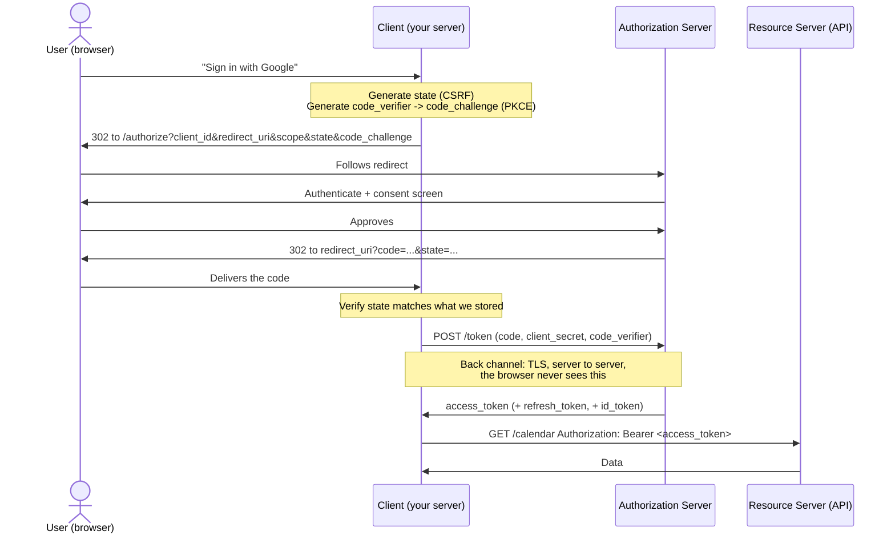
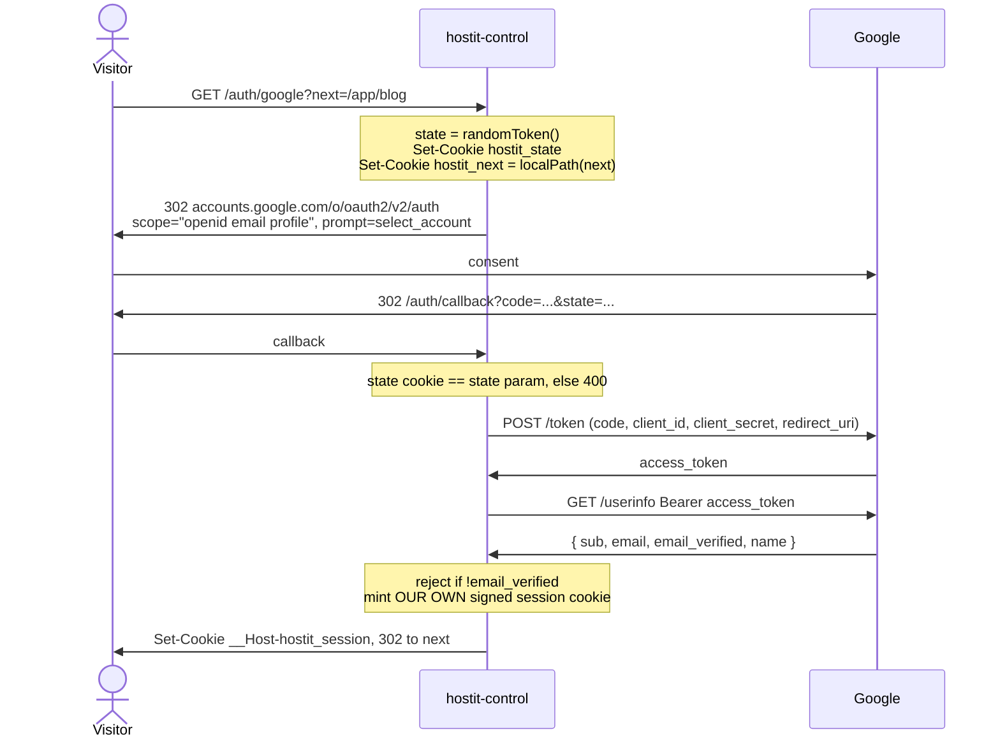

# OAuth 2.0 &middot; OIDC

### What the dance is actually for

<div class="mt-8 opacity-60">
Every parameter defends against something. This deck names the attack.
</div>

<div class="abs-br m-6 text-sm opacity-40">
heckel.io/hostit &middot; ends with <code>control/auth.go</code>
</div>

<style>
h1 {
  background-color: #10b981;
  background-image: linear-gradient(45deg, #34d399 20%, #0e7490 80%);
  background-size: 100%;
  -webkit-background-clip: text;
  -webkit-text-fill-color: transparent;
}
</style>

---
transition: fade-out
---

# How to read this deck

Most OAuth explanations list the steps. That teaches you to copy a flow without
knowing which parts you may skip -- which is how people ship the insecure variants.

- **The problem** -- what people did before, and why it was terrible
- **The roles** -- four parties, and which one you are
- **The flow** -- authorization code, one step at a time, with the attack each step blocks
- **OAuth vs OIDC** -- authorization vs authentication, and why the difference bites
- **The tokens** -- access, refresh, ID; what each is and is not
- **What's new** -- OAuth 2.1, PKCE-for-everyone, resource indicators, CIMD
- **hostit today** -- the real code, and an honest list of what it does not do

<div class="mt-8 text-sm opacity-60">
Rule of thumb throughout: if you cannot say what an attack a parameter prevents,
you do not yet know why it is there.
</div>

---
layout: section
---

# 1. The problem

---

# The password anti-pattern

Before OAuth, "let this site read your contacts" meant **giving that site your
password**.

<div class="grid grid-cols-2 gap-8 mt-6">
<div>

**What went wrong**

- The site can now do *everything*, not one thing
- You cannot revoke it without changing your password
- Revoking breaks every other site too
- The site stores your password, so its breach is your breach
- Two-factor auth is impossible

</div>
<div>

**What you actually wanted to say**

> This *specific* app may read *only* my calendar,
> until I say otherwise, and I can revoke it
> without touching anything else.

That sentence is the whole of OAuth. Everything else
is mechanism.

</div>
</div>

<div class="mt-8 p-4 border-l-4 border-emerald-500 bg-emerald-500/5">
OAuth is a <b>delegation</b> protocol. It exists so a user can grant a program
<i>narrow, revocable</i> access to their data <b>without sharing a credential</b>.
</div>

---

# The four roles

Naming these correctly is most of the battle -- almost every OAuth bug is someone
confusing two of them.

| Role | Spec name | Google Calendar example | hostit example |
|---|---|---|---|
| The human | **Resource owner** | You | You, signing in |
| The thing wanting access | **Client** | The app you're using | `hostit-control` |
| The API holding the data | **Resource server** | Google Calendar API | -- |
| The thing that issues tokens | **Authorization server** | Google's OAuth endpoints | Google |

<div class="mt-6 grid grid-cols-2 gap-6">
<div class="p-3 border border-gray-500/30 rounded">

**Confidential client** -- can keep a secret. A server-side
app with a `client_secret` in its config. **hostit is one.**

</div>
<div class="p-3 border border-gray-500/30 rounded">

**Public client** -- cannot keep a secret. SPAs, mobile,
CLI tools. The binary ships to the attacker.

</div>
</div>

<div class="mt-4 text-sm opacity-70">
The resource server and the authorization server are often the same company but are
<i>always</i> different roles. MCP makes the split explicit, and it matters.
</div>

<style>
table { font-size: 0.70em; line-height: 1.35; }
table :is(td, th) { padding-top: 0.22rem; padding-bottom: 0.22rem; }
</style>


---
layout: section
---

# 2. The authorization code flow

---

# The flow, end to end



<div class="mt-2 text-sm opacity-70">
The <b>code</b> travels through the browser. The <b>token</b> never does. That split is
the entire design.
</div>

---

# Why a code at all? Why not just hand over the token?

Because the front channel is not trustworthy.

<div class="grid grid-cols-2 gap-6 mt-4">
<div>

**The front channel** (browser redirects)

- Lands in browser history
- Lands in server access logs
- Leaks via `Referer` headers
- Visible to extensions, proxies, shoulders

So it carries the **code**: single-use, short-lived
(~60s), and *useless on its own*.

</div>
<div>

**The back channel** (server to server)

- Direct TLS, client to authorization server
- No browser involved
- Authenticated with `client_secret` or PKCE

So it carries the **token**: long-lived, powerful,
and never written anywhere a browser can see.

</div>
</div>

<div class="mt-6 p-4 border-l-4 border-amber-500 bg-amber-500/5">
This is why the old <b>implicit flow</b> (token straight back in the URL fragment) is
dead. OAuth 2.1 removes it outright. If you see <code>response_type=token</code>, it is
a bug.
</div>

---

# Every parameter blocks an attack (1/2)

The classics. If you cannot name the attack, you do not yet know why the parameter is there.

| Parameter | Blocks |
|---|---|
| `state` | **CSRF / login fixation.** An attacker tricks your browser into completing *their* auth, silently linking your session to their account. Random value, stored client-side, compared on return. |
| `redirect_uri`<br/>(pre-registered, exact match) | **Open redirect / code theft.** Without exact matching, `?redirect_uri=evil.com` mails the code straight to the attacker. |
| `code_challenge` /<br/>`code_verifier` (PKCE) | **Code interception.** A malicious app registers your custom URL scheme and grabs the code. Useless without the verifier only the real client holds. |
| `client_secret` | Proves the client's identity on the back channel. Confidential clients only. |

<style>
table { font-size: 0.70em; line-height: 1.35; }
table :is(td, th) { padding-top: 0.22rem; padding-bottom: 0.22rem; }
</style>

---

# Every parameter blocks an attack (2/2)

The identity-era additions. These exist because one client now talks to *many* servers.

| Parameter | Blocks |
|---|---|
| `nonce` (OIDC) | **ID token replay.** Binds the ID token to *this* login attempt, so a captured one cannot be re-presented. |
| `iss` (RFC 9207) | **Mix-up attacks.** With more than one authorization server in play, tells you which one actually answered -- so you do not send a code minted by A to B. |
| `resource` (RFC 8707) | **Confused deputy.** Binds the token's audience to one specific API, so a malicious resource server cannot replay your token somewhere else. |
| `aud` (in the ID token) | **Token substitution.** The token names who it was minted *for*; if that is not you, reject it. |

<style>
table { font-size: 0.70em; line-height: 1.35; }
table :is(td, th) { padding-top: 0.22rem; padding-bottom: 0.22rem; }
</style>


---

# PKCE: from mobile hack to universal default

**P**roof **K**ey for **C**ode **E**xchange -- pronounced "pixie", RFC 7636.

<div class="grid grid-cols-2 gap-6 mt-4">
<div>

**How it works**

```text
1. verifier  = random(43..128 chars)
2. challenge = BASE64URL(SHA256(verifier))

/authorize  ... &code_challenge=<challenge>
                &code_challenge_method=S256

/token      ... &code_verifier=<verifier>
```

The server hashes the verifier and compares. Only
whoever generated it can redeem the code.

</div>
<div>

**Why it went universal**

Originally for mobile apps that could not hold a
secret. But it also defends a *confidential* client
against a stolen code -- so OAuth 2.1 requires it
for **all** clients, public and confidential.

<div class="mt-4 p-3 border border-gray-500/30 rounded text-sm">
Never use <code>code_challenge_method=plain</code>.
It sends the verifier in the front channel, which is
the thing you were defending.
</div>

</div>
</div>

---
layout: section
---

# 3. OAuth vs OIDC

---
layout: statement
---

# OAuth 2.0 tells you *what an app may do*.
# It does **not** tell you *who the user is*.

<div class="mt-8 text-lg opacity-70">
Using an access token as proof of identity is the single most common OAuth mistake.
</div>

---

# Why "log in with OAuth" is subtly wrong

An access token is a **bearer** token: it says *the holder may call this API*. It says
nothing about who obtained it, or who it was issued to.

<div class="grid grid-cols-2 gap-6 mt-4">
<div>

**The confused deputy attack**

1. You log in to `evil.com` with Google
2. `evil.com` now holds a valid Google access token for you
3. `evil.com` sends *your* token to `goodsite.com`
4. `goodsite.com` calls `/userinfo` with it, gets your email
5. `goodsite.com` logs the attacker in **as you**

The token was never bound to `goodsite.com`.

</div>
<div>

**What OIDC adds**

OpenID Connect is a thin **identity layer on top of
OAuth 2.0**. It adds:

- The **`id_token`**: a signed JWT about *the user*
- `aud` -- who the token was issued **for**
- `iss` -- who issued it
- `nonce` -- which login attempt it belongs to
- The `openid` scope, `/userinfo`, and discovery

`aud` is what kills the attack above.

</div>
</div>

---

# The ID token

A JWT: `header.payload.signature`, signed by the authorization server.

```json
{
  "iss": "https://accounts.google.com",   // who issued it -- MUST match expected
  "aud": "1234.apps.googleusercontent.com", // MUST be YOUR client_id
  "sub": "110169484474386276334",         // stable user id -- the real primary key
  "email": "phil@heckel.io",
  "email_verified": true,                 // MUST check before trusting email
  "nonce": "n-0S6_WzA2Mj",                // MUST match what you sent
  "exp": 1766500000, "iat": 1766496400
}
```

<div class="grid grid-cols-2 gap-4 mt-4 text-sm">
<div class="p-3 border-l-4 border-red-500 bg-red-500/5">

**`sub`, not `email`, is the identity.** Emails get
reassigned, changed, and re-registered. `sub` is
stable per issuer.

</div>
<div class="p-3 border-l-4 border-red-500 bg-red-500/5">

**`email_verified: false` is a takeover.** Anyone can
sign up at an IdP claiming your address. If you match
users by email, check this or you hand over accounts.

</div>
</div>

---

# Validating an ID token

<div class="grid grid-cols-2 gap-6">
<div>

**The full check**

1. Signature verifies against the issuer's **JWKS**
   (`jwks_uri`, keys rotate -- cache with TTL)
2. `iss` exactly matches expected issuer
3. `aud` contains **your** `client_id`
4. `exp` in the future, `iat` sane
5. `nonce` matches this login attempt
6. `email_verified` is true before trusting `email`

</div>
<div>

**The exemption people miss**

OIDC Core &sect;3.1.3.7 note 1: if you got the token
**directly from the token endpoint over TLS**, with
a code you obtained yourself, the signature check is
optional -- TLS already authenticated the issuer.

It becomes mandatory the moment a token is passed
to you by *anyone else*.

<div class="mt-3 text-sm opacity-70">
This exemption is why hostit's approach is sound -- see "Is skipping the ID token a bug?"
</div>

</div>
</div>

---

# The three tokens

| | **Access token** | **Refresh token** | **ID token** |
|---|---|---|---|
| **Answers** | May the holder call this API? | May I get another access token? | Who is the user? |
| **Audience** | The resource server | The authorization server | **The client** |
| **Lifetime** | Minutes to an hour | Weeks to forever | Seconds -- it is a login receipt |
| **Format** | Opaque *or* JWT | Opaque | **Always** a JWT |
| **Send to an API?** | Yes, that is the point | **Never** | **Never** |
| **Store it?** | Cache till expiry | Yes, encrypted -- the crown jewel | No, consume and discard |

<div class="mt-3 p-3 border-l-4 border-emerald-500 bg-emerald-500/5 text-sm">
The ID token is <b>not</b> a session. It proves a login <i>happened</i>. You then mint
your own session. Sending an ID token to an API is a category error -- its
<code>aud</code> is you, not them.
</div>

<style>
table { font-size: 0.70em; line-height: 1.35; }
table :is(td, th) { padding-top: 0.22rem; padding-bottom: 0.22rem; }
</style>


---

# Scopes, consent, and refresh

<div class="grid grid-cols-2 gap-6">
<div>

**Scopes are a request, not a grant**

You ask for `calendar.readonly`; the user may approve
less. **Always** read the granted scopes from the
response -- never assume you got what you asked for.

**Incremental authorization** beats the wall of doom:
ask for `openid email` at sign-up, ask for calendar
access the first time they use the calendar feature.
Consent screens listing nine scopes get abandoned.

</div>
<div>

**Refresh tokens**

`offline_access` (or Google's `access_type=offline`)
gets you one. Without it, access ends when the user
closes the tab.

**Rotation**: each refresh returns a *new* refresh
token and invalidates the old. If an old one is
reused, the AS revokes the whole family -- that is how
theft is detected.

<div class="mt-3 p-2 border border-amber-500/40 rounded text-sm">
Google only returns the refresh token on the <b>first</b>
consent. Lose it and you need <code>prompt=consent</code>
to get another.
</div>

</div>
</div>

---

# Discovery: how a client learns the endpoints

Nobody hardcodes URLs any more.

```text
GET https://accounts.google.com/.well-known/openid-configuration
```

```json
{
  "issuer": "https://accounts.google.com",
  "authorization_endpoint": "https://accounts.google.com/o/oauth2/v2/auth",
  "token_endpoint": "https://oauth2.googleapis.com/token",
  "userinfo_endpoint": "https://openidconnect.googleapis.com/v1/userinfo",
  "jwks_uri": "https://www.googleapis.com/oauth2/v3/certs",
  "scopes_supported": ["openid", "email", "profile"],
  "code_challenge_methods_supported": ["S256"]
}
```

- **OIDC Discovery** -- `/.well-known/openid-configuration`
- **OAuth AS Metadata** (RFC 8414) -- `/.well-known/oauth-authorization-server`

<div class="mt-3 text-sm opacity-70">
Both exist for historical reasons. A robust client tries both.
</div>

---
layout: section
---

# 4. What changed recently

---

# OAuth 2.1 and the modern additions

<div class="grid grid-cols-2 gap-6">
<div>

**OAuth 2.1** (consolidating draft) mostly *removes*:

- Implicit flow -- **gone**
- Resource Owner Password Credentials -- **gone**
- PKCE -- **required for all clients**
- Exact-match redirect URIs -- **required**
- Bearer tokens in query strings -- **forbidden**

Nothing here is new advice. It is a decade of
security BCPs finally made normative.

</div>
<div>

**New building blocks**

- **RFC 8707** `resource=` -- bind a token to one API
- **RFC 9728** Protected Resource Metadata -- a
  resource server advertises *its* auth server
- **RFC 9207** `iss` in the response -- defeats mix-up
- **CIMD** -- `client_id` *is* an HTTPS URL

</div>
</div>

<div class="mt-6 p-4 border-l-4 border-emerald-500 bg-emerald-500/5">
Together these let a client talk to a server it has <b>never met</b>: discover the auth
server from the resource, register by URL, and get a token scoped to that one
resource. That is exactly the MCP problem.
</div>

---

# Client ID Metadata Documents

The newest piece, and the one that changes the cost of building a broker.

<div class="grid grid-cols-2 gap-6 mt-2">
<div>

**The old answer: Dynamic Client Registration**
(RFC 7591) -- `POST /register`, get back a
`client_id` + secret, store it **per authorization
server**, re-register when it changes.

MCP has now **deprecated DCR**, kept only for
backwards compatibility.

<div class="mt-6 p-3 border-l-4 border-emerald-500 bg-emerald-500/5 text-sm">

**Why hostit should care:** the broker plan priced
client registration as most of its cost. Serve one JSON
file and that half evaporates -- *where CIMD is
supported*. Google, Slack and GitHub do not; this is an
MCP-ecosystem answer.

</div>

</div>
<div>

**The new answer: your `client_id` is a URL**

```json
{
  "client_id":
    "https://apps.heckel.io/oauth/client.json",
  "client_name": "hostit",
  "redirect_uris": [
    "https://apps.heckel.io/auth/callback"
  ]
}
```

The AS fetches it, checks `client_id` == the URL, and
shows `client_name` on consent. **No registration call,
no stored credentials, portable across servers.**

</div>
</div>

---
layout: section
---

# 5. How hostit does it

---

# hostit's sign-in, as built

`control/auth.go` + `control/server_handler_auth.go`. Google only, confidential client.



---

# What hostit does, precisely

<div class="grid grid-cols-2 gap-6">
<div>

**Does do**

- Authorization **code** flow -- no implicit
- **Confidential client** with a real `client_secret`
- **`state` cookie** compared on return (CSRF)
- **`localPath(next)`** -- the post-login target is
  forced to a path on this host, so an attacker-supplied
  `?next=` cannot become an open redirect
- **Rejects `email_verified: false`** -- the account
  takeover two slides back
- Mints its **own** stateless signed session; Google's
  token is used once and dropped
- `__Host-` cookie prefix, so no subdomain can set it

</div>
<div>

**Does not do**

- **No `id_token` parsing.** It calls `/userinfo`
  with the access token instead
- **No PKCE.** Confidential client, code never leaves
  the back channel
- **No `nonce`** -- only meaningful with an `id_token`
- **No refresh token.** Login is a one-shot identity
  check; there is nothing to refresh
- **No discovery.** The three Google URLs are consts
- **One provider.** Google, or the admin-token
  breakglass path

</div>
</div>

<style>
li { line-height: 1.3; margin-top: 0.1rem; font-size: 0.92em; }
</style>

---
layout: center
---

# Is skipping the ID token a bug?

<div class="text-xl mt-2 mb-6 opacity-80">
No -- but it is a decision worth stating.
</div>

<div class="text-left max-w-3xl text-base opacity-90">

hostit gets the access token **directly from Google's token endpoint over TLS**, using
a code it obtained itself, and immediately spends it on `/userinfo` at a hardcoded
Google URL. There is no third party in the path, so there is no unbound token to
confuse it -- the OIDC &sect;3.1.3.7 exemption applies, and `aud` has nothing to protect
against here.

**The cost is one extra network round trip per login**, and a dependency on `/userinfo`
being up. Parsing the `id_token` already in the token response would remove both.

**It stops being fine** the moment hostit accepts a token minted by anyone else -- a
second IdP, an SSO proxy, a client passing one in. Then `aud`, `iss` and signature
validation become mandatory, not optional.

</div>

---

# What connections would change

Sign-in is the easy half: one provider, one scope set, no stored credentials.
**Connections invert every one of those.**

| | Sign-in today | Connections |
|---|---|---|
| Providers | 1 (Google) | Google, GitHub, Slack, Jira, Linear, arbitrary MCP... |
| Scopes | Fixed `openid email profile` | Per capability, incremental, re-consented |
| Refresh token | None | **The core asset** -- encrypted at rest, rotated |
| Token lifetime | Used once, discarded | Long-lived, refreshed for years |
| Who holds it | Nobody | hostit, on behalf of an owner |
| Failure mode | Login fails, retry | Silent expiry, revocation, scope drift |
| Discovery | Hardcoded consts | Required -- you cannot hardcode "any MCP server" |

<div class="mt-4 p-4 border-l-4 border-amber-500 bg-amber-500/5">
None of that is exotic OAuth. It is <b>custody</b>, <b>lifecycle</b> and <b>provider
catalog</b> -- which is why the integrations deck argues the hard part was never the
protocol.
</div>

<style>
table { font-size: 0.70em; line-height: 1.35; }
table :is(td, th) { padding-top: 0.22rem; padding-bottom: 0.22rem; }
</style>


---
layout: center
class: text-center
---

# The short version

<div class="text-left max-w-2xl mx-auto mt-6">

- OAuth delegates **authority**; OIDC adds **identity**. Never use the first as the second.
- The **code** goes through the browser, the **token** never does.
- Every parameter blocks a named attack. `state` = CSRF. PKCE = code theft. `aud` = confused deputy. `iss` = mix-up.
- `sub` is the user, not `email` -- and check `email_verified`.
- The ID token is a **login receipt**, not a session and not an API credential.
- hostit runs a clean confidential-client code flow, deliberately skipping the ID token because it never handles a token it did not fetch itself.

</div>

<div class="mt-10 text-sm opacity-50">
Code: <code>control/auth.go</code>, <code>control/server_handler_auth.go</code>, <code>control/session.go</code>
</div>
