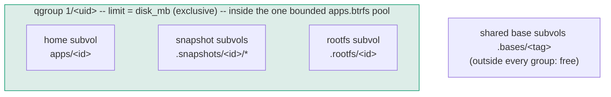
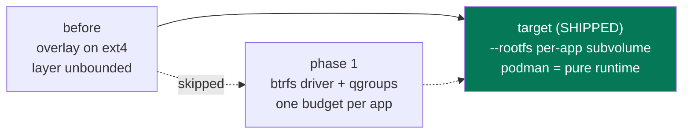

# hostit storage

### Hard caps, and the from-scratch shape

<div class="mt-8 opacity-60">
One budget per app, enforced by the filesystem -- and the from-scratch shape it
landed in (this is implemented, not a plan)
</div>

<div class="abs-br m-6 text-sm opacity-40">
design: <code>plans/260813-hostit-disk-hard-cap.md</code>
</div>

<style>
h1 {
  background-color: #10b981;
  background-image: linear-gradient(45deg, #34d399 20%, #0e7490 80%);
  background-size: 100%;
  -webkit-background-clip: text;
  -webkit-text-fill-color: transparent;
}
</style>

---
transition: fade-out
---

# The incident that started this

A tenant filled the host to 100% -- from inside a **10 MB-quota'd** app.

```console
root@app:~# dd if=/dev/zero of=/usr/bin/bb bs=1M count=8000
8000+0 records out                       # ...no error, host disk now 100% full
```

```console
$ podman rm -f hostit-app-8f12a21f7270
Error: saving container ... state: database or disk is full   # podman wedged too
```

<div class="grid grid-cols-2 gap-6 mt-6">
<div v-click class="p-4 rounded border border-gray-400 border-opacity-30">

**What was capped**

The app **home** (`/home/app`): a btrfs subvolume with a qgroup --
writes past `disk_mb` fail with EDQUOT. Worked as designed.

</div>
<div v-click class="p-4 rounded border border-gray-400 border-opacity-30">

**What was not**

Everything else (`/usr`, `/tmp`, `/root`, ...): the container's **writable
overlay layer** on the ext4 root fs. Unquota'd -- and shared with the
daemon's SQLite and podman's own state DB.

</div>
</div>

<div class="mt-6 text-sm opacity-60">
Requirement: a <b>hard cap</b> -- the dd itself fails at the limit. No passive
monitoring, nothing that cuts an app off after the fact.
</div>

---

# What the box allows (all verified live)

| Mechanism | Verdict |
|---|---|
| `podman create --storage-opt size=` (overlay driver) | **Dead end** -- "only supported for backingFS XFS. Found extfs" |
| ext4 quota, old style (`quotacheck`, `aquota.user`) | **Dead end** -- "Quota format not supported in kernel" |
| ext4 **journaled** usrquota per app uid | **Works** -- but `tune2fs -O quota` needs the root fs **unmounted**: a maintenance reboot per node |
| podman **btrfs storage driver** + qgroup on the layer subvolume | **Works, no reboot** -- every layer is a real subvolume |

<div class="mt-4 text-sm opacity-60">
The overlay files are owned by the app's userns-mapped host uid, which is what
makes the uid-quota route possible at all -- but the btrfs route wins: same
mechanism as the homes, and no offline filesystem surgery.
</div>

---

# The key discovery: layers are subvolumes

Switch `storage.conf` from `overlay` to `btrfs`, and podman's layers stop being
plain directories:

```console
$ btrfs subvolume list /mnt/pool
ID 256 ... path storage/btrfs/subvolumes/9cc4592108bf...   # image layer
ID 257 ... path storage/btrfs/subvolumes/cbc548006a41...   # image layer
ID 258 ... path storage/btrfs/subvolumes/c5a69ef7ff00...   # container writable layer
```

A subvolume is something a **qgroup** can cap -- the exact mechanism (and nearly
the exact code) hostit already uses for app homes:

```console
$ btrfs qgroup limit -e 50M .../subvolumes/<container-layer>
$ podman exec app sh -c 'dd if=/dev/zero of=/usr/bin/aa bs=1M count=100'
dd: error writing '/usr/bin/aa': Disk quota exceeded
52101120 bytes (52 MB, 50 MiB) copied          # wrote exactly the cap, then ENOSPC
```

<div class="mt-4 text-sm opacity-60">
podman 4.9's btrfs driver rejects <code>--storage-opt size</code> -- irrelevant:
hostit sets the qgroup itself at container-create time.
</div>

---

# The gotcha worth a slide: exclusive, not referenced

The container layer is a **snapshot of the image subvolume**. Quota the wrong
counter and the cap is nonsense:

<div class="grid grid-cols-2 gap-6 mt-4">
<div class="p-4 rounded border border-red-400 border-opacity-40">

**Referenced limit (wrong)**

```console
$ btrfs qgroup limit 50M <layer>
$ podman start app        # FAILS
# the layer "references" the
# ~2GB shared image -> over
# budget before writing a byte
```

</div>
<div class="p-4 rounded border border-green-500 border-opacity-40">

**Exclusive limit (right)**

```console
$ btrfs qgroup limit -e 50M <layer>
$ podman start app        # fine
# only what the tenant ADDS
# counts; shared image bytes
# are free
```

</div>
</div>

<div class="mt-6 text-sm opacity-60">
Both behaviors observed live: the referenced cap wedged <code>podman start</code>
with EDQUOT; the exclusive cap let the container run and cut the dd off at
exactly ~50 MiB. Homes keep plain referenced limits -- they are standalone
subvolumes, not snapshots.
</div>

---
layout: section
transition: slide-up
---

# The decided design

Locked 2026-08-13 -- and these budget semantics are exactly what shipped.
(The "phase 1" packaging of them was skipped; the verdict slides at the end.)

---

# One pool, one budget per app



- **One shared pool** -- homes + rootfs + bases; the pool itself bounds total
  damage, so the root fs and the daemon's SQLite are safe even before per-app caps
- **One combined budget** -- `disk_mb` covers home + snapshots + rootfs via a
  hierarchical qgroup; bytes shared with the base are free (exclusive accounting)
- **Snapshots count** -- the budget is the true bytes an app pins; a churning app
  pays for its retention history
- **No more unlimited** -- `disk_mb: 0` now means the platform default (**2 GB**);
  admins set a big explicit number instead

---

# What the tenant experiences

Everywhere they can write, the budget is the budget:

```console
root@myapp:~# dd if=/dev/zero of=/home/app/big bs=1M count=4000
dd: error writing '/home/app/big': Disk quota exceeded          # home: EDQUOT

root@myapp:~# dd if=/dev/zero of=/usr/bin/evil bs=1M count=4000
dd: error writing '/usr/bin/evil': Disk quota exceeded          # rootfs: EDQUOT

root@myapp:~# apt-get install imagemagick                        # fine -- within budget
```

<div class="mt-6 text-sm opacity-60">
The write itself fails at the cap -- the app sees ENOSPC/EDQUOT like any full
disk, hostit does nothing at "runtime", and the host never wedges. The UI can
show usage vs budget, but nothing gates on it.
</div>

---

# Rejected: one btrfs loop per app

Tempting -- the loop file's size <i>is</i> the cap, no qgroups at all. Three costs kill it:

- **Fork loses its magic.** Fork is a reflink snapshot today: instant, free.
  Reflinks cannot cross filesystems -- per-app loops turn fork into a full copy.
- **The container layer stays unsolved.** Podman has one graphroot; per-app loops
  cannot hold per-app layers (without abandoning the storage driver entirely --
  which is the target shape, done properly).
- **Sparse or preallocated -- pick your poison.** Sparse loops oversubscribe the
  host (the host-fill risk returns); preallocated loops reserve everything up
  front (2 GB x N apps on a 24 GB disk).

<div class="mt-6 text-sm opacity-60">
The shared pool + qgroups keeps bounded-total <b>with</b> oversubscription --
the right trade for small boxes.
</div>

---

# Phase-1 layout: what would have sat where (never built)

```
apps.btrfs  (the existing loop image, grown; a real volume later)
  apps/
    <id>/                  # home subvols -- unchanged, referenced qgroup limit
  .snapshots/
    <id>/*                 # snapshot subvols -- join the app's qgroup
  containers/              # NEW: podman graphroot moves in (driver = btrfs)
    btrfs/subvolumes/
      <image-layer>...     # shared image subvols -- outside every app group, free
      <container-layer>    # each app's writable layer -- joins its qgroup, -e capped
```

The daemon's SQLite (`/var/lib/hostit/hostit.db`) and the OS stay on the ext4
root, **outside** the pool: however full the pool gets, the host never wedges.

<div class="mt-4 text-sm opacity-60">
Same pool, same qgroup mechanism everywhere; the only structural change would have
been the podman graphroot moving into the pool under the btrfs driver. <b>Verdict:
skipped</b> -- the from-scratch tree on the next slides shipped directly, and the
graphroot never moved.
</div>

---
layout: section
transition: slide-up
---

# From scratch

hostit owns all tenant storage, podman is just a runtime.
This is the shape that shipped -- the spike-validated details below became
the implementation.

---

# The target shape, as built: an app is subvolumes

```
apps/  (the existing loop pool; homes never moved)
  <id>/                   # home subvols -- exactly where they were
  .bases/
    <tag>/                # workspace rootfs, exported once per pinned tag (read-only)
  .rootfs/
    <id>/                 # container rootfs: snapshot of .bases/<tag>, chowned once
  .snapshots/
    <id>/*                # home snapshots -- all join the app's qgroup 1/<uid>
```

No image/layer storage for app containers at all:

```console
$ btrfs subvolume snapshot apps/.bases/1a3027527a55 apps/.rootfs/<id>      # instant CoW
$ podman create --uidmap 0:1196608:65536 --network slirp4netns ... \
    --rootfs /var/lib/hostit/apps/.rootfs/<id> hostit agent               # same isolation
```

<div class="mt-4 text-sm opacity-60">
The base is built once from the Containerfile and exported (atomically: temp
subvolume, sealed read-only, renamed into place); every app's rootfs is a free
snapshot of it. Apps were already pinned to image tags -- the pin now means
"which base subvolume". Flag order matters: everything after <code>--rootfs</code>
is the container command.
</div>

---

# Wait -- are containers not "never rebuilt"?

The actual requirement is narrower: **a Containerfile change
never recreates an existing app's container.** Each app is pinned to the image
tag it was built with, so new images only affect new apps. But containers ARE
recreated in normal operation:

- the app's own **config changes** (`hostit.yml` run:/env:, memory limit) -- the
  desired-args hash differs, `apply()` recreates
- a **daemon upgrade** -- the version is part of the container's identity (new
  binary may mount/flag things differently); `RestartStaleAgents` recreates every
  container (v0.8.7 did exactly this to roll out `--sdnotify=conmon`)

<div class="mt-4 text-sm opacity-60">
In the image-backed world every recreate threw away the writable layer:
<code>apt-get install</code> lived in that layer, so packages silently vanished on
the next deploy or upgrade -- a long-standing open TODO. Recreation is fine for
hostit (containers are cattle); it was the <b>layer dying with them</b> that hurt.
The rootfs model fixes exactly this: <b>a rootfs, once created, is never recreated
or reset</b> -- recreates keep the filesystem.
</div>

---

# Apt persistence, concretely

<div class="grid grid-cols-2 gap-6 mt-4">
<div class="p-4 rounded border border-red-400 border-opacity-40">

**Before (image-backed containers)**

```console
root@myapp:~# apt-get install ffmpeg
# ... works, lands in the writable layer

$ # owner edits hostit.yml, deploys
$ # -> config hash changed -> recreate

root@myapp:~# ffmpeg
bash: ffmpeg: command not found   # gone
```

</div>
<div class="p-4 rounded border border-green-500 border-opacity-40">

**Now (--rootfs subvolume)**

```console
root@myapp:~# apt-get install ffmpeg
# ... lands in .rootfs/<id>

$ # deploy -> recreate: podman gets the
$ # SAME rootfs subvolume back

root@myapp:~# ffmpeg -version
ffmpeg version 6.1.1 ...          # still there
```

</div>
</div>

<div class="mt-6 text-sm opacity-60">
The rootfs is the app's own persistent subvolume: the container process is
disposable, its filesystem is not. Recreates (config change, upgrades) are
lossless, and the never-rebuild-on-image-change pin is unchanged -- the app's
rootfs came from its pinned base and stays put.
</div>

---

# What the target buys (beyond the cap)

<div class="grid grid-cols-2 gap-6 mt-4">
<div v-click class="p-4 rounded border border-gray-400 border-opacity-30">

**apt-get survives** -- the rootfs is a persistent subvolume, so installed
packages live through container recreation. (A long-open TODO, closed as a side
effect.)

</div>
<div v-click class="p-4 rounded border border-gray-400 border-opacity-30">

**Rollback stays home-scoped (for now)** -- snapshots and rollback cover the
home; the rootfs simply persists through them. Snapshotting it alongside the
home is a natural extension, not built yet.

</div>
<div v-click class="p-4 rounded border border-gray-400 border-opacity-30">

**Multi-node migration is `btrfs send`** -- an app is a handful of subvolumes.
Moving it to another hosting node is send/receive + start. The cleanest possible
primitive for the `hostit-node` split.

</div>
<div v-click class="p-4 rounded border border-gray-400 border-opacity-30">

**No storage-driver dependency** -- podman gets a rootfs path plus the
userns/netns/cgroup flags hostit already passes. The less-maintained btrfs
graph driver never became load-bearing.

</div>
</div>

<div class="mt-4 text-sm opacity-60">
Cost: hostit now owns the base-rootfs lifecycle (export once per tag, GC only
unpinned bases -- a pinned base is never deleted, its extents are shared with
every pinned app) and leaves the standard image/layer world for app containers.
The image store remains the build input and the assistant sandbox host.
</div>

---

# Phase 1 -> target: the target won



| | Phase 1 (skipped) | Target (shipped) |
|---|---|---|
| Layer lives | podman graphroot (btrfs driver) | `.rootfs/<id>` subvolume |
| Budget | hierarchical qgroup (home+snaps+layer) | same semantics, `1/<uid>` |
| Image flow | unchanged (build + pinned tags) | build input; base subvolume per tag |
| apt persistence | no | **yes** |
| Node migration | home only | **whole app: btrfs send** |

<div class="mt-2 text-sm opacity-60">
The budget semantics decided for phase 1 carried to the target unchanged -- only
the layer's physical home differs. Shipped with a one-time startup migration:
keep each app's home state, drop pre-existing snapshots, build the rootfs from
the pinned tag, budget every app.
</div>

---
zoom: 0.8
---

# Or: skip phase 1 entirely? (Verdict: yes -- this is what happened)

Going straight to the target quietly drops phase 1's riskiest parts:

| | Incremental (phase 1 first) | Direct to target |
|---|---|---|
| Storage-driver migration | **yes** -- all nodes switch to the btrfs driver, images rebuild | **none** -- app containers stop using graph storage; overlay stays for builds + the assistant sandbox |
| btrfs graph driver risk | load-bearing | not used for apps |
| Throwaway work | layer-subvol qgroup plumbing, driver migration | none |
| New machinery | little | base export per tag, rootfs lifecycle (create/fork/delete), `--rootfs` under userns |
| Rough effort | days | 1.5-2.5 weeks incl. validation |

<div class="mt-4 text-sm opacity-60">
The open question was <code>--rootfs</code> with an id-mapped mount under the
per-app userns. The stage spike <b>failed</b> on this crun (uid_map EINVAL, then
/etc/mtab EOVERFLOW) -- resolved with the chown fallback: snapshot the base, then
<code>chown -R</code> the rootfs to the app's uid block once (1.6s for 57k files,
~47MB exclusive metadata; data extents stay shared), then plain
<code>--rootfs</code>. Direct was still the better deal, and it is the path that
shipped: nothing thrown away, no driver migration, apt persistence landed with
the cap.
</div>

---
layout: statement
transition: fade-out
---

# The filesystem says no, so hostit never has to.

<div class="mt-4 text-lg opacity-80">
One pool, one budget per app, enforced at write time.
</div>

<div class="mt-10 text-sm opacity-50">
plans/260813-hostit-disk-hard-cap.md &middot; validated on stage 2026-08-13 &middot; implemented (rootfs storage target)
</div>
