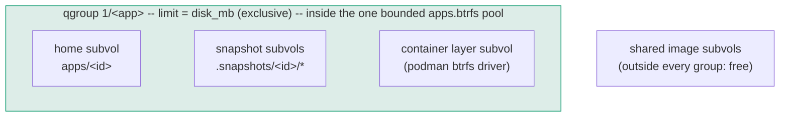
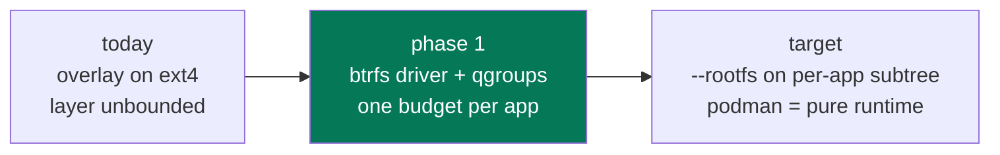

# hostit storage

### Hard caps, and the from-scratch shape

<div class="mt-8 opacity-60">
One budget per app, enforced by the filesystem -- and where the storage design
should end up
</div>

<div class="abs-br m-6 text-sm opacity-40">
design: <code>plans/260813-hostit-disk-hard-cap.md</code>
</div>

<style>
h1 {
  background-color: #10b981;
  background-image: linear-gradient(45deg, #34d399 20%, #0e7490 80%);
  background-size: 100%;
  -webkit-background-clip: text;
  -webkit-text-fill-color: transparent;
}
</style>

---
transition: fade-out
---

# The incident that started this

A tenant filled the host to 100% -- from inside a **10 MB-quota'd** app.

```console
root@app:~# dd if=/dev/zero of=/usr/bin/bb bs=1M count=8000
8000+0 records out                       # ...no error, host disk now 100% full
```

```console
$ podman rm -f hostit-app-8f12a21f7270
Error: saving container ... state: database or disk is full   # podman wedged too
```

<div class="grid grid-cols-2 gap-6 mt-6">
<div v-click class="p-4 rounded border border-gray-400 border-opacity-30">

**What was capped**

The app **home** (`/home/app`): a btrfs subvolume with a qgroup --
writes past `disk_mb` fail with EDQUOT. Worked as designed.

</div>
<div v-click class="p-4 rounded border border-gray-400 border-opacity-30">

**What was not**

Everything else (`/usr`, `/tmp`, `/root`, ...): the container's **writable
overlay layer** on the ext4 root fs. Unquota'd -- and shared with the
daemon's SQLite and podman's own state DB.

</div>
</div>

<div class="mt-6 text-sm opacity-60">
Requirement: a <b>hard cap</b> -- the dd itself fails at the limit. No passive
monitoring, nothing that cuts an app off after the fact.
</div>

---

# What the box allows (all verified live)

| Mechanism | Verdict |
|---|---|
| `podman create --storage-opt size=` (overlay driver) | **Dead end** -- "only supported for backingFS XFS. Found extfs" |
| ext4 quota, old style (`quotacheck`, `aquota.user`) | **Dead end** -- "Quota format not supported in kernel" |
| ext4 **journaled** usrquota per app uid | **Works** -- but `tune2fs -O quota` needs the root fs **unmounted**: a maintenance reboot per node |
| podman **btrfs storage driver** + qgroup on the layer subvolume | **Works, no reboot** -- every layer is a real subvolume |

<div class="mt-4 text-sm opacity-60">
The overlay files are owned by the app's userns-mapped host uid, which is what
makes the uid-quota route possible at all -- but the btrfs route wins: same
mechanism as the homes, and no offline filesystem surgery.
</div>

---

# The key discovery: layers are subvolumes

Switch `storage.conf` from `overlay` to `btrfs`, and podman's layers stop being
plain directories:

```console
$ btrfs subvolume list /mnt/pool
ID 256 ... path storage/btrfs/subvolumes/9cc4592108bf...   # image layer
ID 257 ... path storage/btrfs/subvolumes/cbc548006a41...   # image layer
ID 258 ... path storage/btrfs/subvolumes/c5a69ef7ff00...   # container writable layer
```

A subvolume is something a **qgroup** can cap -- the exact mechanism (and nearly
the exact code) hostit already uses for app homes:

```console
$ btrfs qgroup limit -e 50M .../subvolumes/<container-layer>
$ podman exec app sh -c 'dd if=/dev/zero of=/usr/bin/aa bs=1M count=100'
dd: error writing '/usr/bin/aa': Disk quota exceeded
52101120 bytes (52 MB, 50 MiB) copied          # wrote exactly the cap, then ENOSPC
```

<div class="mt-4 text-sm opacity-60">
podman 4.9's btrfs driver rejects <code>--storage-opt size</code> -- irrelevant:
hostit sets the qgroup itself at container-create time.
</div>

---

# The gotcha worth a slide: exclusive, not referenced

The container layer is a **snapshot of the image subvolume**. Quota the wrong
counter and the cap is nonsense:

<div class="grid grid-cols-2 gap-6 mt-4">
<div class="p-4 rounded border border-red-400 border-opacity-40">

**Referenced limit (wrong)**

```console
$ btrfs qgroup limit 50M <layer>
$ podman start app        # FAILS
# the layer "references" the
# ~2GB shared image -> over
# budget before writing a byte
```

</div>
<div class="p-4 rounded border border-green-500 border-opacity-40">

**Exclusive limit (right)**

```console
$ btrfs qgroup limit -e 50M <layer>
$ podman start app        # fine
# only what the tenant ADDS
# counts; shared image bytes
# are free
```

</div>
</div>

<div class="mt-6 text-sm opacity-60">
Both behaviors observed live: the referenced cap wedged <code>podman start</code>
with EDQUOT; the exclusive cap let the container run and cut the dd off at
exactly ~50 MiB. Homes keep plain referenced limits -- they are standalone
subvolumes, not snapshots.
</div>

---
layout: section
transition: slide-up
---

# The decided plan

Six decisions, locked 2026-08-13. Phase 1 ships on today's image flow;
the from-scratch shape is the target it converges to.

---

# One pool, one budget per app



- **One shared pool** -- homes + container storage; the pool itself bounds total
  damage, so the root fs and the daemon's SQLite are safe even before per-app caps
- **One combined budget** -- `disk_mb` covers home + snapshots + layer via a
  hierarchical qgroup; shared image bytes are free (exclusive accounting)
- **Snapshots count** -- the budget is the true bytes an app pins; a churning app
  pays for its retention history
- **No more unlimited** -- `disk_mb: 0` now means the platform default (**2 GB**);
  admins set a big explicit number instead

---

# What the tenant experiences

Everywhere they can write, the budget is the budget:

```console
root@myapp:~# dd if=/dev/zero of=/home/app/big bs=1M count=4000
dd: error writing '/home/app/big': Disk quota exceeded          # home: EDQUOT

root@myapp:~# dd if=/dev/zero of=/usr/bin/evil bs=1M count=4000
dd: error writing '/usr/bin/evil': Disk quota exceeded          # layer: EDQUOT

root@myapp:~# apt-get install imagemagick                        # fine -- within budget
```

<div class="mt-6 text-sm opacity-60">
The write itself fails at the cap -- the app sees ENOSPC/EDQUOT like any full
disk, hostit does nothing at "runtime", and the host never wedges. The UI can
show usage vs budget, but nothing gates on it.
</div>

---

# Rejected: one btrfs loop per app

Tempting -- the loop file's size <i>is</i> the cap, no qgroups at all. Three costs kill it:

- **Fork loses its magic.** Fork is a reflink snapshot today: instant, free.
  Reflinks cannot cross filesystems -- per-app loops turn fork into a full copy.
- **The container layer stays unsolved.** Podman has one graphroot; per-app loops
  cannot hold per-app layers (without abandoning the storage driver entirely --
  which is the target shape, done properly).
- **Sparse or preallocated -- pick your poison.** Sparse loops oversubscribe the
  host (the host-fill risk returns); preallocated loops reserve everything up
  front (2 GB x N apps on a 24 GB disk).

<div class="mt-6 text-sm opacity-60">
The shared pool + qgroups keeps bounded-total <b>with</b> oversubscription --
the right trade for small boxes.
</div>

---

# Phase-1 layout: what actually sits where

```
apps.btrfs  (the existing loop image, grown; a real volume later)
  apps/
    <id>/                  # home subvols -- unchanged, referenced qgroup limit
  .snapshots/
    <id>/*                 # snapshot subvols -- join the app's qgroup
  containers/              # NEW: podman graphroot moves in (driver = btrfs)
    btrfs/subvolumes/
      <image-layer>...     # shared image subvols -- outside every app group, free
      <container-layer>    # each app's writable layer -- joins its qgroup, -e capped
```

The daemon's SQLite (`/var/lib/hostit/hostit.db`) and the OS stay on the ext4
root, **outside** the pool: however full the pool gets, the host never wedges.

<div class="mt-4 text-sm opacity-60">
Same pool, same qgroup mechanism everywhere; the only structural change is the
podman graphroot moving into the pool under the btrfs driver. Compare with the
from-scratch tree later -- the difference is only where the layer lives.
</div>

---
layout: section
transition: slide-up
---

# From scratch

If the storage design started today: hostit owns all tenant storage,
podman is just a runtime.

---

# The target shape: an app is one subtree

```
pool/  (the existing loop pool works; a real device is a perf nicety for new nodes)
  bases/
    <image-tag>/          # workspace rootfs, exported once per pinned tag
  apps/
    <id>/                 # qgroup 1/<id>: limit = disk_mb -- the whole app
      home/               # the app home (as today)
      rootfs/             # container rootfs: reflink snapshot of bases/<tag>
      snapshots/          # home + rootfs snapshots
```

No image/layer storage for app containers at all:

```console
$ btrfs subvolume snapshot pool/bases/1a3027527a55 pool/apps/<id>/rootfs   # instant CoW
$ podman run --rootfs /pool/apps/<id>/rootfs \
    --uidmap 0:1196608:65536 --network slirp4netns ...                     # same isolation
```

<div class="mt-4 text-sm opacity-60">
The base is built once from the Containerfile and exported; every app's rootfs
is a free reflink of it. Apps are already pinned to image tags -- the pin
becomes "which base subvolume".
</div>

---

# Wait -- are containers not "never rebuilt"?

The actual requirement (and what is built) is narrower: **a Containerfile change
never recreates an existing app's container.** Each app is pinned to the image
tag it was built with, so new images only affect new apps. But containers ARE
recreated in normal operation:

- the app's own **config changes** (`hostit.yml` run:/env:, memory limit) -- the
  desired-args hash differs, `apply()` recreates
- a **daemon upgrade** -- the version is part of the container's identity (new
  binary may mount/flag things differently); `RestartStaleAgents` recreates every
  container (v0.8.7 did exactly this to roll out `--sdnotify=conmon`)

<div class="mt-4 text-sm opacity-60">
And every recreate throws away the writable layer: <code>apt-get install</code>
lives in that layer, so packages silently vanish on the next deploy or upgrade --
a long-standing open TODO. Recreation is fine for hostit (containers are cattle);
it is the <b>layer dying with them</b> that hurts.
</div>

---

# Apt persistence, concretely

<div class="grid grid-cols-2 gap-6 mt-4">
<div class="p-4 rounded border border-red-400 border-opacity-40">

**Today (and phase 1)**

```console
root@myapp:~# apt-get install ffmpeg
# ... works, lands in the writable layer

$ # owner edits hostit.yml, deploys
$ # -> config hash changed -> recreate

root@myapp:~# ffmpeg
bash: ffmpeg: command not found   # gone
```

</div>
<div class="p-4 rounded border border-green-500 border-opacity-40">

**Target (--rootfs subtree)**

```console
root@myapp:~# apt-get install ffmpeg
# ... lands in apps/<id>/rootfs

$ # deploy -> recreate: podman gets the
$ # SAME rootfs subvolume back

root@myapp:~# ffmpeg -version
ffmpeg version 6.1.1 ...          # still there
```

</div>
</div>

<div class="mt-6 text-sm opacity-60">
The rootfs is the app's own persistent subvolume: the container process is
disposable, its filesystem is not. Recreates (config change, upgrades) become
lossless, and the never-rebuild-on-image-change pin is unchanged -- the app's
rootfs came from its pinned base and stays put.
</div>

---

# What the target buys (beyond the cap)

<div class="grid grid-cols-2 gap-6 mt-4">
<div v-click class="p-4 rounded border border-gray-400 border-opacity-30">

**apt-get survives** -- the rootfs is a persistent subvolume, so installed
packages live through container recreation. (An open TODO, solved as a side
effect.)

</div>
<div v-click class="p-4 rounded border border-gray-400 border-opacity-30">

**Rollback covers system state** -- snapshot and roll back the rootfs with the
home: an app's installed packages travel with its data.

</div>
<div v-click class="p-4 rounded border border-gray-400 border-opacity-30">

**Multi-node migration is `btrfs send`** -- an app is literally one subtree.
Moving it to another hosting node is send/receive + start. The cleanest possible
primitive for the `hostit-node` split.

</div>
<div v-click class="p-4 rounded border border-gray-400 border-opacity-30">

**No storage-driver dependency** -- podman gets a rootfs path plus the
userns/netns/cgroup flags hostit already passes. The less-maintained btrfs
graph driver is no longer load-bearing.

</div>
</div>

<div class="mt-4 text-sm opacity-60">
Cost: hostit owns base-rootfs lifecycle (export on build, GC unused bases) and
leaves the standard image/layer world -- machinery hostit does not use anyway.
</div>

---

# Phase 1 -> target



| | Phase 1 (decided) | Target (from scratch) |
|---|---|---|
| Layer lives | podman graphroot (btrfs driver) | `apps/<id>/rootfs` subtree |
| Budget | hierarchical qgroup (home+snaps+layer) | same semantics, simpler membership |
| Image flow | unchanged (build + pinned tags) | base subvolume per tag |
| apt persistence | no | **yes** |
| Node migration | home only | **whole app: btrfs send** |

<div class="mt-2 text-sm opacity-60">
The budget semantics decided for phase 1 carry to the target unchanged -- only
the layer's physical home moves. Rollout: code (fail-open) -> stage migration +
dd acceptance test -> soak -> prod window.
</div>

---
zoom: 0.8
---

# Or: skip phase 1 entirely?

Going straight to the target quietly drops phase 1's riskiest parts:

| | Incremental (phase 1 first) | Direct to target |
|---|---|---|
| Storage-driver migration | **yes** -- all nodes switch to the btrfs driver, images rebuild | **none** -- app containers stop using graph storage; overlay stays for builds + the assistant sandbox |
| btrfs graph driver risk | load-bearing | not used for apps |
| Throwaway work | layer-subvol qgroup plumbing, driver migration | none |
| New machinery | little | base export per tag, rootfs lifecycle (create/fork/rollback/delete), `--rootfs :idmap` under userns |
| Rough effort | days | 1.5-2.5 weeks incl. validation |

<div class="mt-4 text-sm opacity-60">
The open question for going direct: <code>--rootfs</code> with an id-mapped mount
under the per-app userns (kernel 6.8 should support it; needs a stage spike). If
that spike passes, direct is the better deal: nothing thrown away, no driver
migration, and apt persistence lands with the cap.
</div>

---
layout: statement
transition: fade-out
---

# The filesystem says no, so hostit never has to.

<div class="mt-4 text-lg opacity-80">
One pool, one budget per app, enforced at write time.
</div>

<div class="mt-10 text-sm opacity-50">
plans/260813-hostit-disk-hard-cap.md &middot; validated on stage 2026-08-13
</div>
