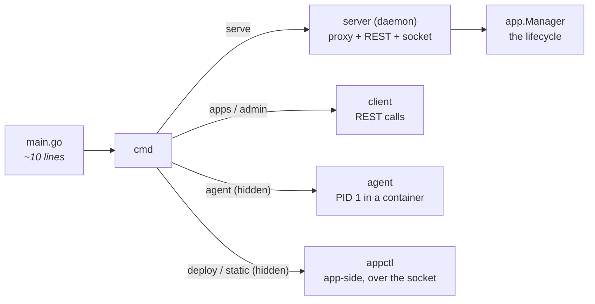
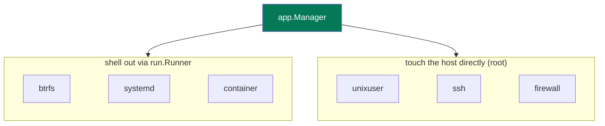
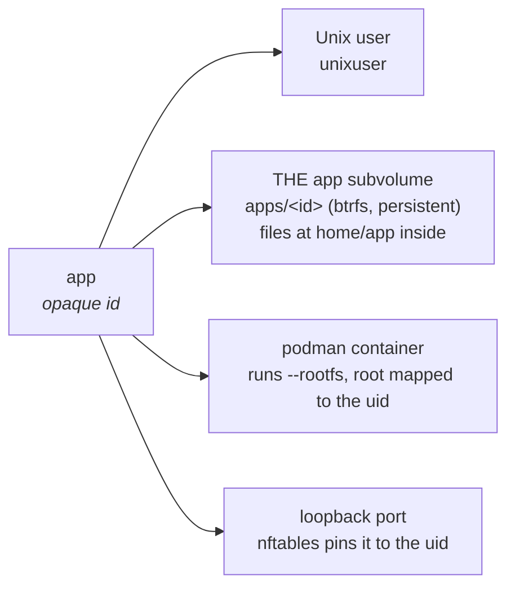
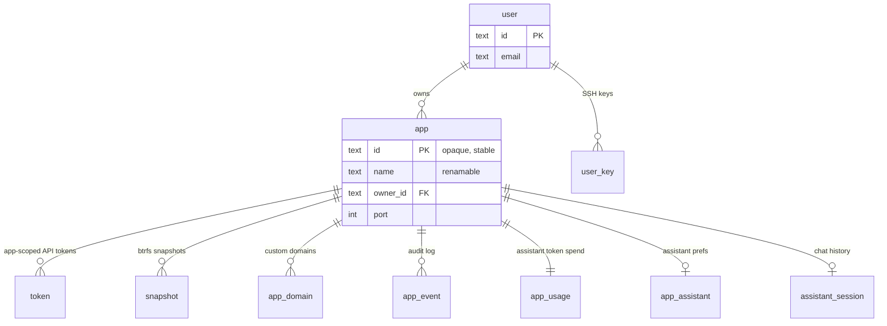
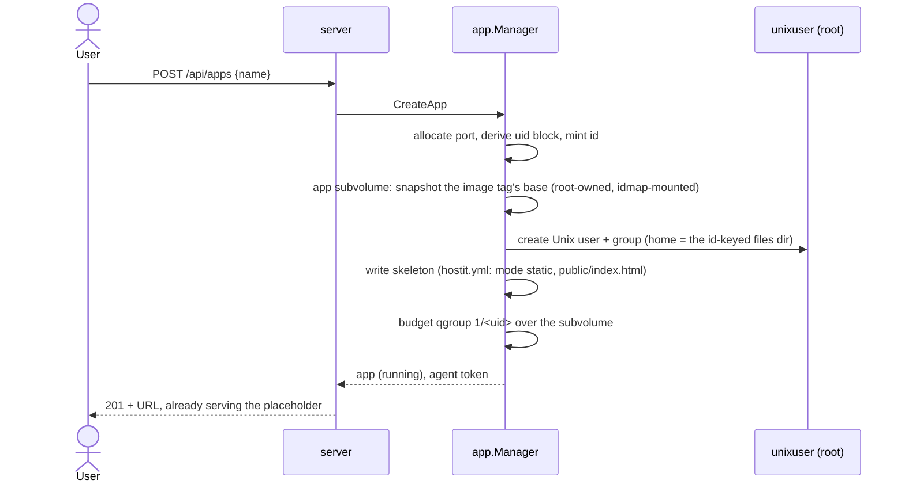
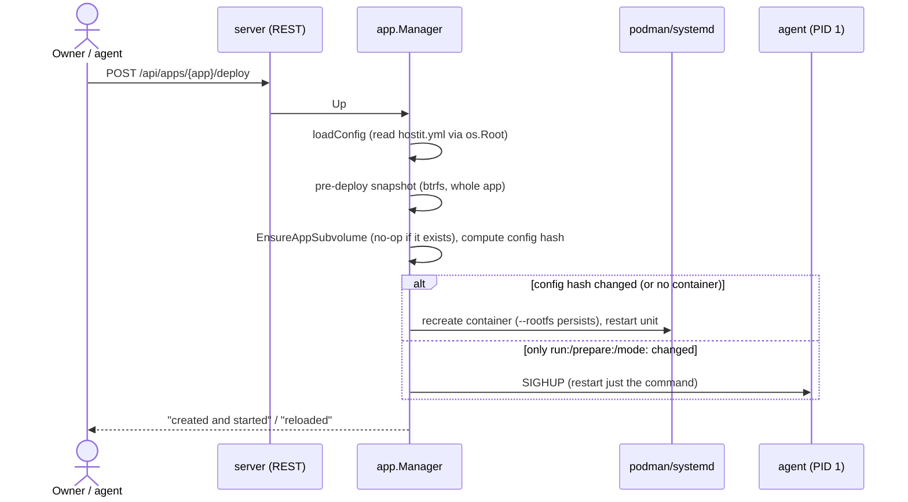
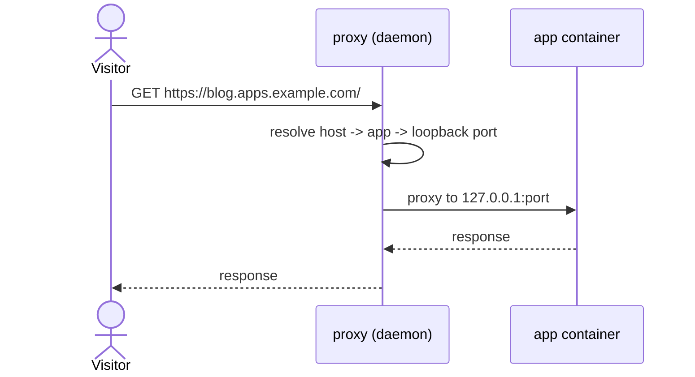
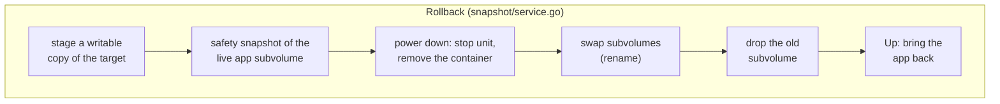
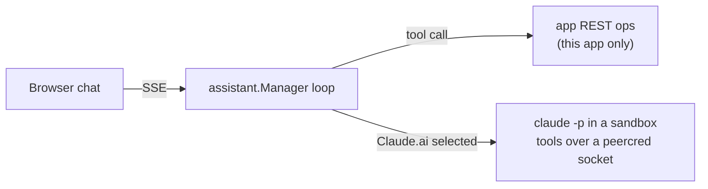

# hostit

### A code overview

The package structure, and the flows that matter, for reading the codebase

heckel.io/hostit &middot; source of truth: <code>docs/</code>

---
transition: fade-out
---

# How to read this deck

hostit is a small self-hosted platform: each app gets its own container, a subdomain
with HTTPS, SSH, and a REST API an agent can drive. This deck is not the product tour
-- it is a map of the **code**.

- **The shape** -- one binary, a thin `main.go`, service packages at the root
- **The packages** -- what each one owns, and how `app.Manager` composes them
- **The seam** -- the injected service interfaces + `run.Runner`, why it tests without root
- **The flows** -- create, deploy, serve, supervise, snapshot, assist

It was written with AI, but it is laid out like a hand-written Go codebase (the ntfy
convention): every package has one job, and every job has a package.

---

# The shape: one binary, many roles

The same binary is the daemon, the CLI, and the in-container agent. A thin `main.go`
hands off to `cmd`; there is no `internal/`.

Which subcommands matter depends on where the binary runs: on the host it is the
daemon; inside a container it is PID 1 and the app-side CLI. See <code>cmd/cmd.go</code>.

---
zoom: 0.78
---

# Package map: the spine

The request path and everything durable. Start here when reading top-down.

| Package | Owns |
|---|---|
| `server` | HTTP: TLS-terminating proxy, REST API, app-scoped agent API, OAuth, sessions, the peercred unix socket, terminal WebSocket, assistant SSE |
| `app` | an app's whole lifecycle; composes the service packages and holds naming, ports, identity |
| `store` | SQLite: schema, migrations, queries (one file per entity) |
| `user` | people: accounts, roles, limits, tokens, SSH keys, allowed domains |
| `config` | server config (`/etc/hostit/server.yml`) and its defaults |
| `cmd` | the CLI: `serve`, the app commands, `admin`, the hidden `agent`/`enter`/`shell` group, the startup preflight |
| `client` | Go client for the REST API, used by `hostit apps` |
| `web` | React 19 + Vite SPA; built into `server/site/` and embedded |

---
zoom: 0.78
---

# Package map: the host-tool services

Each wraps exactly one host tool. `app.Manager` calls them; none call each other.

| Package | Wraps |
|---|---|
| `btrfs` | subvolumes, RO snapshots, reflink, qgroup budgets |
| `container` | podman: create, exec, remove, image build, rootfs export |
| `systemd` | per-app unit lifecycle |
| `unixuser` | Unix user + home + skeleton |
| `ssh` | an app's `authorized_keys` block |

| Package | Wraps / owns |
|---|---|
| `firewall` | nftables per-app loopback rules |
| `run` | the shared `Runner` that shells out |
| `retention` | pure GFS snapshot policy (no I/O) |
| `snapshot` | orchestrates whole-app snapshot + rollback |
| `workspace` | container spec (`--rootfs` + uid map) and its storage: image build (input), per-tag bases, one subvolume per app (files at `home/app` inside) |
| `agent` &middot; `appctl` &middot; `assistant` | in-container supervisor &middot; the `hostit.yml` contract + app-side client &middot; the in-browser AI agent |

Full table with intent: <code>architecture/code-map.md</code>.

---
zoom: 0.9
---

# How `app.Manager` composes the services

`app.Manager` decides *what* an app needs and delegates the *how* to the service that
owns each host tool (`control/manager.go:NewManager`).

Each host tool sits behind its own interface, bundled in <code>app.Services</code>. The
daemon wires the real impls (<code>NewSystemServices</code>); tests pass
<code>apptest.NewNopServices</code>. btrfs/systemd/container shell out via the runner;
unixuser/ssh/firewall touch the host directly and need root.

---

# The seam: why it all tests without root

Every host mutation goes through one of two injected interfaces, so the Manager runs
in a normal `go test` with no root, no podman, no btrfs.

**`run.Runner`**

The single choke point for shelling out. Tests pass a fake runner that returns
canned output and records the exact argv, so "did we call `btrfs subvolume create`?"
is an assertion, not a side effect.

**The service interfaces**

`useradd`, `nftables`, `authorized_keys`, btrfs, systemd, podman -- each host tool
behind its own interface, bundled in `app.Services`. Tests inject
`apptest.NewNopServices`. Same seam a future control-plane / app-node split would remote.

See <code>subsystems/seams-and-testing.md</code>. This is why almost every package has a
colocated <code>_test.go</code> and the suite runs anywhere.

---

# An app is four host resources, keyed by id

Durable resources key on a stable opaque **id**, never the name. So a rename is
`usermod -l` plus one DB update: no data move, no container recreate.

The id-vs-name split is the single most load-bearing decision in the code. See
<code>subsystems/app-identity.md</code>.

---

# The SQLite schema: everything hangs off the app id

One `store.Store` (<code>store/</code>) wraps it all. Child rows key on
<code>app_id</code>, not name, so a rename is a single row update. Schema lives in
<code>store/migrate.go</code> (forward-only numbered migrations).

---
layout: section
transition: slide-up
---

# The flows

From here on: what actually happens when you create, deploy, serve, supervise,
snapshot and assist an app.

---

# Flow: creating an app

Entry: <code>control/manager.go:create</code>. A fresh app is reachable before you build
anything -- the skeleton ships a static placeholder page.

---

# Flow: deploying (hostit.yml -> running)

<code>app/deploy.go:apply</code> is the convergence step. Recreate is disruptive (ends
SSH sessions) but lossless -- the container runs the app's one persistent
subvolume, so files and installed packages survive. A reload just re-runs the
command. The hash decides which.

---

# Flow: serving a request

An unknown host, or a stopped app, gets the same "Nothing deployed here" page, so app
names cannot be enumerated. Custom domains resolve the same way via a cache.

Proxy + TLS: <code>server/service.go</code> (certmagic). Routing: the host header is the
whole lookup.

---

# Flow: the in-container agent (PID 1)

The `agent` package is a process supervisor. It runs the `run:` command, and reacts to
signals the daemon sends over podman.

**Steady state**

- runs `prepare:`, then the `run:`/`static` command
- reaps zombies (it is PID 1)
- writes a breadcrumb to `log/state` the daemon reads
- SIGHUP = reload the command; SIGUSR1/2 = pause/resume

**When the command keeps crashing**

- restarts with exponential backoff (2s -> 60s)
- after 5 rapid crashes, **gives up**: writes `failed`, idles
- a healthy run resets the backoff
- the daemon shows this as a red "App crashed"

<code>agent/service.go:Run</code>. The breadcrumb is the only channel from inside the
container to the UI's status dot.

---
zoom: 0.92
---

# Flow: snapshot and rollback

Snapshots are cheap btrfs subvolumes of the whole app (files AND installed
software); rollback is a crash-safe staged swap.

The <code>snapshot</code> package composes btrfs/systemd/container and calls back into
<code>app.Manager</code> through a small <code>Host</code> interface. Retention is a pure,
tested GFS policy in <code>retention/</code>.

---

# Flow: the built-in assistant

An Anthropic Messages loop whose **tools are one app's own REST operations** -- so the
model is confined to that single app, the same way an agent token is.

A credential's presence is the whole switch: an API key enables API models; an OAuth
token additionally offers the Claude Max subscription. See
<code>subsystems/assistant-internals.md</code>.

---
layout: center
class: text-center
---

# Reading on

- **The whole system** -- `architecture/` (overview -> isolation -> flows -> code-map)
- **One feature** -- `features/<name>.md`: what it is, why, the flow, the code
- **A tricky internal** -- `subsystems/` (identity, security, storage, assistant, ...)
- **Contributing** -- `CONTRIBUTING.md` (TDD, style, build/test)

Every claim here links to a file:symbol. Questions live next to the code -- start at
<code>architecture/overview.md</code>.

