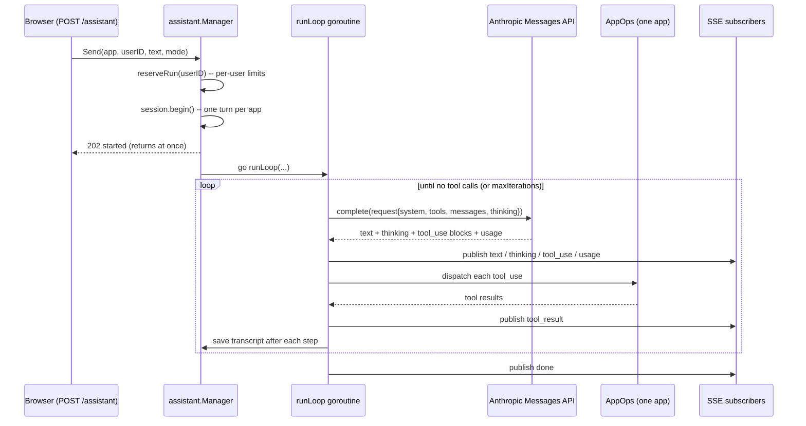
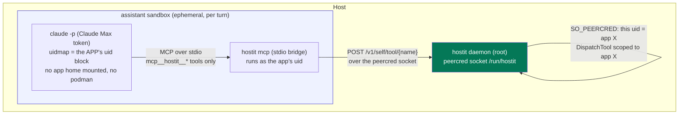

# The built-in assistant

hostit's built-in assistant is an in-browser coding agent: an owner (from a
phone, even) chats with a model that reads and writes the app's files, runs
commands in its container, deploys it, and snapshots it. There are **two
backends** behind the same UI and the same tools -- the metered Anthropic API, and
the operator's Claude Max subscription running in a sandbox -- and the whole thing
is confined to one app the same way an app-scoped token is.

The package is `assistant/`; the server-side adapters are `control/assistantops.go`,
`control/assistantclaude.go`, and `control/assistantmodes.go`; the sandbox's
in-container bridge is `cmd/agent/mcp.go`.

## Anatomy of a turn

A "turn" is one user message and the model's whole response to it (which may
involve many tool calls). The turn is **server-owned**: `Send` starts it as a
background goroutine, not tied to the HTTP request, so it survives the sender
leaving or reloading, and every watcher sees it over SSE
(`assistant/service.go:Send` -> `runLoop`).



`runLoop` (`assistant/service.go`) resolves the mode, stores and shows the user's
message once up front (so a fallback does not duplicate it), then dispatches to a
backend:

- **External Claude mode** -> `runClaudeTurn` (the sandbox). If the subscription
  is unavailable it publishes a notice and **falls back** to the API model, so a
  lapsed subscription never leaves the assistant dead.
- **Any API model** -> `runAPILoop`.

## The API loop

`assistant/service.go:runAPILoop` is the classic tool-use loop against the
Anthropic Messages API (`assistant/anthropic.go:Client.complete`, `POST
/v1/messages`). Each iteration:

1. Call the model with the system prompt, the tool defs, and the recent
   conversation window.
2. Publish the reply's text/thinking/tool_use to subscribers
   (`publishReply`), and append the assistant message to history (with thinking
   stripped -- see below).
3. If there were **no tool calls**, the model is done: publish `done`, return.
4. Otherwise run each tool via `dispatch`, publish each `tool_result`, append them
   as the next user message, and loop.

`maxIterations = 40` bounds the loop as a backstop against a model that never
decides it is finished (`assistant/service.go`). Hitting it is **not an error**:
it publishes a `paused` event with a friendly "say continue to resume" notice
(`maxIterationsNotice`), since nothing failed. `runTimeout = 15m`
(`assistant/session.go`) bounds the whole background run; a cancelled context
(the owner pressed Stop, or the timeout fired) ends the turn cleanly with `done`,
keeping whatever steps were already saved.

### Tools are one app's REST surface

The tools the model gets are **exactly the app's own operations** -- the same
surface an app-scoped agent token can reach -- so the model is confined to one app
by construction (`assistant/tools.go:AppOps`):

```
list_files, read_file, write_file, run_command, read_logs,
deploy, refresh_preview, snapshot, list_snapshots, rollback
```

`AppOps` is an interface (`assistant/tools.go`); the server implements it over
`control.Manager`, scoped to one app name (`control/assistantops.go:appOps`). The
model never gets a raw shell on the host -- `run_command` runs *inside the app's
container* as the app user (`appOps.Exec` -> `control.Manager.Exec`).

Tool calls are executed in one place, `assistant/tools.go:DispatchTool`, shared by
**both** backends (the API loop calls it via `Manager.dispatch`; the sandbox
reaches it over MCP). A tool that errors is reported *to the model* with
`isError` set, not returned up the stack: the model reads it and adapts, exactly
as it would a failed shell command. `refresh_preview` is a UI-only signal handled
by the caller that has a UI; a headless backend simply does not advertise it
(`cmd/agent/mcp.go:mcpTools` filters it out).

### Prompt caching

Every request carries **prompt-cache breakpoints** (`cache_control:
{type: ephemeral}`, `assistant/types.go:ephemeralCache`) on the three large,
stable spans, so Anthropic reuses them across turns instead of re-reading them
each message (`assistant/service.go`):

- the **system prompt** (`cachedSystem`),
- the **tools block** -- marked on the last tool, which caches the whole schema
  (`cachedToolDefs`),
- the **tail of the conversation** -- a breakpoint on the last block of the last
  message, so each turn reuses all prior turns as a cached prefix
  (`cacheConversation`).

These are copies; the stored history keeps its own metadata untouched. The
conversation sent to the model is also **windowed** to the last `maxContextTurns
= 12` human turns (`recentHistory`), cutting only on a human `user` message so
tool_use/tool_result pairs stay intact, so cost and context do not grow without
bound. The full history is still persisted and shown; only the request is trimmed.

### Thinking is shown, not stored

Extended-thinking blocks are streamed to the UI but never persisted:
`withoutThinking` strips them before saving the assistant message
(`assistant/service.go`). An adaptive thinking block carries internal fields hostit
does not round-trip, and the model does not need its earlier thinking echoed back.
Thinking/output config is model-aware: Sonnet/Opus get adaptive thinking and the
effort control; Haiku gets neither (the API rejects them), so a lighter model can
still be offered (`thinkingFor`, `outputConfigFor`).

### Per-turn usage and cost accounting

Each API step's token usage (input, output, cache-write, cache-read) is recorded
against the app best-effort (`store.RecordUsage`, keyed on `app_id` in the
`app_usage` table so it survives a rename), and the running turn total is published
as a `usage` event so the UI shows a live token counter
(`assistant/service.go:runAPILoop`). Dollar cost is derived from accumulated tokens
at current per-model rates (`assistant/pricing.go:CostUSD`); an unknown model falls
back to the Sonnet tier. Usage is summed per owner for the admin view; it is only
ever the built-in assistant, never a tenant's own agent (that bills the tenant's
own account).

## The SSE event stream

Browsers do not watch the HTTP request that started the turn; they subscribe to a
separate SSE endpoint (`GET /api/apps/{name}/assistant/stream`,
`control/server_handler_assistant.go:handleAssistantStream`). Every subscriber gets
the same stream, so a run started on one device shows up on all of them
(`assistant/session.go`). The event types (`assistant/types.go:Event`,
`Type` field):

| Type | Meaning |
|---|---|
| `model` | which model/mode is answering this turn (so the chat can badge the reply) |
| `text` | a chunk of the model's visible reply |
| `thinking` | streamed extended-thinking (shown, never stored) |
| `tool_use` | the model called a tool (name + input) |
| `tool_result` | the tool's output (`is_error` set when it failed) |
| `usage` | running token totals for the turn (live counter) |
| `done` | the turn ended (model finished, cancelled, or timed out) |
| `paused` | the turn hit `maxIterations`; "say continue to resume" |
| `error` | the turn failed |

The stream is defended: a per-app subscriber cap (`maxSubsPerApp = 64`), a slow
subscriber is dropped rather than allowed to stall the run (it recovers on
reload), a keepalive comment every 20s so proxies do not idle it out, and a
**same-origin gate** on the connection (`Sec-Fetch-Site`) as defense in depth
(`control/server_handler_assistant.go`). Per-user rate limits (`reserveRun`,
`assistant/service.go`) cap concurrent runs (`defaultMaxRunsPerUser = 3`) and runs
per hour (`defaultMaxRunsPerHour = 60`) across all of a user's apps, because every
turn spends the operator's budget; the admin token (empty user id) is exempt.

## Resumable and pickup-able

The transcript is one JSON blob per app in SQLite (`assistant_session`, adapted by
`control/assistantops.go:appTranscripts`), saved after every step, so a reload
mid-run recovers the progress. Two ways to resume:

- **The web UI** loads the stored session as structured items
  (`GET /api/apps/{name}/assistant`, `handleAssistantTranscript`) plus whether a
  turn is running, and reconnects to the stream.
- **An external agent** can pick up where the built-in one left off:
  `GET /api/apps/{app}/assistant/transcript` renders the stored session as
  markdown (`RenderTranscript`), and the app `/info` guide tells a pasted-in agent
  to read it so it resumes with context instead of starting cold.

## The Claude Max subscription sandbox

The second backend runs the agent as `claude -p` (Claude Code, non-interactive) on
the **operator's Claude Max subscription**, inside a locked-down podman container.
The design goal: use the subscription without ever letting the model exfiltrate
the subscription token. The code is `assistant/claude.go` (the loop glue) and
`assistant/sandbox.go` (the container).



### The container holds no secrets and no app

`assistant/sandbox.go:baseArgs` locks the container down exactly like an app
container -- uid/gid mapped, `no-new-privileges`, memory and pid limits, its own
slirp4netns network -- but crucially:

- **No app home is mounted.** `HOME` is an ephemeral image-provided dir
  (`assistantContainerHome = /home/app`), thrown away with the container. That
  absence *is* the isolation: the model cannot read the app's files directly, only
  through mediated tools.
- **No podman socket, no host mounts** except the hostit binary and the daemon's
  socket directory (both read-only). So the sandboxed agent cannot drive
  containers or touch the host.
- **The subscription token is mounted into THIS container only** (the assistant
  sandbox), **never an app container** (`baseArgs`, `CLAUDE_CODE_OAUTH_TOKEN`).

The container is mapped to **the target app's uid block**
(`sandbox.go:appIdentity` resolves the app user's uid/gid; `baseArgs` maps
`0:<uid>:65536`). That is what scopes the peercred socket: whatever the sandbox
calls the daemon with, the kernel reports the app's uid, so every tool call lands
on that one app. The turn's context (prior transcript) is replayed into the prompt
as text, because the sandbox container is ephemeral and stateless
(`claude.go:buildClaudePrompt`).

### Tools mediated over MCP -- the load-bearing control

Inside the sandbox, `claude` is configured so its **only** tools are the hostit
app operations, advertised over MCP by `hostit mcp` (`cmd/agent/mcp.go`), which bridges
each tool call to the daemon over the peercred socket
(`POST /v1/self/tool/{name}`, `control/socket.go`). The invocation
(`assistant/sandbox.go:claudeArgs`):

```
claude -p --output-format stream-json --verbose
  --strict-mcp-config --mcp-config '{"mcpServers":{"hostit":{...}}}'
  --permission-mode dontAsk
  --allowedTools   mcp__hostit__*
  --disallowedTools <every built-in, by name>
```

This is **the load-bearing control**: only the hostit MCP tools are allowed, and
every Claude Code built-in (Bash, Read, Write, WebFetch, WebSearch, ToolSearch,
...) is denied **by name** in `disallowedBuiltins`. Without this, a prompt
injection hiding in the app's own content could make the agent `Read` its own
credential out of the environment or `WebFetch` it out; with it, every action the
agent can take is a mediated, app-scoped hostit operation. Two subtleties in the
comments:

- The blocklist works **only because `claudeVersion` is pinned** (`2.1.226`, with
  auto-update disabled). A new built-in tool in a later version, not on the list,
  would silently re-open a path to the credential -- so the list **must be
  re-derived on every version bump** (the code documents how: diff the tools a run
  advertises with and without `--disallowedTools`).
- `--permission-mode dontAsk` alone is **not** enough: some built-ins (e.g.
  ToolSearch) run without a prompt, so they must be denied by name.
- `--strict-mcp-config` (not `--bare`, which would drop the MCP config and leave
  the agent with no tools) and the prompt on **stdin** (not argv, because
  `--mcp-config` is variadic and would swallow a trailing positional).

The MCP bridge itself (`cmd/agent/mcp.go:mcpServer`) is a minimal stdio JSON-RPC 2.0
server. It lists `assistant.ToolDefs()` (minus `refresh_preview`) so the sandbox
model sees an identical tool surface to the API backend, forwards each
`tools/call` to the daemon, and reports a daemon-unreachable error back to the
model as a tool error rather than killing the session.

### Ephemeral, cancellable, logged

Each turn gets its own container (`hostit-assistant-<appID>-<rand>`,
`sandbox.go:containerName`), `--rm`'d on exit and force-removed out of band if the
turn is cancelled -- otherwise a killed podman client could orphan a container
still burning the subscription (`sandbox.go:RunTurn`, the `defer`). The raw
stream-json is teed to a root-owned per-app log
(`sandbox.go:openSessionLog`, `0700` dir, `0600` file) so an operator can watch or
inspect a complex turn; the web chat only shows distilled events. `claude`'s
stream is normalized to the same `Event` types as the API loop
(`sandbox.go:parseAssistantStreamLine`, adapted by
`control/assistantclaude.go:claudeBackend`), so the UI renders a subscription turn
exactly like an API turn. Usage comes back once, at the end, in the `result`
event.

### Reconstructing the transcript

The API loop gets a clean assistant message from Anthropic; the sandbox gets an
ordered *stream*, so the transcript is rebuilt from it
(`assistant/claude.go:claudeAccumulator`): an assistant message (text + tool_use
blocks) followed by a user message of the matching tool_results, mirroring the
Anthropic shape, pairing results to calls FIFO. Reconstructed tool_use ids are
**random and unique across turns** (`newToolID`), not a per-turn counter, because
a repeated `call_1`/`call_2` across turns would make a later API turn 400 with
"multiple tool_result blocks with id X". `dedupeToolIDs` repairs older transcripts
written before ids were unique, so switching from External Claude to an API model
mid-conversation just works.

## The switch: a credential's presence is the whole control

There is **no `assistant-backend` setting.** Which backends exist is decided
purely by which credentials are present in the config (`config/config.go`):

- `anthropic-api-key` present -> `AssistantEnabled()` -> the metered API models are
  offered.
- `claude-code-oauth-token` present -> `ClaudeBackendEnabled()` -> the "Claude.ai"
  (External Claude) option is **additionally** offered.
- Either one present -> `AssistantAvailable()` -> the assistant runs at all.
- Neither -> the assistant is inert; the routes return `enabled:false` cleanly.

The server wires this directly from the config (`control/service.go`): it
constructs the `assistant.Manager` when `AssistantAvailable()`, and calls
`SetClaudeRunner(&claudeBackend{...})` only when `ClaudeBackendEnabled()`. The
comment there records the bug this prevents: the option used to be offered while
the backend was unwired, silently running the API model and badging replies as
Sonnet with no explanation. Now the token's presence is the whole switch -- if
"Claude.ai" is offered, it actually runs the subscription.

Per-user gating and defaults layer on top (`control/assistantmodes.go`): whether a
user may pick External Claude and which API models they may use come from a
per-user override or the operator's global defaults, and the default when unset is
"allowed whenever the subscription is configured" -- because the operator setting
up the token is the signal that new users should get it. The mode a turn actually
runs on is resolved against those permissions (`resolveMode`), and remembered
per-app (`app_assistant`, keyed on `app_id`).

See `plans/260810-hostit-claude-max-backend.md` for the sandbox design and the
threat model behind the MCP-only restriction.
