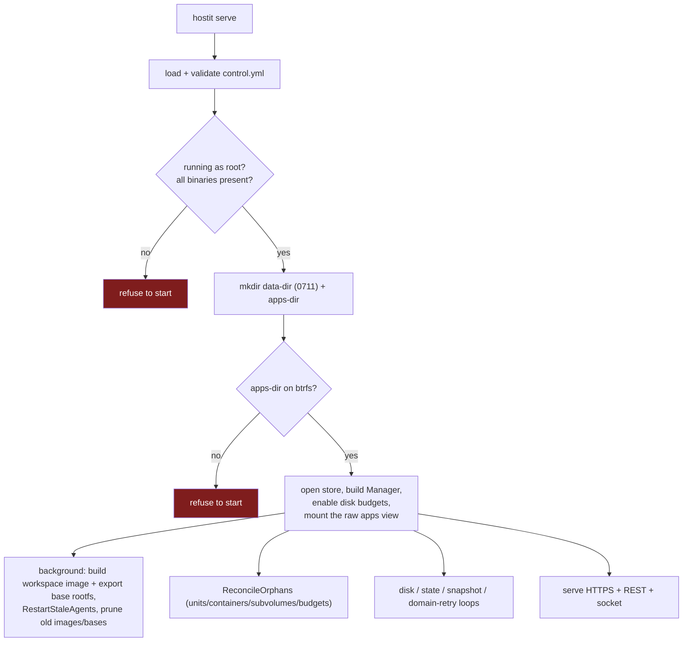

# Release, deploy, and startup

How a hostit build becomes a running daemon on a box, and what has to be true for
it to start. Three stages: **build and package** (goreleaser -> `.deb`/`.rpm`),
**deploy** (the example Ansible role), and **start** (the preflight, then the
background upgrade of running agents).

## Build and package: goreleaser + the .deb

hostit ships as a single static Go binary. `make release` (or `release-snapshot`
for a local test build) runs `goreleaser`, gated behind `clean deps web check`
(`Makefile`) -- note `web` runs first, so the React SPA is built and embedded into
the binary via `//go:embed` before the Go build (a placeholder is checked in so
the package always compiles even without a web build).

`.goreleaser.yml` builds `linux/amd64` and `linux/arm64` and produces `deb` and
`rpm` packages (`nfpms`). The package is more than the binary; it lays down the
whole host contract:

| Packaged file | Destination | Role |
|---|---|---|
| `hostit` | `/usr/bin/hostit` | the one binary (daemon, CLI, agent, shell, enter, mcp) |
| `hostit.service` | `/lib/systemd/system/` | the daemon unit |
| `hostit-app@.service` | `/lib/systemd/system/` | the per-app template unit |
| `hostit-shell` | `/usr/bin/` (0755) | app users' login shell |
| `hostit-enter` | `/usr/bin/` (0755) | the privileged container-entry helper |
| `hostit.sudoers` | `/etc/sudoers.d/hostit` (0440, noreplace) | the narrow sudo grant |
| `control.yml.example` | `/etc/hostit/control/control.yml.example` | config template |

Package **dependencies** are the host tools the daemon shells out to: `podman`,
`uidmap` (per-app user-namespace uid mappings), `slirp4netns` (per-app netns),
`nftables`, `dbus-user-session`, `openssh-server`, with `passt` recommended.

The **postinstall** script (`scripts/postinst.sh`) does only what is safe on every
install/upgrade: registers `/usr/bin/hostit-shell` in `/etc/shells` (so sshd
accepts it as a login shell), creates the `hostit-apps` system group (the sudoers
grant is scoped to it), validates the sudoers file with `visudo -cf` and removes
it if broken (never leave a broken sudoers behind), reloads systemd, and restarts
the daemon **only if it is already running**. It deliberately does **not** enable
the service -- hostit refuses to start without a configured
`/etc/hostit/control/control.yml`, so enabling is left to the operator or Ansible.

## Deploy: the example Ansible role

`deploy/ansible/` is an example role that a maintainer can copy and adapt (it is
the shape the production deploy follows, not a vendored copy of it). The role
(`deploy/ansible/roles/hostit/tasks/main.yml`) is one linear pass:

1. Install podman and the container/network dependencies.
2. Install the static crun release binary (hostit needs crun >= 1.29 for
   idmapped rootfs mounts; most distributions ship an older one) and point
   podman at it via a `containers.conf.d` drop-in -- exactly what the
   preflight's runtime check validates.
3. Assert the required variables are set (`hostit_domain`, `hostit_admin_token`).
4. Fetch the release `.deb` from GitHub (or copy a locally built one for
   development), and install it with `dpkg -i --force-confold` -- `dpkg`, not the
   apt module, because same-version rebuilds are common while iterating and apt
   would treat them as already installed; `--force-confold` keeps the managed
   `/etc/hostit/control/control.yml` instead of prompting on upgrade.
5. Template `/etc/hostit/control/control.yml` (0600).
6. **Set up the btrfs loopback** for app homes (`btrfs.yml`, gated on
   `hostit_btrfs`, on by default) -- see [storage-btrfs.md](storage-btrfs.md).
7. **Harden sshd** for app users (drop the forwarding-stripping config) -- see
   [security-isolation.md](security-isolation.md).
8. Enable and start the daemon.

Secrets (admin token, OAuth secret, AI keys) are meant to live in an Ansible Vault,
not plain vars (`deploy/ansible/roles/hostit/defaults/main.yml` documents each
variable, including the assistant credentials whose *presence* is the whole switch
-- see [assistant-internals.md](assistant-internals.md)).

## Start: the preflight

`hostit serve` refuses to run on a host it cannot support, up front, rather than
failing lazily on the first app operation (`cmd/control/serve.go:execServe` calls
`cmd/preflight.go`). Two gates:

**`checkHostRequirements`** (`cmd/preflight.go`):

- Must run as **root** -- it creates Unix users and drives podman, systemd,
  nftables and btrfs.
- Every command it shells out to must be installed. It checks them **all** and
  reports the missing set at once (so an operator fixes them in one pass):
  `podman, btrfs, nft, systemctl, useradd, usermod, userdel, groupadd, groupmod,
  groupdel, pkill` (`requiredBinaries`).
- The container runtime must support idmapped rootfs mounts
  (`checkRuntimeVersions`): podman **>= 4.3** (the `--rootfs <path>:idmap`
  syntax) and crun **>= 1.29** (validated; Ubuntu 24.04's 1.14.1 hard-fails).
  The crun binary is resolved *through podman* (`podman info`), so a
  `containers.conf` override pointing at a newer static binary -- the
  documented install path -- is exactly what gets checked.

**`requireBtrfs`** (`cmd/preflight.go`): the app-homes directory must be on a
btrfs filesystem, or the daemon refuses to start. Checked after the directory is
created. btrfs is core (snapshots, rollback, fork, hard quotas), not optional.

After the preflight, startup opens the store (which runs any pending schema
migrations), builds the `Manager`, enables btrfs quota accounting
(`EnableDiskBudgets`) and mounts the raw apps view the daemon's file I/O
resolves through (`app/deploy.go:MountRawAppsView` -- a private, non-recursive
bind of the apps dir at `<run-dir>/apps-raw`, so root file I/O sees past
running containers' idmapped rootfs overmounts). The one-time storage
migrations that moved pre-v0.11 hosts onto this layout have been removed;
upgrading from an older release goes through v0.11.x first. It then kicks off
background work:
build the shared workspace image and export its base rootfs subvolume, restart
stale agents, prune superseded images and unpinned bases (`cmd/control/serve.go`, the
`go func`), reconcile orphaned units/containers/app-subvolumes/budget-qgroups
against the registry (`app/reconcile.go`), and start the periodic loops (disk
usage, state, periodic snapshots, custom-domain retry).

## Why agents only upgrade on a restart

An app's **agent is PID 1 inside its container**, exec'd from the hostit binary as
it was at container-create time. The binary is **bind-mounted** into the container
as a file (`workspace/spec.go:appendCommonMounts`), so replacing `/usr/bin/hostit`
on the host swaps the file, but a **running container keeps the inode it started
with** -- the old agent behaviour keeps running until the container is recreated.

This matters for correctness, not just freshness: the agent decides what the app's
`run:` command actually is. `app/upgrade.go:RestartStaleAgents` documents the real
bug it prevents -- a static app once kept serving its old directory through an
upgrade this way, with the app's whole home on the internet.

So an upgrade must actively reach the agents. On startup, once the new `Version` is
set (`cmd/control/serve.go`, `app.Version = c.App.Version`), `RestartStaleAgents` compares
the stored `agent_version` setting to the running build and, if it changed, brings
every **enabled** app **Up** (`Up`, not a bare restart -- a new binary may want the
container built differently, and only `apply` notices that), then records the new
version (`app/upgrade.go`). A powered-off app stays off: an upgrade must not
resurrect what an operator deliberately disabled. It runs in the background because
it costs each app a moment of downtime and the proxy should come up first.
`app.Version` is itself part of each container's identity (a `hostit.version`
label, `workspace/spec.go:CreateArgs`), so `apply` recreates a container whose
label predates the current build. A recreate keeps the app's filesystem: the
container runs the app's one persistent subvolume, so installed packages
survive an upgrade.

## One-off migrations: gated and idempotent only

hostit used to carry imperative one-off migrations run once at startup (e.g. the
older single-uid -> contiguous-uid-block remap, and the `app_id`/`image_tag`
backfills). Those have been **removed** after they ran once on staging and
production: keeping a run-once mutation in the startup path forever is dead weight
and a foot-gun. What remains is:

- **Ordered schema migrations** in `store/migrate.go` -- append-only, each
  recording its version in the same transaction, so a failure rolls back whole and
  a success never replays. These are declarative table changes, not data
  transforms.
- **Idempotent reconciliation** on every start (`app/reconcile.go`) and the
  **version-gated** `RestartStaleAgents` -- both safe to run every boot, neither a
  one-shot.
- **Settings-gated, ensure-style data migrations** for the rare genuinely one-time
  transform. The current examples are the storage migrations
  (`app/migrate.go:MigrateRootfsStorage`, `MigrateUnifiedStorage`, which folded
  each app's home into its rootfs leaving one subvolume per app, and
  `MigrateIdmapStorage`, which shifted each tree's baked-in ownership back to
  container-relative ids for the idmapped rootfs mounts): every step is
  idempotent, only a fully successful pass records the settings gate, and later
  starts skip on it -- so a run killed halfway resumes safely, and once complete it
  costs a single settings read per start until it is eventually removed.

If you need a one-time data transform in the future, do it as a schema
migration (if SQL can express it) or a gated idempotent step like the above, not a
run-once imperative block that lingers in `serve`. See the related design notes in
`plans/260808-hostit-app-id-identity.md` and
`plans/260809-hostit-app-id-image-pinning-migration.md`.
