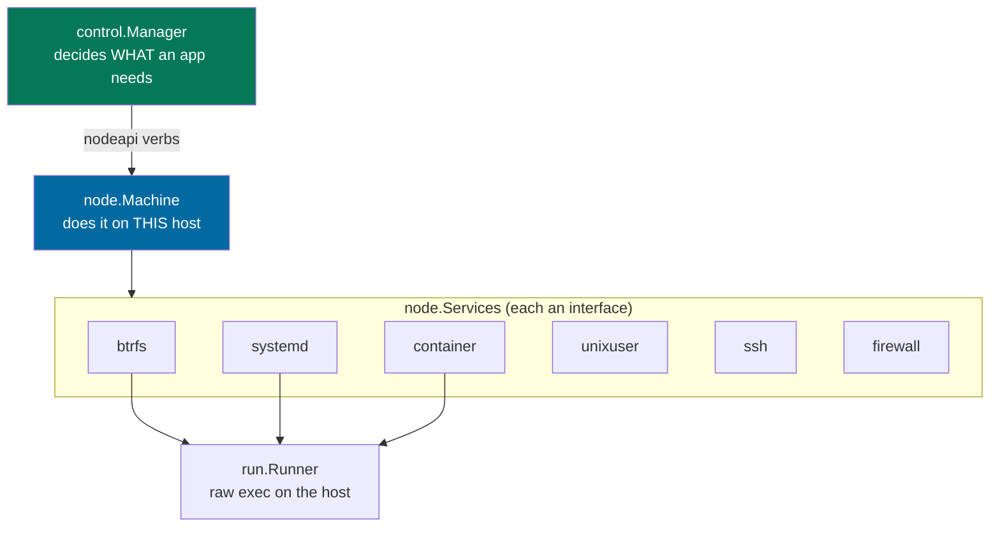

# Seams and testing

`control.Manager` orchestrates apps (create, delete, fork, placement, ports)
and `node.Machine` does the machine work: `useradd`, `podman`, `systemctl`,
`nft`, `btrfs` -- all root, all touching the host. Yet both are unit-tested
without root and without a container runtime, because every host interaction
goes through injected interfaces -- and the same seam is what multi-node
remotes.

## The service seam

Everything the `Machine` does to the host is reached through the
`node.Services` bundle (`node/machine.go`), injected at construction
(`node.NewMachine`, and through it `control.NewManager`):

- **`node.Services`** bundles one interface per host tool: `btrfs`, `systemd`
  and `container` are command-wrapper services built on a shared `run.Runner`;
  `unixuser`, `ssh` and `firewall` touch the host directly (useradd,
  authorized_keys, nft) and must run as root. `NewSystemServices`
  (`node/machine.go`) builds the real set; a test substitutes any single one.
- **`run.Runner`** (`run/service.go`) is the raw command runner every
  command-wrapper service shells out through. The real one execs as root;
  `run.Nop` returns empty output and touches nothing.

The division is deliberate: `control.Manager` decides *what* an app needs
(allocate a port, create a user with this uid, snapshot this app) and the
`Machine` -- through the service that owns each tool -- does the *how*.

## Testing without root

- **`fakeSystem`** (`control/manager_test.go`) is the **recording** fake for
  the control package's own tests: it stores created/deleted/renamed users,
  written authorized_keys, skeletons and port-rule sets, so a test asserts
  *what the Manager asked the host to do* without a host. `newTestManager` /
  `newTestDeployManager` wire it (via `testServices`) with a temp-dir config,
  a temp SQLite store and a recording `fakeRunner`, and hand both back for
  inspection. The fake's mutex is not incidental: `CreateApp` starts the app
  in a background goroutine, so assertions and the background start race on
  the recorded state unless the fake guards it.
- **`control/apptest.NewNopServices`** is the no-op set for **cross-package**
  tests (the `client` tests, handler tests): a `node.Services` whose
  privileged members do nothing, in its own package so other tests can import
  it without shipping test doubles in the binary.
- `run.Nop` covers the command-wrapper services in isolation: a `btrfs` or
  `container` service built on it executes its argument assembly and output
  parsing against a runner that runs nothing; pure helpers like
  `firewall.renderRuleset` and the qgroup parsers are split out precisely so
  they test without invoking any tool.
- The `node` package's own tests (`node/machine_*_test.go`) cover the pure
  machine helpers; machine behavior that spans both halves (deploy, rename,
  snapshots through the Manager) lives in the control package's tests, which
  drive the fused Manager end to end over the fakes.

## The same seam is the multi-node seam (shipped)

The machine half sits behind `nodeapi.NodeAgent` -- the wire contract listing
every verb control may ask of a node (provision, power, files, exec,
snapshots, sync, states). It has exactly the two implementations the design
promised (`plans/260807-hostit-multinode.md`):

- **`node.Machine`** -- the local implementation. The fused daemon's Manager
  embeds one, so every call is a direct Go method call: zero network, zero
  serialization.
- **`node.remoteAgent`** (`node/remote.go`) -- the same interface over the
  mTLS/yamux duplex connection a `hostit-node` dials in; control's
  `routingAgent` (`control/registry.go`) resolves each app's host to the right
  connected agent.

Two properties are load-bearing and worth preserving in any refactor:

- **`os.OpenRoot`'s containment is a property of the real path on the real
  machine.** The kernel refuses to follow a symlink out of an opened root; a
  "remote open" would be just a string the caller trusts. That is why the
  whole file layer (`node/machine_files.go`, `homefs`) lives on the node and
  the wire carries file *contents*, never file *handles*. See
  [security-isolation.md](security-isolation.md).
- **btrfs and podman are local operations** where the filesystem and container
  are; the verb crosses the wire, the operation never does.

## Practical guidance

- New host interaction from the machine half? Add it to the service package
  that owns the tool (or a new small `Service` over `run.Runner`), inject it
  through `node.Services`, and record it in `fakeSystem` if control tests
  assert on it. Do not exec directly from `Machine` methods.
- New control->node operation? It is a `nodeapi.NodeAgent` verb: implement it
  on `node.Machine`, add the RPC verb (`node/rpc.go`) and the remote client
  method (`node/remote.go`), route it in `control/registry.go`, and the
  compiler walks you through every fake that needs it.
- Keep pure formatting/parsing split from I/O so it tests without a host.
