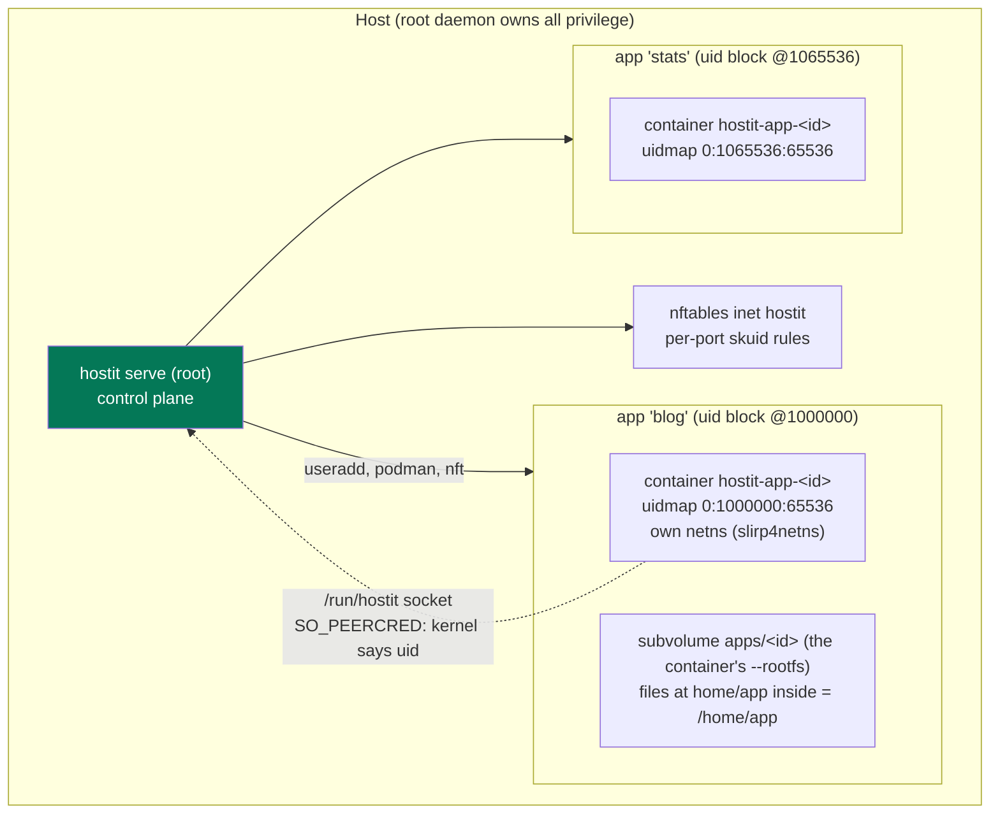

# Security and isolation model

hostit runs untrusted tenant code -- an app is whatever its owner (or the owner's
AI agent) uploaded -- on a shared host, as a root daemon. The whole security
posture rests on one asymmetry: **the daemon holds all the privilege, and an app
is only ever an unprivileged Unix uid.** Nothing an app does escalates, because
every path back into hostit re-identifies the caller by that uid (or by an
app-scoped token), never by anything the app says about itself.

This page walks the boundaries one at a time, then the trust boundary that ties
them together.

## The four boundaries

Each app is created as four things together: a Unix user, a btrfs subvolume (the
container's whole filesystem, with the app's files at `home/app` inside it), a
podman container, and a loopback port with an nftables rule (`control/manager.go:create`).
Each boundary does one job.

| Boundary | Mechanism | What it stops |
|---|---|---|
| App vs app | separate uid block, container, netns | reading files, seeing processes, reaching ports |
| App vs host | uidmap so container root is an unprivileged host uid | an escape landing as root |
| App vs daemon | `SO_PEERCRED` on the socket; app-scoped tokens on the REST API | acting as another app |
| Tenant vs operator | `hostit-shell` login shell; sshd forwarding stripped | tunnelling out, reaching host services |



## App vs app: the contiguous uid block

Every app owns a **65536-wide contiguous uid/gid block**, one per app, spaced so
blocks never overlap (`node/machine.go:uidFor`):

```
uidFor(port) = uidBlockStart + (port - PortMin) * uidBlockSize
             = 1_000_000     + (port - PortMin) * 65536
```

The constants are in `workspace/spec.go` (`UIDBlockStart = 1_000_000`,
`UIDBlockSize = 65536`). Because ports are unique per app (`allocatePort`), the
base uids never collide, and the blocks tile the uid space without overlap.

The container is created with the block as a single offset
(`workspace/spec.go:CreateArgs`):

```
--uidmap 0:<base>:65536   --gidmap 0:<base>:65536
```

so **container uid 0 (root inside the app) maps to the app's unprivileged host
base uid**, and the whole range up to `nobody` maps one-to-one above it.

### Why contiguity is load-bearing

The container runs the app's one persistent subvolume
(`--rootfs <path>:idmap`, an instant snapshot of the shared read-only base, with
the app's files at `home/app` inside it -- see
[storage-btrfs.md](storage-btrfs.md)). The subvolume stays **root-owned on
disk**; the `:idmap` option makes the runtime map it through the container's uid
mapping, so disk-root IS container-root and no ownership is ever baked into the
tree. A single contiguous range keeps that mapping one uniform offset: every uid
a workload uses inside the container lands inside the app's own block on the
host side, across the whole subvolume, home included. A split map like `0:uid:1`
plus `1:subuid:N` would break that correspondence. The `IDs` type
(`workspace/spec.go:IDs`) carries `{UID, GID, Count}` into the create args. Keep
the block contiguous.

### Nothing else may sit inside the app uid space

An app is root inside its own user namespace, so it can become **any host uid in
its block**. Any other container on the host that maps its own uid range must
therefore start above the whole app space, or a tenant ends up sharing a host uid
with it -- which is what the kernel checks for ptrace and signals, so the
separation would then rest on nothing but the two containers happening not to
share a namespace.

`workspace.UIDTop` is the last uid the app space can ever use (the block of
`PortMax`), and the screenshot sandbox derives its base from it
(`node/screenshot/service.go:userNSBase = workspace.UIDTop + 1`). It used to be a
fixed 3,000,000 described as "a high, otherwise-unused host range", which sat
*inside* the app space: it collided with the blocks of ports 10030-10061, i.e.
with whichever tenants held those ports. The browser in that container renders
other tenants' pages and, for a private app, carries their app-bound preview
grant. `TestShotUIDRangeSitsAboveEveryAppBlock` walks the whole port range and
pins the invariant, so a future range cannot quietly land back inside it.

## App vs host: what an escape lands as

The uidmap already means a container escape lands as the app's unprivileged host
uid, not root. Three more create flags harden the container itself
(`workspace/spec.go:CreateArgs`):

- `--network slirp4netns` gives each app its **own network namespace** with no
  peers and no host loopback, so one app cannot reach another's published port
  over `127.0.0.1` from inside, and cannot see host-local services. The app
  listens on a fixed `containerPort` (80) inside its own namespace; it never sees
  the loopback port hostit picked outside.
- `--pids-limit 512` (`maxProcesses`) caps a fork bomb below what it takes to
  exhaust the host.
- `--security-opt no-new-privileges` stops a setuid binary the tenant plants from
  escalating beyond where it started.

Two deliberate non-hardenings, both commented in the code:

- **Capabilities are left in place** on purpose: the app is container-root so it
  can `apt-get` and bind port 80, and the uid map already keeps those caps off
  the host (an escape is unprivileged regardless).
- **`--security-opt apparmor=unconfined`** is set because podman's default
  AppArmor profile mediates signals by a per-container `//&crun` label, and the
  multithreaded Go agent (PID 1) straddles that label, so its `SIGKILL` to a
  child is denied and the app never dies, leaving a duplicate fighting for the
  port. The uid map, `no-new-privileges` and per-app netns already isolate the
  container, so it runs unconfined.

## App vs app on the wire: nftables per-app port rules

Each app's container port is published on host loopback only
(`--publish 127.0.0.1:<port>:80`). Loopback is shared across the host, so without
more, app A could connect to app B's published port at `127.0.0.1:<B-port>`. The
firewall closes that (`system/nftables/service.go:renderRuleset`): each node
owns its own nftables table (`inet hostit` on the default node, `inet
hostit_<nodeid>` on a named one), atomically replaced on every change, with an
output-hook rule per app port:

```
add rule inet hostit output ip  daddr 127.0.0.0/8 tcp dport <port> meta skuid != { 0, <uid> } counter drop
add rule inet hostit output ip6 daddr ::1         tcp dport <port> meta skuid != { 0, <uid> } counter drop
```

The rule keys on `skuid` (the socket's owning uid): a connect to an app's port is
dropped unless the connecting uid is **root** (the daemon's proxy, which owns the
published ports) or the **app's own base uid**. Both IPv4 (`127.0.0.0/8`) and
IPv6 (`::1`) loopback are covered.

The ruleset is rebuilt from the registry, not patched incrementally
(`node/machine.go:ReconcilePortRules`): it lists every app, looks up each uid, and
applies the full set. This runs on create, delete, and startup reconcile, so the
rules always match the registry, and a failure (nft absent in a dev setup) is
logged, not fatal. The rule is keyed to the uid, which is why the uid block and
the port rule are two halves of the same boundary.

## App egress: no metadata, no reaching internal networks

The same per-node table (`system/nftables/service.go:renderRuleset`) also bounds
where an app container may connect **out to**. A container's egress is NAT'd by
slirp4netns and leaves the host sourced by the app's own base uid, so one rule
per node -- keyed on that uid set -- drops it before it can reach anything
internal:

```
add rule inet hostit output meta skuid { <app-uids> } ip  daddr { 169.254.0.0/16, 10.0.0.0/8, 172.16.0.0/12, 192.168.0.0/16, 100.64.0.0/10 } counter drop
add rule inet hostit output meta skuid { <app-uids> } ip6 daddr { fc00::/7, fe80::/10 } counter drop
```

That closes two paths a compromised app would otherwise have: the **cloud
metadata service** (`169.254.169.254` -- IAM/droplet credentials) and **every
other app's backend on the node IP**. The cross-app reach is subtle: an app's
egress SNATs to the node IP, which sits in a peer node's `allowFrom`, so the peer
would admit it -- but since every node IP and app backend lives in private space,
dropping app-uid egress to all of it cuts the reach *at the source*, before the
packet leaves. Public egress and DNS via a loopback-stub resolver
(`127.0.0.53`) are untouched; the drop set is link-local + RFC1918 + CGNAT (v4)
and ULA + link-local (v6, so AWS IMDS-over-IPv6 at `fd00:ec2::254` is covered).

An operator whose apps legitimately need an internal service (a private API, a
private-IP DNS resolver) whitelists its CIDR with **`outbound-allow-private-cidrs`**
-- the same flag that gates the daemon's own user-supplied fetches (MCP servers,
custom OAuth issuers), reused here so there is one outbound allow-list. Accepts
render before the drop, and v4/v6 entries go in their own sets. Whitelist
NARROWLY: a whole node network re-exposes apps to each other.

## File operations: os.OpenRoot containment

The daemon writes into app files as **root**, on behalf of tenant requests (an
agent `PUT`ing a file, the assistant's `write_file`, a scp'd upload the daemon
later touches). The files directory sits **inside the tenant-owned subvolume**
(the tenant is root inside the container whose rootfs it is, and it is writable
over scp) -- so the tenant can plant a **symlink** anywhere in that tree, even at
`home` or `home/app` itself, and try to walk the root daemon out of the
subvolume.

hostit closes this with chained `os.OpenRoot`s, kernel-enforced containment
(`homefs/service.go:OpenRoot`): the subvolume root is opened first (its path only
root controls), the files directory `home/app` is then resolved **inside** that
root, and every file operation goes through the returned `*os.Root`'s
path-contained methods, so the **kernel refuses to follow a symlink out of the
opened root**. This is not a string check; it is TOCTOU-safe and symlink-safe
because the kernel evaluates the real path. A symlink planted at `home/app` is
refused (absolute) or at worst redirects the tenant's own file API within their
own subvolume.

The pattern is uniform across `homefs/service.go` (bound to apps in
`app/files.go`): `WriteFileFrom`, `ReadFile`, `ReadFileMax`, `DeleteFile`,
`MoveFile`, `MakeDir`, `StatFile`, `ListFiles`, `ExtractTar` all open the app's
files `Dir` via `OpenRoot` and operate through it. Belt and braces:

- `homefs/service.go:safeRel` rejects the obvious escapes early (absolute paths,
  any `..` segment) with a useful message, and refuses `protectedDirs`
  (`.hostit/`, `.ssh/`, `.config/`, ...) and the upload temp prefix. Containment
  itself is still the root's job; this just fails fast and clearly.
- `WriteFileFrom` streams to a temp file inside the root and renames on success,
  so an over-cap body leaves neither a partial file nor a damaged old one.
- There is **no chown to redirect**: files the daemon writes stay root-owned
  like the whole idmap-mounted tree, and through the mapped view the app sees
  them as its own (disk-root IS container-root). The old
  chown-through-the-root plumbing is gone with the ownership model.
- `ExtractTar` refuses symlink and device entries outright, and every regular
  entry is validated with `safeRel` before it is written.

One wrinkle the idmap model adds: while a container runs, podman's idmapped
mount covers the subvolume path in the host namespace, and the root daemon
writing through that mapped view would fail (root is not in the mapping). The
daemon therefore opens app files through a **raw, private, non-recursive bind**
of the apps dir at `<run-dir>/apps-raw` (`app/deploy.go:MountRawAppsView`) --
same chained-`os.Root` containment, just anchored on the un-overmounted view.

The same discipline lives in the SSH key writer
(`ssh/service.go:WriteAuthorizedKeys`): it takes the app's chained files root,
refuses a non-directory `.ssh` (a symlink the tenant planted), and writes
`authorized_keys` only through the root -- because otherwise root would be
handing out SSH keys wherever a link pointed. The keys are written root-owned
and world-readable (0755 `.ssh`, 0644 `authorized_keys`): the host's sshd reads
them as the app user (StrictModes accepts root-owned), and through the idmap the
tenant can still hand-edit them; public keys are not secrets.

## Exporting files: symlinks stay symlinks, ids are validated

Downloading a workspace or a snapshot as a `.zip`/`.tar.gz`
([export-download.md](../features/export-download.md)) reads the whole files tree
as root and streams it to the caller, so the same two tenant tricks apply as for
the file API -- a planted symlink, and a crafted path -- and each is closed.

- **A symlink is archived AS a symlink, never followed** (`archive/archive.go`
  walks with `Lstat` semantics, so `filepath.WalkDir` does not descend into a
  link). A link the tenant planted pointing at `/etc/shadow` or another app's
  subvolume is written into the archive as the one-line link entry, not as the
  file it points at, so the export cannot leak anything from outside the
  workspace tree. Sockets, devices and fifos are skipped -- nothing an archive
  can carry, and nothing worth reading through.
- **A snapshot id is resolved against the store before any path is built.**
  `node/machine_archive.go:ArchiveSnapshot` looks the id up
  (`m.store.Snapshot`), confirms its `AppName` matches the requested app
  (returning `store.ErrSnapshotNotFound` -> HTTP 404 otherwise), and only then
  calls `SnapshotPath`. A crafted id (a `../` traversal, or a real snapshot
  belonging to another app) never reaches `filepath.Join`, so an app-scoped
  token cannot walk the export out of its own app -- the same store-first check
  delete and rollback already use.

## Tenant vs operator: SSH lands in the container

An SSH session must never reach a host shell. The app user's login shell is
hostit's own (`userShellFile = /usr/lib/hostit/bin/hostit-shell`, set at
`node/machine.go`), and the path from sshd to a shell is a chain that only ever
lands the caller in **their own** container:

```mermaid
sequenceDiagram
    participant U as ssh blog@host
    participant SD as sshd
    participant SH as hostit-shell (as uid 1000000+)
    participant D as hostit daemon
    participant SU as sudo hostit-enter (root)
    participant C as Container hostit-app-&lt;id&gt;

    U->>SD: public-key auth (managed keys + user's own)
    SD->>SH: exec login shell as the app uid
    SH->>D: /v1/self over the unix socket
    D-->>SH: SO_PEERCRED: kernel says this uid = "blog"
    SH->>D: ensure the container is running
    SH->>SU: sudo -n hostit-enter $TERM [args]
    SU->>SU: target derived from SUDO_UID, NOT from args
    SU->>C: podman exec -it hostit-app-&lt;id&gt; bash -l
    C-->>U: a shell inside the app's own container
```

- `hostit-shell` is a one-line wrapper that execs `hostit shell`
  (`cmd/agent/shell.go:execShell`). It identifies the app via the peercred socket,
  ensures the container is up, greets only an interactive human (scp/rsync see
  nothing but their protocol), then execs `sudo -n /usr/lib/hostit/bin/hostit-enter`. It
  **never falls back to a host shell** -- the container is the user's environment.
- `hostit-enter` is the privileged half (`cmd/agent/enter.go:execEnter`), reachable
  only through a narrow sudoers grant (`hostit.sudoers`:
  `%hostit-apps ALL=(root) NOPASSWD: /usr/lib/hostit/bin/hostit-enter`). It **ignores its
  arguments when choosing a target**: it derives the caller from `SUDO_UID`,
  resolves that user's home, and digs the app id out of the home path
  (its `<id>/home/app` tail, `cmd/agent/enter.go:containerKeyFromHome` ->
  `app.IDFromHomeDir`). So an app user who calls `hostit-enter`
  directly with someone else's name still lands in their own container. The
  caller contributes only `$TERM` (regex-validated) and a single command string,
  passed as individual argv, never through a shell on the root side; podman runs
  with a `minimalEnv`, not the caller's environment.

This is why `cmd/agent/enter.go` imports as little as possible: it is the only code that
runs as root on behalf of an app user, so its blast radius is kept small.

## sshd forwarding hardening

An app login exists for exactly one reason: to reach the app's own container.
SSH's **forwarding** features are the one thing sshd offers that reaches *past*
the container, so they are stripped for app users. The Ansible role drops a
config included at the top of `sshd_config`
(`deploy/ansible/roles/hostit/templates/sshd-hostit-apps.conf.j2`):

```
Match Group hostit-apps
    AllowTcpForwarding no
    AllowStreamLocalForwarding no
    AllowAgentForwarding no
    X11Forwarding no
    PermitTunnel no
    GatewayPorts no
    PermitUserRC no
Match all
```

The concrete threats this stops, called out in the template and the role's
comment (`deploy/ansible/roles/hostit/tasks/main.yml`, "Harden sshd for app
users"): with TCP forwarding a tenant could tunnel to the **cloud metadata
service** (169.254.169.254, IAM credentials) or probe **host-local services** on
loopback. (The node firewall now also drops app-container egress to the metadata
endpoint and private space directly -- see "App egress" above -- so this is
defense in depth, not the only guard.) `scp`/`sftp`/`rsync` are unaffected -- they are not forwarding. The
trailing `Match all` resets the match context so the block does not swallow every
global setting that follows it.

## The trust boundary: the daemon is the control plane

Everything above converges on one rule: **the only way for an app to name or act
on itself is a channel where identity is a fact the app cannot forge.**

- **From inside a container:** the unix socket at `/run/hostit/hostit.sock`. The
  daemon reads the connection's peer credentials with `SO_PEERCRED`
  (`control/socket.go:socketConnContext`), so the **kernel**, not the caller, says
  which uid is connecting. `selfApp` (`control/socket.go:selfApp`) maps that uid to
  the app and scopes the handler to it. A process in a container carries the app's
  host uid through the mounted socket, so this works identically inside and
  outside a container. An app can therefore ask about *itself* and act on
  *itself*, and **cannot name another app**. The socket directory (not the socket
  file) is bind-mounted into the container, because the daemon recreates the
  socket on every start (`workspace/spec.go:appendCommonMounts`).

  The **same API is also served on a loopback TCP address** inside the container
  (`controlconf.ContainerAPIAddr`, `127.0.0.1:2586`), so an app can use an ordinary
  HTTP client instead of a unix-socket one. The in-container agent (PID 1)
  reverse-proxies it to the same socket (`agent/apiproxy.go`), so the peercred
  guarantee is unchanged: the agent connects as the container's root, which the
  idmap maps to the app's host uid -- the same uid the app's own process presents,
  so `SO_PEERCRED` still resolves to the right app. The **port** matters: it must
  stay clear of the app's own container port (`workspace.containerPort`, 80),
  because an app listens on `0.0.0.0:$PORT`, which covers every loopback address
  including `127.0.0.1` -- share the port and the app fails to bind with "address
  already in use". A test pins that they differ. The listener lives in the
  container's own network namespace, so it is exactly as private as the socket.
  The socket stays available -- the loopback is an addition, not a move.
- **From the outside REST API:** an app-scoped bearer token that maps to exactly
  one app's endpoints; anything outside `/api/apps/<app>/` is refused. The
  sandboxed Claude Max backend reaches its tools through the *same* peercred
  socket (`POST /v1/self/tool/{name}`), mapped to the app by the sandbox
  container's uid -- see [assistant-internals.md](assistant-internals.md).

The daemon holds the privilege; an app starts as an unprivileged uid and every
route back in re-derives its identity from the kernel or from a scoped
credential. That is the whole model: compromising an app is compromising one
unprivileged uid on the box, not the platform. (Compromising the daemon is
game-over, which is why the daemon is small, runs the privileged helpers with
minimal environments, and treats every tenant-supplied path and argument as
hostile.)
