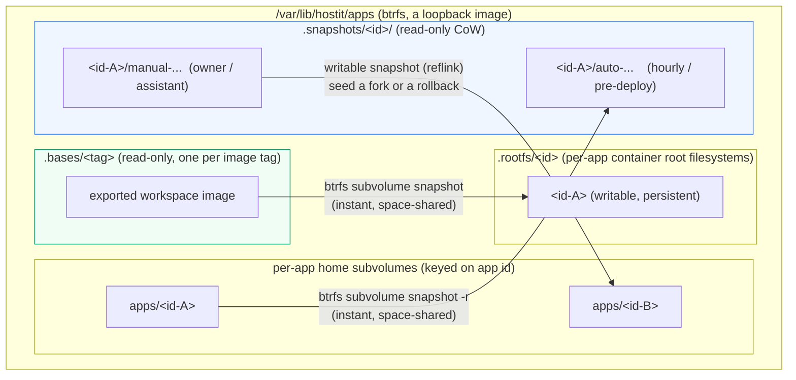
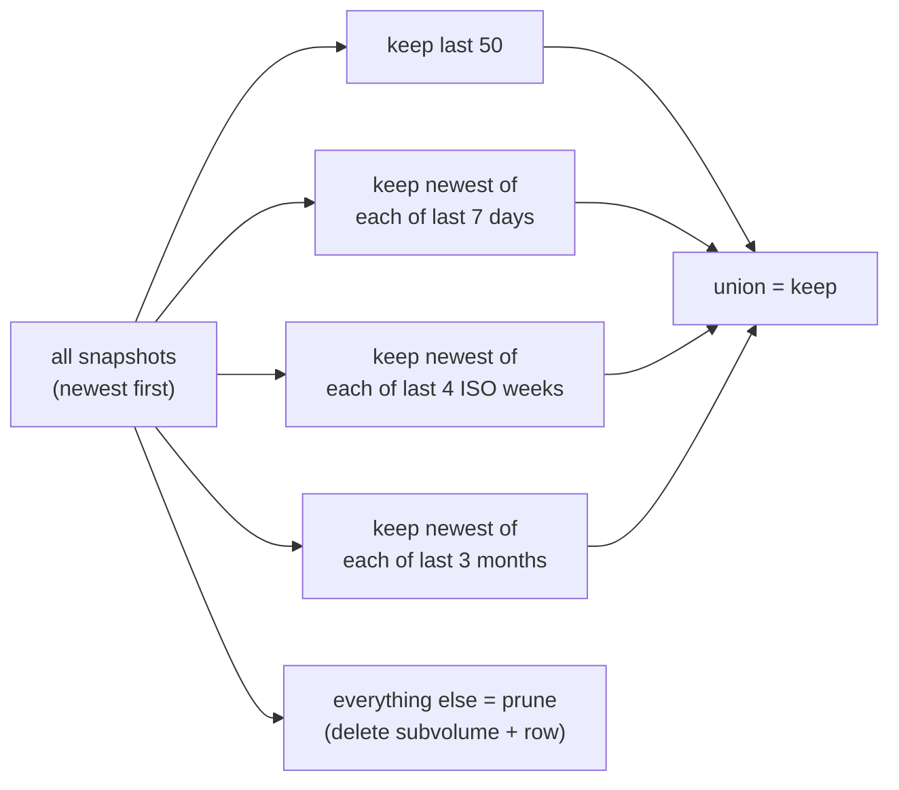

# Storage: the btrfs model

hostit puts everything a tenant can write on **btrfs subvolumes** -- the app's
home, its container's root filesystem, and its snapshots -- and that one choice
buys four things that would otherwise be slow, approximate, or impossible:
instant crash-consistent snapshots, instant reflink forks, exact and cheap disk
accounting, and hard disk caps enforced at write time. As of the current release
**btrfs is mandatory** -- the daemon refuses to start without it.

The btrfs primitives live in the `btrfs/` package (thin wrappers over the `btrfs`
CLI); the app-level orchestration is in `app/btrfs.go`, `app/budget.go` and
`app/quota.go`, the snapshot/rollback logic in the `snapshot/` service, the
base/rootfs lifecycle in `workspace/rootfs.go`; the retention math is the pure
`retention/` package.

Home, rootfs and snapshots of one app are all members of the app's **disk budget
qgroup**, hard-capped on exclusive bytes -- see
[the budget section](#hard-disk-caps-one-budget-qgroup-per-app) below.

## Per-app home subvolumes

A fresh app's home is created as a subvolume (`app/service.go:create` ->
`btrfs.CreateSubvolume`, which runs `btrfs subvolume create`). It is keyed on the
app id (`apps/<id>`), like everything durable -- see
[app-identity.md](app-identity.md). Snapshots live *beside* the home, not inside
it, under `apps/.snapshots/<id>/` (`app/btrfs.go:snapshotsRoot`); they join the
app's budget qgroup, but under exclusive accounting a snapshot only costs budget
for data that has since diverged from the live home.

## Per-app rootfs, per-tag bases: containers do not run an image

App containers do not run from podman's image store. The workspace image is
still **built** there (it is the build input, and it still hosts the assistant
sandbox), but it is then **exported once per tag** into a read-only base
subvolume at `.bases/<tag>` (`workspace/rootfs.go:EnsureBase`: a never-started
container, `podman export | tar -x` into a temp subvolume, sealed read-only and
atomically renamed into place -- ~40s per tag, one time). Each app's container
then runs its own **writable rootfs subvolume** at `.rootfs/<id>`: an instant
snapshot of its pinned tag's base, chowned once to the app's uid block (this
crun cannot idmap-mount a `--rootfs`), passed to podman as plain
`podman create ... --rootfs <path>` (`workspace/rootfs.go:EnsureRootfs`,
`workspace/spec.go:CreateArgs`).

**The invariant: an app's rootfs, once created, is never recreated or reset.**
Container recreates (config change, daemon upgrade) keep the filesystem, so
`apt-get` installs and anything else written outside the home survive them. A
Containerfile change mints a new tag and a new base for **new** apps only;
existing apps keep their pinned tag and their rootfs untouched. A base subvolume
is never deleted while any app pins its tag: its data extents are shared with
every pinned app, and deleting it would silently convert them into each app's
exclusive bytes (`workspace/rootfs.go:PruneOldBases`). A fork's rootfs is
snapshotted from the *source's* rootfs, not the base, so installed packages
carry over (`ForkRootfs`).

## Read-only snapshots

A snapshot is a copy-on-write, read-only subvolume: an instant, space-shared,
crash-consistent copy (`btrfs/service.go:Snapshot` with `-r`). hostit takes them:

- **hourly**, for every app (`app/snapshot.go:SnapshotLoop`, started from
  `cmd/serve.go`), labelled `"Automated snapshot"`,
- **before every deploy** (labelled `"Automated snapshot before deploy"`),
- **on demand**, labelled, by the owner or the assistant's `snapshot` tool
  (`app/snapshot.go:TakeSnapshot`),
- **as a safety snapshot** before a rollback.

`hostit.yml` may declare `snapshot.pre`/`snapshot.post` hooks that run **in the
container** to quiesce a database first; a failing `pre` hook **aborts** the
snapshot, so a torn state is never captured (`app/snapshot.go:takeSnapshot`).

### Rollback is stage-and-swap

Rollback never leaves the app without a home, even if it fails partway
(`app/snapshot.go:Rollback`):

1. **Stage** a writable copy of the target snapshot beside the home -- before
   touching the home, and before the safety snapshot (whose retention prune could
   otherwise delete the very target being restored).
2. Take a **safety snapshot** of the current state (so the rollback is itself
   undoable -- you can roll forward again).
3. Stop and remove the container, then **swap**: move the live home aside
   (`MoveSubvolume`, a same-fs metadata rename), move the staged copy in, and only
   then drop the old home. If putting the new one in place fails, the old one is
   moved back.
4. Restore ownership (`chown -R` to the app uid) and start the app. There is no
   quota to restore: the cap lives on the app's budget qgroup, and the staged copy
   joined it at stage time (qgroup membership survives the rename).

The per-app lifecycle lock (`app/service.go:lockApp`, `appLocks`) serializes
deploy/snapshot/rollback/delete, so these subvolume operations never interleave on
one home.

## Fork: seed a new app from a snapshot

Fork duplicates an app by seeding the new app's home from a **writable CoW
snapshot** of the source instead of the demo skeleton (`app/service.go:Fork` ->
`create` with a `seedPath`). The seed is the source's current home, or a named
snapshot of it; the reflink copy is instant and space-shared
(`btrfs.Snapshot(seedPath, home, false)` -- readonly=false makes it writable).
The forked home is then chowned to the new app's uid (it arrives owned by the
source's uid), the rootfs is snapshotted from the source's rootfs the same way
(`workspace/rootfs.go:ForkRootfs`, so installed packages carry over), and the new
app gets its own port, uid block, user, subdomain, container, disk budget and a
fresh agent token. Fork **requires** btrfs -- it is built on the
snapshot primitive, so `Fork` returns `ErrSnapshotsUnavailable` if the apps
filesystem is not btrfs.

## Hard disk caps: one budget qgroup per app

Each app has one hierarchical btrfs qgroup, `1/<uid>` (keyed on the app's unix
uid: stable across renames, unique per app), whose members are its home
subvolume, its rootfs subvolume, and every snapshot subvolume
(`app/budget.go:ensureBudget`; the snapshot service joins each subvolume it
creates via `snapshot.Host.AssignBudget`). The group is limited on **exclusive
bytes** at the app's `disk_mb` (`btrfs qgroup limit -e`): the app pays for what
it alone pins, while data still shared with the read-only base is charged to
nobody. This is a **hard** cap: a write past it fails with **EDQUOT ("Disk quota
exceeded") at write time**, wherever the tenant writes -- the home *or* `/usr`,
`/tmp`, anywhere in the container -- not the periodic measure-and-stop that a
soft quota would need. A `disk_mb` of 0, which used to mean unlimited, now falls
back to a 2048 MB default (`app/budget.go:effectiveDiskCapMB`); **nothing is
unlimited anymore**. The budget is set up at create and fork time, and re-ensured
at every start. Quota accounting itself is enabled once per start
(`app/budget.go:EnableDiskBudgets`).

Usage accounting reads the same group (`app/quota.go:measureDiskMB` ->
`btrfs.ExclusiveUsageMB`, parsing `btrfs qgroup show --raw`): the app's exclusive
bytes, i.e. what deleting it would free -- accurate and cheap, no directory walk.
A fresh app shows ~47 MB, the metadata cost of chowning the rootfs snapshot.
`RefreshDiskUsage` runs on an interval purely for the dashboard -- there is
nothing to enforce, because the qgroup already hard-caps writes (`app/quota.go`,
`DiskUsageLoop` from `cmd/serve.go`).

Existing apps were moved onto this model by a one-time, settings-gated startup
migration (`app/migrate.go:MigrateRootfsStorage`): it kept every app's home
state, dropped pre-existing snapshots (keeps post-migration budgets predictable),
built each rootfs from the app's pinned tag, and budgeted every app.

## The retention engine (pure GFS)

Snapshots would accumulate forever, so a restic-style grandfather-father-son
policy thins them. It is a **pure function, no I/O**, so the bucketing math is
easy to test exhaustively (`retention/retention.go:Apply`). The default policy
(`retention.Default`): keep the last **50** snapshots outright, plus the newest in
each of the last **7 days**, **4 ISO weeks**, and **3 months**; the union is kept,
the rest pruned. Bucket keys are computed in **UTC** so retention is deterministic
regardless of the server's timezone.

Retention applies to **all** snapshots -- manual and automatic alike -- so none
lives forever (`retention.go` doc; `app/snapshot.go:pruneSnapshots` runs it after
each new snapshot and deletes both the subvolume and the DB row for each pruned
id). A prune that fails to delete a subvolume keeps the row, so it retries rather
than orphaning the subvolume.

## btrfs is mandatory

Earlier hostit degraded gracefully on a non-btrfs host (plain directories, soft
quotas). That is gone: snapshots, rollback, fork and hard quotas are treated as
core, not optional. The startup preflight refuses to run otherwise
(`cmd/preflight.go:requireBtrfs`, called from `cmd/serve.go` after the apps
directory exists):

> hostit requires the app homes (...) to be on a btrfs filesystem, for snapshots,
> rollback and hard disk quotas

The Ansible role sets this up as a **loopback btrfs image** on the existing root
filesystem, so no extra block device is needed
(`deploy/ansible/roles/hostit/tasks/btrfs.yml`): it sizes an image at 75% of free
space, `mkfs.btrfs`, mounts it at the apps dir, enables quota, and rsyncs any
existing homes into subvolumes. See
[release-and-preflight.md](release-and-preflight.md).

### A note on the runtime btrfs check

The code still carries a runtime `btrfsEnabled()` cache (`app/btrfs.go`) and the
`ErrSnapshotsUnavailable` paths, from when btrfs was optional. With the mandatory
preflight in front of it, `btrfsEnabled()` is effectively always true in a real
deployment; the guards remain as defense in depth and to keep the fake-ops unit
tests (which run on whatever the test host's `/tmp` is) honest. Do not read the
presence of those guards as "btrfs is optional" -- the daemon will not start
without it.

## Where it lives

| Concern | Code |
|---|---|
| btrfs CLI wrappers (subvolume, snapshot, qgroup) | `btrfs/service.go` |
| home/snapshot path layout (keyed on app id) | `app/btrfs.go` |
| base export + per-app rootfs lifecycle | `workspace/rootfs.go` |
| snapshot / rollback / prune orchestration | `snapshot/service.go` (bound to the Manager in `app/snapshot.go`) |
| budget qgroup setup (home + rootfs + snapshots) | `app/budget.go` |
| disk limit + usage accounting | `app/quota.go` |
| the one-time rootfs storage migration | `app/migrate.go` |
| the GFS retention policy (pure, unit-tested) | `retention/retention.go` |
| the mandatory preflight | `cmd/preflight.go:requireBtrfs` |
| loopback btrfs setup | `deploy/ansible/roles/hostit/tasks/btrfs.yml` |
| snapshot metadata rows | `snapshot` table, `store/snapshot.go` |
