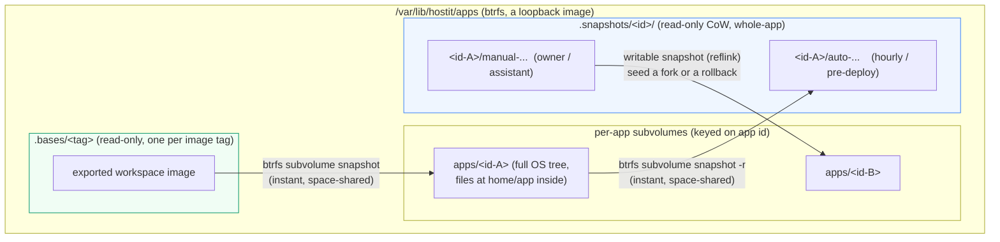
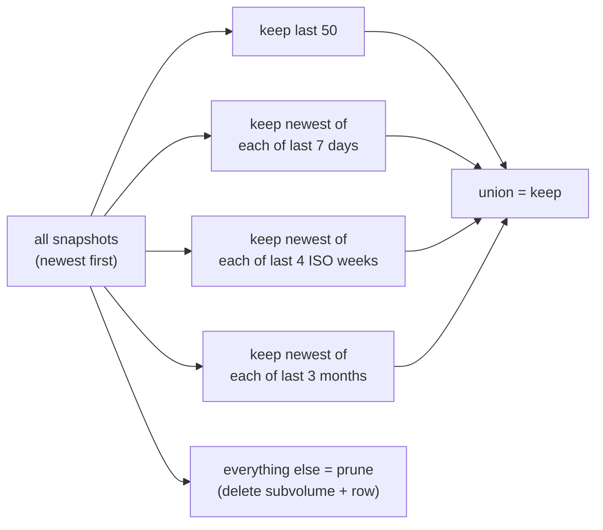

# Storage: the btrfs model

hostit puts everything a tenant can write on **btrfs subvolumes** -- one
subvolume per app (the container's whole root filesystem, with the app's files
inside it) plus its snapshots -- and that one choice buys four things that would
otherwise be slow, approximate, or impossible: instant crash-consistent
snapshots, instant reflink forks, exact and cheap disk accounting, and hard disk
caps enforced at write time. As of the current release **btrfs is mandatory** --
the daemon refuses to start without it.

The btrfs primitives live in the `btrfs/` package (thin wrappers over the `btrfs`
CLI); the app-level orchestration is in `app/btrfs.go`, `app/budget.go` and
`app/quota.go`, the snapshot/rollback logic in the `snapshot/` service, the
base/app-subvolume lifecycle in `workspace/subvolume.go`; the retention math is
the pure `retention/` package.

An app's subvolume and all its snapshots are members of the app's **disk budget
qgroup**, hard-capped on exclusive bytes -- see
[the budget section](#hard-disk-caps-one-budget-qgroup-per-app) below.

## One subvolume per app

An app is **one writable subvolume** at `apps/<id>`: the full OS tree its
container runs (`podman create ... --rootfs <path>:idmap`), snapshotted from the
read-only base of its pinned image tag
(`workspace/subvolume.go:EnsureAppSubvolume`) -- a metadata-only CoW snapshot, so
creating an app is ~instant. The tree stays **root-owned on disk**; the runtime
maps it through the container's uid mapping (see
[the idmap section](#idmapped-rootfs-mounts-and-the-raw-apps-view) below), so no
ownership is ever baked into it. The app's files live INSIDE it at
`home/app` (`workspace.FilesDir`), so the host path `apps/<id>/home/app` and the
in-container `/home/app` are the same tree -- there is no home bind mount
(containers mount only the hostit binary and the daemon's socket directory,
`workspace/spec.go:appendCommonMounts`). The Unix account's home directory is
that files dir, so scp/sftp/rsync land on the app's files. Like everything
durable it is keyed on the app id, not the name -- see
[app-identity.md](app-identity.md). Snapshots live *beside* the app subvolumes,
not inside them, under `apps/.snapshots/<id>/` (`app/btrfs.go:snapshotsRoot`);
they join the app's budget qgroup, but under exclusive accounting a snapshot only
costs budget for data that has since diverged from the live subvolume.

## Per-tag bases: containers do not run an image

App containers do not run from podman's image store. The workspace image is
still **built** there (it is the build input, and it still hosts the assistant
sandbox), but it is then **exported once per tag** into a read-only base
subvolume at `.bases/<tag>` (`workspace/subvolume.go:EnsureBase`: a never-started
container, `podman export | tar -x` into a temp subvolume, `/etc/mtab` symlink
written in, sealed read-only and atomically renamed into place -- ~40s per tag,
one time). Each app's subvolume is an instant snapshot of its pinned tag's base,
passed to podman as `podman create ... --rootfs <path>:idmap`
(`workspace/subvolume.go:EnsureAppSubvolume`, `workspace/spec.go:CreateArgs`).

**The invariant: an app's subvolume, once created, is never recreated or reset
by hostit.** Container recreates (config change, daemon upgrade) keep the
filesystem, so `apt-get` installs and anything else written anywhere in it
survive them. A Containerfile change mints a new tag and a new base for **new**
apps only; existing apps keep their pinned tag and their subvolume untouched. A
base subvolume is never deleted while any app pins its tag: its data extents are
shared with every pinned app, and deleting it would silently convert them into
each app's exclusive bytes (`workspace/subvolume.go:PruneOldBases`). A fork's
subvolume is snapshotted from the *source's* subvolume, not the base, so files
and installed packages carry over together (`ForkAppSubvolume`).

## Idmapped rootfs mounts and the raw apps view

App containers run their subvolume as `--rootfs <path>:idmap`
(`workspace/spec.go:CreateArgs`): the tree is **root-owned on disk**, and the
runtime maps it through the container's uid mapping, so disk-root IS
container-root and disk uid `u` is container uid `u`. Ownership is never baked
into an app tree -- there is **no chown anywhere**: not at create, not at fork,
not after rollback, not for uploads. That is what makes app creation a
metadata-only snapshot (the old create-time `chown -R` over the ~57k-file base,
and the ~47 MB of metadata it dirtied per app, are gone with it).

The model has four consequences, each carried end to end:

- **The runtime must support it.** The startup preflight refuses to launch
  unless podman is **>= 4.3** (the `--rootfs <path>:idmap` syntax) and the OCI
  runtime is a crun **>= 1.29** -- resolved *through* `podman info`, so a
  `containers.conf` override pointing at a newer static binary is exactly what
  gets checked (`cmd/preflight.go:checkRuntimeVersions`). See
  [release-and-preflight.md](release-and-preflight.md).
- **Every rootfs must carry an `/etc/mtab` symlink** (`../proc/self/mounts`):
  podman skips creating it when present, and creating it *through* the idmapped
  view is exactly what EOVERFLOWs on podman 4.9. Base exports write it before
  sealing, `EnsureBase` retrofits it into bases exported before it shipped, and
  every app subvolume carries it (snapshotted from the base)
  (`workspace/subvolume.go:WriteMtab` / `ensureBaseMtab`).
- **The daemon's file I/O goes through a raw view of the apps dir.** podman
  attaches the idmapped mount OVER the subvolume path in the host namespace
  while the container runs, so a host-side access to `apps/<id>` sees the
  MAPPED view -- and the root daemon writing through it fails with EOVERFLOW
  (root is not in the mapping). At startup the daemon therefore binds the apps
  dir **non-recursively** (child overmounts excluded) at `<run-dir>/apps-raw`
  and resolves all file I/O through that raw view
  (`app/deploy.go:MountRawAppsView`, called from `cmd/serve.go`;
  `appFilesByID`). The bind is made **private**: the apps mount is shared by
  default, so a container overmount created after a plain bind would propagate
  into it anyway; a leftover bind from the previous run is torn down (made
  rprivate first, so the unmounts cannot propagate back onto running
  containers' mounts) and rebuilt. podman and btrfs keep the real path:
  destructive subvolume ops (delete, rollback swap) already stop the container
  first, which clears the overmount, and snapshotting through the overmount
  targets the same subvolume anyway. The Unix account's home in passwd points
  at the raw view path of the files dir, so scp/sftp/rsync land there too.
- **`.ssh` and `authorized_keys` are root-owned and world-readable**
  (0755/0644, `ssh/service.go:writeAuthorizedKeysIn`): the host's sshd reads
  them as the app user (StrictModes accepts root-owned), and through the idmap
  disk-root IS container-root, so tenants can still hand-edit their own keys.
  Public keys are not secrets. The files dir (`home/app`) is 0755 for the same
  sshd traversal.

## Read-only snapshots

A snapshot is a copy-on-write, read-only subvolume: an instant, space-shared,
crash-consistent copy of the app's **whole subvolume** -- its files at `home/app`
AND the installed software around them (`btrfs/service.go:Snapshot` with `-r`).
hostit takes them:

- **hourly**, for every app (`snapshot/service.go:SnapshotLoop`, started from
  `cmd/serve.go`), labelled `"Automated snapshot"`,
- **before every deploy** (labelled `"Automated snapshot before deploy"`),
- **on demand**, labelled, by the owner or the assistant's `snapshot` tool
  (`snapshot/service.go:TakeSnapshot`),
- **as a safety snapshot** before a rollback.

`hostit.yml` may declare `snapshot.pre`/`snapshot.post` hooks that run **in the
container** to quiesce a database first; a failing `pre` hook **aborts** the
snapshot, so a torn state is never captured (`snapshot/service.go:takeSnapshot`).

### Rollback is stage-and-swap

Because a snapshot is the whole app subvolume, rollback restores **everything
together**: the app's files and its installed software. A bricked rootfs (a bad
apt upgrade, deleted system files) is restored by rollback like any other
mistake. And rollback never leaves the app without a subvolume, even if it fails
partway (`snapshot/service.go:Rollback`):

1. **Stage** a writable copy of the target snapshot beside the app subvolume --
   before touching the live one, and before the safety snapshot (whose retention
   prune could otherwise delete the very target being restored).
2. Take a **safety snapshot** of the current state (so the rollback is itself
   undoable -- you can roll forward again).
3. Power the container down (stop the unit and remove the container -- the
   subvolume being swapped IS the container's rootfs, so nothing may run it
   during the swap), then **swap**: move the live subvolume aside
   (`MoveSubvolume`, a same-fs metadata rename), move the staged copy in, and only
   then drop the old one. If putting the new one in place fails, the old one is
   moved back.
4. Start the app. There is **no ownership to restore**: app trees are root-owned
   and idmap-mounted, and snapshots carry that root-owned tree with them. There is
   no quota to restore either: the cap lives on the app's budget qgroup, and the
   staged copy joined it at stage time (qgroup membership survives the rename).

The per-app lifecycle lock (`app/service.go:lockApp`, `appLocks`) serializes
deploy/snapshot/rollback/delete, so these subvolume operations never interleave on
one app.

## Fork: seed a new app from a snapshot

Fork duplicates an app by seeding the new app's subvolume from a **writable CoW
snapshot** of the source instead of the demo skeleton (`app/service.go:Fork` ->
`create` with a `seedPath`). The seed is the source's current subvolume, or a
whole-app snapshot of it; either way the fork carries the source's files, config,
data AND installed packages in one instant, space-shared copy
(`workspace/subvolume.go:ForkAppSubvolume` --
`btrfs.Snapshot(seedPath, dst, false)`, readonly=false makes it writable). The
forked subvolume needs no ownership fixup -- app trees are root-owned, and the
fork's container maps the same root-owned tree through the new app's own uid
block -- and the new app gets its own port, uid block, user, subdomain,
container, disk budget and a fresh agent token. Fork is built on the btrfs
snapshot primitive, which the mandatory-btrfs preflight guarantees.

## Hard disk caps: one budget qgroup per app

Each app has one hierarchical btrfs qgroup, `1/<uid>` (keyed on the app's unix
uid: stable across renames, unique per app), whose members are its one app
subvolume and every snapshot subvolume (`app/budget.go:ensureBudget`; the
snapshot service joins each subvolume it creates via
`snapshot.Host.AssignBudget`). The group is limited on **exclusive bytes** at the
app's `disk_mb` (`btrfs qgroup limit -e`): the app pays for what it alone pins,
while data still shared with the read-only base is charged to nobody. This is a
**hard** cap: a write past it fails with **EDQUOT ("Disk quota exceeded") at
write time**, wherever the tenant writes -- `/home/app` *or* `/usr`, `/tmp`,
anywhere in the container -- not the periodic measure-and-stop that a soft quota
would need. A `disk_mb` of 0, which used to mean unlimited, now falls back to a
2048 MB default (`app/budget.go:effectiveDiskCapMB`); **nothing is unlimited
anymore**. The budget is set up at create and fork time, and re-ensured at every
start. Quota accounting itself is enabled once per start
(`app/budget.go:EnableDiskBudgets`).

Usage accounting reads the same group (`app/quota.go:measureDiskMB` ->
`btrfs.ExclusiveUsageMB`, parsing `btrfs qgroup show --raw`): the app's exclusive
bytes, i.e. what deleting it would free -- accurate and cheap, no directory walk.
A fresh app shows next to nothing: its subvolume is a metadata-only snapshot of
the base (the ~47 MB baseline the old create-time `chown -R` used to dirty per
app is gone with the chown itself).
`RefreshDiskUsage` runs on an interval purely for the dashboard -- there is
nothing to enforce, because the qgroup already hard-caps writes (`app/quota.go`,
`DiskUsageLoop` from `cmd/serve.go`).

Existing apps were moved onto this model by three one-time, settings-gated
startup migrations (rootfs, unified, idmap) that shipped in v0.9.x-v0.10.x and
have since been REMOVED from the code: every supported host records their
gates. Upgrading a host from a release older than v0.11 therefore requires
stepping through v0.11.x first (which still carries the migrations), then
moving on. Powered-off apps stay off through upgrades generally:
`RestartStaleAgents` skips apps whose poweroff flag is set.

## The retention engine (pure GFS)

Snapshots would accumulate forever, so a restic-style grandfather-father-son
policy thins them. It is a **pure function, no I/O**, so the bucketing math is
easy to test exhaustively (`retention/retention.go:Apply`). The default policy
(`retention.Default`): keep the last **50** snapshots outright, plus the newest in
each of the last **7 days**, **4 ISO weeks**, and **3 months**; the union is kept,
the rest pruned. Bucket keys are computed in **UTC** so retention is deterministic
regardless of the server's timezone.

Retention applies to **all** snapshots -- manual and automatic alike -- so none
lives forever (`retention.go` doc; `snapshot/service.go:pruneSnapshots` runs it
after each new snapshot and deletes both the subvolume and the DB row for each
pruned id). A prune that fails to delete a subvolume keeps the row, so it retries
rather than orphaning the subvolume.

## btrfs is mandatory

Earlier hostit degraded gracefully on a non-btrfs host (plain directories, soft
quotas). That is gone: snapshots, rollback, fork and hard quotas are treated as
core, not optional. The startup preflight refuses to run otherwise
(`cmd/preflight.go:requireBtrfs`, called from `cmd/serve.go` after the apps
directory exists):

> hostit requires the app homes (...) to be on a btrfs filesystem, for snapshots,
> rollback and hard disk quotas

The Ansible role sets this up as a **loopback btrfs image** on the existing root
filesystem, so no extra block device is needed
(`deploy/ansible/roles/hostit/tasks/btrfs.yml`): it sizes an image at 75% of free
space, `mkfs.btrfs`, mounts it at the apps dir, enables quota, and rsyncs any
existing homes into subvolumes. See
[release-and-preflight.md](release-and-preflight.md). The runtime
"is this btrfs?" guards that used to sit behind the preflight
(`btrfsEnabled()`, the 501 "snapshots unavailable" paths) have been removed with
it: the preflight is the single gate, and everything downstream assumes btrfs.

## Where it lives

| Concern | Code |
|---|---|
| btrfs CLI wrappers (subvolume, snapshot, qgroup) | `btrfs/service.go` |
| snapshot path layout (keyed on app id) | `app/btrfs.go` |
| base export + per-app subvolume lifecycle (+ `/etc/mtab`) | `workspace/subvolume.go` |
| the idmapped `--rootfs <path>:idmap` create args | `workspace/spec.go:CreateArgs` |
| the raw (non-idmapped) apps view bind | `app/deploy.go:MountRawAppsView` |
| file I/O inside the files dir (chained `os.Root`) | `homefs/service.go` |
| snapshot / rollback / prune orchestration | `snapshot/service.go` (bound to the Manager in `app/snapshot.go`) |
| budget qgroup setup (app subvolume + snapshots) | `app/budget.go` |
| disk limit + usage accounting | `app/quota.go` |
| the GFS retention policy (pure, unit-tested) | `retention/retention.go` |
| the mandatory preflight (btrfs, podman/crun versions) | `cmd/preflight.go:requireBtrfs` / `checkRuntimeVersions` |
| loopback btrfs setup | `deploy/ansible/roles/hostit/tasks/btrfs.yml` |
| snapshot metadata rows | `snapshot` table, `store/snapshot.go` |
